# Ep.3 8086/8088处理器

本章问题：

* 主要引线功能
* 内部结构特点
* **内部寄存器组**
* 实模式下的**存储器寻址**
* 总线时序
  * 总线周期
  * 时序图中芯片工作原理

## 一、功能结构

两者均属于第三代**16位**微处理器（内部运算器和寄存器是16位），都有**20位地址线**，  
拥有最大和最小两种工作模式，  
使用相同的指令系统，内部都有指令队列。

**区别：**

* 8086 - **外部数据总线**宽度为**16位**，指令队列长度为6字节
* 8088 - **外部数据总线**宽度为**8位**，指令队列长度为4字节

两者均有以下**两个功能部分**：

* 执行单元(Execution Unit, EU) - 只负责指令的执行
* 总线接口单元(Bus Interface Unit, BIU) - 负责向EU或存储设备传送数据

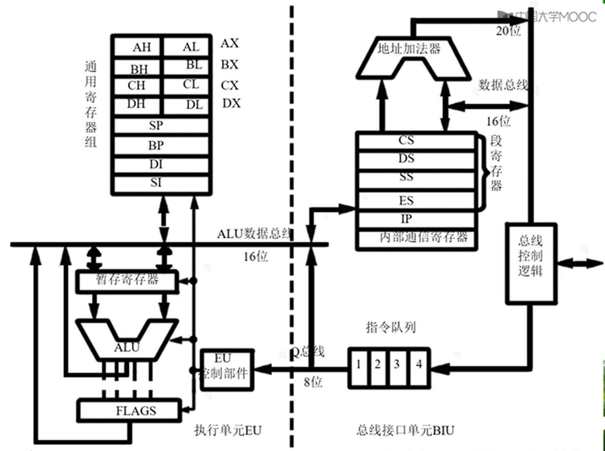  
虚线左侧则是执行单元EU，右侧则是总线接口单元BIU。

### 1. EU - 执行单元

只负责指令的执行。  
从 BIU 的**指令队列**取指令，执行后向 BIU 送回运算结果，并保存结果状态特征到标志寄存器中。

EU **不与 CPU 外部部件相连**进行信息交换，  
因此当需要与主存或外设交换数据时，要向 BIU 发送指令，提供**16位地址**和需要**传送的数据**。

**组成部件：**

* ALU
* 8个通用寄存器组 - 暂存中间结果、指令执行所用数据。
* 标志寄存器FLAGS（16位） - 指令或处理器的状态。
* 控制电路 - 取指令，形成控制信号，控制各部件，执行指令。  

**功能：**

* 译码分析指令
* 执行指令
* 暂存中间运算结果
* 保留结果特征

### 2. BIU - 总线接口单元

BIU 主要完成以下操作：  
取指令到指令队列 → 配合执行部件从指定内存单元或I/O接口取数据 → 将数据传送给 EU 或把 EU 操作结果送到指定内存单元或I/O接口。

**组成部件：**

* 地址指针寄存器(IP)（16位） - 保存下一条指令所在存储单元的偏移地址  
  *注：相当于机组中的PC。*
* 段寄存器（16位）
  * 代码段寄存器(Code Segment, CS)
  * 数据段寄存器(Data Segment, DS)
  * 堆栈段寄存器(Stack Segment, SS)
  * 附加段寄存器(Extra Segment, ES)
* 地址加法器 - 由段地址加上偏移地址得到实际地址  
  将内部寄存器的16位地址，映射到20位的寻址空间，划分为16个段，每段有个段地址，实际地址则为段地址加偏移地址。
* 内部暂存器 - 暂存内部数据  
  对用户透明且无权访问。
* 指令队列缓冲器（6**字节**） - 暂存 BIU 从存储器中预取的指令  
* 总线控制逻辑 - 发出总线控制信号  
  将 CPU 内部总线和外部总线相连，与外电路数据交换，实现存储器和I/O的读写控制。
  
**功能：**

* 负责 CPU 与内存或I/O接口之间的**信息传送**。  
  包括取指令、取操作数、保存运算结果。
* EU 取指令的**指令队列**变化  
  采用 FIFO，当 EU 从指令预取队列中取走指令，指令队列出现空字节，BIU就会将指令向前移并取新指令。  
  注意：遇到**跳转指令**时， BIU 会**复位**指令队列并从新地址取指令传给 EU，因为跳转指令会让当前指令队列所存指令都无效化。
* 从指定内存单元或外设取 EU 需要的**数据**
* 保存 EU 的**运算结果**

### 3. 微机结构

8086/8088和其他外设构成以下微机系统：  
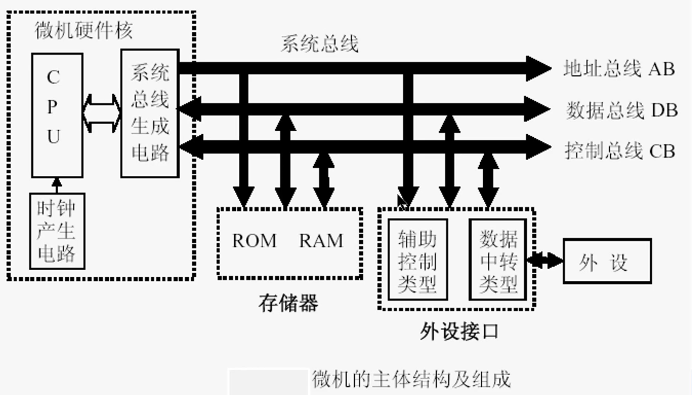

## 二、工作模式

8086/8088为并行工作方式，EU 和 BIU 两部分按**流水线方式**工作，从而**加快执行效率**。  
即：EU 执行指令和 BIU 取指令同时进行。

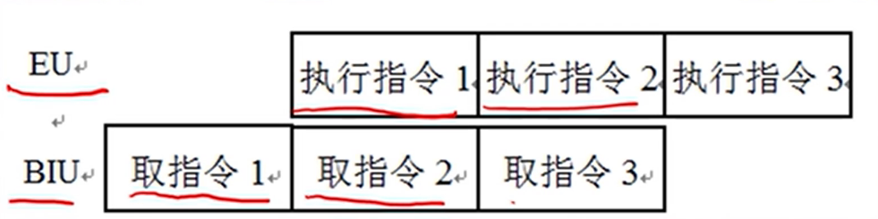

*注：以前CPU工作方式是先取指令再执行指令，为串行工作方式。*

当 8086/8088 连接存储器和外设后，便可构成微机系统，  
不同场合的存储器和外设要求不同，因此分为两种模式：

* 最小模式（单处理器模式） - 系统只有一片8086 CPU，存储器容量小，芯片不多，外设少。  
  这种情况下，系统**控制总线**的信号由**CPU 本身**的引脚直接引出，即**由 CPU 控制总线**。
* 最大模式（多处理器模式） - 系统可以有多个 CPU，主处理器为8086/8088，其余为协处理器。
  这种情况下，系统**控制总线**由**8086/8088和总线控制器8288**共同构成，即**由总线控制器控制总线**。

**常考最小模式**。

## 三、8088引脚特性

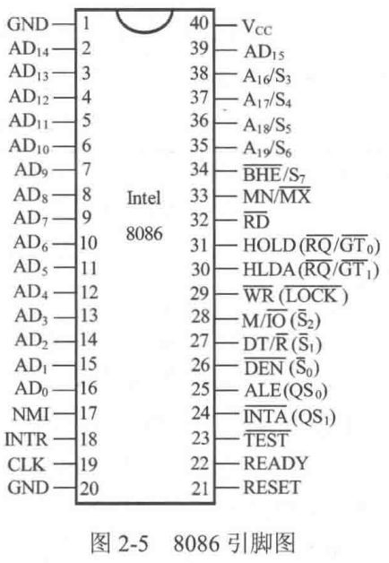 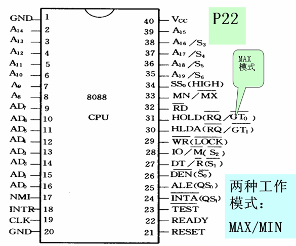

引脚的描述特性：

* 信号的有效电平
  * 高/低电平或上升/下降沿有效（上加横线即为低或下降沿电平有效）
  * 作为**编码**（高低电平均有效，代表不同含义）
* 信号的流向：从外部输入芯片/从芯片输出外部/双向
* 引脚的复用：**分时复用**，在不同时刻传递信号的性质不同
* 三态能力：存在高阻态，表示芯片**放弃**了对该引脚的**控制**。

基础的三个：

* $\mathrm{V_{CC}}$需接入电压$+5V$左右
* $\mathrm{GND}$需接地
* $\mathrm{CLK}$需输入时钟信号，为 CPU 和总线控制电路提供基准时间。

上述提到了最小最大两种模式，存在公共引脚，也存在特殊引脚。  
最小和最大模式下，只有#24 ~ #31这部分引脚定义不同，  
其余引脚将作为公共引脚讲解，然后分两种模式讲解特殊引脚。

*8086与8088只在#34完全不一致，其余引脚均类似，下面以8088为例讲解。*  

### 1. 公共引脚

#### (1) 模式选择引脚

| 编号与引脚         | 名称              | 特性       | 描述                                                                       |
| ----------------------- | ------------------- | ------------ | ---------------------------------------------------------------------------- |
| (#33)$\mathrm{MN}/\mathrm{\overline{MX}}$ | 最大/最小模式选择线 | 编码、输入 | 两种工作模式由该引脚决定：接$5V$时，为最小工作模式；接地时，为最大工作模式。 |

#### (2) 地址线、数据线和控制线引脚

三者存在分时复用的情况，总体如下表。

| 编号与引脚               | 名称                    | 特性                 | 描述                                                                                     |
| ----------------------------- | ------------------------- | ---------------------- | ------------------------------------------------------------------------------------------ |
| (#35)$\mathrm{A_{19}}/\mathrm{S_6}$ ~ (#38)$\mathrm{A_{16}}/\mathrm{S_3}$ | （高四位）地址/状态复用线 | 编码、输出、复用、三态 | 在总线周期$T_1$状态作地址（I/O口时不可用为全低）；其余状态作状态。 |
| (#39)$\mathrm{A_{15}}$ ~ (#2~#8)$\mathrm{A_8}$      | （中八位）地址线  | 编码、输出、三态 |  |
| (#9)$\mathrm{AD_7}$ ~ (#16)$\mathrm{AD_0}$        | （第八位）地址/数据复用线 | 编码、双向、复用、三态 | 在总线周期$T_1$状态作地址；其余状态作数据。 |

> 拓展 - $\mathrm{S_6}$ ~ $\mathrm{S_3}$的状态含义：
>
> * $\mathrm{S_6}$ - 总为低电平，表示8086/8088与总线相连。
> * $\mathrm{S_5}$ - 反映当前是否允许中断标志，指向IF。
> * $\mathrm{S_4}, \mathrm{S_3}$ - 反映当前指向哪个段寄存器。
>   | $\mathrm{S_4}$ | $\mathrm{S_3}$ | 正在使用段寄存器 |
>   | -------------- | -------------- | ---------------- |
>   | 0              | 0              | ES               |
>   | 0              | 1              | SS               |
>   | 1              | 0              | CS或未用      |
>   | 1              | 1              | DS               |

#### (3) 其他公用引脚

| 编号与引脚                 | 名称             | 特性             | 描述                                                                                                                                                   |
| ------------------------------- | ------------------ | ------------------ | -------------------------------------------------------------------------------------------------------------------------------------------------------- |
| (#23)$\overline{\mathrm{TEST}}$ | 检测信号       | 低电平、输入 | 配合`WAIT`指令使用。`WAIT`指令会使 CPU 等待，然后每隔5个总线周期检测该信号，有效则结束等待。相当于外部硬件同步信号。 |
| (#22)$\mathrm{READY}$           | 就绪信号       | 高电平、输入 | 表示被访问存储器或I/O已就绪，可以马上完成一次数据传送。在**总线周期$T_3$开始前**检测，若无效则会在结束后插入$T_w$，直到某一个$T_w$开始前为有效。 |
| (#21)$\mathrm{RESET}$           | 复位信号       | 高电平、输入 | 若维持4个以上时钟周期有效，则进行复位，具体复位操作见下。                                                                    |
| (#34)$\mathrm{SS_0}$             | 系统状态信号 | 编码、输出、三态 | 与$\mathrm{DT}/\mathrm{\overline{R}}$，$\mathrm{IO}/\mathrm{\overline{M}}$一起用作最小方式下的周期状态信号，具体意义见后。（注：在**最大方式下恒为高电平**） |
| (#18)$\mathrm{INTR}$            | 可屏蔽中断请求信号 | 高电平、输入 | 有效时且标志位 IF 为1，则 CPU 在结束当前指令周期后响应中断。（可屏蔽）                                                     |
| (#17)$\mathrm{NMI}$             | 非屏蔽中断请求信号 | 上升沿、输入 | 触发后，CPU 在结束当前指令周期后响应中断。（不可屏蔽）                                                                          |
| (#32)$\overline{\textrm{RD}}$   | 读信号          | 低电平、输出、三态 | 有效时，表示 CPU 正在对存储器或I/O接口进行读操作。（存储器还是I/O口看$\mathrm{M}/\overline{\mathrm{IO}}$）                 |

其中$\mathrm{RESET}$信号复位对个寄存器有清零、置位和清空操作，如下表：  
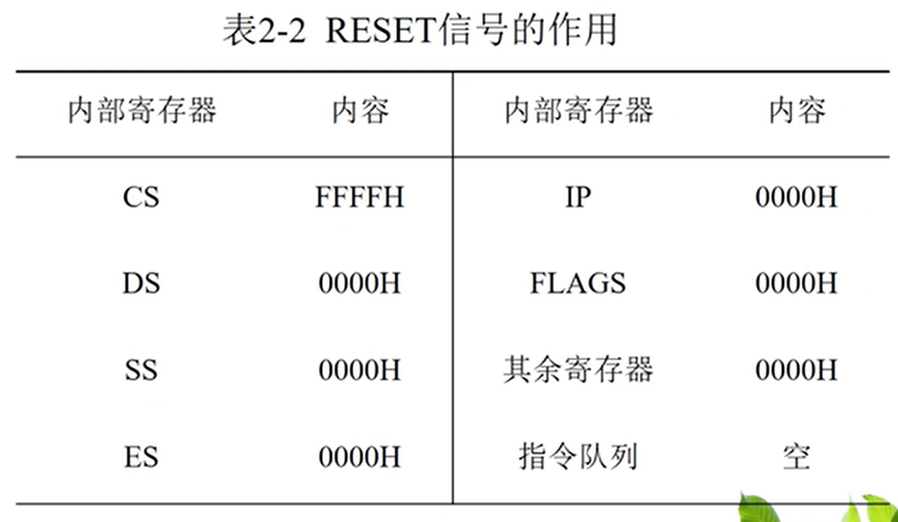  
复位和开机后，CPU 首条指令的地址是`FFFF0H`，一般是无条件转移，以转移到系统程序实际入口。

### 2. 最小模式

#### (1) 数据传输相关信号

| 编号与引脚                          | 名称                      | 特性             | 描述                                                                                   |
| ---------------------------------------- | --------------------------- | ------------------ | ---------------------------------------------------------------------------------------- |
| (#25)$\textrm{ALE}$                      | 地址锁存允许（选通）信号    | 高电平、输出 | 与“地址锁存器”有关。下降沿，地址线上的地址被地址锁存器锁存。（连接外部地址锁存器的选通脉冲$STB$） |
| (#28)$\textrm{IO}/\overline{\textrm{M}}$ | 存储器或I/O接口访问控制信号 | 编码、输出、三态 | 高电平，CPU 对存储器操作；低电平，CPU 对I/O接口操作。               |
| (#27)$\textrm{DT}/\overline{\textrm{R}}$ | 数据发送/接受控制信号 | 编码、输出、三态 | 与“数据收发器”有关。低电平，进行数据接收（CPU 读入）；高电平，进行数据发送（CPU 写出）。 |
| (#26)$\overline{\textrm{DEN}}$           | 数据允许信号          | 低电平、输出、三态 | 与“数据收发器”有关。有效时，表示数据收发器允许输出，可以与系统数据总线进行数据传送。（连接外部地址锁存器的使能信号$\overline{OE}$） |
| (#29)$\overline{\textrm{WR}}$            | 写信号                   | 低电平、输出、三态 | 有效时，表示 CPU 正在对存储器或I/O接口进行写操作。（与$\overline{\textrm{RD}}$对称） |

之前提到的$\mathrm{SS0}$信号，将与$\textrm{IO}/\overline{\textrm{M}}$和$\textrm{DT}/\overline{\textrm{R}}$共同决定最小模式下，当前总线周期的状态，如下表：
| $\textrm{IO}/\overline{\textrm{M}}$ | $\textrm{DT}/\overline{\textrm{R}}$ | $\mathrm{SS0}$ | 含义   |
| ----------------------------------- | ----------------------------------- | -------------- | -------- |
| `0`                                 | `0`                                 | `0`            | 取操作码 |
| `0`                                 | `0`                                 | `1`            | 读存储区 |
| `0`                                 | `1`                                 | `0`            | 写存储器 |
| `0`                                 | `1`                                 | `1`            | 无效状态 |
| `1`                                 | `0`                                 | `0`            | 中断响应 |
| `1`                                 | `0`                                 | `1`            | 读I/O   |
| `1`                                 | `1`                                 | `0`            | 写I/O   |
| `1`                                 | `1`                                 | `1`            | 暂停   |

#### (2) 中断控制信号

| 编号与引脚                 | 名称       | 特性       | 描述                                             |
| ------------------------------- | ------------ | ------------ | -------------------------------------------------- |
| (#24)$\mathrm{\overline{INTA}}$ | 中断响应信号 | 低电平、输出 | CPU 向外输出的中断响应信号，具体将在中断部分讲解。 |

*注：$\mathrm{INTR}$和$\mathrm{NMI}$两个中断控制信号在公用引脚部分。*

#### (3) DMA控制信号

| 编号与引脚      | 名称           | 特性       | 描述                                                                                                                                                                                          |
| -------------------- | ---------------- | ------------ | ----------------------------------------------------------------------------------------------------------------------------------------------------------------------------------------------- |
| (#31)$\mathrm{HOLD}$ | 总线保持请求信号 | 高电平、输入 | 系统 CPU 外的总线主设备要求占用总线（进行 DMA）时，通过$\mathrm{HOLD}$发送高电平。若允许则使所有三态引脚（地址、数据、控制线）设为高阻态，放弃控制权；直到$\mathrm{HOLD}$为低电平，收回控制权。 |
| (#30)$\mathrm{HLDA}$ | 总线保持响应信号 | 高电平、输出 | 若 CPU 允许让出总线，在当前总线周期的$T_4$将$\mathrm{HLDA}$置高电平表示响应；再收回控制权时重置回低电平。                                               |

### 3. 最大模式

地址线、数据线与最小模式一致；控制线存在区别如下：

* 指令队列相关
  * (#24)$\mathrm{\overline{INTA}}$ → $\mathrm{QS_1}$
  * (#25)$\textrm{ALE}$ → $\mathrm{QS_0}$
* 总线周期状态相关
  * (#26)$\mathrm{\overline{DEN}}$ → $\mathrm{\overline{S_0}}$
  * (#27)$\textrm{DT}/\overline{\textrm{R}}$ → $\mathrm{\overline{S_1}}$
  * (#28)$\textrm{IO}/\overline{\textrm{M}}$ → $\mathrm{\overline{S_2}}$
* DMA 相关
  * (#30)$\mathrm{HLDA}$ → $\mathrm{\overline{RQ}}/\mathrm{\overline{GT_1}}$
  * (#31)$\mathrm{HOLD}$ → $\mathrm{\overline{RQ}}/\mathrm{\overline{GT_0}}$
* (#29)$\overline{\textrm{WR}}$ → $\mathrm{\overline{LOCK}}$

| 编号与引脚                                                                                    | 名称               | 特性             | 描述                                                                                                                                                |
| -------------------------------------------------------------------------------------------------- | -------------------- | ------------------ | ----------------------------------------------------------------------------------------------------------------------------------------------------- |
| $\mathrm{QS_1}、\mathrm{QS_0}$                                                                    | 指令队列状态信号 | 编码、输出    | 组合反映总线周期的前一个周期指令队列的状态，以便其他设备跟踪指令队列状态。                                       |
| $\mathrm{\overline{S_2}}、\mathrm{\overline{S_1}}、\mathrm{\overline{S_0}}$                      | 总线周期状态输出信号 | 编码、输出    | 组合反映总线周期状态信号。                                                                                                               |
| $\mathrm{\overline{LOCK}}$                                                                         | 总线封锁信号   | 低电平、输出、三态 | 由前缀指令`LOCK`产生。有效时，系统其他总线主设备不能占用系统总线。                                                      |
| $\mathrm{\overline{RQ}}/\mathrm{\overline{GT_0}}、\mathrm{\overline{RQ}}/\mathrm{\overline{GT_1}}$ | 总线请求/允许信号 | 低电平、双向、三态 | 类似于最小模式下 DMA 相关的$\mathrm{HOLD}$和$\mathrm{HLDA}$。在同一引脚上先接受总线请求信号，再发送总线允许信号。两个引脚可同时与两个外部主设备连接。 |

* $\mathrm{\overline{S_2}}、\mathrm{\overline{S_1}}、\mathrm{\overline{S_0}}$ - 总线周期状态信号
  | $\mathrm{\overline{S_2}}$ | $\mathrm{\overline{S_1}}$ | $\mathrm{\overline{S_0}}$ | 含  义    |
  | ------------------------- | ------------------------- | ------------------------- |   --------- |
  | `0`                       | `0`                       | `0`                       | 中断  响应 |
  | `0`                       | `0`                       | `1`                       | 读I/O  接口 |
  | `0`                       | `1`                       | `0`                       | 写I/O  接口 |
  | `0`                       | `1`                       | `1`                       | 暂  停    |
  | `1`                       | `0`                       | `0`                       | 取  指    |
  | `1`                       | `0`                       | `1`                       | 读存  储器 |
  | `1`                       | `1`                       | `0`                       | 写存  储区 |
  | `1`                       | `1`                       | `1`                       | 无作用 |
* $\mathrm{QS_1}、\mathrm{QS_0}$ - 指令队列状态信号
  | $\mathrm{QS_1}$ | $\mathrm{QS_0}$ | 含义             |
  | --------------- | --------------- | ------------------ |
  | `0`             | `0`             | 队列空闲       |
  | `0`             | `1`             | 操作码的第一个字节 |
  | `1`             | `0`             | 队列空          |
  | `1`             | `1`             | 操作码的后续字节 |

### 4. 8086和8088引脚区别

* $\mathrm{AD_{15}}$~$\mathrm{AD_0}$的定义不同  
  在8086中都定义为地址/数据复用总线；  
  在8088中，由于只需用8条数据总线，因此，对应予8086的$\mathrm{AD_{15}}$~$\mathrm{AD_{8}}$这8条引脚，只作地址线使用。
* 34号引脚的定义不同  
  在8086中定义为$\mathrm{\overline{BHE}}$信号；  
  在8088中定义为$\mathrm{SS0}$，它与$\textrm{IO}/\overline{\textrm{M}}$和$\textrm{DT}/\overline{\textrm{R}}$一起用作最小方式下的周期状态信号。
* 28号引脚的相位不同  
  在8086中为$\textrm{M}/\overline{\textrm{IO}}$；  
  在8088中被倒相，改为$\textrm{IO}/\overline{\textrm{M}}$，以便与8080/8085系统的总线结构兼容。

> 区别 - 8086的#34引脚特性：
>
> 8086的#34引脚为公共引脚，符号位$\mathrm{\overline{BHE}/S_7}$。
>
> | 编号与引脚                    | 名称                       | 特性                        | 描述                                                                                                                                     |
> | ---------------------------------- | ---------------------------- | ----------------------------- | ------------------------------------------------------------------------------------------------------------------------------------------ |
> | (#34)$\mathrm{\overline{BHE}/S_7}$ | 数据总线高8位有效/状态复用线 | 低电平/编码、输出、复用、三态 | 总线周期$T_1$状态，$\mathrm{\overline{BHE}}$有效时，允许 CPU 访问存储器的奇体（高8位有效）。其他状态，$\mathrm{S_7}$作为备用状态，未定义。 |
>
> 其中$\mathrm{\overline{BHE}/S_7}$和$\mathrm{AD_0}$（地址线奇偶位）的组合对应如下操作：  
> 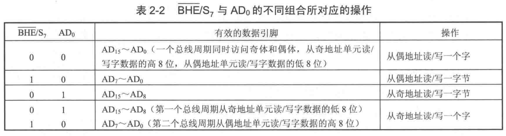

## 四、总线周期时序

> 定义 - 时序：
>
> 微机系统所有操作都按照统一的时钟节拍进行，微处理器各引脚在时间上的先后顺序为时序。

CPU 执行指令**从短到长**涉及3种周期：**时钟周期**、**总线周期**和**指令周期**。

* **时钟周期**：每个时钟脉冲的持续时间。  
  是计算机内部最小的时间单位，由时钟发生器产生，用$Ti$表示。

  运行过程中，微处理器按照 CLK 端的时钟脉冲**一步步工作**，CLK 的时钟周期是微处理器的时间基准。  
  8088的标准时钟信号时$5Mhz$。

* **总线周期**：CPU 通过总线进行一次读写所需时间。  
  CPU 访问存储器或I/O时，需要通过总线进行读或写操作。  
  8086/8088的一个**标准总线周期由$4$个时钟周期构成**，分别为$T1,T2,T3,T4$。  

  部分情况外设或存储器速度较慢，不能及时配合 CPU 传送数据，还会通过$\mathrm{READY}$信号在$T_3$后插入若干附加时钟周期$T_w$。

* **指令周期**：一般一条指令需要多个总线周期且不等长，称为**指令周期**。

**关系**：一个指令周期有多个总线周期，一个总线周期有4或更多个时钟周期。

*注：以下只关心最小状态下的总线周期时序。*

### 1. 8086 - 最小状态写周期时序图

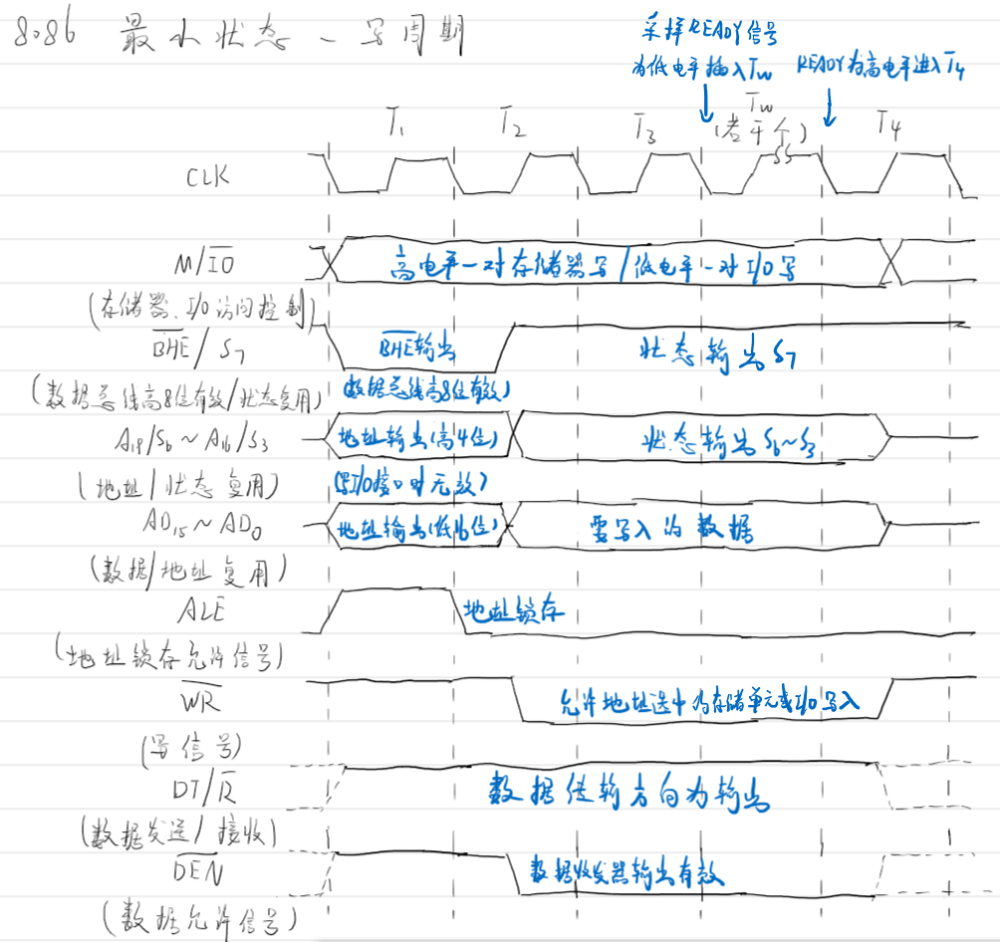

* $T_1$ - 输出地址信息并锁存($\mathrm{ALE}$)，确定字宽($\mathrm{\overline{BHE}}$)
* $T_2$ - 撤销地址准备传输数据，

### 2. 8086 - 最小状态读周期时序图

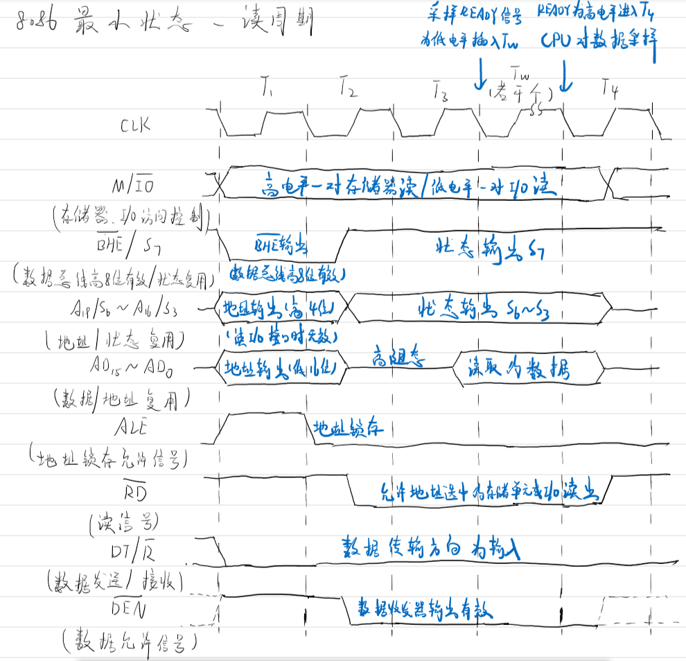

### 3. 8088 - 最小状态写周期时序图

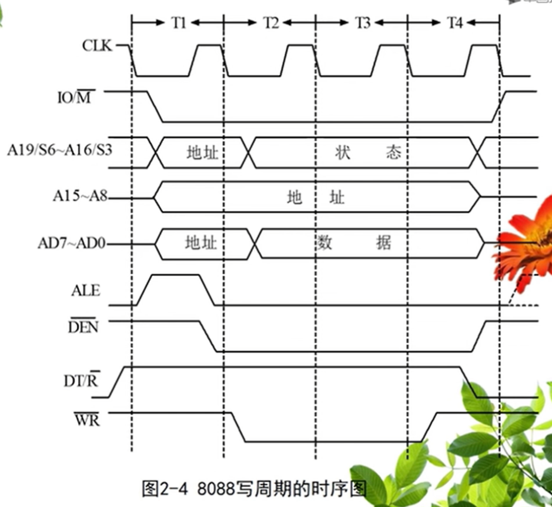

微处理器允许存储器或I/O存储数据的时间一致，需要在这段时间内完成，  
若不能完成，通过$READY$信号，在$T3$周期后插入$Tw$周期，直到$READY$为低电平无效。

### 4. 8088 - 最小状态读周期时序图

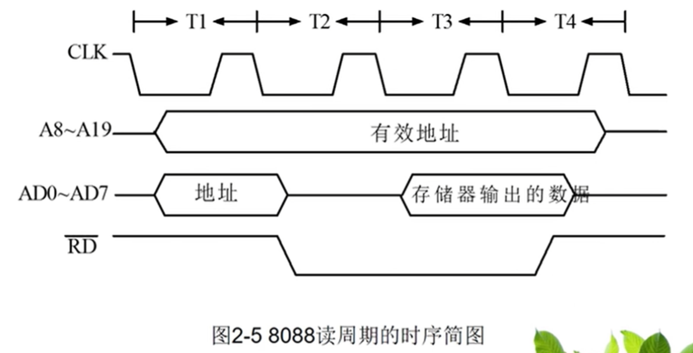

同样可插入$T_w$。

## 五、微机系统的硬件组成

8086/8088有两种工作模式，构成不同控制结构。

* 8088工作在最小模式下，仅需要少量外围设备辅助便可构成一个小型应用系统，称为单处理机模式。
* 在最大模式下，构成的微型机除了8088CPU以外，还可以接一个协处理器8087（增快浮点数运算），称为多处理机模式。

三种总线：

* 地址总线
* 数据总线
* 控制总线

### 1. 总线缓存与锁存

8088的地址线$AD_7\sim AD_0$是分时复用信号线（既可以作为地址、也可以作为数据），  
所以必须从分时复用的引脚**将地址、数据线分离**，  
且必须对地址信息所存以保持稳定（保持地址保持不变）。

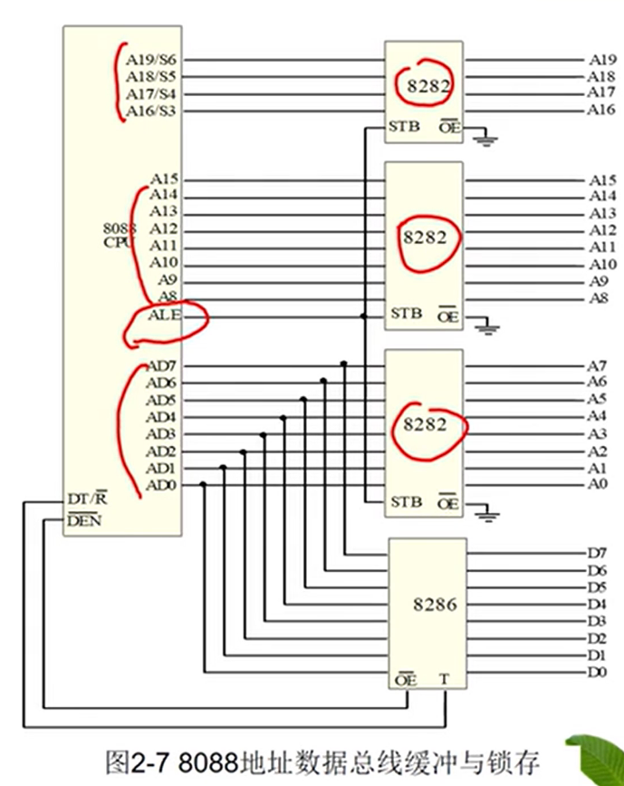

* 8282 - 待三态输出的8D锁存器（与之相似的有74LS343）  
  控制信号：
  * $STB$ - 选通输入，与CPU的$ALE$相连。
  * $\overline{OE}$ - 输出使能，直接接地，表示输出总是有效。
* 8286 - 双向门数据总线收发器（与之相似的有74LS245）  
  控制信号：
  * $T$ - 数据传送方向控制端  
    高电平：数据从A端流向B端；低电平：B流向A
  * $\overline{OE}$ - 输出使能

分离数据总线方法：  
采用8286，当写数据，$DT/\overline{R}$输出高电平，8286数据从$A$到B，为写；反之为读。

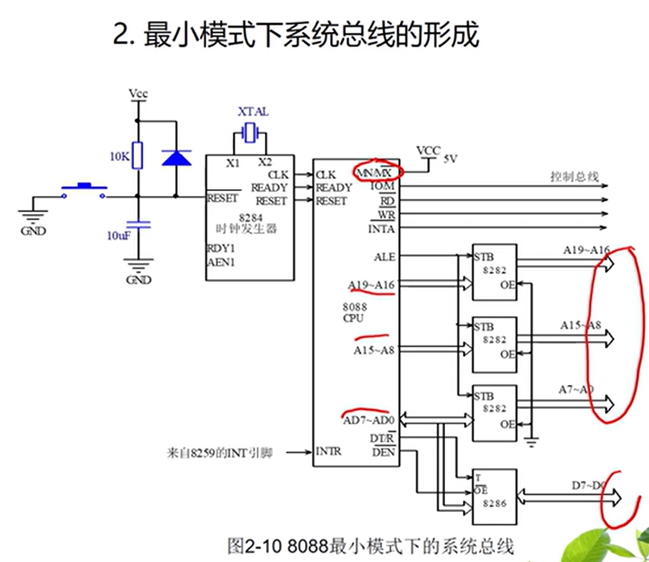 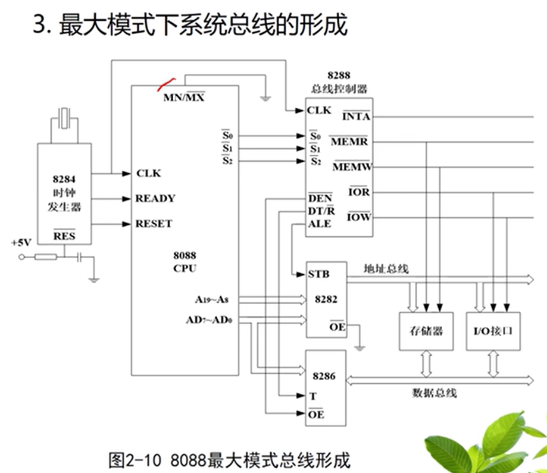

## 六、存储器

### 1. 结构

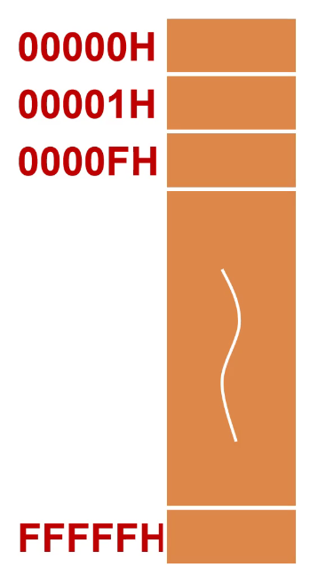

存储容量为$1MB$，物理地址范围`00000H~FFFFFH`。  
每**一个地址**对应存放**1字节**`xxH`的数据。

数据可以是字节、字和双字，对字/字节是从偶地址开始。

### 2. 分段管理

8086/8088有20根地址线，最大内存空间为$1MB$，  
而内部寄存器宽度为16位，只能存放16位的地址$64K$，无法用1个寄存器存下物理地址。

因此采用分段的方法，物理地址 = 段起始地址（段地址 × `10H`） + 段内偏移地址。

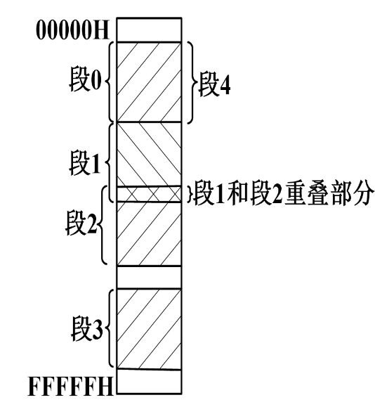

* 段基址 - `xxxxH`：左移$4$位，作为段起始地址  
  每个段由连续的存储单元构成，并且能够独立寻址，**段和段之间允许重叠**。
* 段内偏移量（偏移/有效地址, EA）：段内各存储单元地址相对于该段起始单元地址的位移量。  
  从$0$开始，取值范围为`0000H ~ FFFFH`

段基址和段内偏移地址组成**逻辑地址**，表示为`xxxxH:yyyyH`。

BIU 中存在地址加法器，用于将逻辑地址转换为物理地址。  
第一个加数来自于段寄存器，第二个来自于指令。

**作用：**

1. 存储器采用分段管理，使得多个程序可以并行运行
2. 允许程序重定位（只用更改段寄存器，就能整块的移动程序）
3. ？

### 3. 存储体的组成结构

分奇偶。

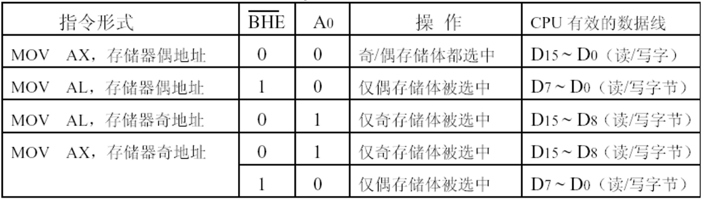

## 七、I/O组织

I/O采用独立编制，寻址外设端口只有$64K$。  
要与内存的**寻址存储器**区分。

## 八、寄存器

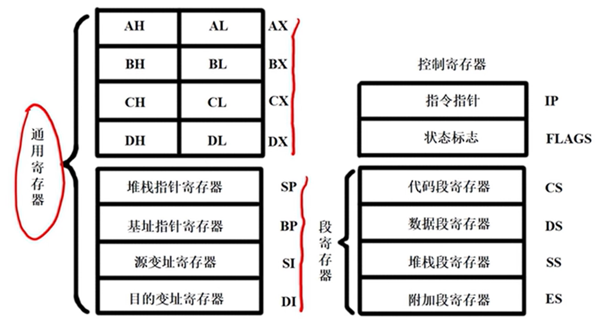  

一共14个**16位**寄存器。

**8个通用寄存器：**

* 4个数据寄存器（可划分为两个独立的单元）
  * AX - 累加器：存放中间运算结果（输入输出寄存器）
  * BX - 基址寄存器：存放内存单元的偏移地址
  * CX - 计数寄存器：循环
  * DX - 通用寄存器：乘除法作辅助的操作数寄存器；输入输出作外设口地址寄存器
* 2个地址寄存器
  * SP - 堆栈指针寄存器：栈顶的偏移地址，与SS配合
  * BP - 基址指针寄存器：多种寻址方式的偏移地址或基地址，与SS配合
* 2个变址寄存器
  * SI - 源变址寄存器（数据段、附加段的偏移地址）
  * DI - 目的变址寄存器（数据段、附加段的偏移地址）

**4个段寄存器：**

* CS - 代码段寄存器：固定与IP一起寻址内存代码区
* DS - 堆栈段寄存器：固定与SP或BP寻址内存堆栈区
* SS - 数据段寄存器：与SI、DI、BP等寻址内存数据区
* ES - 附加段寄存器：与SI、DI、BP等寻址内存数据区

源数据块`DS:SI`，目的数据块`ES:DI`。

**2个控制寄存器：**

* IP - 指令指针寄存器：指明**下一条**要执行指令的偏移地址（基址由CS决定，`CS:IP`）
* FLAGS(FR, PSW) - 状态标志寄存器
  * 状态标志（6位） - 存放运算结果状态
    * (Bit#0)CF - 进位（或借位）
    * (Bit#2)PF - 奇偶（运算结果**低8位**`1`的个数为**偶数置`1`**，相当于第8位奇校验）
    * (Bit#4)AF - 半进位（第3位向第4位有进位置`1`）
    * (Bit#6)ZF - 零（为零置`1`）
    * (Bit#7)SF - 符号（为负数置`1`）
    * (Bit#11)OF - 溢出（超出范围置`1`，与进位不同）
  * 控制标志（3位） - 控制某些特殊操作（用户可写）
    * (Bit#8)TF - 跟踪标志（为`1`是单步工作方式（单步调试））
    * (Bit#9)IF - 中断允许（为`1`表示可以响应可屏蔽中断）
    * (Bit#10)DF - 方向标志：控制地址指针变化（为`0`递增；为`1`递减）

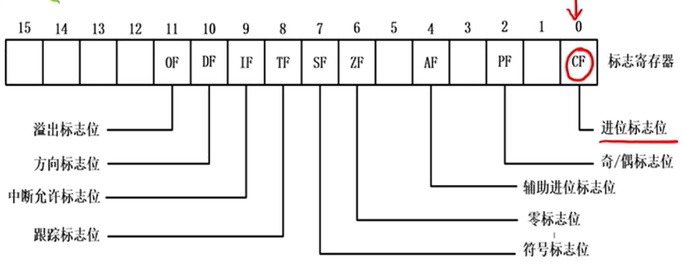

> 区别 - 进位与溢出：
>
> * 进位：运算结果的**最高有效位**，向更高位仅为或借位  
>   只针对**无符号数**（有符号数这个标志位无意义）
> * 溢出：两个**最高有效位一样**（必要前提，与进位不同）的数，运算结果最高有效位不同。  
>   只针对**有符号数**（无符号数这个标志位无意义）
>
> ALU 不知道自己时运算的有符号数还是无符号数，因此两个位都会按照判断方法判断（相当于同时当成有符号数和无符号数），  
> 程序员自己根据是有符号数还是无符号数，决定用哪个标志位。
>
> 两者完全不存在包含关系，如：
>
> * `0111_1111 + 1000_0001` - 有进位，无溢出（最高有效位不一样，OV恒为`0`）
> * `0111_1111 + 0000_0001` - 无进位，有溢出
> * `1111_1111 + 0000_0001` - 有进位，有溢出
