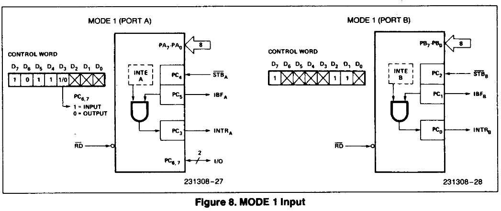
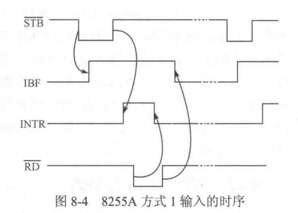
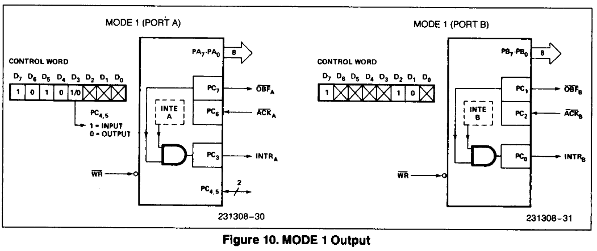
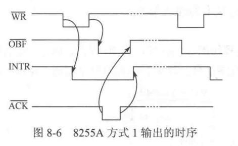

# Ep.9 可编程接口芯片

## 一、综述

通用并行接口的一般接口：

* 多个可编程并行数据通道  
  内含一个并行数据输入和输出缓冲器
* 控制寄存器  
  存放CPU命令字
* 状态寄存器  
  存放接口状态
* 内部地址译码电路

**外侧一侧相连的引脚：**

* 从外设输入数据时需要信号
  * 外设数据已送出 - 外设送并口
  * 输入寄存器空 - 并口送外设
* 向外设输出数据时需要信号
  * 输出寄存器满 - 并口送外设
  * 外侧接受就绪信号 - 外设送并口

**CPU一侧相连的引脚：**

* 与CPU传送数据

## 二、8255

8255上的接口：

* $D_0\sim D_7$ - 数据总线  
* $\overline{WR}$ - 写使能
* $\overline{RD}$ - 读使能
* $A1, A0$ - 内部端口的地址线
* $\overline{CS}$ - 片选信号
* $A$口、$B$口、$C$口 - 向外设的输出

### 2. 功能

* **方式0** - 基本输入/输出方式
* 方式1 - 单向选通工输入/输出方式
* 方式2

#### (1) 方式0

* 相当于三个独立的8位简单接口
* 每个独立端口既可以设置为输入口，也可以设置为输出口，但不能同时实现输入和输出  
* C端口可以是一个8为的简单接口，也可以分为2个独立的4位接口
* 常用于连接简单外设（适用于无条件传输方式或查询方式）

常使A端口和B端口作为8位数据的输入或输出口，使C口的某些位作为状态输入。

#### (2) 方式1

* 三个数据端口分为A、B两组，分别称为A组控制和B组控制
* 端口A、端口B作数据输入或输出口，  
  端口C作为联络控制信号，一部分作为A、B的联络信号，另一部分任何作为基本的输入输出口
* A、B口在作为输入和输出时的选联络制信号不同

**方式1输入时：**

作为外部设备的输入，**外部设备提供数据，供CPU读取**。

* B口的联络信号
  * $PC_0$ → $\text{INTR}_B$ - 中断请求信号  
    **通知给CPU。**
    8255发送该信号，作为中断信号；
    * 8255内部有个中断允许信号$INTE$，只有$INTE$和$IBF$均为高电平，才会发出中断信号。
  * $PC_1$ → $\text{IBF}_B$ - 输入缓冲器满  
    **通知给外设**。  
    8255发送该信号，作为$STB$的应答信号；  
    有效时，表示8255告诉外设，自己的输入数据缓冲器满了，除非CPU它来取走，不然我不能再存放你的数据了（就是防止外设再次发送数据给覆盖了）。  
    *注：也可以通知给CPU，表示CPU让我读，我已经读了，不要再让我读给覆盖了。*
  * $PC_2$ ← $\overline{\text{STB}_B}$ - 输入请求信号  
    由**外设发送该信号**。
    有效时，表示外设告诉8255，自己有数据想要送到CPU里，要让8255存了。  
    *注：也可以由CPU发送该信号，表示CPU准备读取数据了，需要让输入数据送入到8255内部的缓存器中。*  
    ⭐也作为$INTE$信号，因此需要设置为`1`，即控制字`0000_0101`。
* A口的联络信号
  * $PC_3$ → $\text{INTR}_A$
  * $PC_4$ ← $\overline{\text{STB}_A}$
    ⭐也作为$INTE$信号，因此需要设置为`1`，即控制字`0000_1001`。
  * $PC_5$ → $\text{IBF}_A$

  

过程：

1. 当外设需要向CPU输入数据（或CPU需要读入数据）时，**外设（或CPU）向8255发送锁存$\overline{STB}$信号**，让8255锁存；  
2. 8255得到数据后，**向外设（或CPU）发送缓冲满$IBF$信号**，通知其不要再发$STB$信号防止数据被覆盖；  
3. 当中断允许$INTE$信号和缓冲满$IBF$信号均有效时，**8255向CPU发送中断$INTR$信号**，CPU再去读取。  
   注：如果不允许中断（$INTE$无效），则是由CPU主动**查询**的方式来获取。
4. CPU得到有效中断$INTR$信号（或查询到有效），则开始读取，发送读取$\overline{RD}$信号，  
   一段时间后$INTR$信号复位为`0`。
5. 当读取结束后，$\overline{RD}$信号无效，将$IBF$信号复位为`0`。
6. 外设（或CPU）发现$IBF$信号失效后，开始新一轮循环，回到1。

即$\overline{\text{STB}}\to \text{IBF}\to \text{INTR}$

  

**方式1输出时：**

作为CPU的输出，**CPU提供数据，供外部设备读取**。

* B口的联络信号
  * $PC_0$ → $\text{INTR}_B$ - 中断请求信号  
    **通知给CPU。**
    8255发送该信号，作为中断信号；
    * 8255内部有个中断允许信号$INTE$，只有$INTE$和$IBF$均为高电平，才会发出中断信号。
  * $PC_1$ → $\overline{\text{OBF}}$ - 输出缓冲器满  
    **通知给外设**。  
    8255发送该信号，作为$\overline{\text{WR}}$的应答信号；  
    有效时，表示8255告诉外设，自己的输出数据缓冲器有数据了，可以来取数据了。  
  * $PC_2$ ← $\overline{\text{ACK}_B}$ - 应答信号  
    由**外设发送该信号**。
    有效时，表示外设告诉8255，自己已经读取完数据，告诉CPU可以继续发数据了。  
    ⭐也作为$INTE$信号，因此需要设置为`1`，即控制字`0000_0101`。
* A口的联络信号
  * $PC_3$ → $\text{INTR}_A$
  * $PC_6$ ← $\overline{\text{ACK}_A}$
    ⭐也作为$INTE$信号，因此需要设置为`1`，即控制字`0000_1101`。
  * $PC_7$ → $\text{OBF}_A$

  

过程：

1. 当CPU需要向外设输出数据时，**CPU向8255发送数据和$\overline{\text{WR}}$信号**，让8255锁存；  
2. 8255得到数据后，**向外设发送缓冲满$\overline{\text{OBF}}$信号**，通知其有数据让你读取了；
3. 当外设读取准备就绪，且发现$\overline{\text{OBF}}$有效时，则会**取走数据，并向8255发送应答$\overline{\text{ACK}}$信号**，表示自己已经取走数据了。  
4. 8255检测到应答$\overline{\text{ACK}}$信号变有效那个下降沿时，则会将$\overline{\text{OBF}}$信号复位为`0`。
5. 当中断允许$\text{INTE}$信号和应答$\overline{\text{ACK}}$信号复位为`1`那个上升沿时时，**8255向CPU发送中断$INTR$信号**，表示外设已经读完，可以进入中断发送新的数据。  
   注：如果不允许中断（$\text{INTE}$无效），则是由CPU主动**查询**的方式来获取。
6. CPU得到有效中断$\text{INTR}$信号（或查询到有效），则开始新一轮发送，回到1。

即$\overline{\text{OBF}}\to \overline{\text{ACK}}\to \text{INTR}$。

*参考[【微机原理】3.可编程并行接口8255](https://zhuanlan.zhihu.com/p/24373769)。*

## 三、8253

### 1. 概念

* 控制寄存器
* 计数初值及寄存器
* 减一计数器
* 当前计数值锁存器

### 2. 方式

* 方式0 - 软件触发、软件可重触发
* 方式1 - 硬件触发、硬件可重触发
* 方式2 - 软件触发、硬件可重触发
* 方式3 - 软件触发、硬件可重触发
* 方式4 - 软件触发、软件可重触发
* 方式5 - 硬件触发、硬件可重触发

注：

* 硬件触发 - 必须由`GATE`上跳沿开始计数
* 软件触发 - 写入初值（且门控有效）则开始计数
* 硬件可重触发 - 由`GATE`信号导致重新开始计数
* 软件可重触发 - 向初始寄存器写入新初值导致重新计数