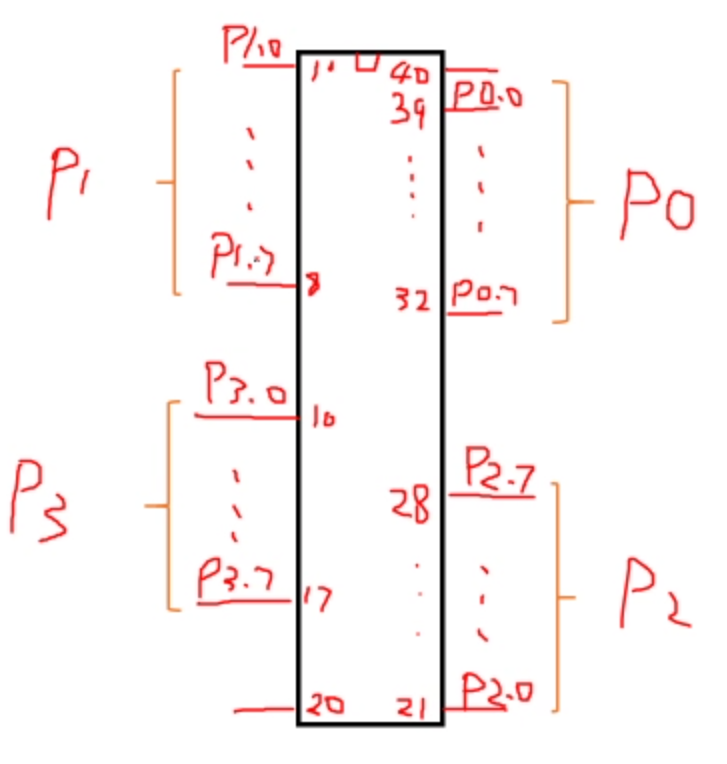
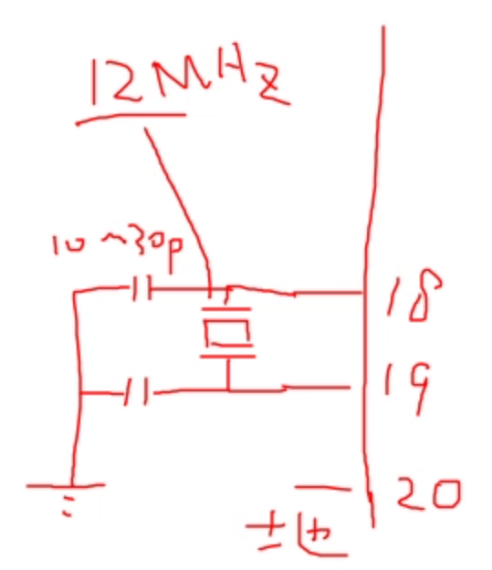
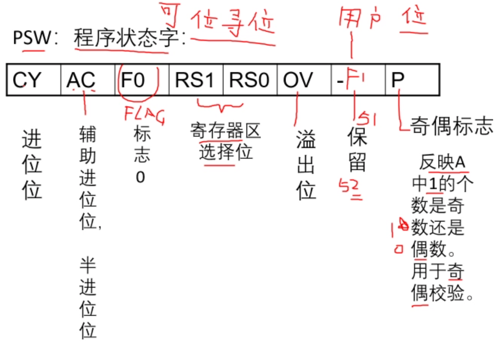
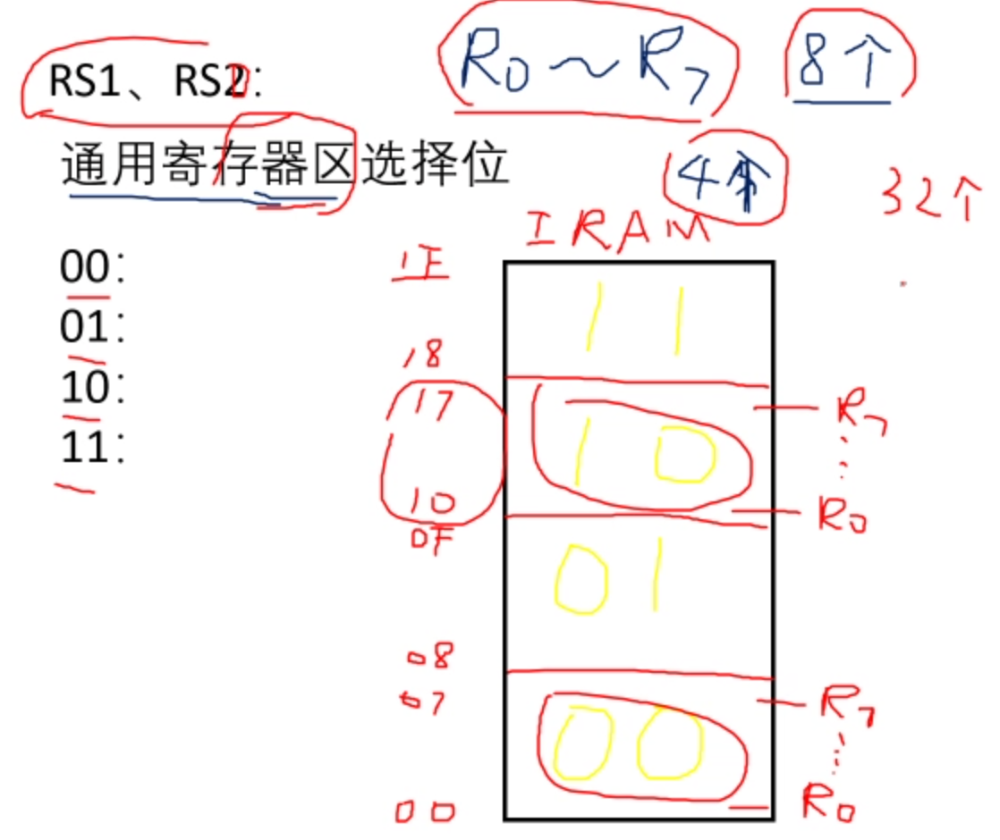

# Ep.2 MCS-51的硬件结构

MCS-51是一种较原始的单片机（不是本次课设用的）。

## 一、MSC-51管教排列

PIO - 用来传输数据的接口组，  
在MCS-51有4组，每组内有8个引脚（8位，数据传输需要8个端口），  
某一PIO引脚属于第几组第几个，则定义为$Px.y$(e.g. $P2.2$)。

其他管脚：

* 9 - $RST$：复位管脚
* 18,19 - $XTAL$,$XTAL2$：主频管脚
* 20 - $GND$：地
* 29 - $\overline{PSEN}$：读（外部）程序存储器的读信号（输出）
* 30 - $ALE$：地址锁存信号（输出）
* 31 - $\overline{EA}$：有效时程序从外部存储器读取（输入）
* 40 - $VCC$：5V

### 1. ALE地址锁存信号

在微机课中讲了。

51单片机要访问64K的外部存储器，需要地址数据分离。  
利用$ALE$实现。

$ALE$为低电平时，代表数据；为高电平时，代表地址，  
然后利用74HC573进行锁存。

### 2. P3口的变异功能

* $P3.0$ - $RXD$：串行输入口
* $P3.1$ - $TXD$：串行输出口
* $P3.2$ - $INT0$：外部中断0（可以下降沿中断，也可以全低电平中断）
* $P3.3$ - $INT1$：外部中断1
* $P3.4$ - $T0$：计数器0的外部输入（单片机可以作为计数器用，此时记录外部信号下降沿次数）
* $P3.5$ - $T1$：计数器1的外部输入
* $P3.6$ - $\overline{WR}$：外部数据存储器写选通信号
* $P3.7$ - $\overline{RD}$：外部数据存储器读选通信号  
  ⚠当扩展了外部数据存储器时，$P3.6$、$P3.7$不能再当成普通I/O口使用！

### 3. P1口的变异功能

* $P1.0$ - $T2$
* $P1.1$ - $T2EV$：计数器2的捕捉/重装引脚

## 二、振荡器和时钟电路

用于产生时钟信号$CLK$，  
为什么要用振荡器可见这篇文章「[为什么我们要在单片机中使用振荡器？](https://baijiahao.baidu.com/s?id=1729642852420934881)」。

外部晶体振荡器：  
  
由外部的晶体和电容与内部电路组成。

如果有合适的始终信号，上述部分可以省略，  
如STC系列，内部有RC震荡器。  
但只能用于精度要求不高的应用。

## 三、CPU

读指令并执行。

组成：8位ALU + 相关寄存器

* 寄存器
  * `A` - 累加器  
    所有的**算术运算**都通过累加器进行。
  * `B`  
    乘除法需要用到`B`
  * `PSW` - 程序状态字  
    
    倒数第二位对于51是保留（未用）；52是`F1`，是用户自定的。  
    RS1和RS2组合，代表通用寄存器(`R0~R7`)在哪个通用寄存器区(4个)，主要是用于中断处理的（直接把寄存器组换到新的区）。
    
  * `SP` - 堆栈指针  
    堆栈区在RAM的128~256，8位。
  * `PC` - 程序计数器
  * `DPTR` - 数据指针寄存器  
    指向64K空间的任意地址，可以分为`DPH`和`DPL`，16位。
* ALU：8位，算数或逻辑运算、位运算。

需要确定变量是有符号数还是无符号数（CY和OV的区别），可以百度。