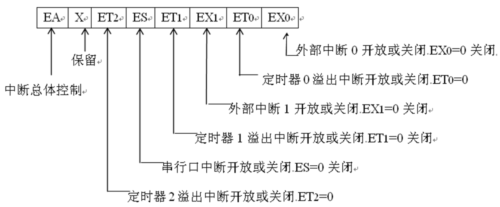

# Ep.5 中断系统

MCS-51有5个中断源：$\overline{INT0}$、$TF0$、$\overline{INT1}$、$TF1$、$RI$&$TI$（MCS-52还有$TF2$、$EXF2$）。

## 二、中断开放寄存器

中断开放寄存器`IE`，  
控制每个中断源，是否允许中断。

置为`1`开放；置为`0`拒绝。

  

## 三、中断优先级

MCS-51的中断优先级分为两级，只有最高`1`和最低`0`，  
由`SFR:IP`决定。

## 四、中断向量

区别于x86的中断向量，其相当于间接寻址，IP会转到中断向量指向的地址；  
而MSC-51的中断向量，是直接寻址（跳过去就能执行），但存放的是一条JMP指令。

中断需要满足以下条件，否则不能得到响应：

1. 同级或高级的中断正在服务
2. 当前周期不是正在执行指令的最后一个周期（这条指令还没执行完）
3. 当前正在执行的指令是`RETI`，或对`IE`、`IP`寄存器进行存取。

如果中断标志因为未满足条件而被闭锁（延迟响应），但在闭锁条件撤出后（条件满足）标志不复存在，则拖延的中断将丢失。

**下降沿触发**中断时，一旦中断被响应进入中断程序后，硬件自动清除中断标志`IE0`、`IE1`；  
**低电平触发**，硬件不会自动清零，**必须要软件清零**，否则会无限循环。

定时器的溢出标志`TF0`、`TF1`也是硬件清零；串行口标志`RI`、`TI`也需要用户清零。

## 五、外部中断

外部中断`INT0`、`INT1`，通过`TCON`寄存器的`IT0`、`IT1`来决定是低电平触发还是脉冲触发。

* $ITx=0$ - 低电平请求中断  
  必须**保持低电平**直到中断得到响应为止。  
  在`RETI`之前应通过**软件清除**`IEx`，否则循环执行。
* $ITx=1$ - 下降沿请求中断  
  至少保持**一个机器周期的高电平**，然后至少保持**一个机器周期的低电平**，CPU才能查到有跳变发生，  
  随后将`IEx`置位，并在最后进行**硬件清零**。