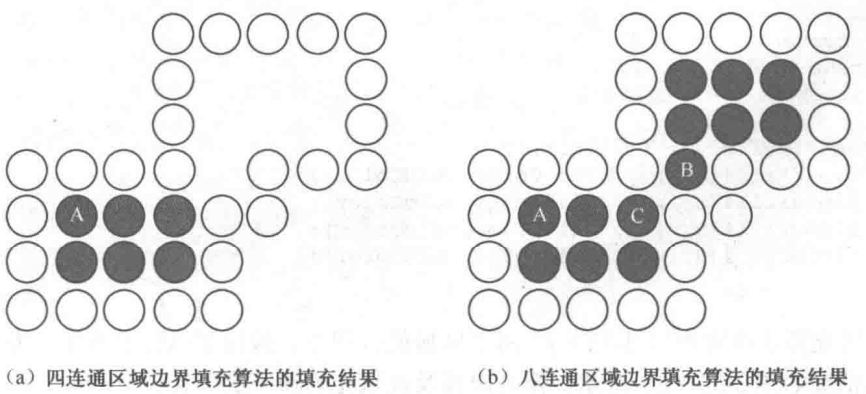
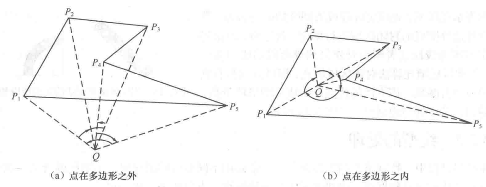
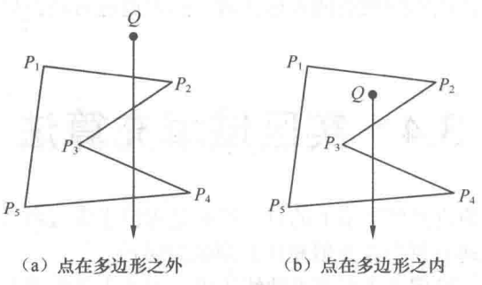
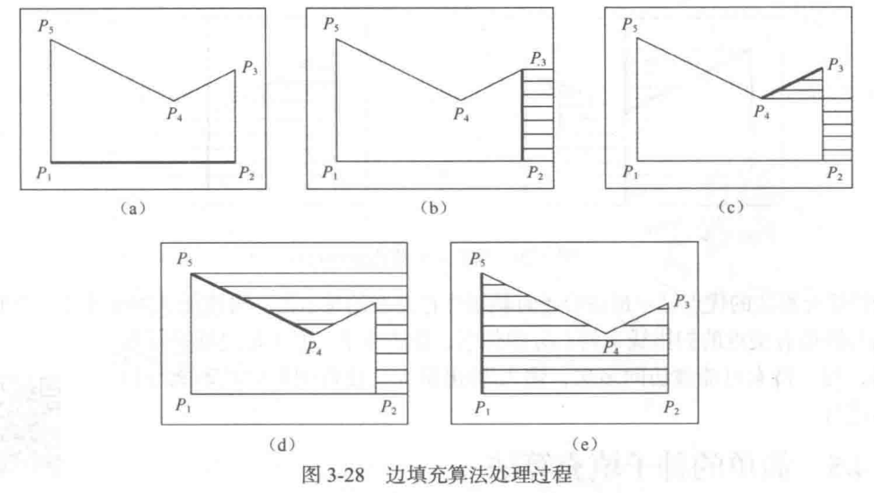
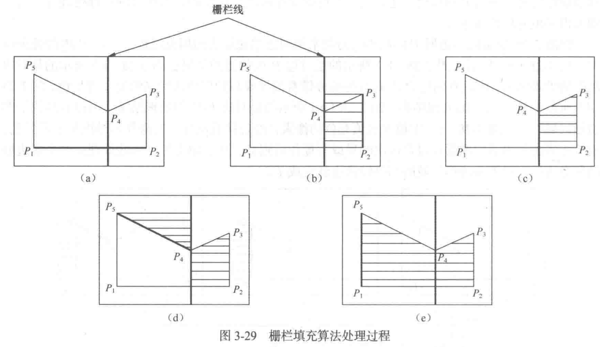
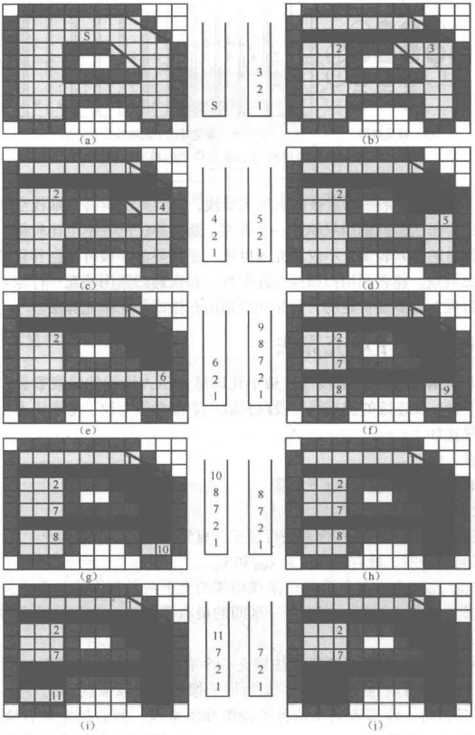

# Ep.3 二维基本图形生成算法

把图形的数学公式（连续）描述成像素集（离散）。  
一个图形系统最基本要求能画一个点，因此跳过了点的光栅化。

## 一、直线的扫描转换

**基本概念：**

* 屏幕坐标：以笛卡尔坐标系（左下为原点），用扫描列号$x$和扫描行号$y$，来描述屏幕上像素的位置。
* 屏幕网格坐标：将像素作为占有大小的区域，交点既可以作为像素中点，也可以作为左下锚点。
* 图形扫描转换（光栅化）：将屏幕看作像素矩阵，每个像素有位置和颜色。用最佳**逼近于所显示图形**的**像素集合**，并用**指定属性**（如颜色）写像素的过程为光栅化。

**直线扫描转换的要求：**

* 所绘直线要直。
* 沿着线段分布的像素应均匀且连续，不能出现断裂。
* 生成速度快。

### 1. 直接生成法

直线扫描转换算法举例 - 直接生成法：

```c++
void DirectLine(int x0, int y0, int x1, int y1, int color)
{
    float k, b, y;
    /* 用斜率计算k, 再用点计算b */
    for (x = x0; x <= x1; x++)
        putpixel(x, (int)(k*x + b + 0.5)), color); // 注意像素位置用整数
}
```

在循环内每次都会计算一次浮点数乘法运算$kx+b$，复杂度高。

### 2. 数值微分法(DDA)

每次计算浮点数乘法运算$kx+b$较复杂，可以在此处优化，  
如“**数值微分法**”(**DDA**)，使用增量的方法。

其利用直线的微分方程$\frac{\mathrm{d}x}{\mathrm{d}y}=k$，生成直线时采用增量改变。  
如果$\Delta x$较大，采用$x$方向作为步进方向（**这样每次$y$变化小**直线才连续），  
$\Delta x=1$，$\Delta y = k\cdot\Delta x$，每次则用加法计算$x_{k+1}=x_k+\Delta x,y_{k+1}=y_k+\Delta y$。

通法为以下代码：

```c++
void Line_DDA(int x0, int y0, int x1, int y1, Color color)
{
    int delta_x, delta_y, steps, dx, dy; // delta_x为两端点横纵坐标距离，dx为增量
    // 计算delta_x, delta_y, 确定steps，并计算dx, dy
    delta_x = x1 - x0, delta_y = y1 - y0;
    steps = max(delta_x, delta_y);
    dx = delta_x / steps, dy = delta_y / steps;
    for (i = 1; i <= steps + 1; i++) // 注意：最后一个像素点需要额外putpixel一次
    {
        putpixel((int)(x + 0.5), (int)(y + 0.5), color); // 四舍五入生成像素点
        x += dx, y += dy;
    }
}
```

包含了斜率不存在的情况（此时`dx=0`）。

浮点数加法还是不及整数加法，继续优化。

### 3. 中点画线算法(Midpoint Line Drawing Algorithm)

通过在每列像素中，确定与理想直线最佳逼近的像素来进行扫描转换。

**算法描述：**

1. 给定直线段$L(P_0,P_1)$段两端点坐标$P_0(x_0,y_0)$、$P_1(x_1,y_1)$（⚠**必须保证$x_0<x_1$**，原因见下「注意 - 有关上述点与直线三种情况的补充」），  
   则直线方程为：
   $$
   F(x,y)=ax+by+c=0
   $$
   其中：$a=y_0-y_1$、$b=x_1-x_0$、$c=x_0y_1-x_1y_0$，且$b>0$  
   记直线斜率为$k$，先假定$0\le k\le 1$。
2. 则平面上任何点$(x,y)$与直线的相对位置有三种情况  
     
   $$
   F(x_i, y_i)\left\{\begin{array}{ll}
   <0 & \textrm { 点 }(x_i, y_i) \textrm { 位于直线下方 } \\
   =0 & \textrm { 点 }(x_i, y_i) \textrm { 位于直线上 } \\
   >0 & \textrm { 点 }(x_i, y_i) \textrm { 位于直线上方 }
   \end{array}\right.
   $$
3. 设当前已确定与直线最近的像素点，坐标为$P(x_i,y_i)$，  
   下一个与直线最近的右方像素，只能是正右方像素$P_{RB}(x_i+1,y_i)$或右上方像素$P_{RU}(x_i+1,y_i+1)$，称为**两个“候选像素”**。  
4. $P_{RB}$和$P_{RU}$的中线$M$，易知坐标$M(x_i+1,y_i+0.5)$，  
   再假设$Q$为理想直线与垂直线$x=x_i+1$的交点，$M$与$Q$有三种关系：
   * 若$M$在$Q$上方或重合，则选正右方$P_{RB}$
   * 若$M$在$Q$下方，则选正右方$P_{RU}$
     
   即用中点$M$的函数值$F(M)$作为决策变量$d_i$，根据$d_i$的符号确定下一个像素的选取。
   $$
   d_i\left\{\begin{array}{ll}
   <0 & \textrm { 取右上方像素 } P_{RU}\left(x_{i}+1, {y}_{i}+1\right) \textrm { 作为下一个像素 } \\
   \ge 0 & \textrm { 取正右方像素 } P_{RB}\left(x_{i}+1, {y}_{i}\right) \textrm { 作为下一个像素 }
   \end{array}\right.
   $$
5. 选择相应像素后，下一个决策变量可以直接推导出来：
   $$
   d_i\left\{\begin{array}{ll}
   <0 & d_{i+1}=d_i+a+b \\
   \ge 0 & d_{i+1}=d_i+a
   \end{array}\right.
   $$
6. 注意到初始的决策变量为$d_0=a+0.5b$，会造成$d_0$为浮点数，之后都是浮点数加法，  
   但$d$只需要关注大小位置，所以可以$\times2$，则**转换为整数加法**：
   * $d_0=2a+b$
   * $d_{i+1}=d_i+2a$或$d_{i+1}=d_{i}+2(a+b)$
7. 第一个像素要选择直线端点$P_0(x_0,y_0)$。  
   决策变量的定义在步骤4，初始的决策变量为$d_0=2a+b$。

> **注意 - 有关上述点与直线三种情况的补充：**
>
> 实际上判断点与直线位置情况应该是下面的判断式：  
>   
> *出自于「[高中数学：点与直线的位置关系，点在直线上方、下方的条件不等式](https://www.zhihu.com/zvideo/1307370134743257088)」*
>
> 上面严格规定了$x_0<x_1$，即$b=x_1-x_0>0$，故才能直接化成上面的判断式。  
> 否则对于下面的情况，实际上是$F(M)>0$才在下方：  
>   
> (这个时候$B<0$，在下方时$F(M)=d>0$)

**算法步骤：**

* 输入：两整数端点$P_0$和$P_1$，必要条件为$0\le k\le 1$，和画线的颜色$color$

1. 若$x_0>x_1$，交换两点
2. 设置初始像素坐标$x,y$为$x_0,y_0$
3. 计算系数$a$、$b$
4. 计算决策变量初始值$d_0 = 2a+b$，两种情况增量$delta1 = 2a$，$delta2 = 2a+2b$
5. 用循环确定沿线段下一像素位置，实现绘制：

   ```c++
   while (x != x1)
   {
     setpixel(x, y, color);
     if (d < 0)
       x++, y++, d += delta2;
     else
       x++, d += delta1;
   }
   ```

---

对于其他三种情况，就是根据$y=x,y=0,x=0$对称即可，这里只给出$d_i$迭代的操作与变化：

| $k$情况     | $k\in[0,1]$           | $k\in(1,+\infty)$     | $k\in[-1,0)$          | $k\in(-\infty,-1)$    |
| ------------- | --------------------- | --------------------- | --------------------- | --------------------- |
| $d_0$         | $d_0=2a+b$            | $d_0=a+2b$            | $d_0=2a-b$            | $d_0=a-2b$            |
| $d_i<0$情况 | `x++, y++, d+=2(a+b)` | `y++, d+=2b`          | `x++, d+=2a`          | `y--, x++, d+=2(a-b)` |
| $d_i\ge0$情况 | `x++, d+=2a`          | `y++, x++, d+=2(a+b)` | `x++, y--, d+=2(a-b)` | `y--, d+=2b`          |

**完整代码：**

```c++
void Line_Midpoint(int x0, int y0, int x1, int y1, Color color)
{
    if (x0 > x1) // 保证x0 <= x1
        swap(x0, x1), swap(y0, y1);
    int a = y0 - y1, b = x1 - x0,   // 直线L的参数（c因为没有用到不用计算）
        d,                          // 决策变量d
        dd_L, dd_G,                 // 决策变量d的增量(L代表小于0的情况，G代表大于0的情况)
        x = x0, y = y0,             // 初始P坐标
        dPx_L, dPy_L, dPx_G, dPy_G; // P坐标的增量(L代表小于0的情况，G代表大于0的情况)
    // 根据k值分情况生成决策变量和增量
    if (-b <= a && a <= 0) // k ∈ [0, 1]
    {
        d = 2 * a + b;                            // d0 = 2a + b
        dPx_L = 1, dPy_L = 1, dd_L = 2 * (a + b); // d < 0情况
        dPx_G = 1, dPy_G = 0, dd_G = 2 * a;       // d >= 0 情况
    }
    else if (a < -b) // k ∈ (1, +∞)
    {
        d = a + 2 * b;                            // d0 = a + 2b
        dPx_L = 0, dPy_L = 1, dd_L = 2 * b;       // d < 0情况
        dPx_G = 1, dPy_G = 1, dd_G = 2 * (a + b); // d >= 0 情况
    }
    else if (0 < a && a <= b) // k ∈ [-1, 0)
    {
        d = 2 * a - b;                             // d0 = 2a - b
        dPx_L = 1, dPy_L = 0, dd_L = 2 * a;        // d < 0情况
        dPx_G = 1, dPy_G = -1, dd_G = 2 * (a - b); // d >= 0 情况
    }
    else // k ∈ (-∞, -1)
    {
        d = a - 2 * b;                                  // d0 = a - 2b
        dPx_L = 1, dPy_L = -1, dd_L = 2 * (a - b);      // d < 0情况
        dPx_G = 0, dPy_G = -1, dd_G = -2 * b;           // d >= 0 情况
    }
    // 迭代生成直线
    while (x != x1 || y != y1)
    {
        putpixel(x, y, color);
        d < 0 ? x += dPx_L, y += dPy_L, d += dd_L : x += dPx_G, y += dPy_G, d += dd_G;
    }
    putpixel(x, y, color);
}
```

### 4. Bresenham画线算法

其与中点画线算法的思想基本一致，只是在判断选$P_{RB}$和$P_{RU}$方法不同，  
这里把用实际位置与中点的位置关系，变为了与$P_{RB}$和$P_{RU}$两距离的大小关系，  
且约定$d_1=d_2$时选择右上方像素$P_{RU}$。  
仍先考虑$0\le k\le 1$的情况。

用$d_1$和$d_2$来表示正右$P_{RB}$和右上两个候选像素的$y$值，与线段上理想$y$值（$Q$点$y$值）的差值，  
即$d_1=|P_{RB}Q|, d_2=|P_{RU}Q|$，可得$d_1-d_2=2k(x_i+1)-2y_i+2b-1$，  
其中$k=\frac{\Delta y}{\Delta x}$，代入并在两边同乘$\Delta x$后得：
$$
\Delta x(d_1-d_2) = 2x_i\Delta y - 2y_i\Delta x + C
$$
其中$C$为一常量，$C=2\Delta y + \Delta x(2b-1)$。

设决策变量$d_i=\Delta x(d_1-d_2)$，其符号与$d_1-d_2$相同，起判别作用。  
判别情况如下：

$$
d_i\left\{\begin{array}{ll}
<0 & \textrm { 取正上方像素 } P_{LU}\left(x_i, {y}_{i}+1\right) \textrm { 作为下一个像素 } \\
\ge 0 & \textrm { 取右上方像素 } P_{RU}\left(x_{i}+1, {y}_{i+1}\right) \textrm { 作为下一个像素 }
\end{array}\right.
$$

而对于决策变量的迭代如下：
$$
d_{i+1}=2x_{i+1}\Delta y - 2y_{i+1}\Delta x + C \\
d_{i+1}-d_i = 2(x_{i+1}-x_i)\Delta y - 2(y_{i+1}-y_i)\Delta x \\
d_{i+1}=d_i+2\Delta y -2\Delta x(y_{i+1}-y_i)
$$

* 当$d_i<0$时，$y_{i+1}=y_i$，故$d_{i+1}=d_i+2\Delta y$
* 当$d_i\ge0$时，$y_{i+1}=y_i+1$，故$d_{i+1}=d_i+2(\Delta y - \Delta x)$

总结如下：

$$
d_i\left\{\begin{array}{ll}
<0 & \textrm { 取正上方像素 } P_{LU}\left(x_i, {y}_{i}+1\right) \textrm { 作为下一个像素 }, d_{i+1}=d_i+2\Delta y \\
\ge 0 & \textrm { 取右上方像素 } P_{RU}\left(x_{i}+1, {y}_{i+1}\right) \textrm { 作为下一个像素 }, d_{i+1} = d_i+2(\Delta y - \Delta x)
\end{array}\right.
$$

而对于决策变量初始值$d_0$，仍取左端点$P_0(x_0,y_0)$，计算得到$d_0$为：
$$
d_0 = 2x_0\Delta y - 2y_0\Delta x \\
C = 2\Delta y + \Delta x(2b-1) \\
b = y_0 - \frac{\Delta y}{\Delta x}x_0
$$

整理得：
$$
d_0 = 2\Delta y - \Delta x
$$

---

对于其他情况按中点画线法类似分析，可得到决策变量$d_i$每次迭代的处理如下表：

| $k$情况     | $k\in[0,1]$              | $k\in(1,+\infty)$        | $k\in[-1,0)$              | $k\in(-\infty,-1)$       |
| ------------- | ------------------------ | ------------------------ | ------------------------- | ------------------------ |
| $d_0$         | $d_0=2\Delta y-\Delta x$ | $d_0=2\Delta x-\Delta y$ | $d_0=-2\Delta y-\Delta x$ | $d_0=2\Delta x+\Delta y$ |
| $d_i<0$情况 | `x++, d+=2Δy`           | `y++, d+=2Δx`           | `x++, d+=-2Δy`           | `y--, d+=2Δx`           |
| $d_i\ge0$情况 | `x++, y++, d+=2(Δy-Δx)` | `x++, y++, d+=2(Δx-Δy)` | `x++, y--, d+=-2(Δy+Δx)` | `x++, y--, d+=2(Δx+Δy)` |

**算法代码：**

```c++
void Line_Bresenham(int x0, int y0, int x1, int y1, Color color)
{
    if (x0 > x1) // 保证x0 <= x1
        swap(x0, x1), swap(y0, y1);
    int Delta_x = x1 - x0, Delta_y = y1 - y0,
        d,                          // 决策变量d
        dd_L, dd_G,                 // 决策变量d的增量(L代表小于0的情况，G代表大于0的情况)
        x = x0, y = y0,             // 初始P坐标
        dPx_L, dPy_L, dPx_G, dPy_G; // P坐标的增量(L代表小于0的情况，G代表大于0的情况)
    // 根据k值分情况生成决策变量和增量
    if (0 <= Delta_y && Delta_y <= Delta_x) // k ∈ [0, 1]
    {
        d = 2 * Delta_y - Delta_x;                            // d0 = 2Δy - Δx
        dPx_L = 1, dPy_L = 0, dd_L = 2 * Delta_y;             // d < 0情况
        dPx_G = 1, dPy_G = 1, dd_G = 2 * (Delta_y - Delta_x); // d >= 0 情况
    }
    else if (Delta_x < Delta_y) // k ∈ (1, +∞)
    {
        d = 2 * Delta_x - Delta_y;                            // d0 = 2Δx - Δy
        dPx_L = 0, dPy_L = 1, dd_L = 2 * Delta_x;             // d < 0情况
        dPx_G = 1, dPy_G = 1, dd_G = 2 * (Delta_x - Delta_y); // d >= 0 情况
    }
    else if (-Delta_x <= Delta_y && Delta_y < 0) // k ∈ [-1, 0)
    {
        d = -2 * Delta_y - Delta_x;                             // d0 = -2Δy - Δx
        dPx_L = 1, dPy_L = 0, dd_L = -2 * Delta_y;              // d < 0情况
        dPx_G = 1, dPy_G = -1, dd_G = -2 * (Delta_y + Delta_x); // d >= 0 情况
    }
    else // k ∈ (-∞, -1)
    {
        d = 2 * Delta_x + Delta_y;                             // d0 = 2Δx + Δy
        dPx_L = 0, dPy_L = -1, dd_L = 2 * Delta_x;             // d < 0情况
        dPx_G = 1, dPy_G = -1, dd_G = 2 * (Delta_x + Delta_y); // d >= 0 情况
    }
    // 迭代生成直线
    while (x != x1 || y != y1)
    {
        putpixel(x, y, color);
        if (d < 0)
            x += dPx_L, y += dPy_L, d += dd_L;
        else
            x += dPx_G, y += dPy_G, d += dd_G;
    }
    putpixel(x, y, color);
}
```

## 二、圆和椭圆的扫描转换

### 1. 数学性质

* 数学意义上圆的定义：  
  给出中心$(x_c,y_c)$和半径$r$，则圆的方程为：
  $$
  (x-x_c)^2+(y-y_c)^2=r^2
  $$

三种生成方式：

* 直角坐标法生成圆：
  $$
  y=y_c+\sqrt{r^2-(x_c-x)^2}
  $$  
  * 方法：$x$从$x_c-r$到$x_c+r$以**单位步长**计算对应的两个$y$值。  
  * 问题：计算复杂、间隙不均匀（最左侧间隙大，中心处间隙小）
* 极坐标生成圆：  
  $$
  \left\{\begin{array}{l}
  x=x_{c}+r \cos \theta \\
  y=y_{c}+r \sin \theta
  \end{array}\right.
  $$
  * 方法：角度$\theta$在$0\sim360$范围均匀变化
  * 优点：解决了间隙不均匀。  
  * 问题：三角函数运算比平方根还要大。
* 八方对称法  
  定圆的四条对称轴，分为八个区域，确定一个区域的点，通过对称一步步生成其他七个点。  
    

  ```c++
  // 八方对称画圆，(xc, yc)为圆心，(x, y )为某一部分一点的圆心偏量。
  void CirclePoints(int xc, int yc, int x, int y, int color)
  {
      putpixel(xc + x, yc + y, color);
      putpixel(xc + y, yc + x, color);
      putpixel(xc - x, yc + y, color);
      putpixel(xc + y, yc - x, color);
      putpixel(xc + x, yc - y, color);
      putpixel(xc - y, yc + x, color);
      putpixel(xc - x, yc - y, color);
      putpixel(xc - y, yc - x, color);
  }
  ```

> 拓展 - 画圆弧：
>
> 仍可用画圆的方法，在八分对称的时候，判断该点是不是圆弧范围内即可。

### 2. 中点画圆算法

跟直线的中点画线法类似。

上述的八方对称法，规定**生成最上方右侧的区域**，对称生成其他的。  
则对于该区域，若从左至右（顺时针）生成，每个像素只能在正右方$P_{RU}$或右下方$P_{RB}$。

先**假定：圆心在原点**。

* **决策与迭代**：选两点的中点$M_i$的圆函数值$F(M_i)$作为决策变量$d_i$，两种情况：
  * $d_M<0$，取正右方像素$P_{RU}$，下一个决策变量$d_{i+1}=d_i+2x_i+3$  
  * $d_M\ge 0$，取右下方像素$P_{RB}$，下一个决策变量为$d_{i+1}=d_i+2(x_i-y_i)+5$
  
    
  注意这里的增量不是固定值，与$x_i,y_i$有关，故只能每次迭代计算。
* **初始决策变量$d_0$**：定第一个像素$P_0$为正上方点$(0,R)$，  
  则两像素中点$M_0$为$(1,R-0.5)$，$d_0=1.25-R$  
* **化浮点为整数**：同样转浮点数为整数，这里平移一个$-0.25$，用$d_i-0.25$代替$d_i$，转换为$d_0=1-R$  
  因为$R$为整数，$R=1$时原本为$0.25>0$，转换为$1-R$后为$0=0$，故把$d=0$归于$d_i>0$的情况，  
  其余仍按与$0$的关系来判断，且$d_{i+1}$迭代式不变。

### 3. Bresenham 画圆算法

**算法表述：**

考虑圆心在原点，半径为$R$，先作第一个四分圆，从左至右（顺时针）。

对于像素$P_i(x_i,y_i)$，下一个像素：

* 正右方像素$H(x_i+1,y_i)$
* 右下方像素$D(x_i+1,y_i-1)$
* 正下方像素$V(x_i,y_i-1)$

对于生成过程中，$P_i(x_i,y_i)$实际点开始的一段圆弧，与点$H,D,V$有以下五种关系：

* $H,D,V$全在圆外
* $H$在圆内，$D,V$在圆外
* $H$在圆内，$D$在圆上，$V$在圆外
* $H,D$在圆内，$V$在圆外
* $H,D,V$全在圆内


上述中$D$点作为临界点，所以以$D$到圆心距离$\Delta_D$作为决策变量，则：  


**算法原理：**

* **决策与迭代**：选两点的中点$M_i$的圆函数值$F(M_i)$作为决策变量$d_i$，两种情况：
  * $d_M<0$，取正右方像素$P_{RU}$，下一个决策变量$d_{i+1}=d_i+2x_i+3$  
  * $d_M\ge 0$，取右下方像素$P_{RB}$，下一个决策变量为$d_{i+1}=d_i+2(x_i-y_i)+5$

### 4. 椭圆生成算法（中点画椭圆法）

椭圆一般方程：
$$
\frac{\left(x-x_{c}\right)^{2}}{a^{2}}+\frac{\left(y-y_{c}\right)^{2}}{b^{2}}=1
$$

转换为二元函数形式：
$$
F(x, y)=b^{2} x^{2}+a^{2} y^{2}-a^{2} b^{2}=0
$$
跟直线一样，可用此式判断点在椭圆内还是外（上）。

椭圆存在四分对称，仍可考虑只生成右上四分椭圆。

需要注意：椭圆一部分中斜率变化差距大，在某一点**需要切换步进方向**，否则会产生断续（$x$步进$1$，$y$变化$>1$）。  
可知对于右上四分椭圆，需要在弧上斜率为$-1$的点切换。

椭圆的斜率：
$$
\frac{\textrm{d}y}{\textrm{d}x}=-\frac{2b^xc}{2a^2y}
$$
转变为切换步进方向的条件：
$$
2b^2x\ge2a^2y
$$
若满足此条件，则需要转换步进方向。  
同时需要注意：转换步进方向后，候选像素也要转换为正下方和右下方。

* 决策变量：记两候选像素的中点$P$，则
  $$
  d_P=F(x_p+1,y_p-0.5)
  $$
* 决策情况：
  * $d_P<0$，中点在椭圆内，取正右方像素，$d_P$
  * $d_P\ge0$，中点在椭圆外（上），取右下方像素

## 三、区域填充

特指对于多边形的处理方法。

### 1. 基本概念

#### (1) 多边形表示方法

多边形一般只给出其所有顶点的集合，即**顶点序列**。

* 顶点表示：只用多边形的顶点序列来表示区域。  
  * 直观、几何意义强、占内存少、易于几何转换
  * 没有明确指出那些像素在多边形内
* 点阵表示（图像）：用位于多边形内的像素集合来表示区域，相当于形成多边形图像（面）。
  * 便于填充显示
  * 丢失了几何信息
  * 存在**内点表示**和**边界表示**
    * 内点表示（填充）：区域内所有像素具有同一颜色（边界外框不同）
    * 边界表示（线框）：区域边界上所有像素具有同一颜色（内部填充不同）

内点表示和边界表示，只是定义一个多边形区域的不同方法，最终都是要填充这个多边形区域为某种颜色。  
会导致在填充代码中，对是否属于填充区域的像素点的判断方式不同。  
两者的**种子点（起始点）均为区域中的一个点**（多边形图形内部一个点）。

内点表示区域的填充算法为“泛填充算法”(Flood Fill Algorithm)：

```c++
void FloodFill(int x, int y, Color fill, Color oldFill)
{
  if (GetColor(x, y) == oldFill)
    // 填充并扩展
}
```

边界表示区域的填充算法为“边界填充算法”(Boundary Fill Algorithm)：

```c++
void BoundaryFill(int x, int y, Color fill, Color boundary)
{
  if (GetColor(x, y) != boundary &% GetColor(x, y) != fill) // 不等于fill防止重复上色
    // 填充并扩展
}
```

#### (2) 区域连通性

* 四连通区域：以某点上下左右4个方向搜索。
* 八连通区域：以某点上下左右、左上左下右上右下8个方向搜索。

四连通和八连通，会在下图情况下存在区别。  



四连通会分割为两个区域，八连通会认为是一个区域，  
即：**八连通扩张速度更快，但对封闭性要求更高（对边界要求不同）。**

#### (3) 填充点判别方法

区域填充的基本思路，就是**判别像素点是否在多边形区域内**。

只给出了多边形的顶点序列，如何判断某像素点是否在多边形区域内，  
对于数学上，可以采用如下方法：

* 角判别法：$P$点与各顶点连线，以某一方向算各角度，若和为$360\degree$，则在多边形内；若为$0\degree$，则在多边形外。  
  
* 射线法：若$P$点在多边形内，任意做射线，都只与多边形有奇数个交点。  
    

但一个个判断像素点是否在区域内，然后决定是否填充，这种逐点测试的方法肯定效率太慢，  
但图形扫描方式存在以下特点：

* 扫描线的连贯性：相邻的扫描线，其扫描得到的填充点其位置相近（故可以用数学方法直接推导）  
  由此特点，产生了“扫描线多边形填充算法”。
* 空间的连贯性：多边形内部一填充点，相邻填充点位置相近  
  由此特点，产生了“种子填充算法”。

### 2. 扫描线多边形填充算法

#### (1) 简单的扫描线填充算法

> 定义 - 奇偶规则：
>
> 水平扫描线自左向右通过多边形而与多边形的边界相交，  
> 扫描线与边界相交奇数次后进入该多边形，  
> 相交偶数次后离开该多边形。

用**水平扫描线**从底至顶扫描该多边形，求出其**与所有边所有交点**（**大多是偶数个成对出现**，但存在异常情况），  
则**每一对奇偶交点之内的点**即在多边形内。  

步骤为：

1. 求交点：计算扫描线与多边形各边的交点（与顶点相交时需要特殊处理）
2. 交点排序：将所有交点按$x$递增顺序排序（求得的交点不一定排好序）
3. 交点配对：相邻的奇数偶数点配对
4. 区间填色：将配对区间内填色

但每次都计算交点，计算量很大，尽量利用已计算出的数据，  
根据“扫描线的连贯性”，可采用以下优化：

$$
(x_{i+1},y_{i+1})\leftarrow(x_{i+1}+\frac{1}{k},y_i+1)
$$

交点在边上，可以用这条边的递增量来快速求得交点。

对于**与顶点相交**时，**存在异常**情况：  
如果默认与顶点相交产生两个交点，扫描线与一顶点和边相交时，**会产生三个点**，此时排序配对填色会出现异常。
将扫描线与顶点相交的点称为“**奇点**”。

**解决方法：**

* 当奇点在两边上方时（奇点$y$值大于其他两点$y$值，下同），算作0个点
* 当奇点在两边之间时，算作1个点
* 当奇点在两边下方时，算作2个点

同时，如果与水平边重合，处理时排除、不计入交点。

缺点为：

* 重复、无用判断过多  
  如扫描线在上方时，下方的边并不会产生交点，但仍会判断。
* 求交点运算量还是比较大

#### (2) 有效边表算法

构造一个有效边表(AET)，使得其存放一定会与当前扫描线存在交点的边。

与当前扫描线相交的边称为有效边（活性边），  
按照与扫描线交点的$x$坐标递增顺序存放在一个链表中，称为有效边表。

为了构造有效边表，另外采用一个边表(Edeg Table, ET)来构造，  
对于从底向上扫描，边表结点结构：

* $y_{max}$ - 边的最上端点的$y$值  
  用来判断扫描线是否越过了该边，$y_{scan}>y_{max}$则不会再产生交点，并将该边移出边表。
* $x$ - 下端坐标的$x$值  
  排序作用：刚开始相交时，交点$x_{scan}$值即为下端坐标$x$值。
* $\frac{1}{k}$ - 边斜率的倒数  
  排序、求交点作用：当$x$相同时，按边斜率倒数从小到大排序。  
  这样排序过后，按边表某一桶的顺序生成交点必然满足排序要求。  
  利用斜率也可以根据一交点求得下一交点。
* $next$ - 下一条有效边  
  链表的链接作用。

**边表预处理：**  

边表首先按照扫描线构造桶，  
桶里预先以每条边的最下端$y$值$y_{min}$存放，并按照$x$和$\frac{1}{k}$排序。

**扫描过程：**

从最底桶（多边形底）到最顶桶（多边形顶）扫描，直到$AET$和$ET$都为空：

* 将$ET$中当前$y$的所有结点加入$AET$并保持排序
* 对于$AET$中的扫描线$y$，交点两两配对，在每一对交点之间填充像素
* 删除$AET$中$y\ge y_{max}$的结点
* 对于留在$AET$中的结点，$x_{i+1}=x_i+\frac{1}{k}$
* 对于$AET$中各结点按$x$值重新排序
* $y_{i+1}=y_i+1$更新下一条扫描线的坐标

### 3. 边填充算法

有效边表算法数据结构复杂，不好在硬件上实现，  
因此提出不需要复杂链表结构的边填充算法。

1. 一侧填充算法  
   按任意顺序处理多边形的每条边，首先求出该边与扫描线交点，然后将该扫描线上**交点右方**的所有像素**求补**。  
   对多边形每条边这样处理后，及完成多边形填充。  
   
2. 栅栏填充算法  
   不一定向外面的一侧求补，可以在多边形中间定一条竖直线，作为栅栏，  
   每条扫描线与多边形求得交点，将交点与栅栏之间的扫描线上像素取补。  
   
3. 边标志填充算法
   先填充图形的**轮廓**，并打上不同标志，  
   在扫描时根据标志进行填充。

### 4. 种子填充算法

种子填充算法就像画图里的油漆桶一样，  
点击一点则是在选取种子点，然后根据这个种子点向四周扩展进行填充。

之前提到的“内点表示”和“边界表示”、“四联通”和“八联通”，会导致种子填充算法在判断是否是填充点时存在区别，  
下面均是以“边界表示”和“四联通”为例。

#### (1) 简单的种子填充算法

思想：从多边形内部任意像素点出发，按“左上右下”的顺序判断相邻像素，  
如果不是边界且未被填充，则填充相应颜色，  
知道区域内所有像素被填充。

```c++
void BoundaryFill(int x, int y, int bcolor, int ncolor)
{
  int color = GetPixel(x, y);
  if (color != bcolor && color != ncolor)
  {
    SetPixel(x, y, ncolor);
    // 以下采用递归形式，也可以改为栈的形式
    BoundaryFill(x - 1, y, bcolor, ncolor);
    BoundaryFill(x, y + 1, bcolor, ncolor);
    BoundaryFill(x + 1, y, bcolor, ncolor);
    BoundaryFill(x, y - 1, bcolor, ncolor);
  }
}
```

#### (2) 扫描线种子填充算法

上方的种子填充算法是一个个像素点进栈填充的，容易MLE，  
可以类似于扫描线算法，把种子点所在扫描线的**区段填好**，然后选取相邻扫描线上的种子点进栈。

步骤：

1. 种子点入栈
2. 栈非空，重复以下步骤
   1. 栈顶出栈，存到$A$
   2. 沿$A$所在的扫描线，对左右像素进行填充，直到遇到边界像素为止
   3. 将最左和最右像素分别记为$x_l$和$x_r$
   4. 在区间$[x_l,x_r]$内，检查与当前扫描线相邻的上下两条扫描线，其是否全为边界像素或已填充的像素，如果不是，则把每一个区间最右像素$x_r'$压入堆栈

示意图如下：

  
需注意3号元素的位置并不是最右侧的，则是根据扫描线范围满足条件的最右方。

## 四、字符处理

* 点阵字符  
  字符都按照定大小的**位图**存储在字库中，位图记录哪个像素被点亮。  
  从字库中将某字符的位图检索出来，然后将检索到的位图写到帧缓存中。

  点阵字符存在“粗体、旋转、斜体”等**变换**。
* 矢量字符  
  记录字符笔画信息而不是整个位图。  
  生成时利用笔画信息进行线段生成即可。
  存储空间小、美观、变换方便。

## 五、属性处理

### 1. 线型处理

存在实线、虚线、点线等线型。

利用像素模板(pixel mask)表示，其是由数字`0`和`1`组成的串，比如：

* 实线：`11111111`
* 虚线：`11001100`
* 点线：`10101010`

用一个**循环下标**记录当前绘制所到像素模板位置，每次放置像素时根据模板内容进行放置。

### 2. 线宽

设备能产生最小的直线宽度作为基本宽度，  
通常是$1$个像素。

1. 线刷子处理线宽  
   实现简单、效率高；  
   但斜线与水平竖直线不一样粗，线宽为偶数个像素时会偏移，转角不会被连接。
   * 线帽
   * 折线转角连接
     * 斜角连接
     * 圆连接
     * 斜切连接
2. 方刷子处理线宽
   采用二维像素模板（跟线型类似，也是表示是否绘制像素，不过是二维），通过把边长为指定线宽的正方形的中心沿直线平移运动。  
   自带方线帽；  
   斜线和水平竖直不一样粗，重复绘制一些像素点
3. 利用区域填充法处理线宽  
   线算出线条扩展后的各角点，再用直线把相邻角点连接起来，最后用多边形填充算法填充。

注：对于曲线的线型和线宽类似于直线处理。

### 3. 颜色

基本属性不多说，直接`RGB(...)`

### 4. 区域填充

对于区域填充的属性有：颜色（图案）、透明度。

对于用图案填充平面区域：  
用像素模板定义各种图案。  
类似于铺地转，将铺一个像素变为铺一块像素模板。

若图形平移后，存在两种处理方法：

1. 图案跟着图形一起平移
2. 先把背景用图案进行虚拟填充，平移到哪个地方显示哪个地方即可。

若存在透明度，则不能对背景的颜色进行替换，而要进行混合运算。

### 5. 字符

单个字符属性：字体、字形、字号、字间距、行间距等  
多个字符形成的文本属性：文本高度、宽度、路径方向、对齐方式

## 六、反走样

计算机绘制的图形存在以下问题，称为走样（失真）：

* 阶梯型走样：图形是阶梯的，有锯齿感
* 狭小图形遗失或细节失真：图形比一个像素还小，若不显示则遗失；若显示则细节失真
* 运动图形闪烁

反走样则是解决这些问题的。

1. 硬件方法：提高分辨率（降低像素大小）
2. 软件方法：就把像素看成有宽度大小的  
   不只存在`0`（完全灭）和`1`（完全亮）两种状态，而是根据图形占像素比，设定像素的显示程度。  
   如占了$50\%$，则显示$50\%$原有颜色的程度。

对于软件方法，算出精确占比复杂度较高，这里采用近似方法：  
将一个像素再划分为$n\times n$的子像素，计算出有$m$个子像素的中心在图形范围内，则占比为$\frac{m}{n*n}$。

同时对于子像素，不同的子像素贡献的程度不同，应该加权。称为“加权模板的过取样方法”。  
用滤波函数覆盖图形，覆盖区域的体积则是权重。（权重均为1则是正方体滤波）