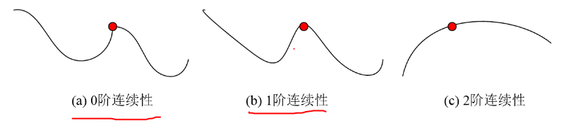
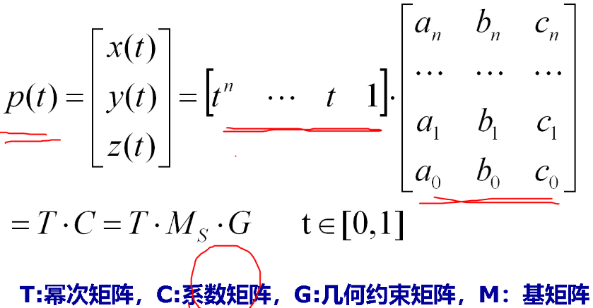
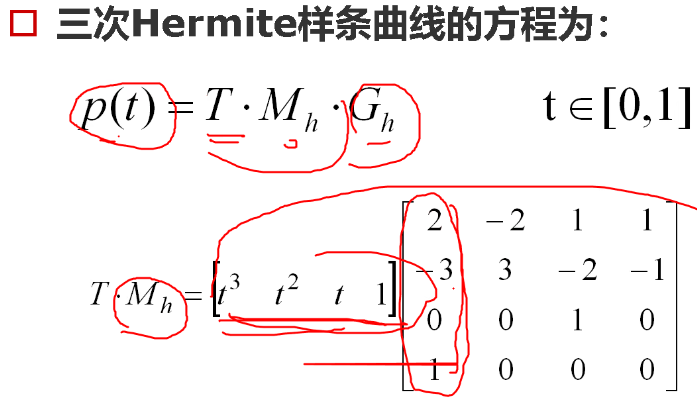
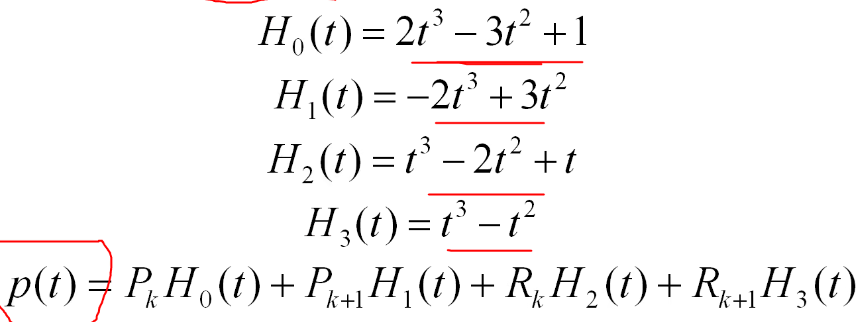

# Ep.6 曲线和曲面

## 一、综述

**曲线曲面发展：**

* 弗格森双三次曲面片  
  用一个整的方程表示曲面太过复杂，且方程为高次，稍微变化容易畸形，故用三次曲面（面片）拼接而成。
* 孔斯双三次曲面片
* 样条方法
* Bezier方法
* B样条方法
* 有理B样条
* 非均匀有理B样条方法

**计算机辅助几何设计(CAGD)研究内容：**

* 几何外形信息的计算机表示
* 几何外形信息的存储和管理
* 几何外形信息的分析和综合
* 几何外形信息的控制与显示

**曲线曲面表示的要求：**

* 唯一性
* 几何不变性  
  对在**不同的测量坐标系**测得的同一组数据点进行拟合，用同样的数学方法得到的**拟合曲线形状不变**。
* 易于界定  
  即为参数方程，用参数范围界定。
* 统一性  
* 易于实现光滑连接  
  拼接的时候希望拼接处是光滑过渡的。
* 几何直观  
  从方程能直观地看出是什么面。

### 1. 表示方法

#### (1) 参数法

$$
p=p(t)\qquad t\in[0,1]
$$

优点：

* 点动成线
* 几何不变性
* 对参数求导代替斜率，避免斜率无穷大
* 有界
* 进行变换

#### (2) 插值与逼近

**逼近：**

> 定义 - 样条：
>
> 采用模板样板法，表示和传递自由曲线曲面的形状。

样条曲线是指：由多项式曲线段连接而成的曲线，在每段边界处满足特定的**连续条件**（保证光滑）。  
样条曲面则可以用两组正交样条曲线来描述。

**插值：**

用已知点算出附近的未知点的方法叫插值。

### 2、连续性条件

假定参数曲线段$p_i$以参数形式描述。

$$
p_i=p_i(t)\qquad t\in[t_{i0},t_{i1}]
$$

需要满足：

* 0阶参数连续($C^0$连续性) - 保证曲线连起来，不断开  
  0阶导数相等，下同。
* 1阶参数连续($C^1$连续性) - 保证曲线是光滑连接
* 2阶参数连续($C^2$连续性) - 保证曲线变化率低，是光顺连接（用于控制相机顺滑移动）

  

由于$C^1$、$C^2$连续性条件严格，可放宽为如下条件，为几何连续：

* 1阶几何连续($G^1$连续性)：一阶导数成比例
* 2阶几何连续($G^2$连续性)：二阶导数成比例

### 3、曲线曲面拟合方法

> 定义 - 拟合：
>
> 用插值或逼近方法，使生成的曲线曲面达到某种设计要求。

* 插值
* 逼近

### 4、样条描述

  

由几何矩阵和基矩阵描述，  
求系数矩阵。

## 二、三次样条

给定$n+1$个点，可通过每个点的分段三次多项式。

### 1. 自然三次样条

定义：

给定$n+1$个型值点，？？？

有4个参数，除了两个型值点的坐标，还需要给出两个条件。

### 2. 三次Hermite样条

对于$P_k$和$P_{k+1}$之间的曲线段为$p(t),t\in[0,1]$。  
则存在条件：

$$
P_k=P(0) \\
P_{k_1}=P(1)
$$

给定两型值点的一阶导数$R_k,R_{k+1}$，
则存在条件：

$$
R_k=P'(0) \\
R_{k+1}=P'(1)
$$

  

$T\cdot M_k$得到4个函数，称为Hermite基函数（混合函数、调和函数）。  

  

特点：

* 可以局部调整，因为曲线段只依赖于端点约束。
* 几何不变性

## 三、Bezier曲线曲面

*不做太多要求。*

用一条曲线逼近控制点。

* 一次Bezier曲线($n=1$) - 两个点、直线段
* 二次Bezier曲线($n=2$) - 三个点、抛物线  
  中间点的导数，与前后点连线的斜率相同。
* 三次Bezier曲线($n=3$) - 四个点

特性：

* 凸包性：Bezier曲线各点均落在控制多边形各顶点构成的凸包之中。
* 几何不变性
* 差变减少性：屏边内一直线与曲线的交点个数，不多于其与控制多边形交点个数。
* 控制顶点变化对曲线形状影响

生成方法：德卡斯特里奥算法