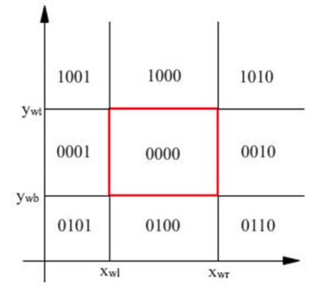

# Ep.7 图形观察方法

## 一、坐标系

1. 模型坐标系  
   在各自的坐标系中描述图形对象。
2. 世界坐标系  
   将图形对象实例放入世界坐标系，因此需要经过模型坐标系到世界坐标系的转换。  
   需要确定图形对象的位置和方向，然后利用之前“从一个坐标系到另一个坐标系”的转换方法进行转换。
   * 位置：模型坐标系原点，在世界坐标系的坐标。
   * 方向：模型坐标系$x$轴，与世界坐标系$x$轴的夹角。
3. 观察坐标系  
   在世界坐标系中，以某种特定视角观察世界坐标系中的各图形对象。
   类似相机，存在以下属性：
   * 观察窗口：即观察的范围。视野外的物体将被裁剪（不绘制）。

最后要将观察窗口中的图形对象，映射到“视口”中，即最终设备坐标系下的显示区域。  
则需要把观察窗口的内容，映射到视口中。

需要假定：观察坐标系与设备坐标系重合。  
然后通过平移和缩放即可映射。

## 二、二维图形显示流程

1. 应用程序到图形的世界坐标
2. 世界坐标系到观察坐标系的变换  
   * 移动原点
   * 旋转重合
3. 观察坐标系下对窗口进行裁剪
4. 窗口到视区（规范化设备坐标系中定义）的变换  
   定义观察区域左下角坐标$(wx_l, wy_b)$、右上角坐标$(wx_r, wy_t)$；  
   定义视区左下角坐标$(vx_l,vy_b)$、右上角坐标$(vx_r,vy_t)$。
   要实现窗口内的点$(xw,yw)$映射到视区内的点$(xv,yv)$。
   * 平移窗口左下角点，与观察坐标系原点重合（为了方便缩放）
   * 基于观察坐标系进行缩放，使窗口变换到与视区等大小
   * 平移，使窗口与视区重合
5. 视图区从规范化坐标系到设备坐标系的变换
6. 在图形设备上输出

## 三、裁剪

> 定义 - 裁剪：
>
> 识别图形在指定区域内或区域外部分的过程成为裁剪算法，简称裁剪。

* 裁剪窗口：用于裁剪图形对象的区域成为裁剪窗口
* 内裁剪：保留裁剪窗口内的部分，去掉窗口外的部分
* 外裁剪：保留裁剪窗口外的部分，去掉窗口内的部分

裁剪处理：

* 图形对象在窗口区域内外的判断
* 计算图形对象与窗口相交部分

对于二维裁剪，需要定义裁剪窗口的四个边界：上边界$y_{wt}$、下边界$y_{wb}$、左边界$x_{wl}$、右边界$x_{wr}$。

### 1. 点的裁剪

点的裁剪就是判断点是否在窗口内。

### 2. 直线段的裁剪

有四个关系：

* 两个端点都在窗口内 - 直线段完全在窗口内
* 两个端点都在窗口外，线段与窗口不相交 - 直线段完全在窗口外
* 两个端点口在窗口外，线段与窗口相交 - 直线段中间部分在窗口内
* 一个端点在窗口内，另一端点在窗口外 - 直线段某一侧在窗口内

则内裁剪过程：

1. 判断是否完全在窗口内，如果是则保留，完成内裁剪。
2. 判断是否完全在窗口外，如果是则舍弃，完成内裁剪。
3. 计算线段与窗口边界的交点，舍弃窗口外部分，保留窗口内部分。

#### (1) Cohen-Sutherland裁剪方法

也称编码裁剪算法。

将边界延长后，可将平面分为九个区域。  
定义如下4位的编码：

* 窗口左边界左方，第1位表示为`1`
* 窗口右边界右方，第2位表示为`1`
* 窗口下边界下方，第3位表示为`1`
* 窗口上边界上方，第4位表示为`1`

1. 求得两端点所在区域的编码`code1`,`code2`。
2. 若编码均为`0000`，即`code1 | code2 = 0`，则两端点均在内部，保留。
3. 若两端点均在外部的同一侧（如均在上边界上方、下边界下方），则舍弃。
4. 其他情况如下处理。