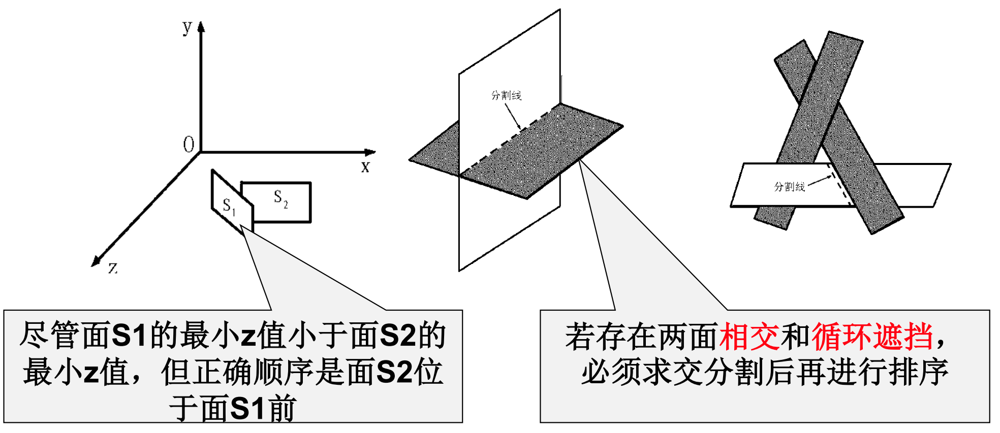

# Ep.9 真实感图形绘制

**主要内容：**

* 隐藏线隐藏面消除
* 光照模型
* 基于简单光照模型的多边形绘制

**图形绘制过程：**

* 场景造型
* 观察变换
* 后向面剔除
* 透视投影
* 隐藏面消除
* 不同物体的物理参量之间的关系

## 一、消隐算法

物体的消隐或隐藏线面的消除，指在给定视点和视线方向后，决定场景中哪些物体的表面是可见的，哪些是被遮挡不可见的。  
称为可见面判别或**隐藏面消除**。

在剔除了不可见面后，还有可见面的遮挡。

故根据实现方式，**分为两类**：

* 景物空间消隐算法
* 图像空间消隐算法

在两者之间的，还存在部分算法，如：深度排序算法、区域细分算法、光线投射算法。

**提高效率的基本原则：**

* 排序：各景物表面**按照距离视点远近排序**的结果，用于确定消隐对象之间的**遮挡关系**。
* 连贯性：是指所考察的物体或视区内的图像局部保持不变的一种性质，用于提高排序效率。
  * 物体的连贯性
  * 面的连贯性
  * 区域的连贯性
  * 扫描线的连贯性
    * 区段
    * 相邻扫描线
  * 帧的连贯性
    * 相邻帧之间
* 包围盒技术：用来初步判断相交关系，防止盲目面与面求交  
  常见的包围盒有：
  * 长方体
  * 圆柱
  * 圆柱

### 1. 深度缓存器算法

是**图像空间**的消隐算法。

对于帧缓存，需要两种信息：

* 颜色信息 - 该像素的颜色值
* 深度信息 - 该像素是由离我们多远的像素所决定的

**基本思想：**

绘制时每次计算该采样点的深度，若低于当前深度缓存器中的深度则不处理；否则更新。  
最终则能绘制出深度最大，即离相机越近的部分。  
深度缓冲器中内容即为消除隐藏面后的图像。

**算法步骤：**

1. 初始化：把Z缓存中各$(x,y)$单元置为z的最小值，而帧缓存各$(x,y)$单元置为**背景色**。
2. 在把物体表面相应的多边形扫描转换成帧缓存中的信息时，对于多边形内的每一采样点$(x,y)$进行处理：
   * 计算采样点$(x,y)$的深度$z(x,y)$
   * 如$z(x,y)$大于Z缓存中在$(x,y)$处的值(即更靠近视点)，则更新Z缓存中的$(x,y)$处，再把多边形在$z(x,y)$处的颜色值存入帧缓存的$(x,y)$地址中；否则不处理。

**深度值计算方式：**

假定多边形平面方程为$Ax+By+Cz+D=0$，则$(x,y)$深度值为：

$$
z(x,y\frac{-Ax-By-D}{C}
$$

可利用扫描线和像素的**连贯性优化**：

* 扫描线上后继点的深度值，可以利用前一点的深度值得到：  
  $$
  z(x+1,y)=z(x,y)-\frac{A}{C}
  $$
* 下一条扫描线上最左侧点的深度值，可以利用上一条扫描线最左侧点的深度值得到：  
  $$
  x|_{y-1,min}=x|_{y,min}-\frac{1}{k}
  $$

缺点：  
不能实现透明效果（因为直接进行颜色替换），  
改进的话，采用“*A缓存器算法*”。

### 2. 深度排序算法（画家算法）

类似于现实画家作画，先画最远的，依顺序画到最近的，  
这样最近的就能覆盖最远的，最后达成消隐的效果。

因此算法关键是**多边形排序**。

**算法步骤：**

1. 生成深度优先级队列  
   距视点距离远的多边形优先级低，排在队列的前端；反之在后。
2. 从队列中依次取出多边形，计算表面光亮度
3. 写入帧缓冲器
4. 重复2、3步骤，直到队列为空

**异常情况：**

空间中面的先后关系可能不好直接判断，如下图。  
  
因此需要判断相交和循环遮挡，若存在则要风格。