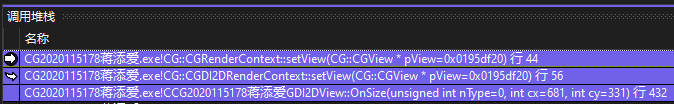
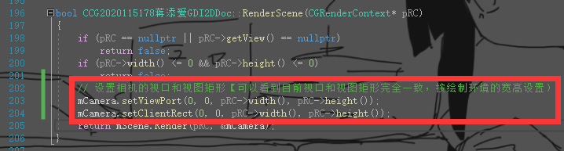
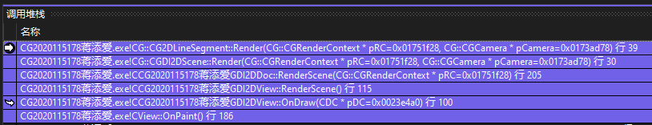

# 实验2

## CDC x GDI

* CDC(DC - Device Context) - 设备环境基类
  * CClientDC - 针对**视图**图形绘制
  * CPaintDC - `WM_PAINT` Windows 消息的设备环境类
  * CWindowDC - 整个窗口图形绘制
* GDI(Graphics Device Interface) - 图形设备接口

两者的联系可见「[GDI和CDC区别](https://blog.csdn.net/oyhb_1992/article/details/78794199)」

## 坐标系

* 设备坐标系：视图(View)的客户区坐标，规定左上角原点。
* 逻辑坐标系：内存中虚拟的坐标系，CDC/GDI函数绘图使用该坐标系。  
  与设备坐标系的关系由映射方式决定，默认（实验中）映射下与设备坐标系相同。
* 世界坐标系：场景(Sence)或说画布中所用的坐标系
* 模型坐标系：描述模型本身所用的坐标（如三角形，定中心为原点，描述三顶点位置）

## 包围盒 AABBox2

就是图形对象的边界，本实验采用“轴对齐矩形”包围盒。

可以用来进行图形操作（放大缩小）或初步位置判断等。

## 序列化（持久化） Serialize

> 定义 - 序列化：
>
> 内存中的对象信息**转换为存储或传输**的形式，比如类数据成员的保存和解析。  
> 反序列化则是相反过程。

JSON就是可以用来序列化的工具。

图形程序中需要将图形场景进行保存，或从存储中读取场景到内存中。

## 绘制环境 RenderContext

CDC封装了GDI绘图环境和相关方法，如`LineTo()`等绘制方法，  
但如果要自定义绘制方法，就需要自建绘制环境类。

主要提供各种绘制接口的，如`mHDC`，就是绘制时用的`dc`。  
并且目前绘制环境提供的**视图宽高**，直接给**文档类的相机设置范围大小**。

基类中的数据成员解释：  
Tip. 类型中开头带`H`的代表句柄(Handle)，开头带`C`的代表类。  
有关句柄的解释可以看「[关于句柄的概念](https://blog.csdn.net/weixin_45207460/article/details/121672498)」

* `HWND` - 窗口句柄
* `HDC` - DC的句柄
* `HGLRC`

在窗口发生变化时，会及时更新绘制环境（主要是宽高）。  
  
`OnSize()`就是在视图窗口变化时调用的。

## 场景 Scene

里面的`mRenderables`存放图形对象列表，  
其类型`CTypedPtrArray`表示“保存对象指针的数组”。

具体的解释可见「[CTypedPtrArray和carray的区别，两者都是数组吧？参数含义是什么](https://zhidao.baidu.com/question/473833751.html)」

## 视图 View / 视口 ViewPort

视图很好理解，就是你新建文档后那个空白画布，对应的是设备坐标系；  
视口是视图的一个再分区，在刚开始可以默认就是视图，即可以当成对应设备坐标系。

注意到：目前视口只在摄像机 Camera 中有变量，但 Camera 本身并没用到视口（也就是说视口目前没用）

## 相机 Camera

Camera 实际上就是一个“设备坐标系”与“世界坐标系”相互转换的作用。

其关键利用了视图画布的大小，存在数据成员`mClientRect`中，  
其在每次渲染的时候，会在文档类更新这个数据成员。  

在各个`Render()`函数中均会用到相机，因为均要涉及两个坐标系转换。

## 渲染 Render 的调用顺序

  

MFC 视图 CView 的`OnPaint()` → 实验中**视图** View 的`OnDraw()` → View 的`RenderScene()`，传入绘制环境 RenderContext → **文档**类 Doc 的`Render()`，传入相机 Camera → **场景** Scene 的`Render()` → 场景各对象的实际渲染。

需要注意，窗口更新的时候（大小变化，移动等）需要重新渲染，即要在`OnDraw()`里调用，否则会丢失。