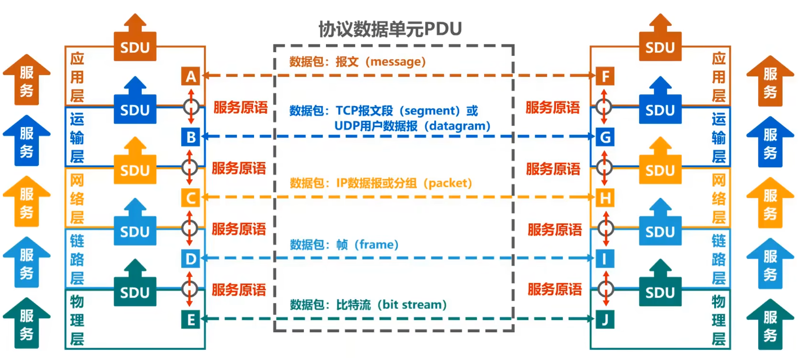
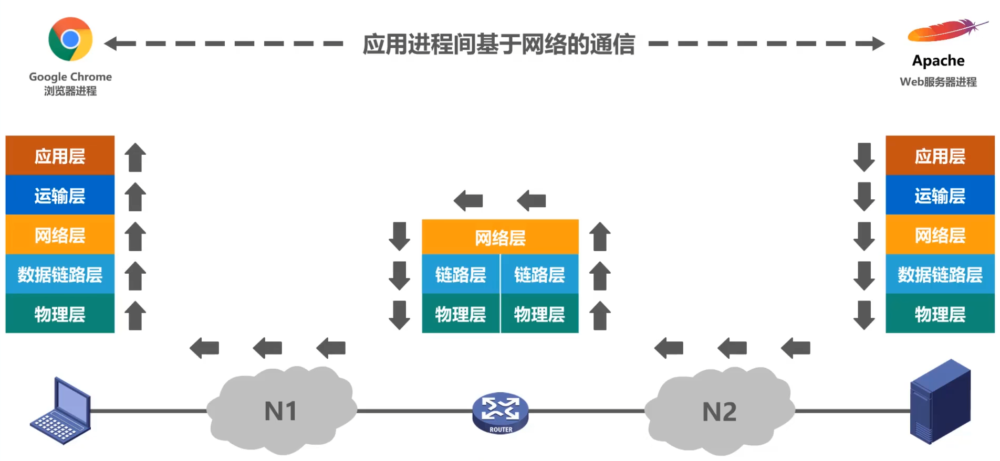
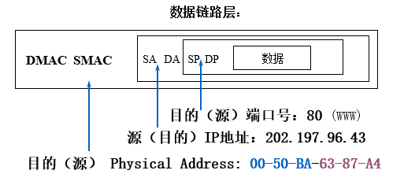
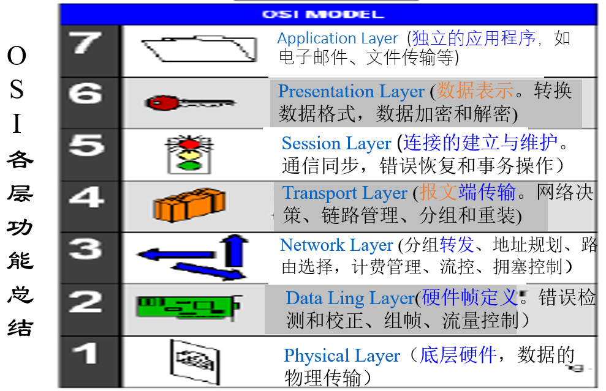
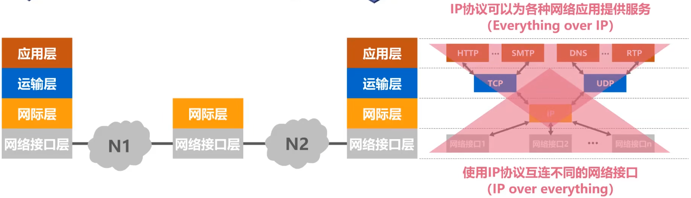
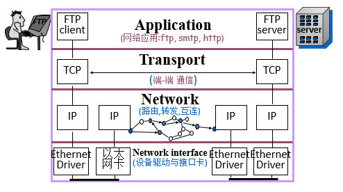
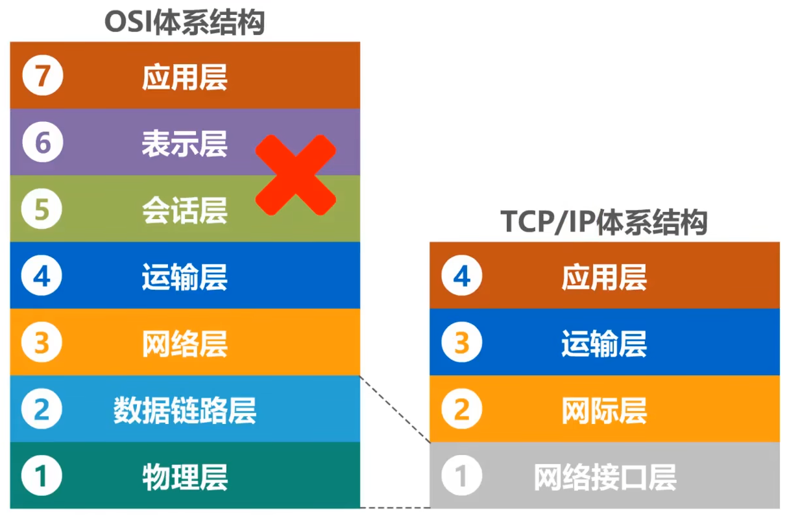
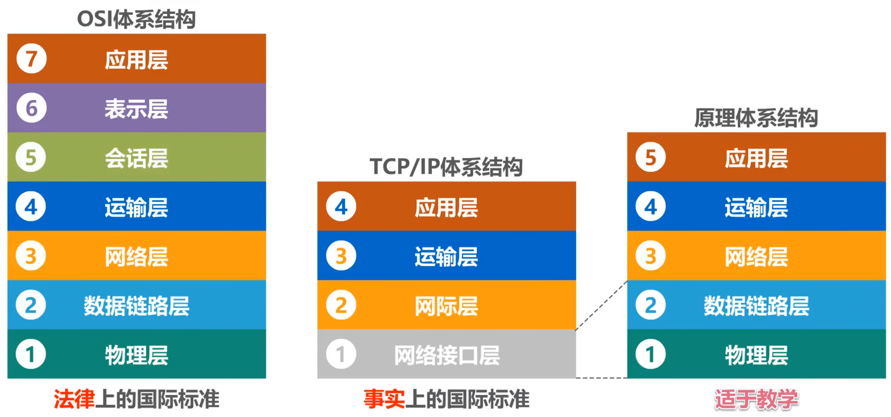

# 第二节 网络体系结构

⭐网络体系结构是**层次**和**协议**的结合。

网络体系**复杂体**现在以下方面：

* 通信介质不同：电子、光
* 链路不同：光纤、铜线、卫星等
* 交换复杂：机械(人工服务)、电、光、交叉
* 协议多样：TCP/IP、ATM、Ethernet、PPP、X.25、FrameRelay、AppleTalk、IPX等
* 功能复杂：
  * Routing - 路由（走什么线路、什么时候上下线路等）
  * Error Control - 差错控制（要求传输无差错）
  * Congestion Control - 拥塞控制（防止网络阻塞）  
    瘫痪原因：资源耗尽（路由器的内存耗尽）
  * Quality of Service(QoS) - 服务质量（需要保证服务质量）
* 应用多样：FTP、WEB、远程桌面、虚拟化（机器整合再划分、用以提升系统稳定性）

为了使不同体系结构的计算机网络都能互连，且解决上面网络复杂性带来的问题，提出了许多**网络体系结构**（标准框架），常见的有：

* OSI体系结构 - **法律**上的国际标准
* TCP/IP体系结构（因特网所用协议） - **实际**上的国际标准
* 原理体系结构 - 仅**教学**所用，实际不存在

## 一、基本概念

### 1. 分层

正因为网络非常复杂，需要**划分成小的子系统来处理**，即分层。

**分层原因：**

* 在对等层之间建立通信关系
* 简化软件的编写、调试、修改
* 修改某层不影响其他层
* 容易标准化、开放式

**分层的标准：**

* 根据不同层次的抽象分层，每层应当实现一个定义明确的功能
* 每层的功能及技术实现应有明显差别，交界面的相互作用要少（低耦合）
* 低层对于高层是透明的  
  > 透明：高层不用知道低层的具体实现，只负责调用低层提供的封装接口。
* 每层功能的选择应该有助于指定网络协议的国际标准
* 层次数目要适当。要足够多避免不同功能混杂在一层；也不能太多避免体系结构庞大
* 考虑现有的网络结构及通信协议（不能废弃当前别人的投资）

**OSI体系结构的七层分层：**

* 应用层
* 表示层
* 会话层
* 运输层
* 网络层
* 数据链路层
* 物理层

  

> 拓展 - 从实际问题考虑如何分层：
>
> 1. 对于两台计算机，直接通过一条网线连接通信，需要考虑：  
>    以下即属于之后分层中的“物理层”范围。
>    * 采用怎样的传输媒体  
>      即什么连线，如双绞线。（严格来说传输媒体并不属于物理层，不包含在体系结构中）
>    * 采用怎样的物理接口  
>      即线怎么连接上设备，如RJ45接口（就一般的网线接口）。
>    * 使用怎样的信号表示比特`0`和`1`  
>      如简单的使用方波，低电平为`0`、高电平为`1`。（实际并不是方波信号）
> 2. 对于多台主机，用总线互连，解决物理层问题后，需要考虑：
>    以下即属于“数据链路层”范围。
>    * 如何**标识同一网络**中各主机（主机编址问题）  
>      A向C发送数据，但数据会传播到所有计算机，各计算机如何知道是发给自己还是别人的。解决如MAC地址
>    * 如何从信号比特流中区分**地址**和**数据**  
>      即如何解决封装结构问题。
>    * 如何协调各主机争用总线  
>      同时发送数据会造成碰撞。
> 3. 由若干主机、路由器互连起来的小型互联网。
>    以下即属于“网络层”范围。
>    * 如何标识各网络和各网络主机（网络和主机共同编址问题）  
>      解决如IP地址。
>    * 路由器如何转发分组、如何进行路由选择  
>      源主机与目的主机之间的路径不止一条，数据可以选择不同的路径。
> 4. 网络上，各主机上各应用的通信（如用户的浏览器和QQ，服务器的WWW和Email）。
>    以下即属于“运输层”范围。
>    * 如何解决进程之间基于网络的通信问题（WWW发送的数据，是浏览器处理还是QQ处理）
>    * 分组在网络传输过程中出现传输错误
> 5. 制定各种协议，按协议编写各种协议，通过应用进程间的交互来完成特定的网络应用。  
>    即属于“应用层”范围。
>
> 总结：  
> 

### 2. 实体

> 定义 - 实体、对等实体：
>
> 指任何可发送或接受信息的硬件或软件进程。  
> 其在网络各层中均存在实体。
>
> 而对等实体，则指收发双方相同层次（**对等层**）中的实体。

对等层、对等实体如下图所示：  
  
  

### 3. 协议

> 定义 - 协议：
>
> 控制两个**对等实体**进行**逻辑通信**的规则的集合。
>
> 逻辑通信指的是一种概念上的通信，实际上并不存在（实际通信只在物理层发生，其他层向下传），  
> 这样在研究某一层时只用考虑该层而不用考虑其他层的影响。

通信的关键是通信双方能够互相理解，因此需要规定各种约定规则，即协议。  

* 对于人类语言需要规定：讲什么、如何将、谁先谁后讲  
* 对于计算机网络需要规定：报文含义、报文格式、发送顺序

对于上述规则的约定则是协议。

  
左侧是人类对话的过程，右侧则是计算机网络模仿人类对话的过程。

**协议三要素：**

* **语法**(Syntax - Format of Messages)：定义所交换信息的**格式**  
  即所交换信息由**哪些字段**以及按**何种顺序**构成。
* **语义**(Semantics - Meaning of Messages)：定义收发双方所要完成的**操作**  
  如：构建并发送报文、接受并解析报文等
* **同步**（时序） - 定义收发双发的**时序**关系  
  完成的操作要按一定时序进行。
  

**协议的必要性：**

* 硬件只负责低层（只负责数据收发）
* 但可能发生问题
  * 比特出错
  * 报文丢失
  * 重复报文
  * 报文传递顺序
* 因此需要采取措施（指定协议）处理
  * 一台网络连接多台计算机
  * 同一计算机运行多个应用进程
  * 同一计算机的一个应用具有多个拷贝

*注：协议不止网络上，如串口通信(COM)也有协议。*

多个协议可以组成一个**协议集**，  
多个协议一起工作，各自解决不同的问题。  
一般称为协议簇(Protocol family)或协议组(Protocol suite)。

### 4. 服务

> 定义 - 服务：
>
> 在协议的控制下，两个对等实体的逻辑通信，使得本层能够**向上一层提供服务**。  
> 因此要实现某层协议，需要使用下一层所提供的服务。

如：物理层使用物理层协议通信，为数据链路层提供服务；  
数据链路层利用物理层提供的服务，实现链路层协议并进行逻辑通信，为网络层提供服务。  
最终的应用层给用户(user)提供服务。

> 区别 - 服务与协议：
>
> 协议是“水平的”，而服务是“垂直的”。
>
> * 服务：是各层向它的上层提供的一组原语或称操作（纵向）。  
>   只是定义了该层能够**代表**它的**上层完成的操作**，但没有涉及这些操作如何实现。  
>   服务定义了**两层之间的接口**，上层是服务的用户，下层是服务的提供者。  
>   实体看得见相邻下层所提供的服务。
> * 协议：是定义同层对等实体之间交换的帧、分组和报文的格式及意义的一族规定（横向）。  
>   实体利用协议来**实现**他们的**服务定义**。  
>   实体不知道某服务的具体协议，是**透明**的。
>
> 只要不改变提供给用户的服务，实体就可以任意改变它们的协议，使得协议和服务分割。

**几个概念：**

* **服务访问点**：指同一系统中**相邻两层**的实体交换信息的**逻辑接口**，用于**区分不同的服务类型**。如：  
  * 数据链路层 - 帧的“类型”字段。
  * 网络层 - IP数据报首的“协议”字段。
  * 运输层 - “端口号”
* 服务原语：上层使用下层所提供的服务，必须通过**与下层交换一些命令**，这些命令即是服务原语。
* **协议数据单元(PDU)**：**对等层次**之间传送的数据包。  
  如物理层为“比特流”、链路层为“帧”等。
* 服务数据单元(SDU)：层与层之间交换的数据包。  
  一个SDU可划分为多个PDU；多个SDU可组成一个PDU【？……

## 二、具体分层

以OSI体系结构讲解具体分层考虑和解决的问题。

### 1. 物理层

要连接两台计算机，必须解决一下问题：

* 机械特性 - 采用什么样的通信接口（串/并/网络）  
  规定物理连接时所使用可接插连接器的形状和尺寸、引脚的数量与排列情况等
* 功能特性 - 通信接口如何定义（数据、控制、定时、定地）  
  规定各引脚有什么用。  
  如：**9针**的接口(DB-9)的**2,3,5为发送、接受、地**；**25针**的接口(DB-25)的**2,3,7为发送、接受、地**  
  其他一些技术：
  * 交叉连接：双方交叉连接2和3，5（或7）公用。
  * 单串口调试：把2、3短路。
* 电气特性 - 信号电平、比特宽度、连接距离、信道编码
  * 数字信号
  * 控制信号和数据
  * 负逻辑：`1` - $-3\text{V}\sim -15\text{V}$ / `0` - $3\text{V} \sim 15\text{V}$
  * 信号速率
  * 连接距离
  * 控制信号：`on` / `off`
* 规程特性 - 事件之间的时序关系。  
  

这些内容都是**物理相关**的，故需要引入**物理层**，  
包含“**线缆**”(光纤、双绞线、卫星等)和“**接口**”(RJ45、光纤灯)。

* 主要功能：就能保证**信号的可靠传输**（接什么发什么）。
* 该层的**协议数据单元**(PDU)：**比特流**

### 2. 数据链路层

物理层仍存在没有解决的问题：

* **差错控制** - 信道一般存在误码率
* **定义传输信号具体含义** - 物理层只管传送比特信号，不关心信号含义
* **流量控制** - 两台机器速率不匹配，快的发送可能将慢的接收淹没

故划分出数据链路层，解决上述问题。  

* 主要功能：确保数据（帧）在**链路（同一个子网）的可靠传输**。
  * 信息含义（帧格式）的定义、帧定界  
      
    将以太网帧定为如下格式：  
      
    *FCS - 4字节校验和*
  * 流量控制 - 避免快的发送淹没慢的接受  
    * 停等协议（停下来等接受完）
    * 滑动窗口协议
    * 其他流量控制协议
  * 差错控制 - 错误检测、确认（捎带应答）、重传
  * 共享信号 - 介质访问控制（MAC地址即存在于此层）
* **协议数据单元**(PDU)：**帧**

### 3. 网络层

链路层只是负责在同一个物理网络下（内网）的数据传输，  
要解决**跨网传输**，需要引入网络层。

* 编址 - IP、域名
* 地址转换 - 上三者相互转换、NAT  
  外网不知道内网地址，绑定IP和MAC；不容易记住外网地址，绑定IP和域名。  
  NAT：内网共享外网地址（如热点、路由器）
* 分组转发和路由选择
* 拥塞控制
* 网际互连
* 差错检测与恢复
* 多路广播
* 记账服务

以上为网络层解决的问题。

* **主要功能**：确保分组在通信子网内（从源IMP（接口报文处理机）到目的IMP之间）的传输。
* **协议数据单元**(PDU)：**分组**(Packet)

### 4. 传输层

  
在传具体内容时，传输层拆分成若干段，再由网络层无序传输。

* 报文分组：Msg→Packet→Msg
* 连接管理（建立连接、传输数据、释放连接）
* 寻址(Addressing)与多路复用：绑定IP和端口
* 流量控制/拥塞控制：终端/网络端
* 差错控制：由终端（主机）完成

以上为传输层解决的问题。

* **主要功能**：负责把完整的报文发送到对方主机的某个进程。
* **协议数据单元**(PDU)：**报文**

### 5. 会话层

传输层及以下各层主要负责网络数据通信，  
而网络最终目的是用户之间的通信——会话，  
为解决用户之间的会话问题引入会话层。

* **主要功能**
  * 会话管理（建立、维护、释放会话）
  * 数据流同步（单工/双工/半双工）
  * 重新同步
* **协议数据单元**(PDU)：**SPDU**

### 6. 表示层

有关用户信息的表达以及网络安全性的问题，集中放在表示层处理。  
（如账号密码等需要处理的信息）

* **主要功能**
  * 抽象语法描述
  * 编码规则
  * 数据压缩/解压缩
  * 加密/解谜
* **协议数据单元**(PDU)：**PPDU**

### 7. 应用层

计算机网络上的应用多种多样，需要规范这些应用，  
使之成为开放式应用，应用之间能够实现互连。

* 文件传输：TFP/TFTP
* 电子邮件：SMTP, POP3/IMAP
* 网上浏览：HTTP, HTTPS
* 终端仿真：Telnet
* 无盘工作站
* 简单网络管理协议：SNMP
* 目录服务：LDAP, AD

服务按其向应用程序**提供的特性**分组，称为**服务元素**。

* **主要功能**：应用层向应用程序提供服务，解决通用性应用问题。
* **协议数据单元**(PDU)：**APDU**

## 三、分层传输举例

数据不是从一台机器的$n$层直接传到另一台机器的$n$层，  
而是把数据和控制信息**层层下传**，直到最底层，  
最低层是物理介质，所有数据通信都在该层的基础上进行。

  
一台机器发送时，将信息层层打包，传到路由器；  
路由器接收后，先将包层层解封，得到目的地址后再打包转发；  
另一台计算机接收后，层层解封从而得到数据。

每层按照该层的**协议**，构建相应的协议数据单元PDU，  
然后交付给下一层处理，再添加首部或尾部，再形成该层的PDU，  
最终物理层将比特流变换为相应信号，发送到传输媒体进行传输。

## 四、开放系统互联参考模型(OSI/RM)

> 定义 - 开放系统参考模型(OSI/RM)
>
> 是由 ISO 提出和定义的计算机网络的**分层**、各层**协议**和层间**接口**的集合。

OSI/RM 把进行交换信息的“源端系统”和“目的端系统”划分成七个子系统，即**七层**，  
每一层完成系统信息交换所需的部分功能，通过层间的**接口与其相邻层连接**，  
从而实现不同系统之间、不同结点之间的信息交换。

如果两个端系统主机之间没有直接的物理介质相连，其间的信息交换必须通过通信子网中的**路由器**进行**信息中转**，  
路由器只需要七层中的下三层。

**要点：**

* 分层
* 层接口
* 层功能
* 协议
* 服务
* 服务访问点

### 1. 服务原语

**协议层间**交换的信息（种类、信息内部参数及用途）被称为“**服务原语**(Service primitive)”，  
由于对服务原语的定义不涉及其具体的表达格式，又称为**抽象服务原语**，  
因此对同一服务的服务原语，在不同的软硬件中，其表达格式可能完全不同。

**OSI服务原语有：**

* `REQUEST` - 请求：  
  一个实体希望得到完成某些操作的服务。
* `INDICATION` - 指示：  
  通知一个实体，有某个事件发生。
* `RESPONSE` - 响应：  
  一个实体希望响应一个实体。
* `CONFORM` - 证实：  
  返回对先前请求的响应。

**OSI服务有两类：**

* 面向连接的服务
* 无连接服务

### 2. 数据封装

数据的传输是洋葱皮结构，  
**传出**的时候需要一层层把需要的**信息封装**，  
**传入**的时候需要把封装的信息一**层层解封**。

### 3. 总结

两个IMP之间具体的数据传输，是通过链路层传输，  
两个IMP之间，属于网络层，  
两个主机之间，属于传输、会话、表示、应用层。

*注：IMP可以理解为路由器的前身。*

## 五、Internet 体系结构(TCP/IP体系结构)

OSI/RM提供的七层模型比较复杂，因此 Internet 将其简化，是四层结构：

* 应用层 - 应用提供者实现
* 主机-主机层（运输层）
* 网间网层（网际层）
* 网络接口层 - 网络开发商实现

称为“TCP/IP”。

### 1. TCP/IP的四层结构

* 应用层：网络应用  
  主要协议有：FTP、HTTP、SMTP
* 传输层：负责报文的传输  
  主要协议有TCP、UDP
* 网络层：负责路由的分组转发、互连等  
  **核心**协议为IP
* 网络接口层（底层）：网络设备驱动  
  为了将不同的网络接口进行互连，网络接口层**不涉及具体的内容**。

**与OSI体系结构的对应：**

  
相当于把数据链路层与物理层合并为网络接口层；  
网络层更名为网际层（因为TCP/IP再网络层使用IP协议，IP协议中文意思是网际协议）；  
去掉了会话层和表示层。

### 2. 三类网络地址

* IP: 定位**主机**的某个**互连网连接**。
* 端口：相当于**应用的地址**。
* MAC：在跨网传输时会不断变化。

### 3. 数据封装

1. WWW Header和WWW Data，组成TCP Data
2. TCP Data和TCP Header（包含应用地址（端口）），组成IP Data
3. IP Data和IP Header（包含IP地址），组成Ethernet Data
4. Ethernet Data和Ethernet Header（包含网卡地址）和Ethernet Trailer（检验和），组成最终的封装数据

## 六、OSI 与 TCP/IP 的比较

> OSI 与 TCP/IP 的区别：
>
> * OSI模型有3个主要概念：服务、接口、协议；TCP/IP参考模型最初没有明确区分服务、接口和协议。​
> * OSI参考模型产生在协议产生之后（而TCP/IP却正好相反）。模型实际上是对已有协议的描述。​
> * OSI模型有7层，而TCP/IP模型只有4层。​
> * OSI模型在网络层支持无连接和面向连接的通信，但在传输层仅有面向连接的通信，TCP/IP模型在网络层仅有一种通信模型(无连接)，但在传输层支持两种模式。​

OSI 优缺点：

* OSI 优点
  * 结构严谨、科学、完备，是计算机网络的国际标准​
* OSI 缺点
  * 过分追求完美性使协议体系过于复杂，难以尽快投入应用
  * 标准制订周期太长，不适应市场需求的迅速变化和技术的发展 ​

TCP/IP 优缺点：

* TCP/IP 优点
  * 从体系结构上看, Internet的4层结构比OSI/RM的7层结构简单, 也没有OSI/RM中复杂的“服务”定义，制订的时机合适
  * 在实践中它明显地占了上风——事实标准​
* TCP/IP 缺点
  * 结构不严谨、不科学、不完善​  
    因此实践中不断发现问题，不断完善，即打补丁​

## 七、原理体系结构

由于TCP/IP体系结构中的“网络接口层”并不涉及什么具体内容，对理解网络结构不方便，  
教学中融合了OSI体系结构与TCP/IP体系结构，提出“原理体系结构”。

之后的教学安排基于该种层次划分。
