# Ep.5 传输层

## 一、简介

之前的两层（物理层、数据链路层）实现了**网络内部**的通信；  
加上一层（网络层）后实现了主机通过**异构网络**互联起来的通信，为“主机到主机（**点到点**）”的通信。

而实际计算机网络中进行的通信的实体是位于通信两端主机中的“**进程**”，  
因此传输层，实现的为“**端到端**”的通信。

* **任务**：为运行在不同主机上的**应用进程**，提供直接的**通信服务**。
* **概念 - 端口**：并不是物理意义上的端口，而是用来**区分不同进程的标识符**。
* 提供的运输协议：
  * 面向连接的TCP
  * 无连接的UDP

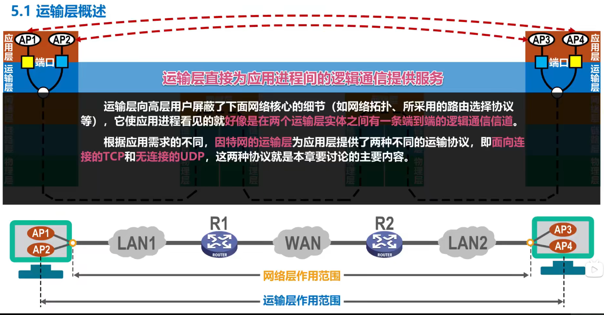

## 二、端口

### 1. 端口号意义

计算机中，进程的区分使用的是“进程标识符PID”，但因为操作系统的不同格式不同无法统一，  
为了使不同操作系统的计算机应用进程之间能进行网络通信，需要使用统一的方法**对TCP/IP体系的应用进程进行标识**，  
故：TCP/IP体系的运输层使用“端口号”来区分应用层的不同应用进程。

端口号为$16bit$，范围为$0\sim65535$。  
**分类：**

* 熟知端口号：$0\sim1023$，分给TCP/IP体系中重要的应用协议
* 登记端口号：$1024\sim49151$，为其他应用程序使用，但需要在IANA按规定的手续登记防止重复
* 短暂端口号：$49152\sim65535$，留给客户进程选择暂时使用

端口号只具有**本地意义**，是标识**本计算机应用层中的各进程**，  
在因特网中，不同计算机的相同端口号不一定有联系。

### 2. 复用与分用

**发送方复用与接收方分用：**  
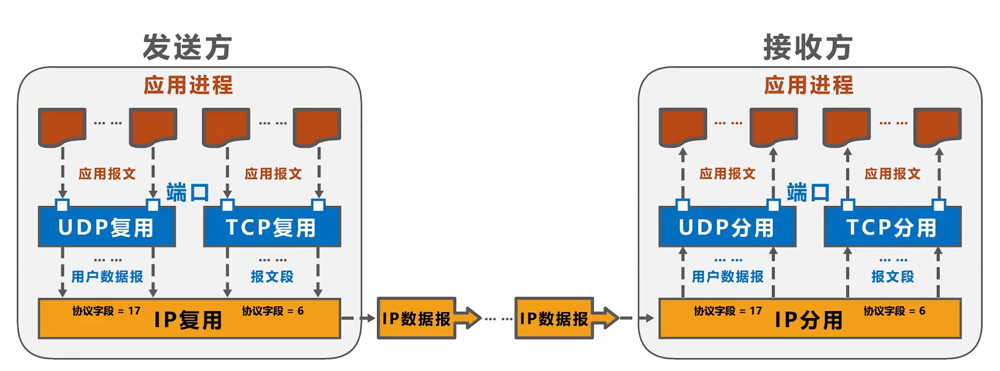

### 3. 熟知端口号

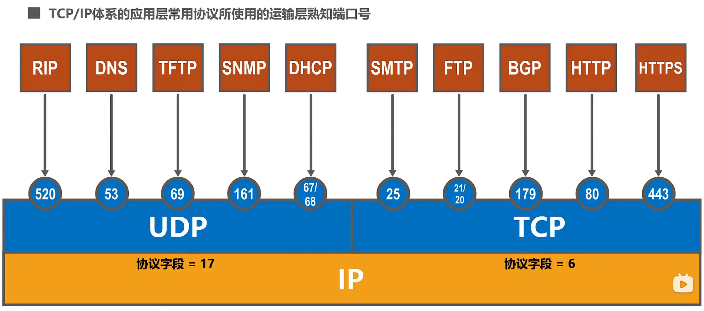  
无论运输层使用TCP还是UDP，网络层都需要使用IP协议进行封装，  
首部的协议字段，区分了运输层使用的是TCP还是UDP，依此进行对应的复用与分用。

## 三、UDP与TCP的对比

### 1. 连接性

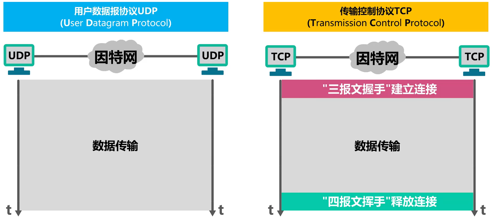

* UDP是无连接的（不需要建立和释放连接）
* TCP是面向连接的

### 2. 单播、多播与广播

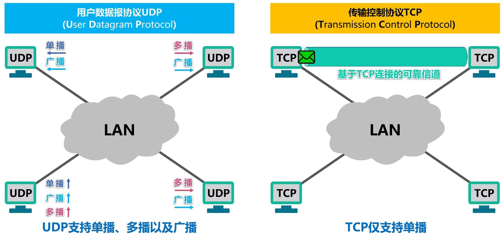

* UDP支持**单播、多播和广播**
* TCP**仅支持单播**

### 3. 应用报文的处理

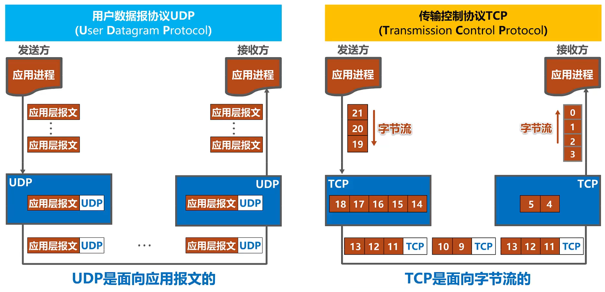

* UDP对上层交付下来的应用数据块不合并或拆分，保留边界直接添加首部传输，故是面向应用报文的；  
* TCP会上层交付下来的应用数据块视作无结构的字节流，会进行编号缓存、任意提取并发送或接收并交付上层（但肯定会保证最终的字节流一样），故是面向字节流的。

### 4. 可靠性

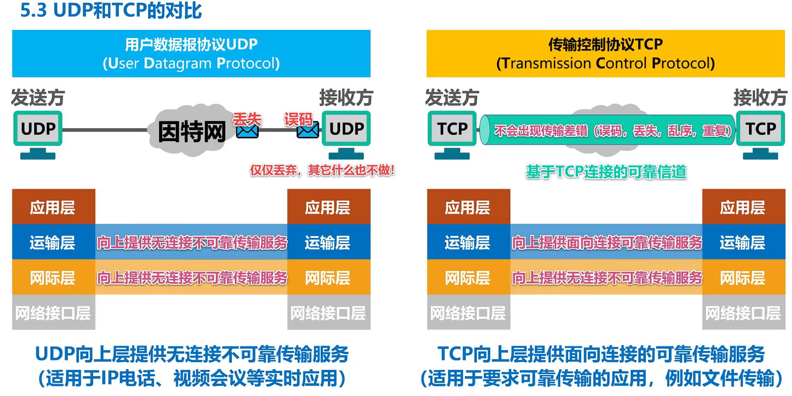  
虽然网际层（网络层）的IP协议是无连接不可靠的，指传输过程中会出现丢失和误码现象，  
但TCP会进行检测和控制，保证了不会出现传输差错，故可以提供可靠的面向连接的传输服务。

### 5. 报文首部

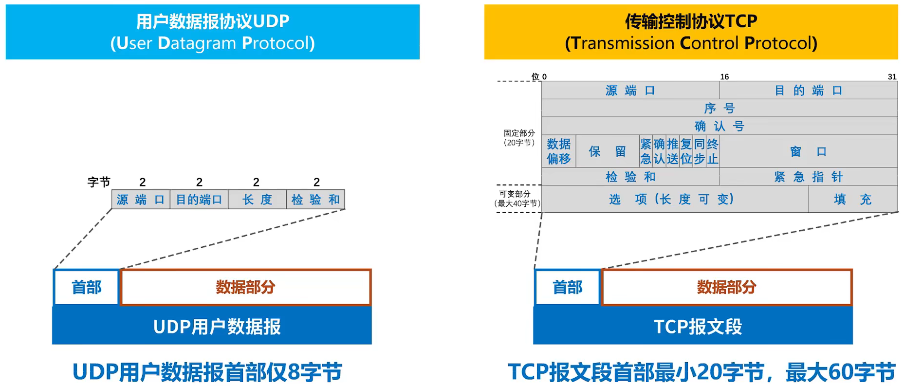  
TCP因为需要实现可靠传输、流量控制、拥塞控制等功能，所以需要较复杂的首部。

### 6. 总结

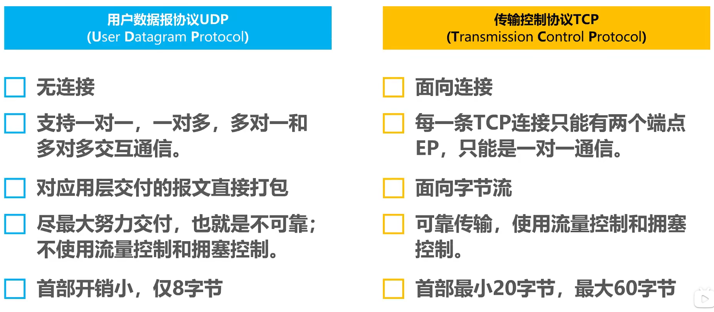

## 四、UDP

**报文头部：**  
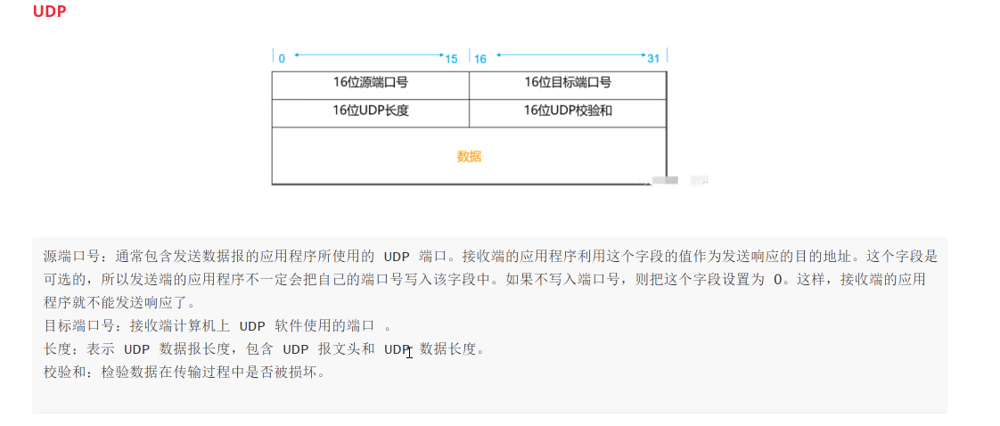  
注意：与TCP不同的是，这里有一个UDP长度，其是包含UDP报头和数据的**整体长度**；  
而TCP中没有东西记录长度。

## 五、TCP

### 1. 流量控制

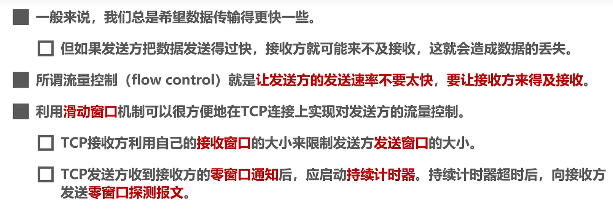

接收方存在一个“**接收窗口**”`rwnd`，用来调整发送方的“**发送窗口**”`swnd`，  
发送方在收到接收方的确认报文时，若发送窗口内的数据已全部发出，则会停止发送，  
直到接收方发送一个确认报文(`ACK=1, ack=x`)，则将发送窗口移到`x`处之后。

若接收方的报文中含有`rwnd=y`，则发送方会将发送窗口的大小调整为`y`。

每个报文存在一个“**重传计时器**”，若超时后未被`ACK`，则会重传。

发送方的发送窗口可以被设置为`0`，会暂停发送，并启动一个“**持续计时器**”，  
超时后会向接收方发送一个“零窗口探测报文”，接收方接收到后会返回一个报文通报自己当前的接收窗口`rwnd=z`。  
如果为`0`，则重启计时器继续等待；否则设置为对应的`z`并开始发送。

零窗口探测报文等一些重要报文，即便接收方窗口为0，也会被接收。

### 2. 拥塞控制

> 定义 - 拥塞：
>
> 在某段时间，若对网络中**某一资源的需求**，**超过**了该资源所**能提供的可用部分**，网络性能就要变坏，即发生了拥塞(congestion)，
>
> 资源：网络中的链路容量（带宽）、交换结点中的缓存和处理机等。

**拥塞对网络吞吐量（即网络性能）的影响：**  
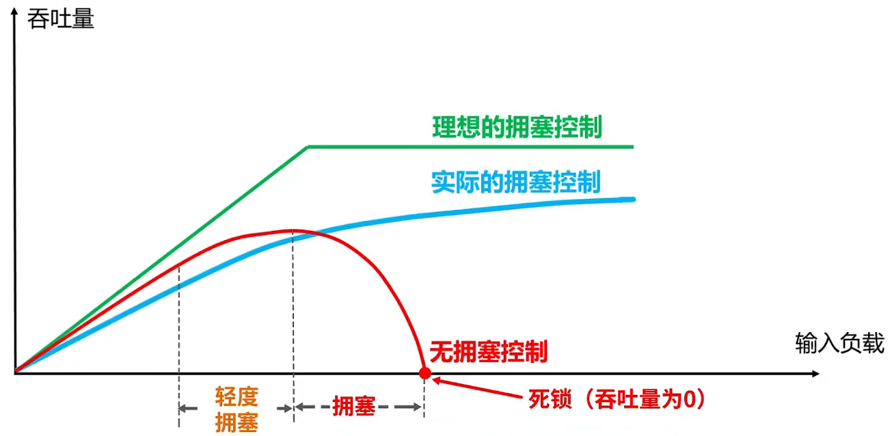

三种拥塞控制算法（状态）：

* 慢开始
* 拥塞避免
* 快重传与快恢复

发送方会维护一个“**拥塞窗口**”`cwnd`，取决于网络的拥塞程度，根据上面三种算法动态变化。

* 原则：只要没有拥塞，`cwnd`就增大一点，反之立刻减少。
* 拥塞依据：没有按时收到应当到达的确认报文`ACK`（即**发生了超时重传**）

结合上方的流量控制，则**发送方最终的“发送窗口”**`swnd=min(cwnd, rwnd)`，  
下例中假设接收窗口`cwnd`为无限大，只考虑拥塞窗口`rwnd`。

#### (1) 慢开始和拥塞避免

发送方维护一个“**慢开始门限**”变量`ssthresh`，用来作为选择是“慢开始”还是“拥塞避免”算法的临界。

* $cwnd < ssthresh$ - 使用慢开始算法
* $cwnd > ssthresh$ - 使用拥塞避免算法
* $cwnd = ssthresh$ - 均可（一般使用拥塞避免）

两种算法总结：

* 慢开始算法：每次加本身，呈指数增加形式
* 拥塞避免算法：每次加`1`，呈线性增加形式

当因为触发“超时计时器”而重传时，会认为是拥塞（虽然不一定是拥塞，可能只是丢失），  
因此，会执行两个操作：

1. `ssthresh = cwnd / 2`
2. `cwnd = 1`

*叫慢开始只是因为开始时的传输速率慢，不是增加速率慢。*

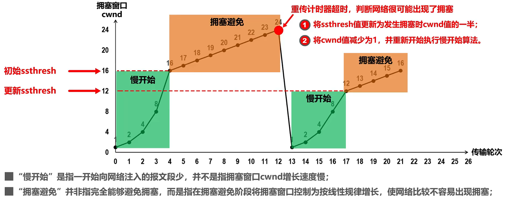

#### (2) 快重传与快恢复

上面说到：触发“超时计时器”后，不一定是拥塞，也可能是丢失，如果都认为是拥塞会造成网络吞吐量的下降。  
因此“快重传与快恢复”是为了改善这种情况而提出的。

* 快重传：要求**发送方尽快地进行重传**（知道丢失后就马上重传），而不是等“重传计时器”超时后再重传。  
  因此，也要求**接收方**在每次接收到报文后，就**马上发送`ACK`**，而不是等到自己发送数据时顺带`ACK`。  
  如果存在失序（中间有报文丢失，发送方接着发后面的），则也要发送对**已接收有序的最后报文**的`ACK`。  
  发送方一旦接收到$3$个连续的重复`ACK`，则肯定是有报文失传，马上将相应失传的重传，而不是等到超时重传。  
  因此，这样便不会认为是拥塞导致的重传，不会进行严格的拥塞控制，但还是要进行“快恢复”算法。
* 快恢复：一旦发送方是因为丢失，收到了$3$个重复`ACK`，就进行快恢复算法，具体操作为：
  1. `ssthresh = cwnd = cwnd / 2`

*部分快恢复算法也会让`ssthresh = cwnd / 2; cwnd = ssthresh + 3;`。*

---

最终，采用$3$种算法的拥塞控制过程为：  
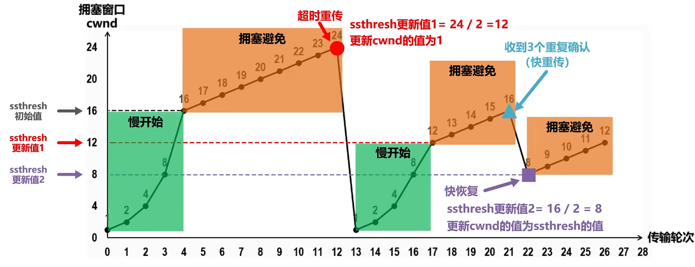

### 3. 超时重传时间确定

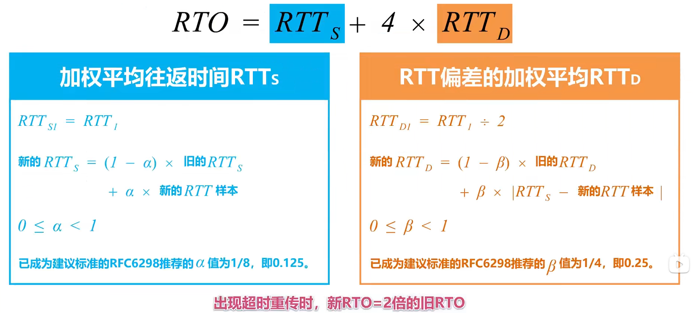

其中：

* $RTT_i$ - 第$i$次的报文段往返时间  
  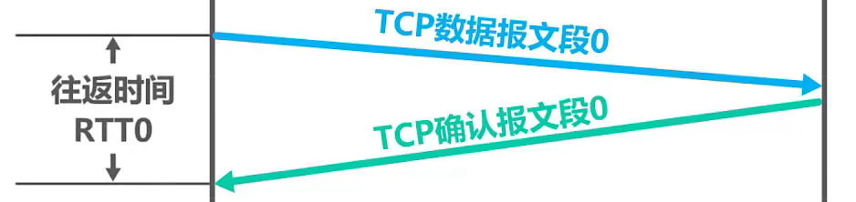
* $RTT_{Si}$ - 第$i$次收到`ACK`报文后，计算的“加权平均往返时间”，公式如上
* $RTT_{Di}$ - 第$i$次收到`ACK`报文后，计算的“$RTT$偏差的加权平均”，公式如上  
  注意：上式中的$RTT_{S}$为$RTT_{Si-1}$，也就是上一次的。
* $RTO$ - 当前设定的超时重传时间。

当某次因为超时重传时，则把$RTO$直接变成两倍，且下一次不更新$RTT_S$和$RTT_D$。  
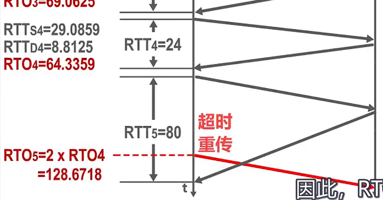

### 4. 可靠传输 - TCP运输连接管理

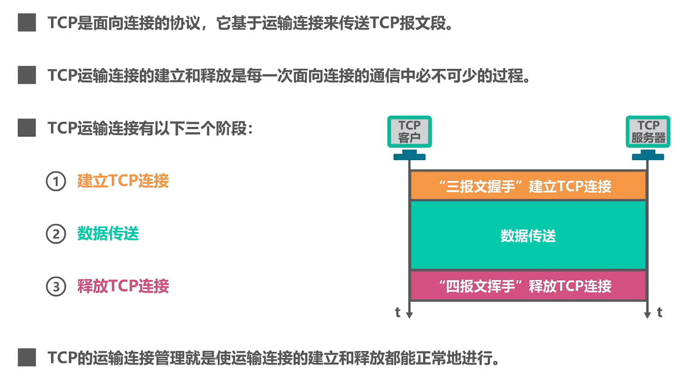

#### (1) 建立TCP连接

  
普通的TCP确认报文段：若不携带数据，则**不消耗序号**，下一个数据传输的报文序号则为`x+1`。

> 回答 - 第三次握手是否多余：
>
> 不多于：为了防止已失效的连接请求报文段，突然又传送到了TCP服务器，因而导致错误。

#### (2) 释放TCP连接

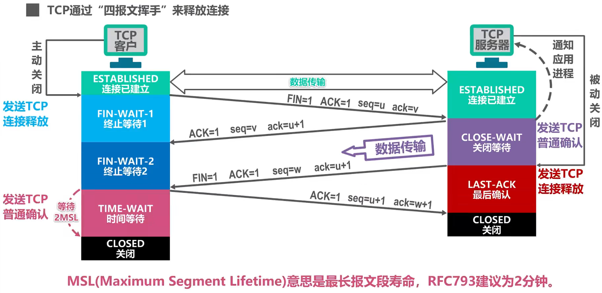

**“保活时间”：**  
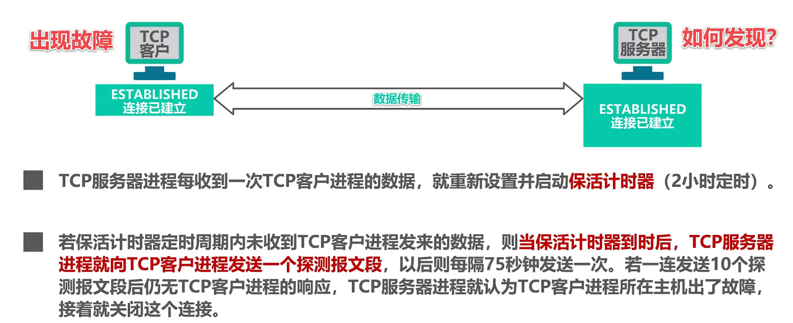

### 5. 报文首部格式

#### (1) 源端口、目的端口

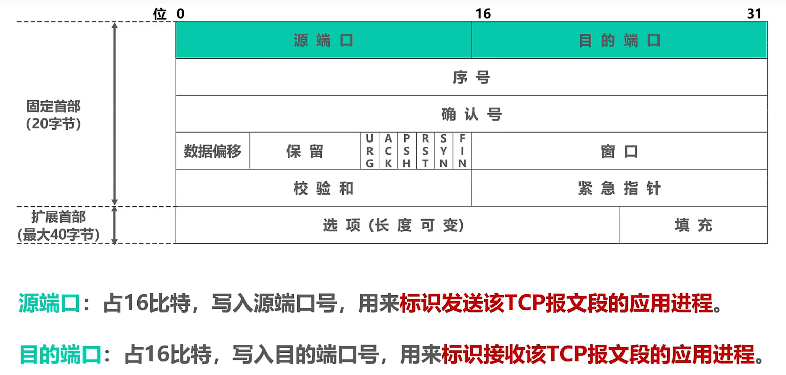  

#### (2) 序号seq、确认号ack

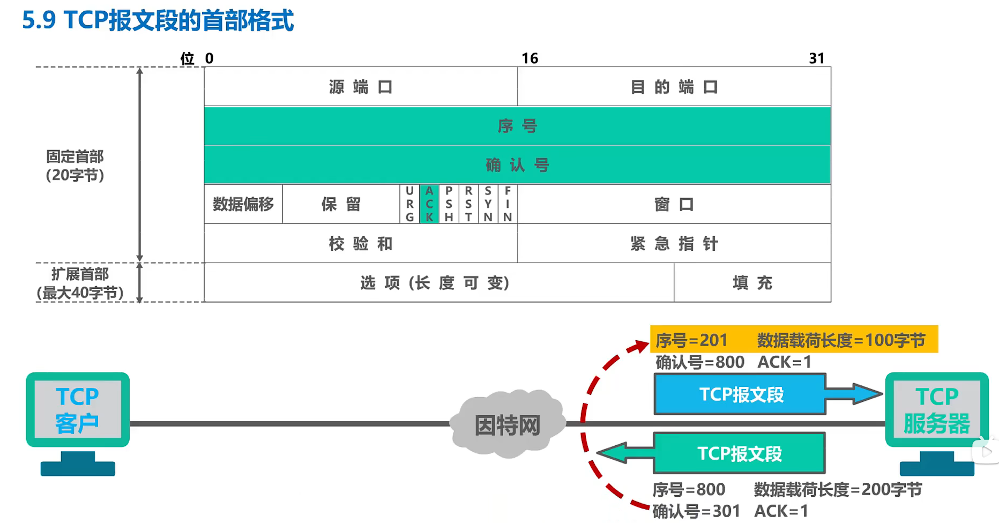  
`ACK`在完成TCP连接建立后，所有报文都**必须置`1`**。

#### (3) 数据偏移

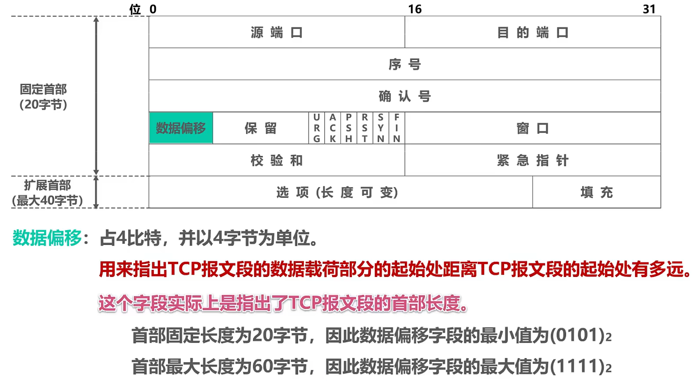  
一定注意：以`4Byte`为单位，也就是图上的一行。

#### (4) 保留字段

`6bit`，全置`0`

#### (5) 窗口

即发送该报文方的接收窗口。  
给接收者，以调整其发送窗口，为$\min(rwnd, cwnd)$

#### (6) 校验和

要加上$12$字节的伪首部，不是重点。

#### (7) 标志位与紧急指针

* `ACK`：基本上都要带，除了第一个建立连接的报文。
* `SYN`：在TCP建立连接时出现，用来同步序号
* `FIN`：在TCP释放连接时出现，释放报文段都要让`FIN`置`1`
* `RST`：用来复位TCP连接，置`1`时表示连接异常，必须先释放再重连，还可以拒绝非法报文或拒绝打开连接
* `PSH`：会尽快上数据报交给应用进程，而不是等待缓存
* `URG`：置`1`时，紧急指针有效，该报文会插队到缓存最前并立即封装TCP报文发送；接收方也直接上交应用进程而不会在缓存排队。
  * 紧急指针：指明紧急数据的长度，这里指明数据载荷部分包含了多长的紧急数据。  
    数据载荷前面是紧急数据；接着是普通数据。

#### (9) 选项与填充

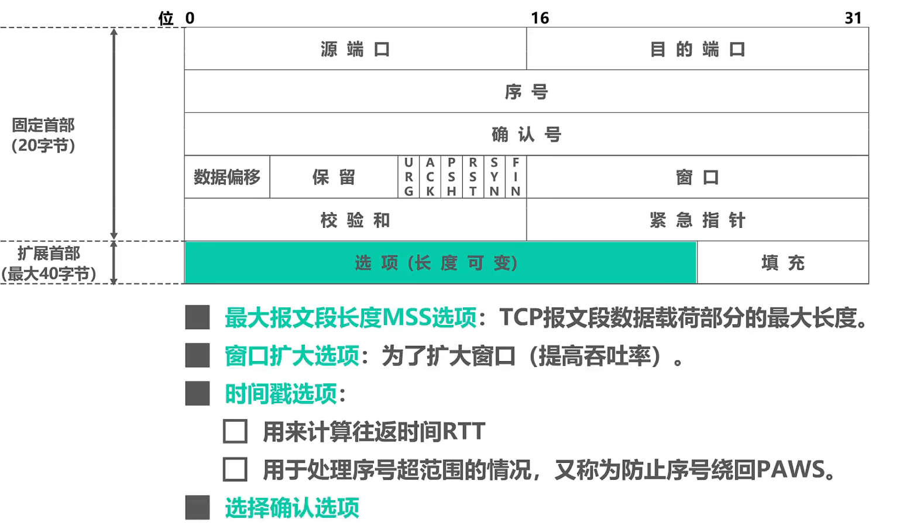

选项的长度可变，故需要用填充字段，确保该首部长度可被$4$整除，使数据便宜为整数。
