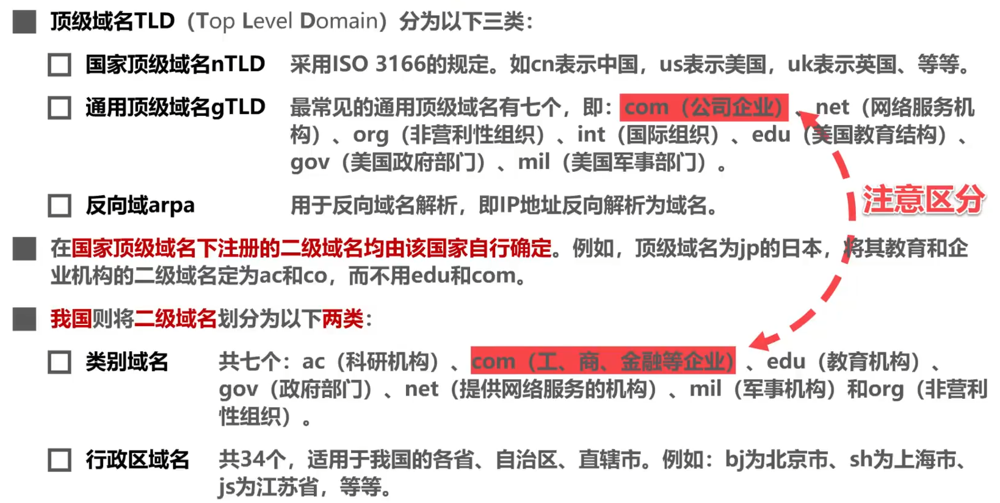
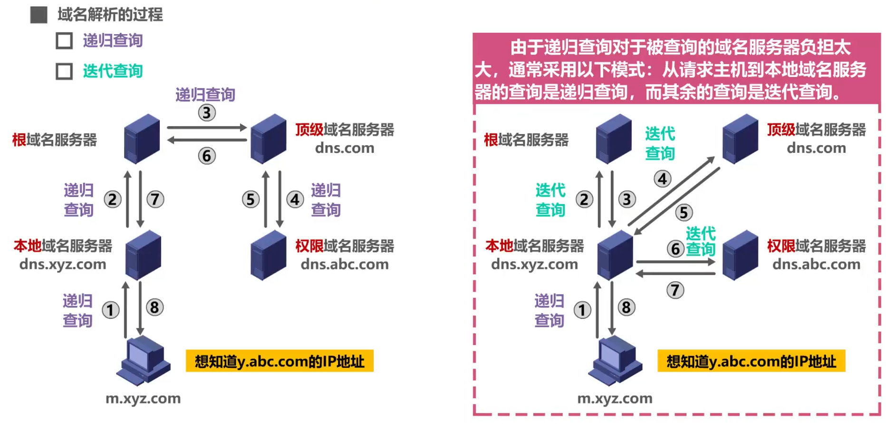
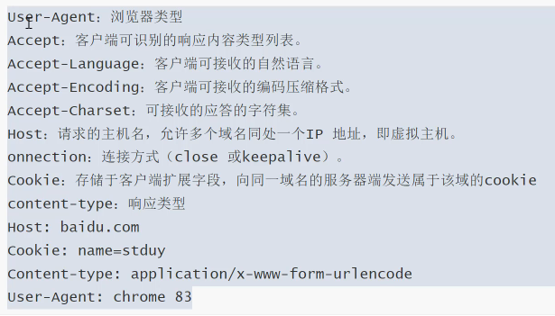

# Ep.6 应用层

## 一、网络应用模型

1. 客户端/服务器模型  
   也叫C/S模型。服务器的服务启动后便不断运行，被动等待并接受来自客户端的请求；客户端则主动请求计算服务的主机。
2. P2P模型  
   没有专门的服务器，每个计算机均为“对等方”(Peer)，既可以作为客户端，也可以作为服务器。  
   故随着用户的增多，虽然需求也在增多，但系统的整体资源和服务能力也得以同步扩充和提高，  
   新用户的加入可以提供服务和资源，满足了网络中用户的需求，促进分布式体系的实现。

## 二、DNS

作用：把**便于记忆的、具有特定含义**的主机名（域名），转换为**便于机器处理**的IP地址。

### 1. 域名

* 顶级/一级域名  
  分为三类：
  * 国家顶级域名：`.cn`、`.us`、`.jp`
  * 通用顶级域名：`.com`、`.org`
  * 反向域arpa
* 二级域名  
  国家顶级域名下注册的二级域名，均有该国家自行确定，如日本的教育机构为`.ac.jp`，而非`.edu.jp`。
* 三级域名
* ……

最后的`.com`/`.cn`就是顶级域名，然后每一个点就增加一级。

在顶级域名之上实际上还有个“树根”，即根域名，但没有任何表示（仅作为树根）。

### 2. 域名服务器

* 根域名服务器  
  在迭代方式一般只是返回对应的顶级域名服务器的IP；递归方式则查询对应的顶级域名服务器。
* 顶级域名服务器  
  即该顶级域名的DNS服务器（如`dns.com`）
* 权限域名服务器  
  之后二级、三级等的DNS服务器（如`dns.baidu.com`，如果查`xyz.baidu.com`则这可返回；如差`xyz.tieba.baidu.com`，则还要继续到`dns.tieba.baidu.com`找）
* 本地域名服务器  
  不属于上述三层结构，只是作为一个“**默认域名服务器**”作为DNS服务的起点。  
  如果有记录或缓存，则直接返回；否则按递归还是迭代去找上述三者。

### 3. 解析方式

1. 递归查询  
   查询时，先查询本地域名服务器，若本地找不到，则依此向下一级域名服务器递归查询，直到最后找到。
2. 递归与迭代结合方式  
   查询时，先查询本地域名服务器，若本地找不到，先问根域名服务器，有则返回；没有则返回**顶级域名服务器的IP**；  
   然后再根据IP问顶级域名服务器，有则返回；没有则范围下一级的权限域名服务器的IP。

  

### 4. 高速缓存

在各级域名服务器（包括本地域名服务器）中，若有查询过某域名的IP地址，则缓存中应该存有该域名对应的IP地址。  
在这之后，若缓存中存在，则直接返回，不再继续迭代或递归查询。

同时，本机（用户主机）也存在DNS缓存，一般用户主机在启动时便从本地域名服务器中下载域名和IP地址的全部数据库。

为了保持高速缓存中的内容正确，需要为高速缓存设置计时器，并删除超过合理时间的记录。

## 三、重要协议

* Talent - 远程登录协议
* FTP - 文件传输协议 - 上传下载文件
* HTTP - 超文本传输协议 - 浏览网页
* DNS - 域名服务协议 - 域名解析
* SMTP - 简单邮件传输协议 - 发送邮件
* POP3 - 邮局协议 - 接收邮件

## 四、万维网

* 概念：万维网是超大规模，联机形式的资料空间，是海量网络站点和网页集合。
* **统一资源定位符(URL)**：用于定位资源，可以唯一标识一个资源，资源可以是文本、图片、视频等
* URL形式：`<协议>://<主机地址>:<端口号>/<路径>/(<目录文件名>)`
  * 协议：`http`/`https`/`ftp`/...
  * 主机地址：可以是IP、也可以是域名
  * 端口号：0~65535，根据协议会有默认端口号（如`http`则为`80`），故一般可不写
  * 路径：该套接字(主机地址+端口)下的路径
  * 目录文件名

### 1. HTTP协议请求流程

1. 用户操作 - 用户在浏览器输入URL或点击超链接
2. 分析URL - 浏览器分析URL链接
3. 请求IP地址 - 浏览器向DNS服务器请求域名对应的IP地址
4. 解析IP地址 - DNS服务器将域名解析为IP地址
5. 建立TCP连接 - 客户端与服务端建立TCP连接
6. 浏览器申请资源 - 客户端浏览器向服务端发送申请资源命令
7. 服务器响应 - 服务器响应浏览器的资源申请
8. 释放TCP连接 - 客户端与服务端双方释放TCP连接  
   注：现在一般获得资源后不会马上释放连接，而是会保存一定时间。
9. 浏览器显示资源 - 浏览器显示从服务器中获取到的资源

### 2. 请求报文

* 请求行：请求方法 + 请求URL + HTTP协议版本
* 请求头  
  
* 请求体（载荷）
  * `GET`请求，请求体空
  * `POST`请求，根据不同方式有不同的内容

### 3. 响应报文

* 响应行：HTTP协议版本 + 状态码 + 是否成功  
  
* 响应头  
  也是类似的一些标签
* 响应体  
  响应的数据

### 4. HTTP与HTTPS区别

* HTTP端口为`80`；HTTPS为`443`
* HTTP是明文的；HTTPS除了包含HTTP，还包含SSL加密处理，安全性高
* HTTP不用申请证书；而HTTPS需要
