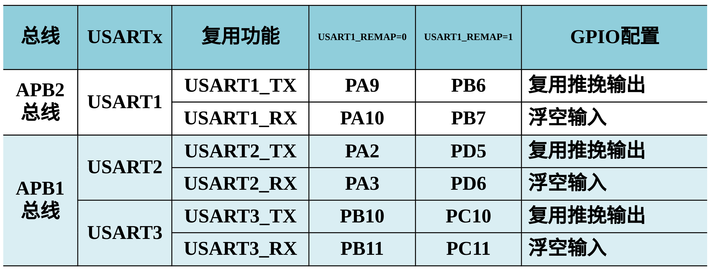
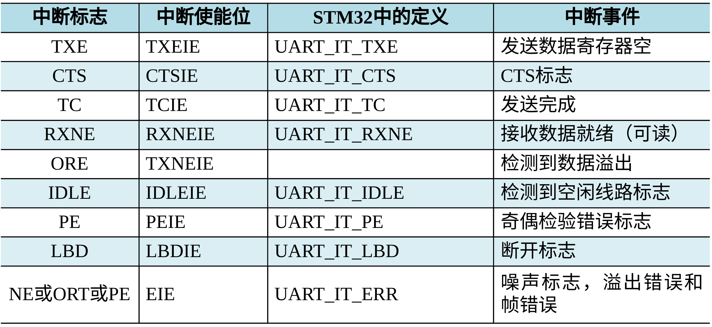

# Ep.7 通信

## 一、概述

### 1. 并行与串行

* 并行：CPU与外设通信
* 串行：一般跨设备通信

### 2. 同步与异步

* 同步：必须要求时钟一致，基本上需要外接时钟同步线
* 异步：不用要求时钟一致，可以使快设备和慢设备通信  
  传输速率低，成本便宜

### 3. 指标

* 波特率：每秒传输的二进制位数，bit/s, bps
* 字符速率：波特率 = 字符速率 $\times$ 每个字符包含的位数

一般配置：9600波特率、1711（1起始、7数据、1校验、1结束）

## 二、 异步串行通信

### 1. 基础通信方式

数据帧组成（以下以传输ASCII码格式来说）：

* 起始位：1位，以`0`表示开始
* 数据位：发送数据，5～8位
* 校验位：1位，检测数据是否有效
* 停止位：1、1.5、2位（以实际情况定），表示结束

空闲时：用`1`表示当前线路上没有数据传输。

传输速率：50、75、100、150、300、600、1200、2400、4800、9600、19200、38400

> 实际上在传数据时，并不是一个帧一个字符，  
> 而是采用私有协议，自定义帧的格式来传输多个字符提高效率。

### 2. UART

UART(通用异步收发传输器)是一**个全双工**通用异步**串行**收发模块，  
用于：打印程序调试信息、上位机和下位机通信等场合。

通信场合要求不高时，只需要发送"Tx"、接受“Rx”、地"GND"三条线即可，  
最高传输速率达到20kbps，且不能传输太远、适合小规模点到点方式.

## 三、USART

### 1. 内部结构

* 发送数据寄存器(TDR)
* 接受数据寄存器(RDR)
* 发送移位寄存器
* 接受移位寄存器

**寄存器：**

* `CTS` - 反应nCTS状态线的变化
* `LBD` - LIN断开检测
* `TXE` - 发送数据寄存器空（0表示数据还没转移到移位寄存器，1反之）
* `TC` - 是否发送完成
* `RXNE` - 读取数据寄存器空（0表示数据还没收到）

**数据发送过程：**

数据 → 发送数据寄存器 → 发送移位寄存器 （触发TXE中断）→ 传送数据 （TC被置位）→ 发送完成

数据接收过程：

数据

### 2. 接口

USART异步模式至少需要两个引脚：`Rx`（接收数据引脚）和`Tx`（发送数据引脚）。  



### 3. 编程模式

* 轮询模式：适用于发送
* 中断模式：适用于接收，不知道什么时候来
* DMA方式：大量数据传送

#### (1) 轮询模式

通过**定期或循环查询**USART**状态寄存器**`SR`各位的状态，编写应用程序对接收或发送的数据进行处理，  
有两种方式实现对USART相关寄存器的操作：

1. 寄存器开发方式：直接配置功能寄存器
2. 基于库的开发方式：间接对寄存器配置

#### (2) 中断方式

有以下中断事件：

* 发送期间：  
  发送完成、清除发送、发送数据寄存器空
* 接收期间：  
  * 总线空闲检测
  * 溢出错误
  * 接收数据寄存器非空
  * 校验错误
  * LIN 断开符号检测
  * 噪音标志（仅在多缓冲器通信）
  * 帧错误（仅在多缓冲器通信）



#### (3) DMA方式

USART 模块可通过 DMA 方式进行**大批量数据**的连续传输。

STM32F103 微控制器的 USART 的发送和接收分别映射到不同的DMA通道上，  
如 USART1_Rx 被映射到 DMA1 的通道5，USART1_Tx 被映射到DMA1的通道4。

## 四、USART标准外设库以及应用

### 1. 标准库

### 2. 编程步骤

1. 声明 GPIO 和 USART 初始化结构体
2. 串口所用的 GPIO 时钟使能，串口时钟使能
3. 设置 I/O 引脚功能为复用推挽输出、浮空输入  
   串口使用的是I/O的复用功能：
   * USART1 的发送引脚为 PA9，需将PA9配置为**复用推挽输出**
   * USART1 的输入引脚为 PA10 ，需将PA10配置为**浮空输入**
4. 设置波特率，设置数据格式：数据位、停止位、校验位
5. 使用串口初始化函数`USART_Init()`初始化相应串口  
   `USART_Init(USART1, &USART_InitStructure);//初始化串口1 USART1`
6. 利用串口使能函数`USART_Cmd()`使能相应串口  
   `USART_Cmd(USART1, ENABLE); // 使能串口`
7. 应用程序编写  
   若使用中断，则编写串口中断函数`void USART1_IRQHandler(void)`
   
### 3. 距离

#### (2) 重定向基本 C 输入输出函数

C 中的`scanf()`、`printf()`，可以重定向到串口，从而实现串口（或LCD）输出，  
实现方式：重写`fputc()`、`fgetc()`函数。

重定向时，需要执行以下步骤：

1. 在串口初始化头文件`usart.h`中添加`#include <stdio.h>`头文件
2. 在 Keil MDK 编译器的 Target 中勾选 Use MicroLIB。

```c++
// 重定向 C 库函数 printf() 到串口
int fputc(int ch, FILE *f)
{
  /* 发送一个字节数据到串口 */
  USART_SendData(DEBUG_USARTx, (uint8_t) ch);
  /* 等待发送完毕 */
  while (USART_GetFlagStatus(DEBUG_USARTx, USART_FLAG_TXE) == RESET);
  return ch;
}
// 重定向 C 库函数 scanf() 到串口
int fgetc(FILE *f)
{      
  /* 等待串口输入数据  */
  while (USART_GetFlagStatus(DEBUG_USARTx, USART_FLAG_RXNE) == RESET);
  return (int)USART_ReceiveData(DEBUG_USARTx);
}
```

使用上述代码**输出字符串**时，会出现丢失第一个字符的现象，  
可以在发送字符前调用`USART_ClearFlag()`复位`TC`标志位。

```c++
USART_ClearFlag(USARTx, USART_FLAG_TC);
```
