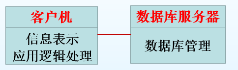

# 第二节 体系结构设计

## 一、概念

### 1. 提出与位置

自从软件系统首次被**分成许多模块**，模块之间有**相互作用**，组合起来有**整体的属性**，就具有了**体系结构**(Software Architecture, SA)。

  

### 2. 定义

软件体系结构是一个复杂软件的高层结构，它高度抽象，超越了算法和数据结构，  
两个基本着眼点是**系统的结构及需求**与**实现间的交互**。

> 定义 - 软件体系结构：
>
> 体系结构是以**构件**、构件**之间的关系**、构件**与环境之间的关系**为内容的某一系统的基本**组织结构**，及**指导**上述内容设计与演化的**原理**。

**特性：**

* 是一个关于**系统形式和结构**的**综合框架**，包括**构件**和**构件的整合**
* 这些要素应该**满足一定的限制**，**遵循一定的设计规则**，能够在一定的环境下进行**演化**
* 反应系统开发中具有重要影响的**设计决策**，便于各种人员的交流，**反映多种关注**，据此开发的系统能完成统既定的功能和性能

### 3. 核心元素

体系结构(SA)=**构件**+**连接件**+**约束**+**质量**

#### (1) 构件

> 定义 - 构件：
>
> 构件是指**语义完整**、**语法正确**和**有可重用价值**的**单位软件**，是软件重用过程中可以**明确辨识的系统**；  
> 结构上，它是**语义描述**、**通讯接口**和**实现代码**的复合体。

**基本属性：**

* **自包容**  
  构件是可独立配置的单元，因此构件必须自包容。
* **严格封装**  
  构件强调与环境和其他构件的分离，因此构件的实现是严格封装的，外界没有机会或没有必要知道构件内部的实现细节。
* **接口规范**  
  构件可以在适当的环境中被复合使用，因此构件需要提供清楚的接口规范，可以与环境交互。

**构件模型：**

* 构件实现
* 文档化
* 开发的标准

  
需要给构件一个全局唯一的名字或句柄。

构件的种类：

#### (2) 连接件

连接件(Connector)用来建立**构件间的交互**以及**支配这些交互规则**的体系结构构造模块。

#### (3) 规约(协议)

连接的规约，是建立在物理层之上的**有意义信息形式**的表达规定。

**目的**：

使双方能够相互理解对方所发来的信息的语义。

**举例**：  

* 对过程调用来说：参数的个数和类型、参数**排列次序**
* 对消息传送来说：消息的格式

## 二、软件体系结构风格（模式）

描述某一**特定应用领域**中，**系统组织方式**的惯用模式。

### 1. 分层体系结构风格

分成多个水平层次，每层只与相邻的层次交互。

分层的方法支持系统的**增量式开发**，  
这个体系结构还是**可改变的和可移植**的，如果一个层的接口被保留下来，这个层就能被另外的一**个对等层替换**。

是一种比较清晰的，分工明确的体系结构。

是典型的高内聚、低耦合的体系结构。
**原因：**

* 基于**单一职责原则**的指导思想  
  通过层对多元职责进行分解，每层拥有独立职责，对关注点进行分离。
* 基于**依赖倒置原则**的指导思想  
  通过接口保持分层架构的稳定性，降低不同层级的耦合度，  
  即使某曾接口发生变化，也只影响相邻的上层，维护量小且错误可控，  
  面向接口的编程有利于提升可扩展性与代码复用能力。
* 基于**信息隐藏**的原则  
  通过层间隔离降低层与层之间的依赖，每个层次对其他层的功能知道的越少越好，  
  不同类型开发人员专注于擅长的开发领域，只关注整个结构中的某一层，这有利于降低开发成本与难度。

**体系结构三要素：**

* 构件：UI层、业务逻辑层、数据实体层、算法层
* 连接件：层与层之间的**过程调用**
* 规约：上层调用下一层，不能跨层调用

**好处：**

* **关注点分离**：一个层中的构件只会处理本层的逻辑，**降低开发成本与复杂度**。
* **层间隔离**：不能进行跨层调用，仅使用下层提供的接口。  
  只要接口不变就可以用对等层代替，提升**扩展性**与**可维护性**；  
  同时接口变化，之影响相邻层，**降低层与层之间的依赖**。
* **可重用**性好

**缺点：**

* 性能低 - 高层次的功能与相对低层次的实现结合起来，每层要处理和解释。  
  可通过**缓存机制**(Radius)来改善。
* **级联修改** - 根本性需求变化，可能产生跨越多层的级联修改，尤其体现在自上而下的方向。  
  可通过**依赖倒置**原则改善。

**使用场景：**

* **企业级应用程序**  
  将复杂系统分为多个水平层次，从而实现**分离关注点**和**松耦合**的效果，提高系统的可维护性和可重用性。
* **大型Web应用程序**  
  大型Web应用程序通常需要处理**大量并发请求**和**复杂业务逻辑**，一样实现分离关注点和松耦合的效果，提高系统的可伸缩性和可维护性。
* **需要满足特定的安全或可靠性要求**  
  分层体系结构可以将**不同的安全或可靠性要求分配到不同的层次**中，从而实现安全和可靠性的控制和管理

### 2. 客户端-服务器体系结构(C/S架构)

将系统分成**客户端**和**服务器端**两部分，  
客户端向服务器**发起请求**，  
服务器**接收请求并返回响应**，客户端进行响应处理。

* 目的：基于资源不对等，实现共享。
* 组成部分：服务器、客户应用程序、网络

**优点：**

* 强大的**数据操作**和**事务处理**能力
* **分布式**任务
* 系统具有较强的适应性、灵活性和扩展性

**缺点：**

* 客户端程序**设计复杂、开发成本较高**。
* 软件**移植**、软件**维护**和**升级困难**。  
  每次升级的时候，客户端都需要重新部署。

#### (1) 两层结构

将**信息表示**与**应用逻辑处理**都放在客户机上，服务器只需要管理数据库事务。  
这时的客户机成为“胖客户机”。

* 优点：管理简单、容易实现，能有效保证系统的性能。
* 缺点：客户机越多，管理和维护上存在的困难越大。

#### (2) 三层架构

将两层结构的客户机上**容易发生变化**的**应用逻辑部分**提取出来，并放到一个专门的“应用服务器”上，使客户机变“瘦"。

**应用服务器：**

作用是使系统中最**易发生需求改变**的**应用逻辑处理**被集中在一起，因此给**系统维护**带来了很大的**便利**。  
当用户应用规则发生**变化时**，需改变的不是数目庞大的客户端，而是**一台或少数几台应用服务器**。

#### (3) 特例 - 浏览器-服务器体系结构(B/S架构)

*相当于三层C/S架构再瘦身，最后瘦成了浏览器。*

* **目的**：简化客户端，便于升级。
* **组成部分**：数据库服务器、Web服务器、客户浏览器、网络。

  

客户端没有任何的业务逻辑，只呈现最后的页面(`.html`)。  
仅仅通过浏览器可运行全部模块。

**与C/S架构比较：**

基于浏览器解释，安全性和效率都没C/S架构高；但非常便捷。

#### (4) 适用领域

* 处理海量数据
* 处理分布式事务
* 处理分布式网络

### 3. MVC(模型-视图-控制器)体系结构

**问题背景：**

* 用户界面需要频繁的修改，它是“不稳定”的。
* “业务逻辑/数据”与“用户界面”之间应尽量少的避免直接通信。

如何让**Web应用程序**的**用户界面**与**业务逻辑功能**实现**模块化**，以便使程序开发人员可以轻松地单独修改各个部分而不影响其他部分？  
即：分离**用户界面**和**业务逻辑**，使得UI人员和逻辑开发人员可并行单独开发。

MVC在传统的B/S体系结构的基础上加入了一个新的元素：**控制器**，  
由控制器来**决定视图与模型**之间的**依赖**关系。

**三个要素：**

* 模型（Model, M）  
  用于管理应用系统的行为和数据，并响应为获取其状态信息（通常来自视图）而发出的请求，还会响应更改状态的指令（通常来自控制器）  
  对应于传统B/S中的业务逻辑和数据。
* 视图（View, V）  
  用于管理数据的显示；  
  对应于传统B/S中的用户界面。
* 控制器（Controller, C）  
  用于解释用户的鼠标和键盘输入，以通知模型和视图进行相应的更改。  
  在传统B/S结构中新增的元素。

**变更-传播机制：**

* 维护了一个模型中相依组件的注册表。
* 所有视图还有一些控制器在这个表中**登记**了对**变更通知的需求**。
* **模型状态的改变**将**触发**变更-传播机制。  
  每个在表中登记的**视图**和**控制器**都会**收到变更通知**。
* 变更-传播机制是**模型与视图**、**模型与控制器**之间唯一连接。

**使用场景：**

应用程序需要**分离业务逻辑和用户界面**，或需要**支持多种用户界面**，优先选择MVC体系结构可能更为合适。  
例如，可以使用相同的模型和控制器来支持Web应用程序、移动应用程序和桌面应用程序等不同的用户界面。

### 4. 数据流体系结构

**语境（背景）：**  

**数据源源不断的产生**，系统需要对这些数据**进行若干处理**（分析、计算、转换等）。

**解决方法：**

* 把系统分解为几个连续的处理步骤，这些步骤之间**通过数据流连接**，一个步骤的**输出**是另一个步骤的**输入**；
* 每个处理步骤由一个**过滤器构件**(Filter)实现；
* 处理步骤之间的数据传输由**管道**(Pipe)负责。

  

**典型应用：**

适合**流式数据**的处理。
编译器、Unix管道、**图像处理、信号处理**、网络监控与管理等。

### 5. 数据共享体系结构

数据共享风格有两种不同类型的软件元素：

* 中央数据单元（资源库）：用于表示系统的当前状态
* 相互依赖的构件组：中央数据单元和构件之间可以进行信息交换

### 6. 总线体系结构

构件之间并不直接通信，而基于总线进行交互。

**优点：**

* 简单：总线作为共享的通信通道，避免了构件点对点的通信。
* 灵活、可扩展：构件可以热插拔。

**缺点：**

* 总线瓶颈
* 总线单点故障
* 实时性不好

**适用场景：**

适用于**小型系统**和**嵌入式系统**等简单的应用场景。

### 7. 体系结构的设计决策

并不存在公式化的体系结构设计过程，  
具体体系结构设计取决于所开发的系统的类型、系统架构师的经验、背景，以及系统的特定需求。

体系结构风格的选择，应该根据系统的**非功能性需求**来决定：

* 性能  
  体系结构应当将关键性操作**局部化到少量构件**中，尽量让这些构件**部署在同一台计算机中**而不要分布到网络上。  
  同时意味着适用**大粒度的构件**比小粒度的构件更节省通信开销。
* 信息安全  
  应该使用一种**层次化体系结构**，把最**关键的资产放在最内层**。
* 可用性  
  体系结构设计应**包含冗余构件**以便在不停止系统的情况下可以更换或替换构件。
* 可维护性  
  体系结构设计应使用**变更的细粒度**、**自包含的构件**。应当将数据的**生产者与消费者分离**。

## 三、软件体系结构描述 - “4+1”视图模型

“4+1”视图模型：用**逻辑视图**、**进程视图**、**物理视图**、**开发视图**和**场景视图**来描述软件体系结构。

  

*课设必要的是：开发视图、物理（部署）视图。*
