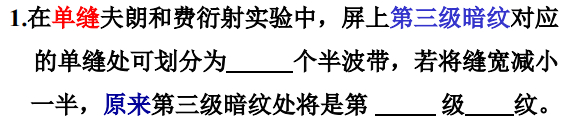
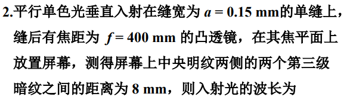
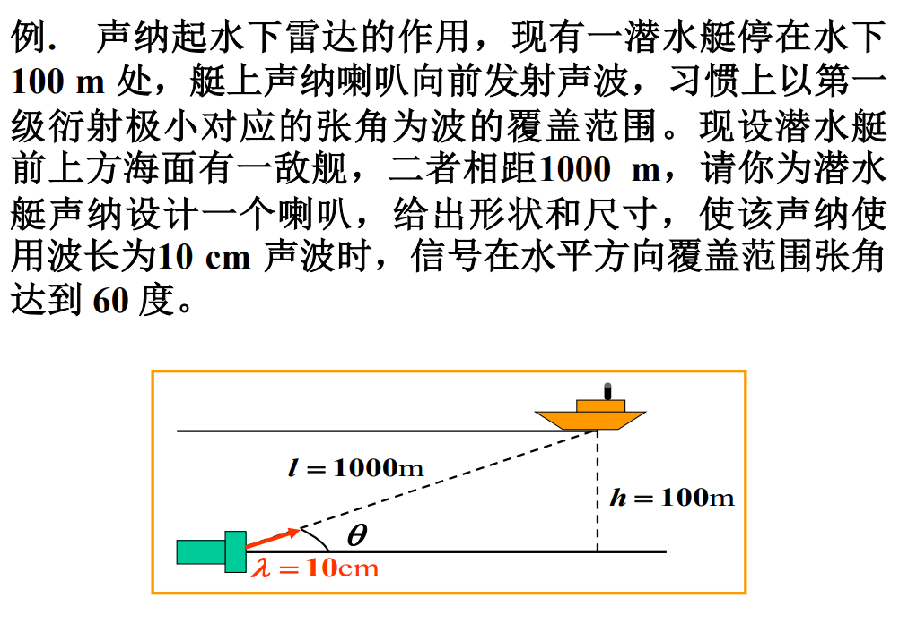
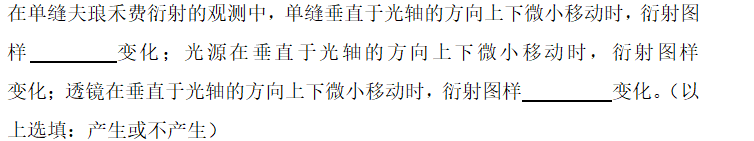

# 波动光学 - 练习

## 一、衍射 - 单缝夫琅禾费衍射 - 半波带法

### 1. 明暗纹位置

> 答案：  
> $6$、一、明

### 2. 线宽度（求波长）

分析：运用公式 - $\Delta x=f\frac{\lambda}{a}$

> 答案：  
> $\lambda=5\times 10^{-7}\textrm{m}$
>
> 过程：
> $6\Delta x = 6f\frac{\lambda}{a}=8\times10^{-3}\textrm{m}$

### 3. φ很大情况下的明暗纹位置

  
注：这里水平方向就是朝纸面向里，以正位置为轴覆盖$60°$。

分析：运用暗纹公式 - $a\sin\varphi=k\lambda \rightarrow a=\frac{k\lambda}{\sin\varphi}$

> 解答：  
> 要在第一级暗纹的范围，故$k=1$。
>
> 竖直宽度：$b=\frac{\lambda}{\sin\theta}$，其中$\sin\theta=\frac{100}{1000}=0.1$，  
> 故竖直宽度：$b=100\textrm{cm}$，
>
> 水平宽度$a=\frac{\lambda}{\sin30\degree}=20\textrm{cm}$。
>
> 故为举行，长$100\textrm{cm}$，宽$20\textrm{cm}$。

## 二、衍射 - 单缝夫琅禾费衍射 - 条纹变化

### 1. 单缝、光源、透镜上下移动

  

> 解析：  
> 单缝沿垂直于光轴的方向稍微平移，透镜没动，入射光方向不变，从单缝射出来的沿\varphi方向的衍射光仍会聚在透镜后焦面同样的地方，所以衍射图样不发生任何变化。  
> 中央明纹中心由透镜主光轴与屏幕的交点决定，当光源或透镜在垂直于光轴的方向平移时，中央明条纹和其他明纹也将向垂直于光轴的方向平移。
>
> 答案：  
> 不产生；产生；产生
