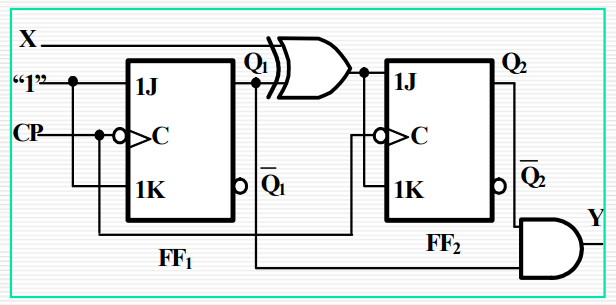
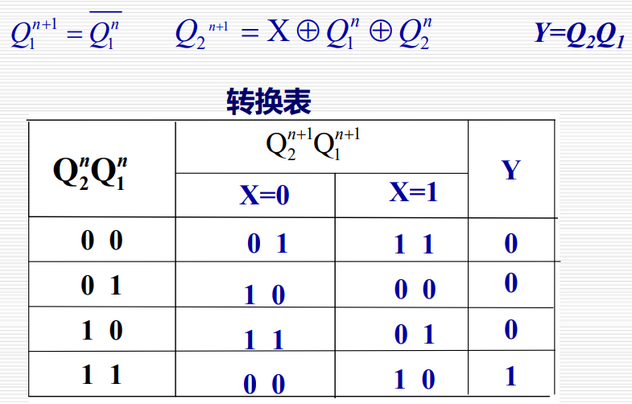
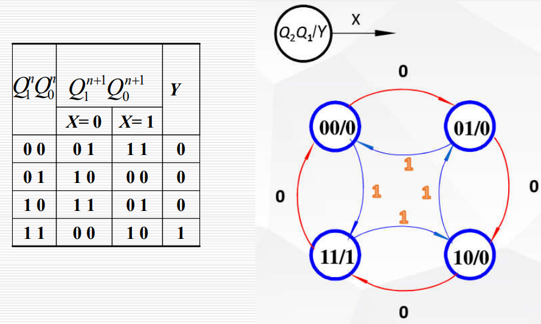
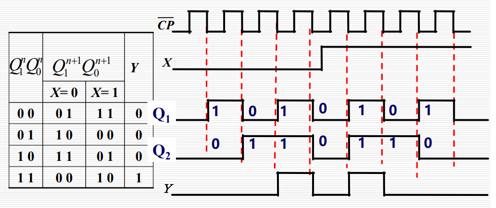

# 第二节 时序逻辑电路的分析

## 一、一般步骤

1. 了解电路的组成：  
   电路的输入、输出信号、**触发器的类型**等。  
   *不加三角上升沿，加了三角下降沿；米利状态输入均看，穆尔只与状态有关。*
2. 根据给定的信息（时序图、电路图等），写出三个特性方程  
   一般按照以下顺序
   * 各触发器的激励方程组
   * **状态方程组**  
     将激励方程组带入触发器的特性方程即可。
   * **输出方程组**
3. 根据状态方程组和输出方程组列出转换表  
   *现态左，按顺序；次态中，分输入；输出米利合到中，输出穆尔单独右。*
4. 画出状态图  
   *圆圈表状态，箭头表转移；输入放箭头，输出看类型；米利放箭头，穆尔放圆圈。*
5. 画出时序图  
   *时序信号稳定变，判断上升下降沿；状态循环一周期，再把输入依次变。*

## 二、各种形式例题

### 1. 给定电路图

1. 了解电路组成：
   * 输入：$X$。
   * 输出：$Y$，为穆尔型（只状态）。
   * 触发器类型：两个JK，同步时序，下降沿敏感。
2. 写出三个特性方程：
   * 激励方程组：  
     $J_1=K_1=1$  
     $J_2=K_2=X\oplus Q_1$
   * 状态方程组：  
     $FF_1$：$Q_1^{n+1}=J\overline{Q_1^n}+\overline{K}Q_1^n=\overline{Q_1^n}$  
     $FF_2$：$Q_2^{n+1}=J\overline{Q_2^n}+\overline{K}Q_2^n=(X\oplus Q_1^n)\overline{Q_2^n}+\overline{X\oplus Q_1^n}Q_2^n=X\oplus Q_1^n\oplus Q_2^n$
   * 输出方程组：  
     $Y=Q_2Q_1$
3. 根据特性方程写出转换表  
   
4. 根据转换表画出状态图  
   
5. 根据转换表画出波形图  
   
