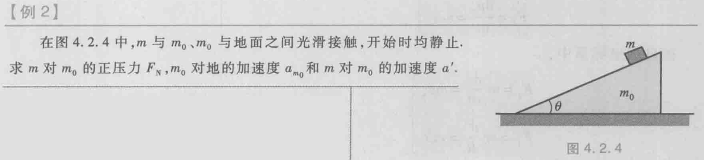
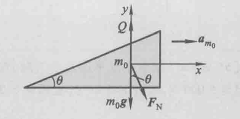
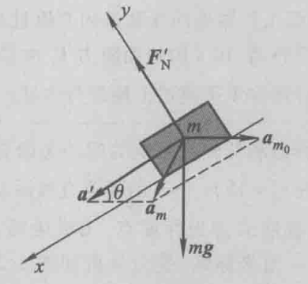

# 第二节 运动定律的应用

## 一、惯性系和非惯性系

* 惯性定律：  
  不受外力作用的物体（自由粒子）永远保持静止或匀速直线运动的状态。  
  即满足牛顿第一定律（惯性定律）的参考系。
* 惯性系：惯性定律在某种参考系中，近似成立的参考系。
* 非惯性系：相对地面加速运动的物体。

由于真正的惯性系不存在，因此只能近似。  
存在性质：相对已知惯性系静止或匀直的参考系也是惯性系，否则（加速运动）为非惯性系。

一些近似的惯性系：

* 太阳参考系（恒星基准） - 较好的惯性系
* 地心参考系（行星基准） - 近似的惯性系
* **地面参考系** - 常用的近似惯性系

因此，相对地面匀速运动的参考系就是惯性系，而加速运动的则是非惯性系。

## 二、惯性系中的力学定律

$$
\vec{F}=\frac{\textrm{d}\vec{p}}{\textrm{d}t}=m\vec{a}
$$

*就牛二方程。*

可以再分为各个方向。

因此只要知道物体所受外力，以及初始状态，  
则可以完全确定该物体的所有运动状态。

## 三、非惯性系中的力学定律

相对于非惯性系，牛顿定律不成立。  
（比如坐在车上观察一个静止在地面的物体，水平没有受力却在相对运动）  
方法：引入**惯性力**。

### 1. 加速平动参考系

对于以加速度$\vec{a_0}$相对于惯性系$S$平动的非惯性系$S'$，  
设所有物体都受到一个虚拟力（惯性力）的作用。

* 惯性力大小：$m_0\cdot a_0$
* 惯性力方向：与非惯性系对惯性系的加速度方向$\vec{a_0}$相反。

$$
\vec{F_\textrm{惯}}=\vec{F_0}=-m_0\vec{a_0}
$$

则牛顿定理变为：

$$
\vec{F_\textrm{合}}=\vec{F_\textrm{真}}+\vec{F_\textrm{惯}}=F+(-m\vec{a_0})=m\vec{a'^2}
$$

*注意$a_0$为参考系的加速度。*

### 2. 转动参考系

仍设所有物体都受到一个虚拟力（惯性离心力）的作用。

$$
\vec{F_\textrm{惯}}=-m\omega^2r\vec{n}
$$
$\vec{n}$代表径向单位向量。  
$\omega$为参考系（如圆盘）的转动角速度。

与真实存在的向心力大小相同，方向相反。

## 四、例题 - 斜面滑块问题

解：

因为$m_0$对地面光滑，初略受力分析可知其对地面合外力不为零，  
所以斜面相对地面有加速度，则**斜面不能作为惯性系**。  
即对$m$以$m_0$为参考系受力分析时，求得的只是**相对加速度**，  
需要再加上$a_{m_0}$才为对地加速度。

---

选取**地面作为参考系**并建立直角坐标系，对$m_0$受力分析：

根据牛顿第二定律，可列方程：
$$
\left\{\begin{array}{l}
F_{x}=F_{\mathrm{N}} \sin \theta=m_{0} a_{m_{0}} \\
F_{y}=Q-m_{0} g-N \cos \theta=0
\end{array}\right.
$$

---

根据伽利略变换，$m$相对地面（惯性系）的加速度为：  
$$
a_m=a_{m_0}+a'
$$

选取**地面为参考系**，沿平行斜面和垂直斜面建立直角坐标系。

先将绝对加速度$a_m$分解得：
$$
\left\{\begin{array}{l}
a_{m x}=a^{\prime}-a_{m_{0}} \cos \theta \\
a_{m y}=-a_{m_{0}} \sin \theta
\end{array}\right.
$$

再对$m$受力分析：  

根据牛顿第二定律，可得：
$$
\left\{\begin{array}{l}
F_{x}=m g \sin \theta=m a_{m x}=m\left(a^{\prime}-a_{m_{0}} \cos \theta\right) \\
F_{y}=F_{\mathrm{N}}^{\prime}-m g \cos \theta=m a_{m y}=-m a_{m_{0}} \sin \theta
\end{array}\right.
$$

*（注意上式中相对加速度$a'$，绝对加速度$a_m$和牵连加速度$a_{m_0}$，以及三者的矢量合成）*

---

由牛顿第三定律得：
$$
F_N=F_N'
$$

联立解得：
$$
F_N=\frac{m_0mg\cos\theta}{m_0+m\sin^2\theta} \\
a_{M}=\frac{m g \cos \theta \sin \theta}{M+m \sin ^{2} \theta} \\
a^{\prime}=\frac{(M+m) g \sin \theta}{M+m \sin ^{2} \theta}
$$
