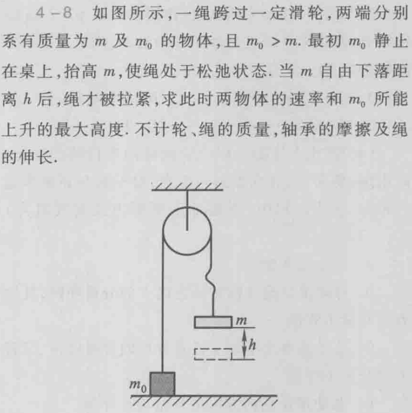

# 第四节 动量守恒定律

## 一、动量守恒定律

> 定义 - 动量守恒定律：
>
> 由动量定理$\vec{F_\textrm{外}}=\frac{\textrm{d}p}{\textrm{d}t}$，  
> 如果**合外力为$\vec{F_\textrm{外}}=0$**，则**总动量不随时间变化**。  
> 称为“动量守恒”。

也可以表述为：  
不受外力且总质量不变的系统，其总动量不随时间变化，质心做匀速直线运动。

若系统内力$\gg$外力，且外力作用时间短，  
则可以近似使用动量守恒定律。

## 三、动量定律及动量守恒定律的运用

> 例1 - 滑轮
>
>   
>
> 解：  
> 分为两个阶段：  
>
> 1. m刚开始下落到绳拉紧
> 2. 绳拉紧到上升最高高度

