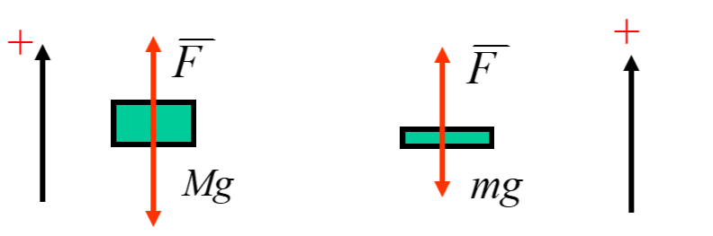
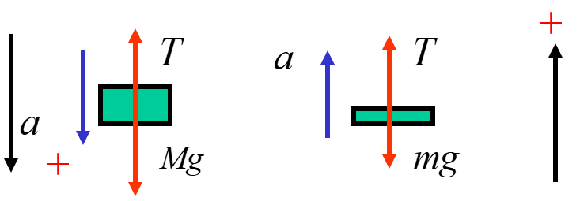

# 第四节 动量守恒定律

即为合外力为$0$时得动量定理特例$\Delta p = 0$。

## 一、动量守恒定律

> 定义 - 动量守恒定律：
>
> 由动量定理$\vec{F_\textrm{外}}=\frac{\textrm{d}p}{\textrm{d}t}$，  
> 如果**合外力为$\vec{F_\textrm{外}}=0$**，则**总动量不随时间变化**。  
> 称为“动量守恒”。

也可以表述为：  
不受外力且总质量不变的系统，其总动量不随时间变化，质心做匀速直线运动。

若系统内力$\gg$外力，且外力作用时间短，  
则可以近似使用动量守恒定律。

此时孤立系统的质心作匀速直线运动。

即便总动量不守恒，若对某一方向分量（$x,y,z$轴）合外力为$0$，也可以其用动量守恒。

注意：  
如果$\vec{I_\textrm{外}}=\int\vec{F_\textrm{外}}\textrm{d}t=0$，**不能说动量守恒**！  
因为冲量是个过程量，两个时刻冲量为$0$动量相等，并不能保证恒为$0$，  
只能说两个时刻动量相等，而不能说整个过程动量守恒。

## 二、例题 - 滑轮问题

解：

分为两个阶段：

1. $m$刚开始下落到绳拉紧。  
   此时自由落体运功过程中，$m$会获得一个速率$v_0$，  
   拉紧的瞬间，$m$与$M$会变为相同速率$v$。
2. 绳拉紧到$M$上升最高高度。  
   期间$m$向下减速运动，$M$向上减速运动。

---

取向上为正方向。

1. m刚开始下落到绳拉紧。  
   记绳拉力为$\vec{F}$，分别对两物块动量定理。  
   

   对$m$动量定理：
   $$
   I_1=(\vec{F}-mg)\Delta t = \Delta p =-mv-(-m\sqrt{2gh})
   $$
   *（注：$\sqrt{2gh}$为自由下落获得速度）*

   对$M$动量定理：
   $$
   I_2=(\vec{F}-Mg)\Delta t = \Delta p =Mv-0=Mv
   $$

   $\Delta t\to0$时，$\vec{F}$远大于$m,M$*（不然怎么能瞬间将两者速度变为相同）*，  
   故可忽略$mg,Mg$，则$I_1=I_2$，联立：
   $$
   -mv-(-m\sqrt{2gh})=Mv
   $$
   得：
   $$
   v=\frac{m\sqrt{2gh}}{m+M}
   $$
2. 绳拉紧到$M$上升最高高度。  
   此阶段$m$与$M$具有相同绳拉力$T$，以及相同加速度$a$，  
   画出受力图：  
     
   *注意两物的正方向不同。*

   由牛顿运动定律：
   $$
   \left\{\begin{array}{l}
   M g-T=M a \\
   T-m g=m a
   \end{array}\right.
   $$
   解得：
   $$
   a=\frac{(M-m)g}{m+M}
   $$

   则$M$上升的最大高度，即为初速度为$v$，末速度为$0$，加速度恒为$-a$的运动问题，  
   解得：
   $$
   H=\frac{m^2h}{M^2-m^2}
   $$
