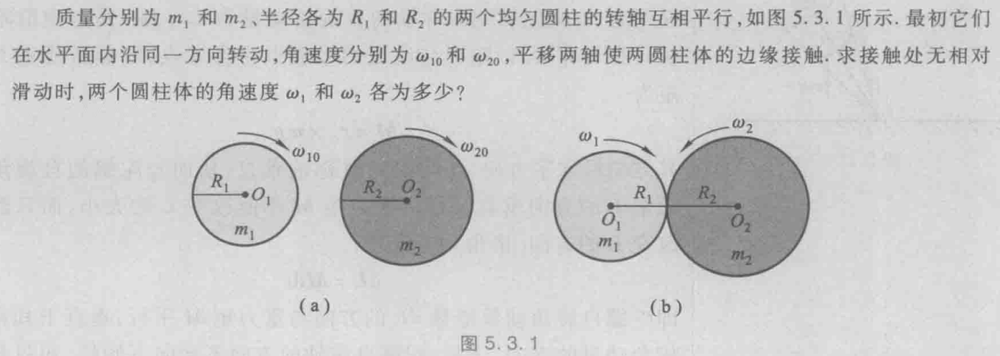
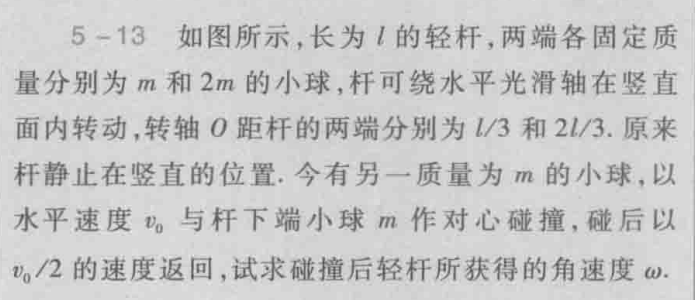

# Ep.5 角动量 角动量守恒定律

世界各种物体基本都有旋转运动，因此角动量十分重要。  
跟动量等同，甚至更重要。

重点：

* 概念
  * 角动量
    * 质点：$\vec{L}=\vec{r}\times m\vec{v}$
    * 质点系：$\vec{L}=L_\textrm{轨道}+L_\textrm{自旋}=\vec{r_c}\times m\vec{v_c}+\sum_i(\vec{r'_i}\times m_i\vec{v'_i})$
    * 定轴刚体：$L_z=J\omega$
  * 转动惯量
    $$
    J=\int_m r^2\textrm{d}m
    $$
  * 力矩
    $$
    \vec{M}=\vec{r}\times\vec{F}
    $$
  * 角冲量
* 定律
  * 刚体定轴转动定律
    $$
    M_z=J\frac{\textrm{d}\omega}{\textrm{d}t}=J\beta
    $$
    类比于$F=ma$。
  * 角动量定律的微积分形式
    * 质点
    * 质点系
    * 定轴刚体  
      $$
      \int_{t_1}^{t_2}M_z\textrm{d}t=J\omega_2-J\omega_1
      $$
  * 角动量守恒定律  
    当**外力力矩的和**$\vec{M_\textrm{外}}=0$时，系统角动量守恒。

## 例题

### 1. 两盘旋撞

### 2. 轻杆上球非弹性碰撞

### 3. 两类冲击摆

动量守恒只能解决部分冲击摆问题（绳连接），其力心无力，  
若将绳改为杆，则存在轴的作用力，此时动量不守恒，  
而角动量守恒则可以解决该类问题。

### 4. 重量杆
