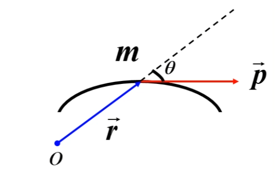
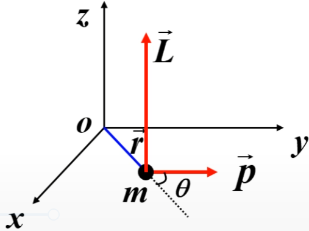
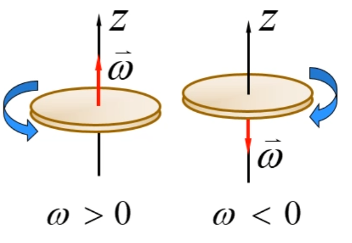
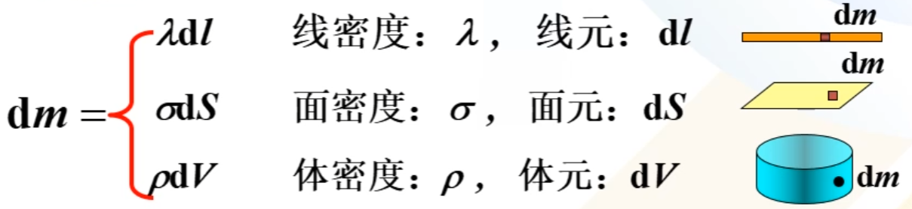
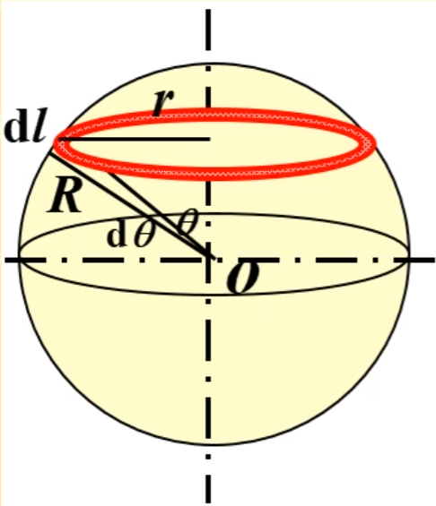

# 第一节 角动量 转动惯量

## 一、角动量

*即线量$\vec{p}$对应的角量$\vec{L}$。*

也称动量矩。  
用来量度转动物体的机械运动量。

### 1. 质点的角动量

> 定义 - 角动量：
>
> 
> $$
> \vec{L}=\vec{r}\times\vec{p}=\vec{r}\times m\vec{v}
> $$
>
> 其中$\vec{r}$为：该时刻质点相对于参考点$O$的位置矢量。  
> 注意：$\times$为向量的叉乘。

* 角动量大小：$|L|=rmv\sin\theta$  
  其中$\theta$是$\vec{r}$与$\vec{v}$的夹角。
* 角动量方向：$\vec{r}$、$\vec{v}$与$\vec{L}$构成右手螺旋定则。  
  其中右手四指先指$r$的正向，再沿小于$\pi$的角度，转向$p$的正方向。
  

对某参考点的角动量，反映质点绕该参考点**旋转运动的强弱**。

注意：**参考点的选择**对角动量影响很大！  
即是物体作直线运动，只要参考点不再运动轨迹上，仍然有角动量。

### 2. 质点系的角动量

为系统内所有质点，对同一参考点角动量的矢量和。  
分为：“轨道角动量”和“自旋角动量”。

记系统的质心为$C$，则：

* 轨道角动量：$L_1=\vec{r_c}\times m\vec{v_c}$  
  为质点系质量全部集中于质点处，**质心相对参考点**的角动量。
* 自旋角动量：$L_2=\sum_i(\vec{r'_i}\times m_i\vec{v'_i})$  
  为所有质点**相对质心**的**角动量矢量和**。

故质点系角动量$L$为：

$$
\vec{L}=L_\textrm{轨道}+L_\textrm{自旋}=\vec{r_c}\times m\vec{v_c}+\sum_i(\vec{r'_i}\times m_i\vec{v'_i})
$$

### 3. 定轴转动刚体的角动量

刚体定轴转动具有以下特性：

1. 各质点均作圆周运动，圆面为转动平面。
2. 各质点运动的线量不等，但角量相同。
3. 各质点的角速度矢量方向均沿轴线。

同时我们在转轴($z$轴)上选定一个正方向，  
则角速度的方向就可以单纯用正负来表示，  
所以只用考虑角量大小，将矢量转化为**代数量**。

> 定义 - 定轴角动量：
>
> 质点对转轴$z$的角动量：
> $$
> L_{iz}=|\vec{r}\times m_i\vec{v_i}|=m_ir_i^2\omega
> $$
>
> 刚体对转轴$z$的总角动量：
> $$
> ⭐L_z=\sum_iL_{iz}=\omega\sum_ir_i^2m_i
> $$

## 二、转动惯量

将角动量$L=\omega\sum_ir_i^2m_i$类比动量$p=vm$，  
发现$\sum_ir_i^2m_i$与$m$类似，  
因此可以称：$\sum_ir_i^2m_i$为**转动惯量$J$**。

*即转动惯量$J$为角量下的质量$m$，描述转动惯性。*

### 1. 定义

$$
⭐J=\sum_i r_i^2m_i
$$

若质量连续均匀分布，可用积分表示：
$$
J=\int r^2\textrm{d}m
$$

* $\textrm{d}m$：质量元。
* $r$：质量元到转轴的距离。

则刚体对定轴的角动量计算转换为：$L=J\omega$  
同时刚体的动能可转换为：$E_k=\frac{1}{2}mv^2=\frac{1}{2}J\omega^2$  
（但不能看成质量集中在质心的质点，因为每个质点线速度不同）

### 2. 计算转动惯量

对于$\int r^2\textrm{d}m$的$\textrm{d}m$，针对线、面、体可以如下转化：  
  

* 杆  
  线密度：$\lambda=\frac{m}{L}$
  * 转轴在中点：$J=\frac{1}{12}mL^2\qquad(=\int_{-\frac{L}{2}}^{\frac{L}{2}}x^2\frac{m}{L}\textrm{d}x)$
  * 转轴在两端：$J=\frac{1}{3}mL^2\qquad(=\int_0^Lx^2\frac{m}{L}\textrm{d}x)$
* 环：  
  面密度：$\sigma=\frac{m}{\pi R^2}$  
  面元：$\textrm{d}S=2\pi r\textrm{d}r$  

  则：$J=\frac{1}{2}mR^2\qquad(=\int_0^Rr^2\sigma\cdot2\pi r\textrm{d}r)$
* 球壳：  
    
  看成许多个圆环组成，取一小段上下厚度为$\textrm{d}l$的圆环。  
  面密度：$\sigma=\frac{m}{4\pi R^2}$  
  面元：$\textrm{d}S=2\pi r\textrm{d}l=2\pi R\sin\theta\cdot R\textrm{d}\theta$

  $J=\frac{2}{3}mR^2\qquad(=\int_0^\pi (R\sin\theta)^2\sigma\textrm{d}S)$（注意原式的$r$为每一个圆环到其圆心的距离，而不是到球心的距离）
* 球体：  
  可以看成许多半径不同的同心球壳组成。  
  体密度：$\rho=\frac{m}{\frac{4}{3}\pi R^3}$  
  体元：$\textrm{d}V=4\pi r^2\textrm{d}r$

  由上面可知：一个球壳的转动惯量$\textrm{d}J=\frac{2}{3}\textrm{d}mr^2$  
  则球体：  

  $J=\frac{2}{5}mR^2 (=\int_0^R\frac{2}{3}r^2\textrm{d}m)$

性质：

1. 两个物体对同个转轴的转动惯量具有可加减性。  
  （如上面球体计算方法、同轴圆柱、同轴空心圆盘）
2. 平行轴定理 - 一个物体对不同转轴的转动惯量存在变换：
   $$
   J_D=J_C+md^2
   $$
3. 正交轴定理：
   $$
   J_z=J_x+J_y
   $$

### 3. 角动量与转动惯量的r

* 角动量$\vec{L}=\vec{r}\times\vec{p}$的$\vec{r}$：离参考**点**的距离。
* 转动惯量$J=\int r^2\textrm{d}m$的$r$：离参考**轴**的距离。
