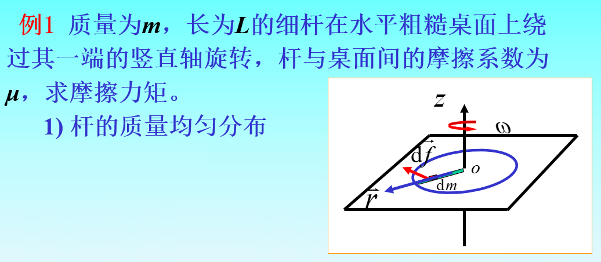
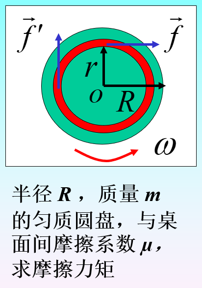

# 第二节 角动量的时间变化率 力矩

## 一、质点力矩（角动量时间变化率）

> 推导 - 质点的角动量时间变化率：
>
> $$
> \vec{L}=\vec{r}\times\vec{p}\\
> \frac{\textrm{d}\vec{L}}{\textrm{d}t}=\frac{\textrm{d}\vec{r}}{\textrm{d}t}\times\vec{p}+\frac{\textrm{d}\vec{p}}{\textrm{d}t}\times\vec{r} \\
> \because \quad \frac{\textrm{d} \vec{r}}{\textrm{~d} t} \times \vec{p}=\vec{v} \times \vec{p}=\vec{v} \times m \vec{v}=0 \\
> \therefore \quad \frac{\textrm{d} \vec{L}}{\textrm{~d} t}=\vec{r} \times \frac{\textrm{d} \vec{p}}{\textrm{~d} t}=\vec{r} \times \vec{F}
> $$

即：
$$
\frac{\textrm{d}\vec{L}}{\textrm{d}t}=\vec{r}\times\vec{F}
$$

$\vec{r}$为质点位矢，  
$\vec{F}$为合力。

*类似于线量力$\vec{F}$对应的角量$\vec{M}$。但注意不再是线量为角量乘距离，这里反过来。*

---

根据上式，直接定义“角动量的时间变化率”，  
为“**力矩**”$\vec{M}$，  

分为两种力矩：

1. 对参考点的力矩：
   $$
   \vec{M}=\vec{r}\times\vec{F}
   $$

   * 大小：$|\vec{M}|=rF\sin\theta=Fd$
   * 方向：右手定则，$r$转向$F$。

   
2. 对轴的力矩：
   $$
   \vec{M}=\vec{r}\times(\vec{F_\parallel}+\vec{F_\perp})
   $$
   

   1. 对于$\vec{r}\times\vec{F_\parallel}$：方向垂直于轴，改变轴的方向。  
      对于定轴问题，有力跟此力矩平衡，故此部分可以忽略。
   2. 对于$\vec{r}\times\vec{F_\perp}$：方向平行于轴，**改变物体绕轴转动状态**。

注意：

1. 力矩**求和**只能对**同一参考点或轴**进行。  
   一般的力矩求和要用矢量叠加，  
   但对于定轴刚体，因为方向总平行轴，所以可以规定正方向转化为代数量。
2. 力和力矩虽然**性质一样**，但**不可等同**（和外力为$0$，力矩不一定为$0$，反之亦然）。
   
3. 对于内力，其大小相等，方向沿同一直线相反，  
   故一对内力的力矩之和为$0$。

## 二、质点系力矩和（角动量的时间变化率）

> 推导 - 质点系的角动量时间变化率：
>
> 将质点所有的力分为内力（质点间相互作用）和外力，  
> 则：
> $$
> \begin{array}{c}
> \frac{\textrm{d} \vec{L}_{1}}{\textrm{~d} t}=\vec{M}_{1 \textrm { 外 }}+\vec{M}_{1 \textrm { 内 }} \\
> \frac{\textrm{d} \vec{L}_{2}}{\textrm{~d} t}=\vec{M}_{2 \textrm { 外 }}+\vec{M}_{2 \textrm { 内 }} \\
> \frac{\textrm{d} \vec{L}_{N}}{\textrm{~d} t}=\vec{M}_{N \textrm { 外 }}+\vec{M}_{N \textrm { 内 }}
> \end{array}
> $$
>
> 两边求和得：
> $$
> \frac{\textrm{d}}{\textrm{d}t}\sum_i\vec{L_i}=\sum_i\vec{M_{i\textrm{外}}}+\sum_i\vec{M_{i\textrm{内}}}
> $$
>
> 其中由上性质3得$\sum\vec{M_{i\textrm{内}}}=0$，  
>
> 故：
> $$
> \frac{\textrm{d}\vec{L}}{\textrm{d}t}=\vec{M_\textrm{外}}=\sum_i(\vec{r_i}\times \vec{F_{i\textrm{外}}})
> $$

故**质点系的力矩**为：质点系所受**外力矩的矢量和**。

$$
\vec{M_\textrm{外}}=\sum_i (\vec{r_i}\times\vec{F_{i\textrm{外}}})
$$

**先求所有外力的力矩，再求矢量和。**

## 三、刚体定轴转动定律

*对应质心运动定律。*

把$\vec{L_z}=\omega\sum r_i^2m_i=J\omega$，代入$\vec{M_\textrm{外}}=\frac{\textrm{d}\vec{L}}{\textrm{d}t}$得：

$$
⭐M_z=J\frac{\textrm{d}\omega}{\textrm{d}t}=J\beta
$$

称为定轴转动定律。  
说明了刚体定轴转动角加速度的大小，与刚体所受的对该轴的合外力矩成正比，与对该轴的转动惯量成反比。

> 对比 - “质心运动定律”与“刚体定轴转动定律”
>
> $$
> \left\{\begin{array}{c}
> \vec{{F}}={m} \vec{{a}} \\
> {M}_{z}={J} \beta
> \end{array}\right.
> $$
>
> * 运动定律
>   * $\vec{F}$ - 改变物体平动状态的原因
>   * $m$ - 物体平动惯性大小的量度
> * 转动定律
>   * $\vec{M_z}$ - 改变物体绕轴转动状态的原因
>   * $J$ - 物体转动惯性大小的量度

## 四、求解步骤与例题

根据质点系力矩计算公式：

$$
\vec{M_\textrm{外}}=\sum_i (\vec{r_i}\times\vec{F_{i\textrm{外}}})
$$

一般来说力$F$一样（如摩擦力），但每个质点的$r$不同，  
故要用积分方法求。

可以得到以下步骤：

1. *先算质量元$\textrm{d}m$  
   因为一般来说求的力都跟质量有关，所以要算这个（若无关也可以不算）。  
   一般来说跟求转动惯量一样。  
   $\textrm{d}m=\lambda\textrm{d}r=\sigma\textrm{d}S=\rho\textrm{d}V$。
2. 算力元$\textrm{d}F$  
   注意这里如果力与质量有关，则要用质量元，  
   如：摩擦力$\textrm{d}f=\mu(\textrm{d}m)g$
3. 算力矩$M$，为力矩元$\textrm{d}M$求积  
   $M=\int\textrm{d}M=\int r\textrm{d}F$

> 例1 - 求杆的摩擦力力矩
>
>   
>
> 解：
>
> 1. 求质量元
>    $$
>    \mathrm{d} m=\frac{m}{L} \mathrm{~d} r
>    $$
> 2. 求力元
>    $$
>    \mathrm{d} f=\mu(\mathrm{d} m) g
>    $$
> 3. 求力矩元
>    $$
>    \mathrm{d} M=-r \mathrm{~d} f
>    $$
> 4. 求力矩
>    $$
>    M=\int \mathrm{d} M=-\int_{0}^{L} r \mu \frac{m}{L} g \mathrm{~d} r=-\frac{1}{2} \mu m g L
>    $$
>
> ---
>
> 例2 - 求圆盘的摩擦力力矩
>
> 
>
> 解：
>
> 1. 求质量元
>    $$
>    d m=\frac{m}{\pi R^{2}} \cdot 2 \pi r \cdot d r
>    $$
>    分解成一个个小圆环来算。
> 2. 求力元
>    $$
>    \mathrm{d} f=\mu(\mathrm{d} m) g
>    $$
> 3. 求力矩元
>    $$
>    \mathrm{d} M=-r \mathrm{~d} f
>    $$
> 4. 求力矩
>    $$
>    M =- \int_{0}^{R}\frac{2 \mu m g r^{2}}{R^{2}} \textrm{d} r =-\frac{2}{3} \mu m g R
>    $$
