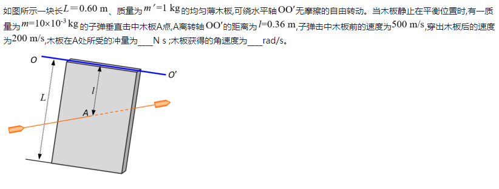

# 第三节 角动量定理

## 一、角动量定理的微分形式

1. 质点
   $$
   \vec{M}=\frac{\textrm{d}\vec{L}}{\textrm{d}t}
   $$
2. 质点系
   $$
   \vec{M_\textrm{外}}=\frac{\textrm{d}\vec{L}}{\textrm{d}t}
   $$
3. 定轴刚体
   $$
   \vec{M_z}=J\beta=J\frac{\textrm{d}\omega}{\textrm{d}t}
   $$
   $M_z$是刚体绕轴改变运动状态的原因。

## 二、角动量定理的积分形式

1. 质点
   $$
   \int_{t_1}^{t_2}\vec{M}\textrm{d}t=\Delta\vec{L}
   $$
2. 质点系
   $$
   \int_{t_1}^{t_2}\vec{M_\textrm{外}}\textrm{d}t=\Delta\vec{L}
   $$
3. 定轴刚体  
   力矩$M_z=J\beta$、角动量$L=J\omega$
   $$
   \int_{t_1}^{t_2}M_z\textrm{d}t=J\omega_2-J\omega_1=\Delta\vec{L}
   $$

## 三、旋进 - 角动量定理的应用

也称“进动”。

1. 陀螺
2. 车轮
3. 子弹

## 四、例1 - 子弹打木块问题

为线量的动量定理与角量的角动量定理的转换使用。

对子弹用动量定理后，可得冲量$I=3N/s$，  
但注意⚠：此时不能对$A$点使用动量定理，即$I=m'v_A$，再$w=\frac{v}{r}$。

因为每点线速度不同，肯定不能转化为相同的线速度。  
即：
**平动物体（子弹）速度转移（打到）到转动物体（转轴木板），不能直接动量转化。**

要先把冲量转化成角冲量：
$$
I'=I\cdot l
$$
则：
$$
\Delta L=I'=I\cdot l = L_1-0
$$

再用动量的计算式：
$$
L_1=Jw
$$
得
$$
w=\frac{I\cdot l}{J}
$$
