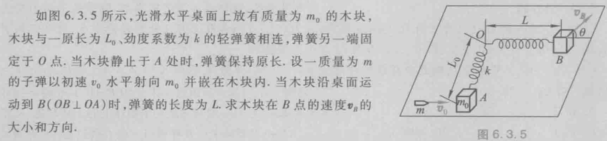

# Ep.6 机械能、机械能守恒定律

## 一、动能

1. 功的计算，变力的功，保守力做功的特征
2. 质点、质点系、定轴刚体的动能

### 1. 平动动能

1. 质点：
   $$
   E_k=\frac{1}{2}mv^2
   $$
2. 质点系：
   $$
   E_k=\sum_i\frac{1}{2}m_iv_i^2
   $$

### 2. 转动动能

只考虑定轴刚体转动的动能。

$$
E_k=\frac{1}{2}J\omega^2
$$

### 3. 动能与动量（角动量）的关系

动量：
$$
\left.\begin{array}{l}
E_{k}=\frac{1}{2} m v^{2} \\
\vec{p}=m \vec{v}
\end{array}\right\} \Rightarrow E_{k}=\frac{p^{2}}{2 m}
$$

角动量：
$$
\left.\begin{array}{l}
E_{k}=\frac{1}{2} J \omega^{2} \\
\vec{L}_{2}=J\vec{\omega}
\end{array}\right\} \Rightarrow E_{k}=\frac{L^{2}}{2 J}
$$

## 二、功

### 1. 功的定义

> 由动能的时间变化率，得到功的微元（元功）：
>
> $$
> \textrm{d}A=\vec{F}\cdot\textrm{d}\vec{r}=M\cdot\textrm{d}\theta
> $$

因此得到功：

* 平动：
  $$
  A=\int_a^b \vec{F}\cdot\mathrm{d}\vec{r}=\int_a^b(F_x\mathrm{d}x+F_y\mathrm{d}y+F_z\mathrm{d}z)
  $$
* 转动：
  $$
  A=\int_{\theta_1}^{\theta_2} M\cdot\mathrm{d}\theta
  $$

### 2. 功的性质

* 功是**过程量**  
  与力作用点的位移相关（说某个位置的功没有意义）。
* 功是**相对量**  
  与参考系选择有关（在电梯里的人，外部参考系做功，内部不做功）。
* 一对作用力与反作用力做功的代数和，不一定为零。  
  因为位移不一定相同。

## 三、动能定理

* 对于质点：
  力（对于质点只有外力）所做的功，改变动能。
  $$
  A=\Delta E_k
  $$
* 对于质点系：  
  外力做功加上**内力做功**的代数和，改变动量。
  $$
  A_\textrm{外}+A_\textrm{内}=\Delta E_k
  $$

注意：在（角）**动量**定理中，因为内力和内力矩的矢量和为$0$，所以不考虑内力，  
但在**动能**定理中，内力做功代数和不一定为$0$，因此需要考虑。

## 四、保守力

### 1. 保守力定义

> 定义 - 保守力
>
> 做功与路径无关，只与起点和终点的位置有关的力，  
> 称为保守力。

性质：

* 做功**与路径无关**，只与始末位置有关。
* 沿闭合路径运动一周，做功为$0$。

常见的保守力：

* 重力
* 弹力
* 万有引力
* 静电力
* 四种基本相互作用（引力、弱力、电磁力、强力）

### 2. 势能

因为保守力做功只与相对位置有关。

> 三种保守力的做功：
>
> * 重力：$A=-\left(m g h_{2}-m g h_{1}\right)$
> * 弹力：$A=-\left(\frac{1}{2} k x_{2}^{2}-\frac{1}{2} k x_{1}^{2}\right)$
> * 引力：$A=-\left[\left(-G \frac{m_{1} m_{2}}{r_{2}}\right)-\left(-G \frac{m_{1} m_{2}}{r_{1}}\right)\right]$

因此可以将这个相对位置决定的函数，定义为该物体系势能。  
对应关系：

| 力  | 做功$A$                                                                                             | 势能$E_p$                       |
| ---- | ----------------------------------------------------------------------------------------------------- | --------------------------------- |
| 重力 | $A=-\left(m g h_{2}-m g h_{1}\right)$                                                                 | $E_{p}=mgh$                       |
| 弹力 | $A=-\left(\frac{1}{2} k x_{2}^{2}-\frac{1}{2} k x_{1}^{2}\right)$                                     | $E_{p}=\frac{1}{2} k x^{2}$       |
| 引力 | $A=-\left[\left(-G \frac{m_{1} m_{2}}{r_{2}}\right)-\left(-G \frac{m_{1} m_{2}}{r_{1}}\right)\right]$ | $E_{p}=-G \frac{m_{1} m_{2}}{r}$ |

### 3. 保守内力与势能的关系

可求保守力做功与势能的相互转换。

$$
A_\textrm{保守内力}=-\Delta E_p
$$

### 4. 与能量关系

动能增量：
$$
\Delta E_k = A_\textrm{外}+A_\textrm{内}=A_\textrm{外}+A_\textrm{保守内}+A_\textrm{非保守内}
$$

机械能增量：  
机械能是质点系的**动能和势能的总和**。
$$
\Delta E = \Delta(E_k+E_p) = A_\textrm{外}+A_\textrm{非保守内}
$$

## 五、机械能守恒

1. 过程满足$A_\textrm{外}+A_\textrm{非保守内}=0$
2. 每个时间微小元都为$0$  
   否则只是初末态相同，不是整个过程守恒。

## 六、例题

1. 桌上链滑动
2. 杆、弹簧、环
3. 击中升高
4. 弹簧拉转  
   

   分别使用动量守恒、机械能守恒、角动量守恒。
