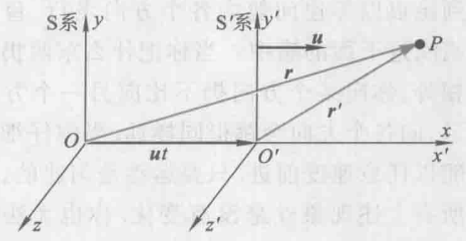

# 第一节 经典力学框架

## 一、力学相对性原理

$$
\vec{F}=m\frac{\textrm{d}^2\vec{r}}{\textrm{d}t^2}
$$

力学定律在一切惯性系中数学形式不变。

* 描述力学规律而言，一切惯性系彼此等价。
* 在一个惯性系中做的力学实验，不能判断该惯性系相对于其他惯性系的运动。

## 二、伽利略变换

* 位置变换
  $$
  \vec{r'}=\vec{r}-\vec{u}t
  $$
* 速度变换
  $$
  \vec{v'}=\vec{v}-\vec{u}
  $$

---

存在的困难：

* 伽利略变换不是经典电磁定律的对称操作。  
  比如洛伦兹力$F=qvB$，若速度变换后则洛伦兹力也变了，与实际不符。
* 与高速运动的实验结果不符。

## 三、狭义相对论的基本原理

### 1. 狭义相对性原理

一切**物理定律**在**所有惯性系**中都有**相同的数学形式**。

### 1. 光速不变原理

在**所有的惯性系**中，**真空中的光速恒为$c$**，  
与光源或观察者的**运动无关**。
