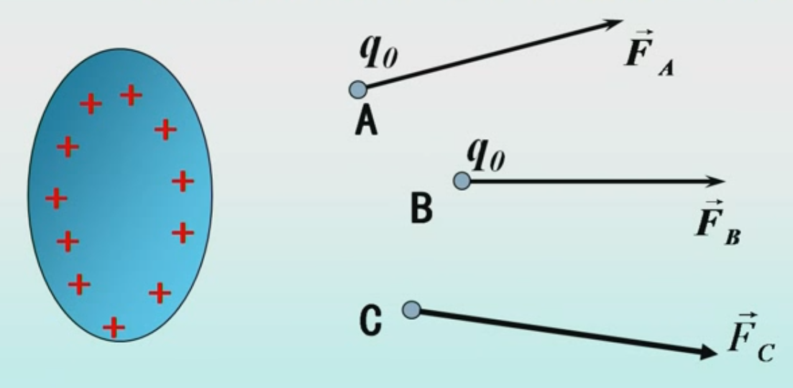

# 第二节 电场强度

因为电场这种物质，基本特征就是：用来对在其中的电荷**造成作用力**的。  
因此为了描述这种能造成作用力的性质，  
首先需要规定一个检验电荷，用来**测量作用力的大小方向**。

然后将这个检验电荷，检验电场中每一点，其所受的力，  
便可描述电场中**各点所造成的电场力的情况**，称为**电场强度**。

## 一、场源电荷与检验电荷

* 场源电荷：产生静电场的点电荷。  
* 检验电荷：电量足够小的点电荷。  
  需要满足两个要求：
  * 电荷量足够小  
    则可以忽略本身对电场分布的影响。  
  * 为点电荷  
    可以与场点对应。

## 二、电场强度

### 1. 电场强度定义

通过检验电荷可以发现，  
当**等比增加**检验电荷的**电荷量**，**所受的力**也等比增加。  
即：电场造成的电场力，与电荷带电量有正相关。

因此可用电场力与电荷量的比值，描述“电场对电荷造成力”的这一性质，  
称为**电场强度**，简称“场强”。

> 定义 - 电场强度$\vec{E}$：
>
> $$
> ⭐\vec{E}=\frac{\vec{F}}{q_0}
> $$
>
> 描述电场中各点的强弱和方向。

其**与试探电荷无关**。

* 大小：等于单位检验电荷在该点所受电场力。
* 方向：与$+q_0$受力方向相同。

### 2. 电场强度计算

#### (1) 点电荷的场强

*就很简单。*

记：点电荷电荷量为$q$。

试探电荷受力：$\vec{F}=\frac{1}{4\pi\epsilon_0}\frac{qq_0}{r^2}\vec{e_r}$  
则电场强度：
$$
\vec{E}=\frac{1}{4\pi\epsilon_0}\frac{q}{r^2}\vec{e_r}
$$

#### (2) 点电荷系的场强

用电场力叠加定理。  
是每个点电荷造成的电场强度的矢量和。

$$
\overrightarrow{\mathbf{E}}=\overrightarrow{\mathbf{E}}_{1}+\overrightarrow{\mathbf{E}}_{2}+\cdots+\overrightarrow{\mathbf{E}}_{\mathrm{n}}=\sum_{\mathrm{i}=1}^{\mathrm{n}} \overrightarrow{\mathbf{E}}_{\mathrm{i}}=\sum_{\mathrm{i}=1}^{\mathrm{n}} \frac{1}{4 \pi \varepsilon_{0}} \frac{\mathrm{q}_{\mathrm{i}}}{\mathrm{r}_{i}^{2}} \vec{e}_{r i}
$$

#### (3) 连续分布电荷的场强

$$
\begin{array}{l}
d \vec{E}=\frac{1}{4 \pi \varepsilon_{0}} \frac{d q}{r^{2}} \vec{e}_{r} \\
\vec{E}_{p}=\int d \vec{E}=\frac{1}{4 \pi \varepsilon_{0}} \int_{(V)} \frac{d q}{r^{2}} \vec{e}_{r}
\end{array}
$$

需要注意对于不同的$\mathrm{d}q$，其$\vec{e_r}$的方向也不同。  
要不把$q$转变为有关坐标的函数，要不把$\vec{e_r}$分解为水平和垂直。

### 2. 计算场强分布的基本方法

* 由定义求
* **由点电荷$\vec{E}$公式和$\vec{E}$叠加原理求。**
* 由高斯定理求。
* 由$\vec{E}$和$U$的关系求。

一般用方法2：

* 点电荷$\vec{E}$公式：
  $$
  \vec{F}=\frac{qq_0}{4\pi\epsilon_0r^2}\frac{\vec{r}}{r}\quad\Rightarrow\quad\vec{E}\frac{\vec{F}}{q_0}=\frac{q}{4\pi\epsilon_0r^2}\frac{\vec{r}}{r}
  $$
* 点电荷系：
  $$
  \vec{E}=\sum_i\frac{q_i}{4\pi\epsilon_0r_i^2}\frac{\vec{r_i}}{r_i}
  $$
* 连续带电体：
  $$
  \textrm{d}\vec{E}=\frac{\textrm{d}q}{4\pi\epsilon_0r^2}\frac{\vec{r}}{r}\quad\Rightarrow\quad\vec{E}=\int\textrm{d}\vec{E}
  $$

---

小结：

* 无限长均匀带电直线：
  $$
  E=\frac{\lambda}{2\pi\epsilon_0r}
  $$
* 均匀带电圆环轴线上：
  $$
  \vec{E}=\frac{qx\vec{i}}{4\pi\epsilon_0(x^2+R^2)^{\frac{3}{2}}}
  $$
* 无限大均匀带电平面：
  $$
  E=\frac{\sigma}{2\epsilon_0}
  $$

## 四、静电场叠加定理

> 定义 - 静电场叠加定理
>
> $$
> \vec{E}=\sum\vec{E_i}
> $$

点电荷系电场中某点总场强，  
等于各点电荷单独存在时，在该点产生的场强的矢量和。
