# 第一节 荷产生场

## 静止部分 - 静止电荷→静电场

### 一、库仑定律

反应两个**点电荷**之间的**相对作用力**。
$$
\vec{F}=\frac{1}{4\pi\epsilon_0}\frac{q_1q_2}{r^2}\vec{e_r}
$$

* $\epsilon_0$ - 真空电容率（真空介电常数）  
  为常数。

### 二、电场强度 —— 静止电荷产生电场

反应静电荷产生的电场大小。

等于单位**正**电荷在某位置上所受的静电力。
$$
\vec{E}=\frac{\vec{F}}{q}
$$

#### 1. 点电荷的场强

$$
\vec{E}=\frac{1}{4\pi\epsilon_0}\frac{q}{r^2}\vec{e_r}
$$

* $\epsilon_0$ - 真空电容率（真空介电常数）  
  为常数。
* $q$ - 静止点电荷的电荷量

#### 2. 带电体的场强

微元 - 电荷源：$\mathrm{d}\vec{E}=\frac{1}{4\pi\epsilon_0}\frac{\mathrm{d}q}{r^2}\vec{e_r}$  
积分：
$$
\vec{E}=\int\mathrm{d}\vec{E}=\frac{1}{4 \pi \varepsilon_{0}} \int_{(V)} \frac{d q}{r^{2}} \vec{e}_{r}
$$

### 三、电场线和电通量

#### 1. 电场线

电场线是几何方法描述电场，  
比数学公式更直观。

* 电场强度  
  已知电场线越密集，电场强度越大，  
  因此可以说：**单位面积中，穿过的电场线越多，场强越大。**
* 电场方向  
  跟电场线的方向一致。

建立联系：$E\leftrightarrow \frac{\Phi_e}{S}$（$\Phi_e$为穿过面积$S$的面的电场线的条数）

#### 2. 电通量

定义电通量$\Phi_e$：  
**某个面**的电通量，就是穿过这个面的**电场线的条数**。

电通量只是用来描述电场性质的，建立$\Phi_e\sim E$之间的关系，  
不是我们手动去数条数，所以不用在意电场线的画法与电通量存在关系。

对于**匀强电场**，**一块平面**的$\Phi_e$计算方法：
$$
\Phi_e=ES\cos\theta=\vec{E}\cdot\vec{S}
$$

* $\theta$ - 电场方向$\vec{E}$与平面$S$法线的夹角

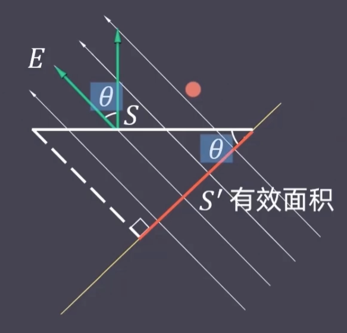

---

对于**非匀强电场**，**一块曲面**的$\Phi_e$计算方法：

微元：$\mathrm{d}\Phi_e=\vec{E}\cdot\mathrm{d}\vec{S}$  
积分：
$$
\Phi_e=\iint_S\mathrm{d}\Phi_e=\iint_S\vec{E}\cdot\mathrm{d}\vec{S}
$$

### 四、高斯面的电通量 —— 电场高斯定理

> 定义 - 高斯面：
>
> 将任意一个闭合曲面称为“高斯面”，  
> 电场高斯定理则研究电荷对于高斯面产生的电通量。
>
> 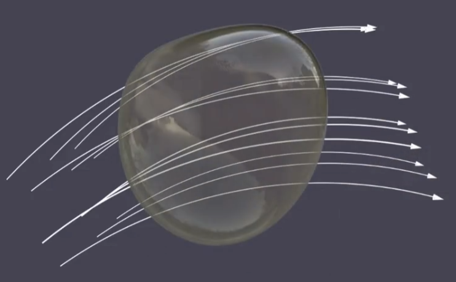
>
> 对于在内部的正电荷，电场线从里向外穿出，$\Phi_e>0$；  
> 对于在内部的负电荷，电场线从外向里穿入，$\Phi_e<0$。

电场的高斯定理：  
反应高斯面的电通量与点电荷的关系。  
$\Phi_e^{\textrm{高斯面}}\sim Q$

1. 内部，只有一个正（负）电荷：$\Phi_e\propto Q$  
   正电荷则电通量为正，负电荷则为负，均正比于$Q$。
2. 内部，同时存在正负电荷：$\Phi_e\propto Q_{\textrm{净}} = \sum Q$  
   内部的正负电荷相互抵消，正比于最终的净电荷量。
3. 外部：$\Phi_e = 0$  
   穿进来与穿出去的电场线一致，则抵消。

总结为：$\Phi_e^{\textrm{高斯面}}\propto \sum Q$

求得常数，可以得到高斯定理：
$$
\Phi_e^{\textrm{高斯面}}=\oiint_S\vec{E}\cdot\mathrm{d}\vec{S}=\frac{}{}\frac{\sum Q}{\epsilon_0}
$$

> 证明 - 高斯定理的比例系数：
>
> $\oiint_S\vec{E}\cdot\mathrm{d}\vec{S}=C\sum Q$，  
> 求证：$C=\frac{1}{\epsilon_0}$
>
> 将面内包含的总电荷量记为$Q$，球面各处场强一样为常数  
> 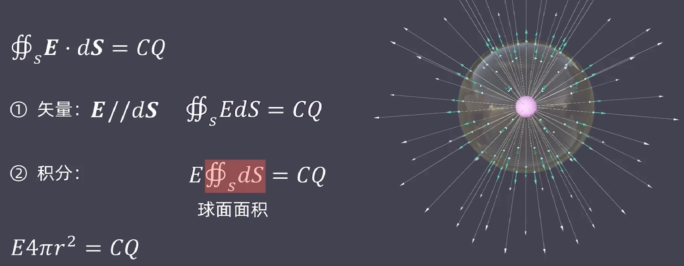  
> 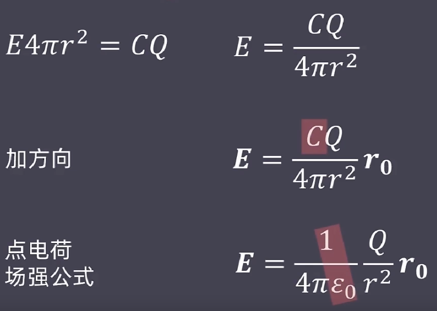

---

补：高斯定理——主要用来求电场。

利用公式：
$$
\oiint_S\vec{E}\cdot\mathrm{d}\vec{S}=\frac{}{}\frac{\sum Q}{\epsilon_0}
$$

其中高斯面任选，将$Q$、$S$得出来后便能求解出$E$与$r$的关系。

首先好解的条件为：电场高度对称。  
这样才能选择一个漂亮高斯面，使得前一项积分好求，直接将前面一项变为$E*S*cos\theta$。
> 一般高斯面的选取要这三个条件：
>
> 1. 曲面上每点的电场方向与曲面垂直（不垂直至少也要夹角固定）
> 2. 各部分曲面的场强大小相同或为零
> 3. 每部分曲面面积易得

后面一项则是高斯定理内容：就是包围在里面的$Q$，  
一般给的是总q，完全包围就是$q$，部分包围就看占比（均匀分布）。

然后可解。

### 五、电场的环路 —— 环流定理

#### 1. 保守场

静电力沿任意**闭合路径**，**做功为0**。

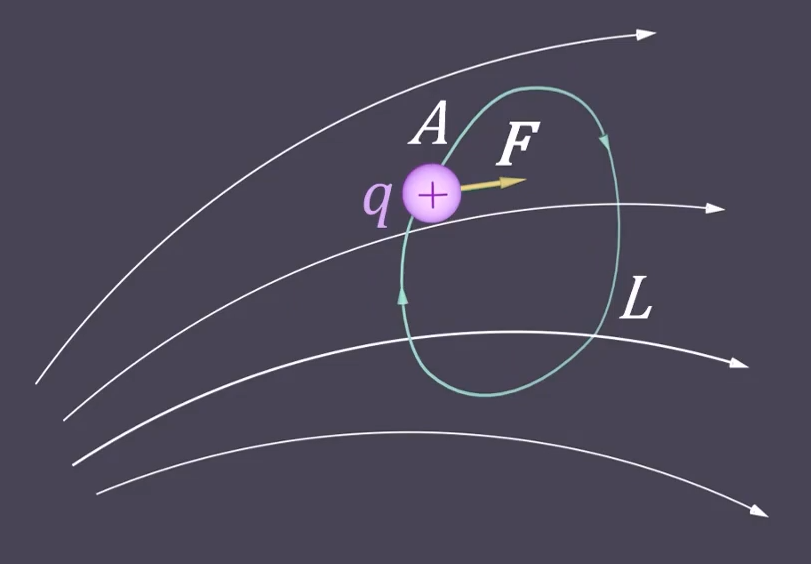
$$
\oint_L \vec{F}\cdot\mathrm{d}l=0
$$

因此静电力是一种保守力，电场是一种保守场。

#### 2. 环流定理

可将上式转换为：
$$
\oint_L\vec{E}\cdot\mathrm{d}l=0
$$
（$\vec{F}=q\vec{E}$，$q$为常数可以不用考虑）

$\oint_L\vec{E}\cdot\mathrm{d}l$为**静电场的环流**，  
因此环流定理则是：  
**静电场的环流恒为零**。

可以理解为：  
单位电荷受到的静电力，沿任意闭合路径做功为0。

## 运动部分 - 运动电荷→磁场

### 一、运动电荷

反应微观运动电荷与宏观电流的关系。
$$
(\mathrm{d}q)v=I\mathrm{d}l
$$

* $\mathrm{d}q$ - 电荷源
* $I$ - 电流大小  
  为标量。
* $\mathrm{d}l$ - 电流方向的导线线元  
  为矢量，方向等于电流的方向。

其中$I\mathrm{d}l$也称导线元。

### 二、磁场大小 —— 运动电荷产生磁场

#### 1. 点电荷的磁场

反应**运动点电荷**产生的**磁场**大小。

$$
\vec{B}=\frac{\mu_0}{4\pi}\frac{q\vec{v}}{r^2}\times\vec{e_r}
$$

* $\mu_0$ - 真空磁导率  
  为常数。
* $q$ - 运动点电荷的电荷量
* $\vec{v}$ - 运动点电荷的速度矢量

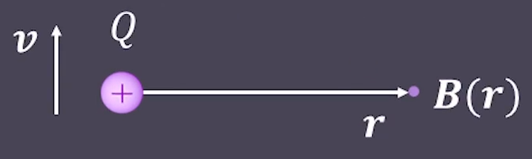

与静止电荷场强的关系：

* 分母的真空介电率$\epsilon_0$ → 分子的真空磁导率$\mu_0$
* 静止电荷的电荷量$q$ → 运动电荷的电荷量乘上速度矢量$q\vec{v}$。
* 点乘方向矢量的$\cdot\vec{e_r}$ → 叉乘方向矢量$\times\vec{e_r}$

#### 2. 电流的磁场 —— 毕奥-萨伐尔定律

微元 - 磁元：
$$
\mathrm{d}\vec{B}=\frac{\mu_0}{4\pi}\frac{(\mathrm{d}q)\vec{v}}{r^2}\vec{e_r}=\frac{\mu_0}{4\pi}\frac{I\mathrm{d}l}{r^2}\vec{e_r}
$$

积分：
$$
\vec{B}=\int \mathrm{d}\vec{B}=\frac{\mu_0}{4\pi}\int\frac{I\mathrm{d}l}{r^2}\vec{e_r}
$$

#### 3. 通电直导线的磁场

* 大小：
  $$
  B=\frac{\mu_0}{2\pi}\frac{I}{a}
  $$
  * $a$ - 点到导线的距离
* 方向：利用右手螺旋定则。

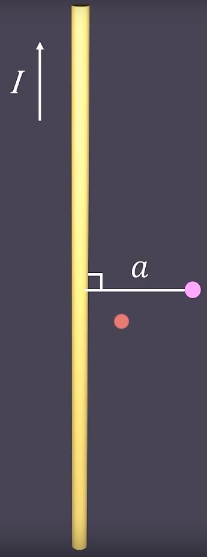

> 推导：
>
> 磁场元：
> $$
> \mathrm{d}\vec{B}_p=\frac{\mu_0}{4\pi}\frac{I\mathrm{d}\vec{l}}{r^2}\times\vec{e_r}
> $$
>
> 积分：
> $$
> \vec{B_p}=\frac{\mu_0}{4\pi}\int_l\frac{I\mathrm{d}\vec{l}}{r^2}\times\vec{e_r}
> $$
>
> * 方向：任取一段微元，都是垂直纸面向里。
> * 大小：  
>   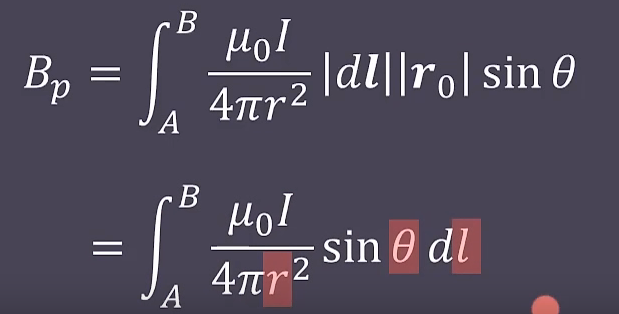  
>   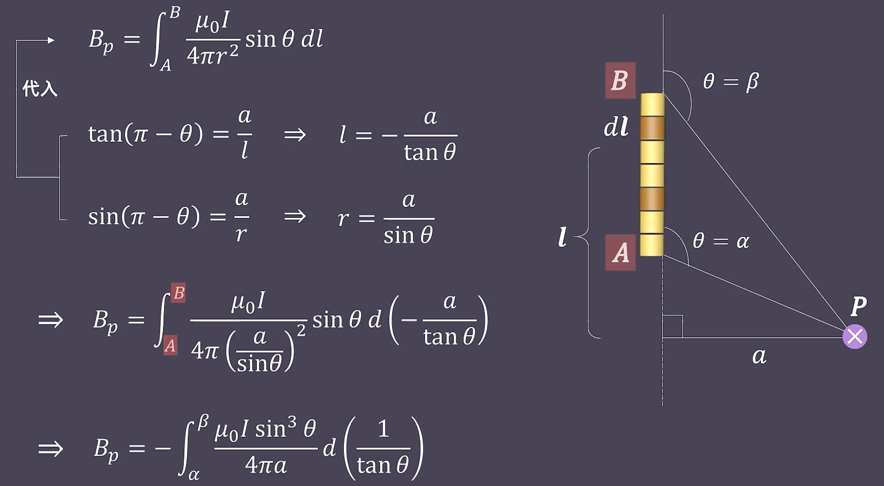  
>   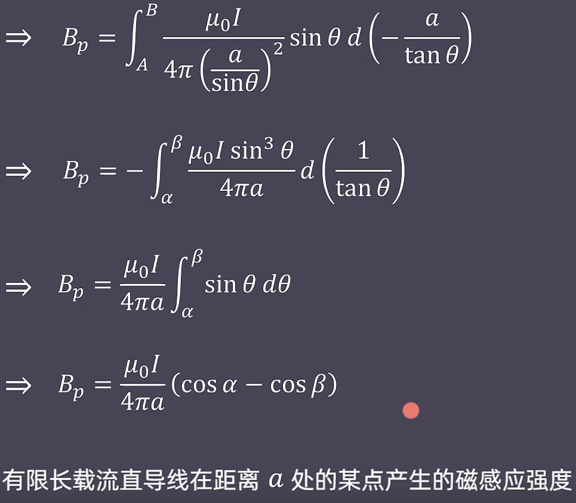  
>   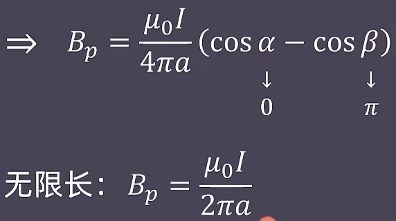

### 三、磁感线和磁通量

#### 1. 磁感线

跟电场线一样，用来描述磁场的大小和方向。

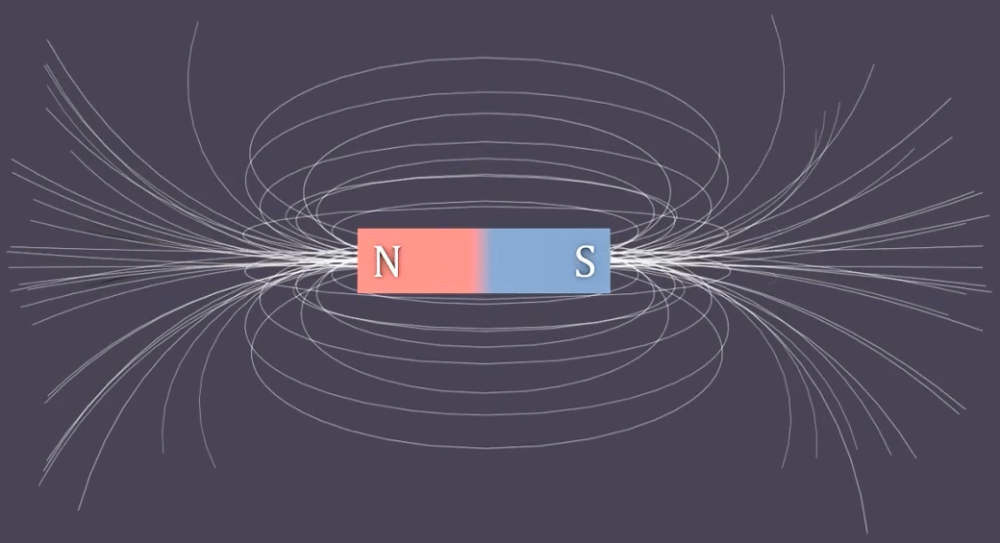

* 磁场强度  
  磁场线越密集，电场强度越大，  
  因此可以说：**单位面积中，穿过的磁场线越多，磁场越大。**
* 电场方向  
  跟磁场线的方向一致。

与电荷不同之处：

* 电荷可以单独存在正电荷和负电荷
* 磁不存在单独的磁北极和磁南极  
  即：磁北极和磁南极一定成对出现。

因此磁感线一定闭合。  
在外部的方向：从北极指向南极。  
在内部的方向：从南极指回北极。

#### 2. 磁通量

定义磁通量$\Phi_m$：  
**某个面**的磁通量，就是穿过这个面的**磁感线的条数**。

计算方法：
$$
\Phi_m=\iint_S\mathrm{d}\Phi_m=\iint_S\vec{B}\cdot\mathrm{d}\vec{S}
$$
*将电场强度$\vec{E}$换成磁感应强度$\vec{B}$。*

### 四、高斯面的磁通量 —— 磁场高斯定理

因为北极和南极一定同时存在，  
有一条磁感线穿出高斯面，则其一定对应穿入高斯面。

因此磁场高斯定理：
$$
\Phi_m^{\textrm{高斯面}}=\oiint_S\vec{B}\cdot\mathrm{d}\vec{S}=0
$$

### 五、磁场的环路 —— 安培环路定理

静止的电荷，技能是向四周发射一条条电场线；  
运动的电荷，形成电流，技能是向四周辐射一圈圈磁场线。

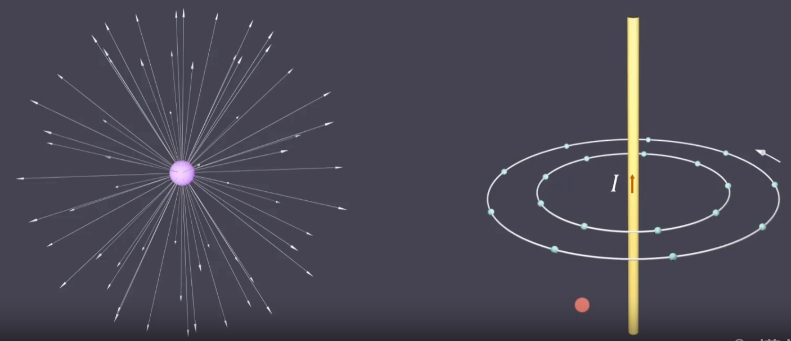