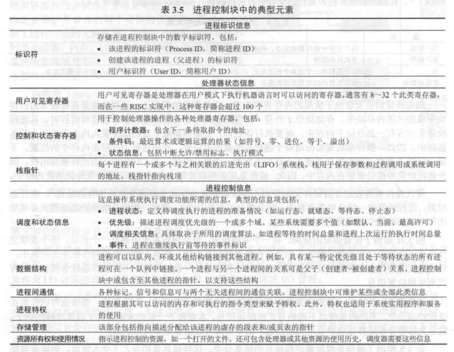

# 第一节 Process - 进程

## 一、What is a process? - 进程的概念

> 定义 - 进程(Process)：
>
> 进程是程序在一个数据集合上的**运行过程**，是系统进行资源分配和调度的一个独立单位。
>
> * A program in execution.  
>   正在运行的程序。
> * The entity that can be assigned to and executed on a processor.  
>   一个能被分配给处理器和被处理器执行的实体。
> * A unit of activity characterized by the execution of a sequence of instructions, a current state, and an associated set of system resoureces.  
> 由一组执行的指令、一个当前状态和一组相关的系统资源表征的活动单元。

进程的两个基本元素：

* **程序代码**(Program code)
* 与代码相关联的**数据集**(Set of data)

> 区别 - 进程(Process)、程序(Program)与任务(task)：
>
> * Program：偏向静态
> * Process：偏向动态，是由程序运行后所建立的，与task, job, APP类似。
> * Task：是一个抽象的概念，指的是要完成的某个任务。  
>   比如启动杀毒软件就是想完成“查杀病毒”这个任务；按鼠标左键就是想完成“单击”这个任务。  
>   一个进程可能执行若干个任务，一个任务也可能由若干个进程完成。

进程的基本元素(Elements)：

* Identifier(ID) - 标识符
* **State** - 状态
* Priority - 优先级
* Program counter - 程序计数器  
  程序中即将执行的**下一条指令的地址**。
* Memory pointers - 内存指针
* Context data - 上下文数据  
  进程执行时处理器的寄存器中的数据。
* I/O status information - I/O状态信息
* Accounting information - 记账信息  
  处理器时间总和、使用的时针数总和、时间限制等。

上述信息存储在一个称为“**进程控制块**”(Process Control Block/PCB)的数据结构中，  
其由操作系统创建、分配和管理。  
*具体的PCB可以查看下面[进程的控制结构](#2-process-control-structures---进程的控制结构)。*

可以说：进程由“程序代码(Program code)和相关数据(Associated data)”及“进程控制块(Process control block/PCB)”组成。

## 二、Process States - 进程的状态

若将进程执行的指令序列（地址）列出，可描述单个进程的行为，称为进程**轨迹**(trace)。

当对于一个处理器，给出其各个进程轨迹的交替方式，就可以描述**处理器的行为**。

*注：其中的Dispatcher为调度程序，负责调度进程。*

### 1. Two-State Process Model - 两状态进程模型

1. 运行状态模型
   * Running - 运行态：正在占用处理器
   * Not running - 非运行态

   两种状态可以通过"Dispatch"（调度）和"Pause"（暂停）来转换。
     
2. 队列模型  
   类似于运行状态模型，不过非运行态为一个队列。
     

### 2. Creation and Termination of Process - 进程的创建和终止

#### (1) 进程的创建(Creation)

创建的原因：

  

创建的方式中，由一个进程引发另一个进程的创建很有用，这个行为称为“**进程派生**”(Process spawning)。

* Process spawning  
  由原有的一个进程派生出来。
  * Parent process - 父进程
  * Child process - 子进程

进程派生为显示的请求。

#### (2) 进程的终止(Termination)

结束的原因：  
  

### ⭐3. Five-State Model - 五状态模型

将两状态模型完善成五种状态：

* **New** - 新建态
* **Ready** - 就绪态
* **Running** - 运行态
* **Blocked** - 阻塞态
* **Exit** - 退出态

转化的方式：

* **Admit** (New → Ready) - 加载  
  新进程准备好被再接纳时发生。
* **Dispatch** (Ready → Running) - 调度
* **Event wait** (Running → Blocked) - 等待时间  
  进程请求其必须**等待某些事件**时（发生IO事件、无法得到某服务、无法得到资源）发生。
* **Event occurs** (Blocked → Ready) - 发生事件  
  所等待时间发生后。
* **Timeout** (Running → Ready) - 超时  
  正在运行的进程运行时间过长，超过了“允许不中断执行”的最大时限。  
  或者进程B优先级高于进程A，则中断A将B放入运行态。此时称操作系统**抢占**(Preempted)了进程A。
* **Release** (Running → Exit) - 释放

五状态的队列模型如下：
  
由于引起阻塞的原因不同，所以阻塞队列也会分为多种事件队列。

### 4. Suspended Process - 进程的挂起（七状态模型）

因为内存可能不够，不能放下更多的进程，  
但进程又被创建出来，因此需要处理。

方法为：  
将Blocked内的部分进程，**放入Suspend(挂起)队列**中，  
此时进程储存在磁盘(Disk)当中，从而释放了内存。

但也存在一定问题，  
因此提出了更完善的七状态图。

多出来的常用转化方式：

* **Suspend** (Blocked → Blocked/Suspend) - 阻塞换出（挂起）  
  需要腾出空间时，则优先挂起一定的阻塞进程。
* **Suspend** (Ready) → Ready/Suspend) - 就绪换出（挂起）  
  如果释放足够空间的唯一方法只能是挂起就绪态的进程，则也可以挂起就绪态的进程。  
  同时，如果计算机确定某一个高优先级阻塞态进程很快就绪，则也会挂起低优先级就绪态进程。
* **Event occurs** (Blocked/Suspend → Ready/Suspend)  
  等待时间发生，则阻塞挂起态的进程可转到就绪挂起态。
* **Activate** (Ready/Suspend → Ready) - 就绪换入（激活）  
  没有就绪态时，则可以从就绪暂挂态调入一个进程。  
  或者就绪暂挂态中存在更高优先级的，也会跟就绪态交换。
* **Admit** (New → Ready&Ready/Suspend) - 加载

其他的特殊的转化方式：

* **Activate** (Blocked/Suspend → Blocked) - 阻塞换入（激活）  
  这个转化很少见，因为进程不在内存中并且未准备好执行，将它调入并没有意义（照样不会执行）。  
  一般都会就绪换入。
  但如果存在优先级更高，且操作系统相信很快就会执行，则也会这样转化。
* **Suspend** (Running → Ready/Suspend) - 运行换出（挂起）  
  这个也很少见，因为运行态一般会后退到就绪态。  
  但如果阻塞挂起态中，有较高优先级的进程不再被阻塞，此时操作系统则会抢占(Preempted)这个进程。  
  将该运行态的进程转化为就绪挂起态，为高优先级的阻塞挂起态进程释放内存空间。

---

挂起的原因：  

## 三、Process Description - 进程描述

操作系统控制计算机系统内部的事件、为处理系执行进程进行调度和分派、给进程分配资源、响应用户程序的基本服务请求。  
而要控制进程并管理资源，操作系统需要**知道进程以及系统的信息**。

### 1. OS Control Structures - 操作系统的控制结构

操作系统用来管理进程和资源，需要掌握这些信息，  
普遍采用的方法是：构造并维护其管理的每个实体的信息表。

操作系统维护的信息可以分为四种表：

1. Memory tables - 内存表  
   跟踪内存（主存）和外存（虚存）。
2. I/O tables - 设备表  
   I/O设备和通道。
3. File tables - 文件表  
   文件是否存在、文件在外存的位置。
4. **Primary process tables - 进程表**  
   进程表内是各个进程的进程印象。

### ⭐2. Process Control Structures - 进程的控制结构

操作系统管理控制进程，需要知道进程的**位置和属性**。  
为以下结构：

* ⭐**Process Image - 进程映像**  
  储存进程的**总体信息**（程序、数据、栈、属性）  
  包含下面四个方面：
  * User Program - 用户程序  
    待执行的程序。
  * User Data - 用户数据  
    用户空间中可修改部分。包括程序数据、用户栈区域和可修改的程序。
  * Stack - 栈  
    进程的一或多个栈，用于保存参数、过程调用与系统调用的地址。
  * ⭐**Process Control Block**(PCB) - 进程控制块  
    控制进程所需要的数据，为进程的**属性(Attributes)集**。
    * Process Identification(PID) - 进程标识符
      * Process ID - 进程的标识符
      * User ID - 用户标识符
      * Parent Process ID - 创建该进程的进程（父进程）的标识符
    * Processor State Information - 处理器信息状态  
      进程的**最基本信息**，出现在处理器寄存器中。
      * User-Visible Registers - 用户可见寄存器
      * Control and Status Registers - 控制和状态寄存器
        * Program counter - 程序计数器
        * Condition codes - 条件码
        * Status information - 状态信息
      * Stack Pointers - 栈指针
    * Process Control Information - 进程控制信息  
      操作系统控制和协调各种活动进程所需的**额外信息**。
      * Scheduling and State Information - 调度和状态信息
        * Process state - 进程状态
        * Priority - 优先级
        * Scheduling-related information - 调度相关信息
        * Event - 事件
      * Data Structuring - 数据结构
      * Interprocess Communication - 进程间通信
      * Process Privileges - 进程特权
      * Memory Management - 存储管理
      * Resource Ownership and Utilization - 资源所有权和使用情况

其中：**进程控制块**(PCB)是操作系统中最重要的数据结构，包含了操作系统所需进程的所有信息。  
可以用于隔离进程。

## 四、Process Control - 进程控制

### 1. Mode of Execution & Function of OS Kernel - 执行模式&内核功能

分为两种模式：

1. User Mode - 用户模式（非特权模式）
2. System Mode - 系统/控制/内核模式（特权模式）

一般进程都运行在用户模式，  
当需要调用内核功能时，则要切换到内核模式，称为⭐**模式切换(Mode switch)**。  
（如**进程切换**时，需要执行进程调度；则调用了内核功能，**会发生模式切换**）

---

**内核(OS Kernel)的典型功能**有下面四种：

1. 进程管理
2. 内存管理
3. I/O管理
4. 支持功能

> 拓展 - 原语(Primitive)：
>
> 内核的支持功能还包括原语的管理功能。  
> 原语则是原子性的操作(Atomic operation)，是最基本的操作，是**不可中断**的。  
> 如：
>
> * Process Switch - 进程切换
> * Process Create & Terminate - 进程创建与终止
> * Process Block & Wakeup - 进程阻塞与唤醒
> * Process Suspend & Active - 进程挂起与激活
>
> 操作系统内核的功能也是由原语来实现的。

### 2. Process Creation - 进程创建

进程创建的过程：

1. Assign a unique **PID** to the new process.  
   分配PID。
2. Allocate **space** for the process.  
   分配空间。

   包括进程映像中所有元素。
3. Initialize the **PCB**.  
   初始化进程控制块(PCB)。

   * 进程标识信息：进程ID和其他相关ID。
   * 处理器状态信息：多数初始化为0，除程序计数器和系统栈指针。
   * 进程控制信息：根据标准的默认值和该进程请求的特性初始化。
4. *Set the appropriate linkages.  
   设置正确的链接。
  
   对于某些操作系统，是将调度队列都维护为一个链表，此时需要设置链表。
5. *Create or expand other data structures.  
   创建或扩充其他数据结构。

   操作系统可能需要记账文件来评估进程性能。

### 3. Process Switching - 进程切换

进程切换指：操作系统中断(interrupt)一个正在运行的进程，将另一个进程置于运行模式，并把控制权交给后者。

#### (1) 何时切换进程

有以下三种机制（前两种为主要机制）：

1. **Interrupt - 中断**  
   与当前进程无关的某种**外部事件**相关。
   是一种正常的进程切换，此时原进程切换到Ready或Blocked中。

   * Clock interrupt - 时钟中断  
     即超时，执行时间超过最大允许时间段（时间片(Time Slice)）。
   * I/O interrupt - I/O中断  
     发生IO活动后，检测Blocked中是否有高优先级的进程，有的话则中断当前进程。
   * Memory fault - 内存失效  
     进程引用虚拟内存时，需要中断该进程进入Blocked中，直到调入内存的IO完成，切换为Ready。
2. **Trap - 陷阱**  
   与**当前进程**执行的指令相关。
   一般是程序出错，甚至发生致命问题时需要被切换，此时会尝试恢复原进程或直接切换到Exit中。
3. *Supervisor call - 系统调用  
   是显示请求(Explicit request)，通过调用操作系统函数发生。  
   如用户进程请求I/O操作（如打开文件），此时调用系统代码，则会将用户进程切换并置为Blocked。

#### (2) ⭐切换过程

1. **Save the context** of the processor (program counter & other registers).  
   保存处理器上下文，包括程序计数器和其他寄存器。
2. **Update the PCB** of the process currently in the Running state (process state & other relevant fields).  
   更新当前位于运行态进程的PCB，包括更改状态和其他相关信息（切出Running的原因、记账信息）
3. **Move the PCB** of the process to the appropriate **queue**.  
   将该进程的PCB移到相应队列（Ready/Blocked/etc.)
4. **Select another process** for execution.  
   调度另一个进程执行。
5. **Update the PCB** of the process selected (process state).  
   更新所选进程的PCB，包括更改状态为Running。
6. Update memory management data structures.  
   更新内存管理数据结构。
7. **Restore the context** of the processor.  
   载入被选中进程的程序计数器和其他寄存器的相应值（该进程之前也可能被切换）。

## 五、Execution of the OS - 操作系统的执行

由于**操作系统也是软件**，需要由处理器执行，  
并且操作系统会频繁地**释放控制权**，并依赖与处理器恢复控制权，  
所以针对操作系统如何执行控制，其是否也是普通的一个进程，有以下的说法。

### 1. Nonprocess Kernel - 无进程内核

*也就是不将操作系统当成跟普通程序一样的进程。*

关键是：进程这一概念仅适用于用户程序，操作系统代码则是**在特权模式下单独运行的实体**。

### 2. Execution within User Process - 在用户进程内运行

在用户进程的上下文中执行所有操作系统软件。  
操作系统是用户调用的一组例程，**在用户进程的环境**内执行各种功能。

操作系统代码和数据位于“共享地址空间”(Shared address space)中，**被所有用户进程共享**。  
虽然操作系统例程在用户进程环境执行，但**用户也不能篡改或干涉操作系统例程**。

### 3. Process-Based OS - 基于进程的操作系统

*就是直接把操作系统作为一组系统进程实现。*

主要的内核功能(Kernel functions)被**组织为独立的进程**。
