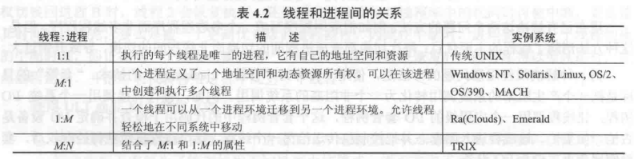
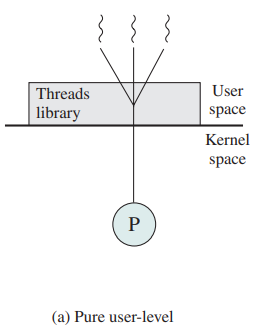
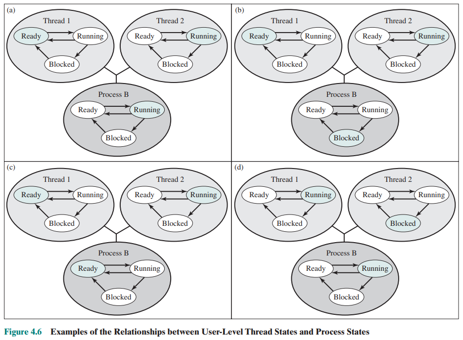
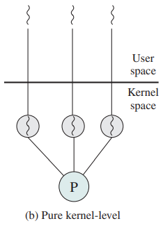
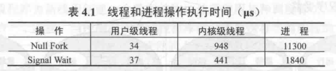
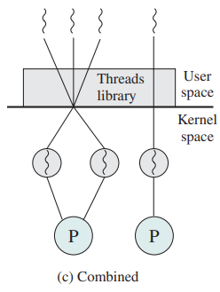
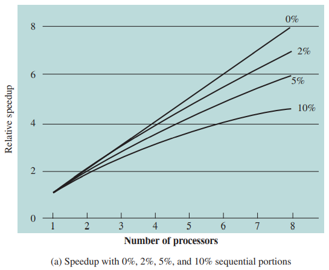
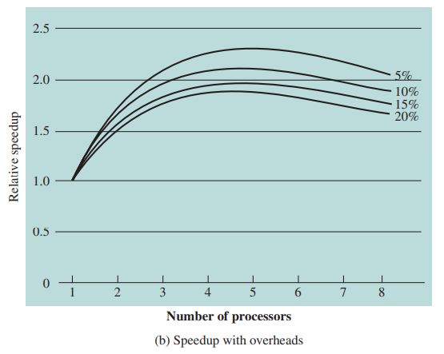
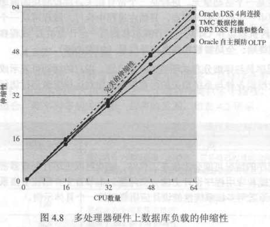

# 第二节 Thread - 线程

一个程序通常由若干个函数(function)构成，  
每个函数功能所需资源、执行方式等均不相同，  
若放在一个进程中串行处理会导致利用率低，各功能之间相互限制，  
因此考虑将每个独立功能分开。

但一个进程互相是隔离的，资源不互通，  
不能将每个功能分为一个进程。

因此提出线程概念，  
其来自于一个进程，资源共享，但执行是分开的。

## 一、Processes and Threads - 线程和进程

进程具有两个特点：

* Resource ownership - 资源所有权  
  进程包括存放[进程映像](../1.%20Process/2.1-Pocess_Management-1.md#⭐2-process-control-structures---进程的控制结构)(Process Image)的虚拟地址空间，以及拥有对其所拥有的资源的控制权和所有权，包括内存、I/O通道、I/O设备、文件等。
* Scheduling/execution - 调度/执行  
  进程执行时采用一个或多程序的执行路径，不同进程的执行过程会交替执行。  
  因此进程具有执行态(Ready, Running等)，和分配给其的优先级(Priority)。

这两个特点独立，因此操作系统可以分别处理两者。  
为了区分两个特点，可以分别称呼为如下形式：

* 将拥有资源所有权的单位，称为“进程”或“任务”(task)
* 将分派（即调度/执行特点）的单位，称为“线程”或“轻量级进程”(Light Weight Process, LWP)。

### 1. Single-thread/Multithreading - 单线程/多线程

* 多线程：  
  The ability of an OS to support **multiple, concurrent paths of execution** within **a single process**.  
  操作系统在**单个进程**内支持**多个并发执行路径**的能力。
* 单线程：每个进程中仅执行单个线程。

对于不同操作系统：

* MS-DOS：支持单用户进程和单线程。
* 各种版本的UNIX：支持多用户进程，但每个进程仅支持一个线程。
* Java运行时环境：为单进程多线程。
* Windows、Linux：每个进程都支持多个线程（多进程多线程）  
  > 拓展 - Windows、Linux实际的进程线程支持：  
  >
  > 根据[电子科大的课程](https://www.bilibili.com/video/BV15E411w7GB?p=37)(3:11)讲述，  
  > Windows和Linux实际上是单进程多线程，只有一个初始化进程`init`，  
  > 其他所有的进程实际上都是该进程的线程。

### 2. Difference between Process&Thread - 进程和线程的区别

多线程环境中，进程定义为“资源分配单元”(Resource allocation)和一个“保护单元”(Protection)，  
**与进程相关联的有**：

* A virtual address space that holds the process image.  
  容纳**进程映像**的虚拟地址空间。
* Protected access to processors, other processes (for interprocess communication), files, and I/O resources. (devices and channels)  
  对处理器、其他进程（用于进程间通信）、文件和IO资源（设备和通道）的**受访问保护**。

一个进程可能有一个或多个线程，  
**与线程相关的有**：

* A thread **execution state**. (Running, Ready, etc.)  
  一个线程的**执行状态**（运行、就绪等）。
* A saved **thread context** when not running; one way to view a thread is as an independent program counter operating within a process.  
  线程未运行时，保存的“**线程上下文**”。  
  线程可视为在进程内运行的一个独立程序计数器。
* An **execution stack**.  
  一个**执行栈**。
* Some per-thread **static storage** for local variables.  
  用于存放局部变量的一些**静态存储空间**。
* Access to the **memory and resources** of its process, shared with all other threads in that process.  
  与进程内**其他线程共享的内存和资源**的访问。

  
可以看出**单线程和多线程的区别**：

* 单线程：  
  * **进程**一起包含了**用户空间地址**、**PCB**、执行中管理调用/返回行为的**用户栈**和**内核栈**。
  * 进程运行时，**处理器寄存器**由该**进程控制**；未运行时，保存处理器寄存器的内容。
* 多线程：  
  * **进程只有**一个**用户空间地址**和**PCB**。
  * 每个**线程会有**许多**单独的栈和线程控制块**(Thread control block, TCB)，TCB中包含寄存器值、优先级和其他与线程有关的信息。
  * 所有线程**共享该进程的状态和资源**，都**驻留在同一地址空间**中，并可以**访问到相同数据**。  
    某线程改变了属于该进程的内存中某一数据时，其他线程都能看到该变化；某进程以读权限打开外部文件时，其他线程也可读。

> 拓展 - 线程与进程的关系
>
> 线程与进程之间存在1:1、1:m、m:1、n:m的关系，  
> 

### 3. Threads Advantages - 线程的优点

每个线程占用资源少，很容易**创建**、**终止**和**切换**，  
并且**提高了不同执行程序通信的效率**（进程之间通信要内核介入提供保护和通讯机制，而线程之间则不同）。

### 4. Threads Usage - 线程的用途

* 对于多处理器(Multiprocessor)系统：  
  Multiple threads in the same process can be executing simultaneously on different processors.  
  在同一进程的多个线程，可以被不同的处理器同时处理。
* 对于单处理器(Uniprocessor)系统：  
  To simplify the structure of a program that is logically doing several different functions.  
  可以简化逻辑上从事几种不同工作的程序的结构。

单用户多处理器系统中使用线程的例子：

* Foreground and background work - 前台和后台工作  
  一个线程在前台读取用户输出输出结果，一个线程在后台执行用户命令并更新数据。
* Asynchronous processing - 异步处理  
  程序中异步元素可以用线程实现。比如自动保存功能，则可以创建一个周期保存数据的线程。
* Speed of execution - 执行速度  
  多线程可以边执行本批数据边读入下批数据。
* Modular program structure - 模块化程序结构  
  涉及多种活动或多种输入输出源和目的的程序，适合多线程操作。

### 5. Thread Functionality - 线程的功能

#### (1) Thread States - 线程状态

和进程一样，线程也存在三种状态：

* Ready - 就绪态
* Running - 运行态
* Blocked - 阻塞态

**挂起对于线程没有意义**，因为线程不占用资源，不能通过挂起线程释放资源，  
如果一个**进程被挂起**，**所有线程**也要被**换出**。

#### (2) Thread Operations - 线程操作

针对线程的三种状态，存在下面四种操作：

* **Spawn - 派生**
* **Block - 阻塞**
* **Unblock - 解除阻塞**
* **Finish - 结束**

对于KLT线程（下文将讲述）：若将一个线程阻塞，并不会阻塞整个进程，也就是不阻止其他线程运行。

#### (3) Thread Execution - 线程执行

需要执行以下三种任务：

* **Scheduling and dispatching** is done on a thread basis in an OS that supports threads.  
  对于支持线程的系统，**调度和分配**是在线程基本单元上完成的。
* Most of the **state information** dealing with execution.  
  许多**状态信息**与线程执行有关。
  * States are maintained in thread-level data structures.  
    状态由线程水平的数据结构维护。
  * Suspending a process involves suspending all threads of the process.  
    挂起一个进程，需要挂起所有线程。
  * termination of a process terminates all threads within the process.  
    结束一个进程，需要结束所有线程。
* **Synchronize**（同步） the activities of the various threads.  
  线程需要**同步**各种其他线程的活动，以使他们互相不干扰去且不破坏数据。  
  因为线程共用一个地址空间，一个线程对资源的任何修改都会影响同一进程其他线程的状态。

## 二、Types of Threads - 线程的分类

分为“**用户级线程**”(ULT)和“**内核级线程**”(KLT)。  
区别在于：**OS是否知道线程的存在**。

⚠注意：这里的用户和内核与之前的用户模式、内核模式等概念不一样。  
这里指的是内核对线程的知情度，之前指的是一种权限模式。

### 1. User Level Thread(ULT) - 用户级线程

管理线程的所有工作都由应用程序（进程）完成，  
内核（OS）意识不到线程的存在，其只管理进程。

应用程序通过使用“线程库”(thread library)的各种“例程”(utility)，进行多线程的各种管理。  

因为OS不知道线程的存在，所以**不会改变线程的状态**。  
当进程发生状态改变时，线程状态不变，  
之后当进程重新Running时，则继续之前的线程状态运行。
> e.g. ULT调度：
>
> 
>
> 1. (a)图中，线程2进行了一个阻塞本进程的系统调用，  
>    此时控制权转交给内核，将B→Blocked，切换到另一进程，  
>    但此时**线程2仍处于Running**，**线程1仍处于Ready**！  
>    虽然实际上线程2不处于Running，但在线程库中看起来是Running。  
>    转化为图(b)。
> 2. (a)图中，本进程用完其时间片，则B→Ready，  
>    但**线程状态仍不变**。  
>    转化为图(c)
> 3. (a)图中，线程2要线程1执行某些动作时，  
>    则线程2→Blocked，线程1→Running。

* 优点：
  * 线程切换不需要[内核模式](../1.%20Process/2.1-Pocess_Management-1.md#1-mode-of-execution---执行模式内核功能)(System Mode)，节省了两次状态转换。
  * 可以为每个进程（应用程序），定制符合其需要的线程调度算法。
  * ULT可以直接在任何OS上运行，而不用修改内核底层。
* 缺点：
  * 线程阻塞，一般都会**阻塞其他线程**，失去了线程的灵活性。
  * **不能利用多处理技术**。因为每个进程只分配一个处理器，只能执行一个线程；而不能分配多个处理器同时执行该进程若干个线程。
* 改进：
  * Jacketing - 管套：  
    把一个产生系统阻塞的调用，转化为非阻塞的系统调用。

拓展：ULT中线程**不会创建TCB**（TCB是内核用于管理线程的，但内核都不知道线程）。

### 2. Kernel Level Thread(KLT) - 内核级线程

管理线程的所有工作都由内核完成，  
OS知道线程的存在，既管理进程也管理线程。

应用级没有线程管理代码，只有一个到内核线程设施的API接口。

因此克服了ULT方法的两个缺点。

* 优点
  * 一个线程阻塞，可以调度另一个线程，因此其他线程不会被阻塞。
  * 内核可以把同一个进程的多个线程，调度到不同处理器中
  * 内核自身也可以是多线程的。
* 缺点
  * 跟ULT的**速度有数量级上的差距**。
      
    *注：Null Fork为派生开销、Signal Wait为同步时间。*

### 3. Combined Approaches - 混合方法

就ULT和KLT混合。

线程创建在用户空间完成，调度和同步也在应用程序进行，  
对于一个应用程序中的多个ULT，会被映射到一些KLT上。

采用该方法，可以结合纯ULT与纯KLT的优点，并克服它们的缺点。

## 三、Multicore → Multithread - 多核与多线程

介绍在多核系统上，运行多线程带来的软件性能提升。

提升性能用**加速比**(Speedup)来表示，运用“Amdahl定律”定义：
> 定义 - Amdahl定律：
>
> Amdahl’s Law​：
> $$
> \text{Speedup}=\frac{\textrm{在单个处理器执行时间}}{\textrm{在N个并行处理器执行时间}}=\frac{1}{(1-f)+\frac{f}{N}}
> $$
> 其中$f$为并行度，$N$为处理器个数。
>
> 则$1-f$部分表示代码本质上串行执行部分；$f$则为并行部分，无限并行且没有调度开销。

当不考虑额外开销时，可以得到如下函数图像：  
  
*注：线上的百分比表示的是$1-f$，为串行度。*  
可以看到：即便有一小部分是串行，都能显著影响性能。

当考虑额外开销后，函数图像会出现峰值：  
  
可以看到：考虑多处理器任务调度和通信等开销后，核数达到一定程度后再增加，性能提升反而下降。  
*【即核数并不是越多越好……*

但通过一些措施，可以降低这些性能影响。
> e.g. 数据库管理系统：
>
>   
> 可以看出：数据库管理系统能有效利用多核系统，

可以从多核系统受益的应用程序：

* Multithreaded native applications - 原生多线程应用程序
* Multiprocess applications - 多进程应用程序
* Java applications - Java应用程序
* Multiinstance applications - 多实例应用程序

## 四、Linux Process/Thread - Linux的进程线程管理

老版本的Linux内核不支持多线程，因此需要应用程序自己去实现，  
即编写一套用户级线程程序库，将**所有线程**由一个单独的**内核级进程管理**。  
著名的为“pthread”库。  
*即为标准的UTL线程。*

现代的Linux不再区分进程和线程，  
组成一个用户级进程的多个用户级线程，映射到一个用户的内核级进程。  
*即对应上面拓展提到的，Linux实际为一个进程多个线程的模式。*

### 1. Linux Process(task) Model - Linux的进程状态图

*注：Linux下，Process与task为同一概念。*  
*因此其也称多任务操作系统。*

存在以下几种状态：

* Running - 运行  
  对应两种状态，要么在被执行，要么将被执行。
  * Ready - 就绪
  * Executing - 执行
* *Blocked（原本没有这么区分，但个人在这里这样分类）*
  * Interruptible - 可中断  
    标准的阻塞：等待事件结束、可用资源、其他进程信号。
  * Uninterruptible - 不可中断
    与“可中断”不同的是：等待的是一个硬性条件，因此不接受任何信号（个人理解为如`sleep()`这样的阻塞）。
* Stopped - 停止  
  进程被中止，且只能由另一个进程主动动作来恢复（如被调试的进程）。
* Zombie - 僵死  
  进程已中止，但因为某些原因，进程表中仍有其任务结构。

### 2. Linux Thread Library - Linux的线程库

一般都是“Pthread Library”.

主要函数：

* `pthread_create()`
* `pthread_exit()`
* `pthread_join()`
* `pthread_yield()`
* `pthread_attr_init()`
* `pthread_attr_destory()`

## Summary

* Process → Resource Ownership  
  进程对应“资源所有”。
* Thread → Program Execution  
  线程对应“程序执行”。
* User-level Thread
  * Created and managed by a threads library that runs in the user space of a process.  
    被运行在用户空间的某进程的线程库所创建和管理。
  * A mode switch is not required to switch from one thread to another.  
    当从一个线程切换到另一个线程，不需要进行[模式切换](../1.%20Process/2.1-Pocess_Management-1.md#1-mode-of-execution---执行模式内核功能)。
  * Only a single user-level thread within a process can execute at a time.  
    同一时间只能运行一个进程的一个线程（因为一个进程只能分配一个处理器）。
  * if one thread blocks, the entire process is blocked.  
    如果某进程内一个线程被阻塞，整个进程与其线程都被阻塞。
* Kernel-level Thread
  * Threads within a process that are maintained by the kernel.  
    进程中的线程被内核管理。
  * A mode switch is required to switch from one thread to another.  
    当从一个线程切换到另一个线程，需要模式切换。
  * Multiple threads within the same process can execute in parallel on a multiprocessor.  
    一个进程的多个线程，可以同时被多处理器执行（因为一个进程的多个线程都可以分配处理器）。
  * Blocking of a thread does not block the entire process.  
    阻塞一线程不会影响到其他进程。
