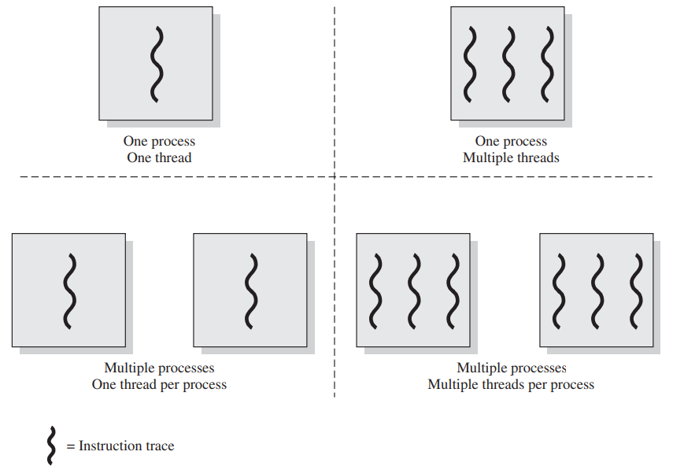
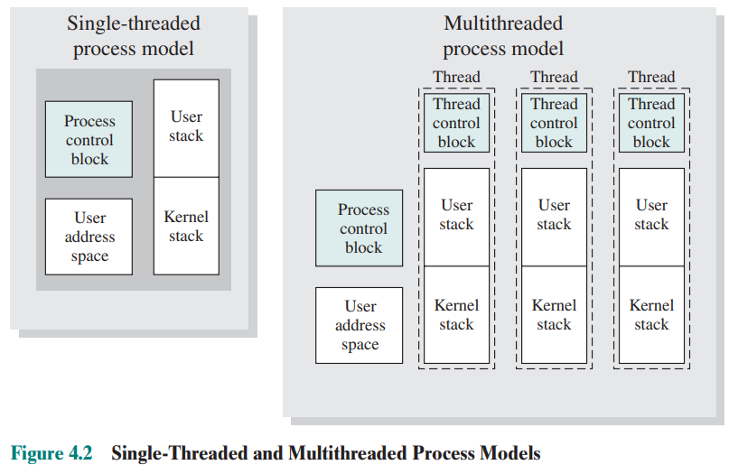

# 第二节 Thread - 线程

一个程序通常由若干个函数(function)构成，  
每个函数功能所需资源、执行方式等均不相同，  
若放在一个进程中串行处理会导致利用率低，各功能之间相互限制，  
因此考虑将每个独立功能分开。

但一个进程互相是隔离的，资源不互通，  
不能将每个功能分为一个进程。

因此提出线程概念，  
其来自于一个进程，资源共享，但执行是分开的。

## 一、Processes and Threads - 线程和进程

进程具有两个特点：

* Resource ownership - 资源所有权  
  进程包括存放[进程映像](../1.%20Process/2.1-Pocess_Management-1.md#⭐2-process-control-structures---进程的控制结构)(Process Image)的虚拟地址空间，以及拥有对其所拥有的资源的控制权和所有权，包括内存、I/O通道、I/O设备、文件等。
* Scheduling/execution - 调度/执行  
  进程执行时采用一个或多程序的执行路径，不同进程的执行过程会交替执行。  
  因此进程具有执行态(Ready, Running等)，和分配给其的优先级(Priority)。

这两个特点独立，因此操作系统可以分别处理两者。  
为了区分两个特点，可以分别称呼为如下形式：

* 将拥有资源所有权的单位，称为“进程”或“任务”(task)
* 将分派（即调度/执行特点）的单位，称为“线程”或“轻量级进程”(Light Weight Process, LWP)。

### 1. Single-thread/Multithreading - 单线程/多线程

* 多线程：操作系统在**单个进程**内支持**多个并发执行路径**的能力。  
* 单线程：每个进程中仅执行单个线程。

对于不同操作系统：

* MS-DOS：支持单用户进程和单线程。
* 各种版本的UNIX：支持多用户进程，但每个进程仅支持一个线程。
* Java运行时环境：为单进程多线程。
* Windows、Linux：每个进程都支持多个线程（多进程多线程）

### 2. Difference between Process&Thread - 进程和线程的区别

多线程环境中，进程定义为“资源分配单元”(Resource allocation)和一个“保护单元”(Protection)，  
**与进程相关联的有**：

* A virtual address space that holds the process image.  
  容纳**进程映像**的虚拟地址空间。
* Protected access to processors, other processes (for interprocess communication), files, and I/O resources. (devices and channels)  
  对处理器、其他进程（用于进程间通信）、文件和IO资源（设备和通道）的**受访问保护**。

一个进程可能有一个或多个线程，  
**与线程相关的有**：

* A thread execution state. (Running, Ready, etc.)  
  一个线程的**执行状态**（运行、就绪等）。
* A saved thread context when not running; one way to view a thread is as an independent program counter operating within a process.  
  线程未运行时，保存的“**线程上下文**”。  
  线程可视为在进程内运行的一个独立程序计数器。
* An execution stack.  
  一个**执行栈**。
* Some per-thread static storage for local variables.  
  用于存放局部变量的一些**静态存储空间**。
* Access to the memory and resources of its process, shared with all other threads in that process.  
  与进程内**其他线程共享的内存和资源**的访问。

  
可以看出**单线程和多线程的区别**：

* 单线程：  
  * **进程**一起包含了**用户空间地址**、**PCB**、执行中管理调用/返回行为的**用户栈**和**内核栈**。
  * 进程运行时，**处理器寄存器**由该**进程控制**；未运行时，保存处理器寄存器的内容。
* 多线程：  
  * **进程只有**一个**用户空间地址**和**PCB**。
  * 每个**线程会有**许多**单独的栈和线程控制块**(Thread control block, TCB)，TCB中包含寄存器值、优先级和其他与线程有关的信息。
  * 所有线程**共享该进程的状态和资源**，都**驻留在同一地址空间**中，并可以**访问到相同数据**。  
    某线程改变了属于该进程的内存中某一数据时，其他线程都能看到该变化；某进程以读权限打开外部文件时，其他线程也可读。

### 3. Threads Advantages - 线程的优点

每个线程占用资源少，很容易**创建**、**终止**和**切换**，  
并且**提高了不同执行程序通信的效率**（进程之间通信要内核介入提供保护和通讯机制，而线程之间则不同）。

### 4. Threads Usage - 线程的用途

* 对于多处理器(Multiprocessor)系统：  
  Multiple threads in the same process can be executing simultaneously on different processors.  
  在同一进程的多个线程，可以被不同的处理器同时处理。
* 对于单处理器(Uniprocessor)系统：  
  To simplify the structure of a program that is logically doing several different functions.  
  可以简化逻辑上从事几种不同工作的程序的结构。

单用户多处理器系统中使用线程的例子：

* Foreground and background work - 前台和后台工作  
  一个线程在前台读取用户输出输出结果，一个线程在后台执行用户命令并更新数据。
* Asynchronous processing - 异步处理  
  程序中异步元素可以用线程实现。比如自动保存功能，则可以创建一个周期保存数据的线程。
* Speed of execution - 执行速度  
  多线程可以边执行本批数据边读入下批数据。
* Modular program structure - 模块化程序结构  
  涉及多种活动或多种输入输出源和目的的程序，适合多线程操作。

### 5. Thread Functionality - 线程的功能

#### (1) Thread States - 线程状态

和进程一样，线程也存在三种状态：

* Ready - 就绪态
* Running - 运行态
* Blocked - 阻塞态

**挂起对于线程没有意义**，因为线程不占用资源，不能通过挂起线程释放资源，  
如果一个**进程被挂起**，**所有线程**也要被**换出**。

#### (2) Thread Operations - 线程操作

针对线程的三种状态，存在下面四种操作：

* **Spawn - 派生**
* **Block - 阻塞**
* **Unblock - 解除阻塞**
* **Finish - 结束**

若将一个线程阻塞，并不会阻塞整个进程，也就是不阻止其他线程运行。

#### (3) Thread Execution - 线程执行

需要执行以下三种任务：

* Scheduling and dispatching is done on a thread basis in an OS that supports threads.
  对于支持线程的系统，调度和分配是在线程基本单元上完成的。
* Most of the state information dealing with execution.  
  许多状态信息与线程执行有关。
  * States are maintained in thread-level data structures.  
    状态由线程水平的数据结构维护。
  * Suspending a process involves suspending all threads of the process.  
    挂起一个进程，需要挂起所有线程。
  * termination of a process terminates all threads within the process.  
    结束一个进程，需要结束所有线程。
* Synchronize（同步） the activities of the various threads.  
  线程需要同步各种其他线程的活动，以使他们互相不干扰去且不破坏数据。  
  因为线程共用一个地址空间，一个线程对资源的任何修改都会影响同一进程其他线程的状态。

## 二、线程的分类

分为用户级线程(ULT)和内核级线程(KLT)。  
区别在于：OS是否知道线程的存在。

注意：这里的用户和内核与之前的用户模式、内核模式等概念不一样。  
这里指的是内核对线程的知情度，之前指的是一种权限模式。

### 1. User Level Thread(ULT) - 用户级线程

管理线程的所有工作都由应用程序（进程）完成，  
内核（OS）意识不到线程的存在，其只管理进程。

应用程序通过使用“线程库”(thread library)的各种“例程”(utility)，进行多线程的各种管理。

缺点：  
进程被挂起，线程也会被挂起。

改进：

* Jacketing

### 2. Kernel Level Thread(KLT) - 内核级线程

OS知道线程的存在。  
OS既管理进程也管理线程。

缺点：  
跟ULT的速度有数量级上的差距。

### 3. Combined Approaches - 混合方法

## 三、Multicore/Multithread - 多核与多线程

### 1. 多核系统上的软件性能

Amdahl’s Law​：
$$
$$

可以从多核系统受益的应用程序：

* Multithreaded native applications - 原生多线程应用程序
* Multiprocess applications - 多进程应用程序
* Java applications - Java应用程序
* Multiinstance applications - 多实例应用程序

## 四、Linux Process/Thread - Linux的进程线程管理

### 1. Linux Process/Thread Model - Linux的进程线程状态图

* Running
* Ready
* Interruptible - 可中断
* Uninterruptible - 不可中断
* Stopped - 停止
* Zombie - 僵死

### 2. Pthread Library - Linux的线程库

* `pthread_create()`
* `pthread_exit()`
* `pthread_join()`
* `pthread_yield()`
* `pthread_attr_init()`
* `pthread_attr_destory()`

## Summary

* ULT&KLT
