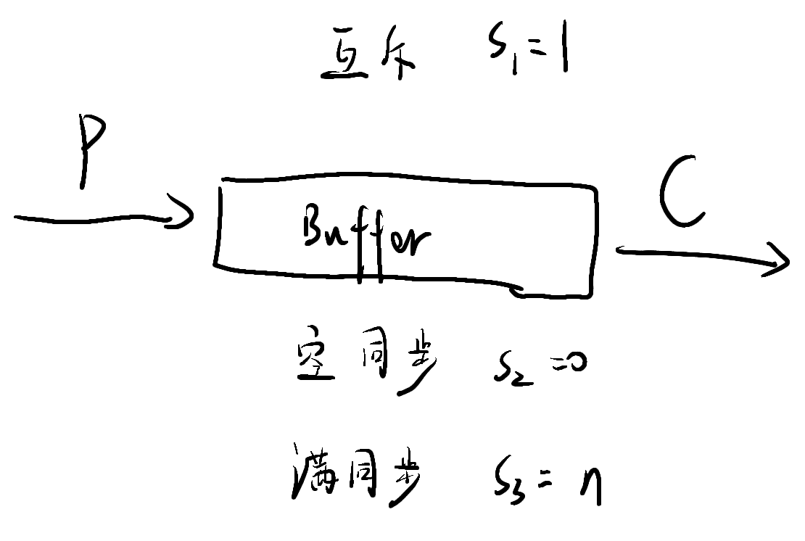
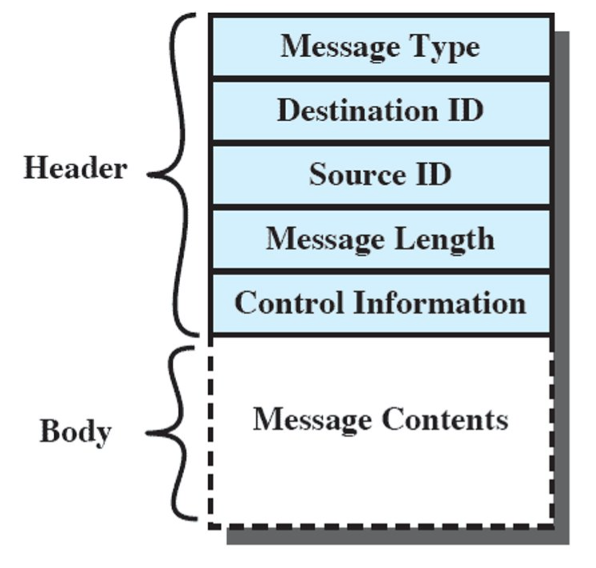

# 第三节 Concurrency: Mutual Exclusion and Synchronization - 并发性：互斥和同步

在多道程序(Multiprogramming)间，进程间不仅只有“争夺处理器资源”的关系，  
其间还可能存在同步、通信。

并发的基本需求就是加强“**互斥**”(Mutual Exclusion)的能力，  
使得一个进程在活动期间，具有排斥所有其他进程的能力。

进程间的关系：

* 独立
* 竞争
* 合作
  * 直接合作 - 进程之间可以相互通信。
  * 间接合作 - 进程之间相互不知晓。

## 一、Principles of Concurrency - 并发的原理

不能通过控制进程的顺序，来确定多个进程的结果。  
因为结果取决于以下三方面：

* Activities of other processes
* The way the OS handles interrupts​
* Scheduling policies of the OS​

因此OS需要保证：可重现性。  
即只保证进程每次运行都得到确定的需要结果，  
而忽略进程执行顺序。

### 2. Race Condition - 竞争条件

发生在多个进程或线程读写数据时，  
此时由最后执行（竞争“失败者”）的进程，决定最终的数据。

### 3. OS Concerns - 操作系统关注的问题

需要关注以下问题：

* be able to keep track of various processes​
* allocate and de-allocate resources for each active process​
* protect the data and physical resources of each process against interference by other processes​
* ensure that the processes and outputs are independent of the processing speed​

### 4. Process Interaction - 进程的交互

### 5. Mutual Exclusion - 互斥

当一个数据正在被操作的时候，不希望别的进程再操作它。  
方法可以为“上锁”。

* Critical Section - 临界区  
  一段需要被保护的代码。

对于互斥的机制，需要满足以下要求：

* Must be enforced​
* A process that halts must do so without interfering with other processes​
* No deadlock or starvation​
* A process must not be denied access to a critical section when there is no other process using it （进步）​
* No assumptions are made about relative process speeds or number of processes​
* A process remains inside its critical section for a **finite time**.  
  一个进程驻留在临界区的时间必须有限（否则可能进程异常结束，则一直被上锁）。

> 举例 - Petersons Algorithm​：
>
>   
> 是针对进程`i`的一个代码描述。
>
> 其中`while`的作用就是使进程`i`处于等待，  
> 直到`j`不再需要互斥，或者不再被执行。

### 6. Mutual Exclusion Tools - 互斥的工具

分为硬件支持和软件支持：

* Hardware Support
  * Interrupt
  * Machine instruction
* Software Support
  * ⭐**Semaphore** - 信号量
  * Monitor - 管程
  * Message - 消息传递

## 二、互斥：硬件的支持

### 1. Interrupt

为了保证互斥，只要让该进程不被中断即可。

### 2. Special Machine Instructions​ - 特殊机器指令

主要是`compare`和`swap`指令。

* 优点
  * 容易实现
  * 可用在多处理器上
* 缺点
  * 忙等待
  * 可能发生饥饿
  * 可能发生死锁

## 三、Semaphore - 信号量

信号量本质上是一个数据结构，  
可视为一个整形变量，并包含三个操作：

1. 初始化为非负数。
2. `semWait` - 使信号量减1。  
   若值$<0$，阻塞该进程。
   用来接受信号。
3. `semSignal` - 使信号量加1。  
   若值$\le0$，`semWait`阻塞的进程解除阻塞。  
   用来传输信号。

根据排队的过程顺序，还可以分类为：

* Strong Semaphores ​- 强信号量
* Weak Semaphores ​- 弱信号量

「图」
体现对资源的同步使用，而不是互斥。
*互斥：用完后还要释放。*

### 2. 例题 - 生产消费者问题

* 生产者：产生某种类型的数据，并存放到buffer（缓冲区）中。
* 消费者：从buffer中取数据。

存在限制条件：

* 每次只能有一方，对buffer进行操作。（因此是互斥问题）
* buffer满时，生产者不能再操作（生产）；buffer空时，消费者不能再操作（消费）（因此存在同步）。



```c++
void producer()
{
  while (true)
  {
    produce();
    semWait(e);
    semWait(s);
    append();
    semSignal(s);
    semSignal(n);
  }
}
```

信号量`s`之间存在同步。

### 3. 例题 - 读者写者问题

类似于生产消费者问题，  
但多个读者之间可以同时访问buffer。

存在问题：  
若一直存在读者在读，则无法写入。  
因此分歧在于：读者写者同时到达，谁的优先级更高。

#### (1) Readers Have Priorty - 读者优先

```c++
int readCount; // 全局变量 - 读者数目
semaphore x = 1, wsem = 1; // x - readCount; wsen - 读者锁
void reader()
{
  while (true)
  {
    semWait(x); // 先对readcound加锁
      readCount++;
      if (readCount == 1) semWait(wsem); // 存在读者，加上读者锁
    semSignal(x);
    READUNIT();
    semWait(x); // 读完需要修改readCount,故又要加锁
      readCound--;
      if (readCount == 0) semSignal(wsem);
    segSignal(x);
  }
}
```

## 四、Monitors - 管程

比信号量更负责，控制能力更强。

让**本地的一些数据**，只能被**管程内部的函数**访问处理。  
进程要访问管程，必须要调用管程内部的过程。

每一次管程只能被一个进程访问，故**天然互斥**。  
不同于信号量，需要手动加锁解锁。

### 1. Synchronization - 同步结构

* 数据：
  * `c` - Condition variables
  * $c_i$ - 条件等待队列
* 操作：
  * `cwaitt(c)`
  * `csignal(c)`

Producer $i$即是各种函数。

### 2. 管程例题 - 生产消费者问题

```c++
void producer()
{
  char x;
  while (true)
  {
    produce(x); // 与buffer无关，是独立的，因此不是管程内部的Producer
    append(x);
  }
}
```

管程部分：

```c++
```

## 五、Message Passing - 信号传递

除了同步之外，还能实现消息的交换。

原语：

* `send(des, msg)` - 发送
* `receive(src, msg)` - 接受

需要考虑：

* Synchronization - 同步
  * `send`
    * Blocking - 发送的时候阻塞
    * Nonblocking - 不阻塞
  * `receive`
    * Blocking
    * Nonblocking
* Address - 寻址
* Format
* Queueing Discipline

### 1. 同步

* 阻塞式
* 非阻塞式

一般采用非阻塞式发送、阻塞式接受。（发随便发，但确认需谨慎）

### 2. 寻址

* 直接寻址  
  收发地址都非常明确
* 间接寻址  
  有邮箱“Mailboxes”，作为中介，需要去邮箱发送接收。

### 3. 格式

Message的格式：  


### 4. 互斥的实现

用一个邮箱，内部存在一个“授权书”。  
哪个进程拿到这个授权书，便可以执行临界区，执行完后再放回。

### 5. 信号传递例题 - 生产消费者问题

buffer的容量是多少，则有多少份授权书。

## 六、小结

* Atomic operation - 原子操作  
  可以在任何一个原子操作中断，导致并发程序结果不同。
  正常情况下认为一条语句就是一个原子操作。
* Critical section - 临界区
* Deadlock - 死锁
* Livelock
* Mutual exclusion - 互斥
* Race condition - 竞争条件
* Starvation - 饥饿  
  只考虑信号量的话，一般都会发生饥饿。
