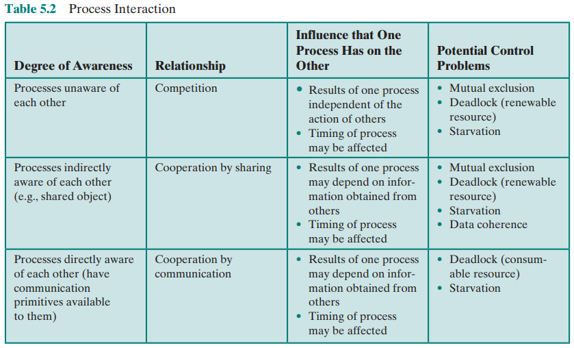
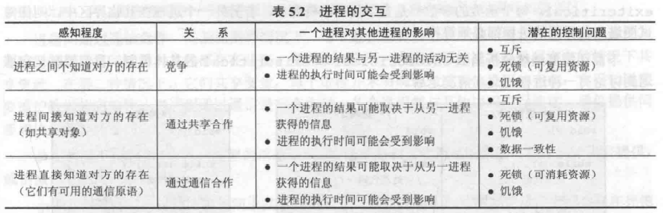
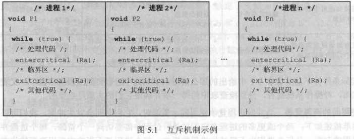
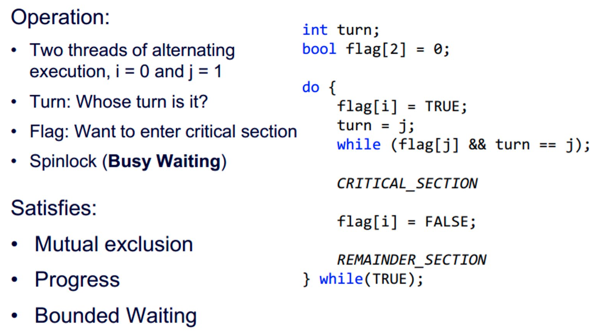
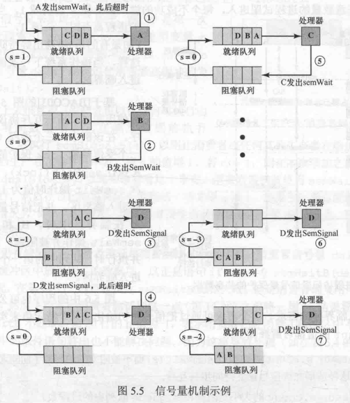
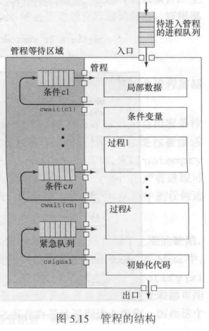

# 第三节 Concurrency: Mutual Exclusion and Synchronization - 并发性：互斥和同步

在多道程序(Multiprogramming)间，进程间不仅只有“争夺处理器资源”的关系，  
其间还可能存在同步、通信。

并发的基本需求就是加强“**互斥**”(Mutual Exclusion)的能力，  
使得一个进程在活动期间，具有排斥所有其他进程的能力。

进程间的关系：

* 独立
* 竞争
* 合作
  * 直接合作 - 进程之间通过进程ID，可以相互通信。
  * 间接合作 - 进程之间虽然相互不知晓，但通过共享资源（如I/O缓冲区）间接合作。

同时进程之间还会有**同步**(Synchronization)的数据。

本章的重点：用各种方法（信号量、管程等）来实现进程的**互斥和同步**。

## 一、Principles of Concurrency - 并发的原理

不能通过控制进程的顺序，来确定多个进程的结果。  
因为**结果取决于以下三方面**：

* Activities of other processes - 其他进程的活动
* The way the OS handles interrupts​ - OS处理中断的方式
* Scheduling policies of the OS​ - OS的调度策略

因此产生了不确定的结果(**Non-deterministic result**)，并造成以下**并发的困难**(**Difficulties of Concurrency**)：

* Sharing of global resources.  
  全局资源的共享。
* Difficult for the OS to manage the allocation of resources optimally.  
  OS难以对资源进行最优化分配。
* Difficult to locate programming errors as results are not deterministic and reproducible.  
  定位程序设计错误很困难。

因此OS需要保证：可重现性。  
即只保证进程每次运行都得到确定的需要结果，  
而忽略进程执行顺序。  
*具体见下面“OS Concerns”*。

### 1. Race Condition - 竞争条件

发生在多个进程或线程读写数据时，其最终结果取决于多个进程的指令执行顺序。  
此时由**最后执行**（竞争“失败者”）**的进程**，决定最终的数据。

利用如信号量之类的方法可以解决“竞争条件”。

### 2. OS Concerns - 操作系统关注的问题

需要**关注以下问题**：

* Be able to keep track of various processes​.  
  要能追踪不同的进程。（利用PCB可以实现）
* Allocate and de-allocate resources for each active process​.  
  能为每个活动进程分配和释放各种资源。
* Protect the data and physical resources of each process against interference by other processes​.  
  保护每个进程的数据和物理资源，避免被其他进程无意干扰。
* Ensure that the processes and outputs are independent of the processing speed​.  
  进程的功能、输出结果要与执行速度（指令执行顺序）无关，即上面的“可重现性”。

### 3. Process Interaction - 进程的交互

* Processes unaware of each other - 进程间互相不知道存在  
  为竞争关系，操作系统需要知道竞争情况。
* Processes indirectly aware of each other - 进程间间接知道对方存在  
  表现出合作关系。
* Processes directly aware of each other - 进程间直接知道对方存在  
  表现出合作关系。

 

#### (1) Competition among Processes for Resources - 进程间的资源竞争

当并发进程使用同一资源时，会出现资源竞争，  
竞争进程间存在三个控制问题：

* **Mutual exclusion** - 互斥
  * Critical resource - 临界资源：不可共享的资源（如打印机）
  * Critical section - 临界区：使用临界资源的那部分程序。
* **Deadlock** - 死锁
* **Starvation** - 饥饿

#### (2) Cooperation among Processes by Sharing - 进程间通过共享合作

必须确保共享数据的完整性(the **integrity** of the shared data)。

进程间指令的不同执行顺序可能导致数据不一致，需要注意，  
也可以采用前面的"Critical Section"方式来保护数据完整性，且该概念在这种合作下十分重要。

#### (3) Cooperation among Processes by communication - 进程间通过通信合作

各个进程都与其他进程进行连接，通信提供同步和协调各种活动的方法。

因为没有共享任何对象，不需要互斥，  
但仍存在死锁和饥饿的问题。

### 4. Mutual Exclusion - 互斥

当一个数据正在被操作的时候，不希望别的进程再操作它。  
方法可以为“上锁”等。

* **Critical Section - 临界区**  
  一段需要被保护的代码，**一个时间内只能有一个进程在**该临界资源的临界区。

为了实现互斥，可以采用如下两个抽象函数`entercritical`和`exitcritical`来抽象表示互斥。

  
具体实现机制将在后面讲解。

对于互斥的机制，需要满足以下要求：

* Mutual exclusion must be enforced​ - 必须**强制实施**互斥  
  Only one process at a time is allowed into its critical section among all processes that have critical sections for the same resource or shared object.  
  在与**相同资源**或**共享对象**的临界区有关的所有进程中，**一次只允许一个**进程进入临界区。
* A process that halts(停止) in its noncritical section must do so without interfering with other processes.  
  一个在非临界区停止的进程，**不能干涉**其他进程。
* No deadlock or starvation​.  
  **不能出现死锁饥饿**。
* A process must not be denied access to a critical section when there is no other process using it.  
  当**没有其他进程**使用临界资源时，需要进入临界区的资源能**立刻进入**。
* No assumptions(假定、限制) are made about relative process speeds or number of processes​.  
  对相关进程的**执行速度**和**处理器的数量没有任何要求限制**。
* A process remains inside its critical section for a **finite time**.  
  一个进程驻留在临界区的时间必须有限（否则可能进程异常结束，则一直被上锁）。

> (扩展)举例 - Petersons Algorithm​：
>
>   
> 是针对进程`i`的一个代码描述。
>
> 其中`while (flag[j] && turn == j);`的作用就是使进程`i`处于等待，  
> 直到`j`不再需要互斥，或者不再被执行。

### 5. Mutual Exclusion Tools - 互斥的工具

分为硬件支持和软件支持：

* *Hardware Support* -  硬件支持
  * Interrupt - 中断
  * Machine instruction - 机器指令
* Software Support - 软件支持
  * ⭐**Semaphore** - 信号量
  * Monitor - 管程
  * Message - 消息传递

## *二、Mautal Exclusion: Hardware Support - 互斥：硬件的支持

### 1. Interrupt

为了保证互斥，只要让该进程不被中断即可。

### 2. Special Machine Instructions​ - 特殊机器指令

主要是`compare`和`swap`比较交换指令。

* 优点
  * 容易实现
  * 可用在多处理器上
* 缺点
  * 使用了忙等待(Busy waiting)
  * 可能发生饥饿
  * 可能发生死锁

## ⭐三、Semaphore - 信号量

### 1. 信号量讲解

信号量本质上是一个数据结构`struct`，  
可视为一个整形变量，然后包含三个操作：

1. 初始化  
   创建的时候可以初始化为非负数(0或其他正整数）。
2. `semWait`  
   先使信号量减1，若值$<0$，阻塞该进程(Running→Blocked)。  
   用来**接受信号**。
3. `semSignal`  
   使信号量加1，若值$\le0$，从被`semWait`阻塞的若干进程中，解除一个进程的阻塞。  
   用来**传输信号**。

> 该信号相当于一个通信令牌，  
> 有进程负责签发，即用`semSignal`，  
> 当进程需要通行的时候，就要用`semWait`得到一个通行令牌，  
> 如果还有令牌，拿一个就继续向前走了，  
> 如果没有多的，就要在这里预定着令牌(因此令牌数变为负数)，直到签发一个下来。
>
> 在没有令牌的时候，可能有很多个人都要通行而等着，  
> 等了好久才签发下来一个，这个时候也只能让其中一个通行(令牌数加一，放行一个，仍是负数)。  
> 但让谁先通行，不同的方法就分为“强信号量”和“弱信号量”

根据排队的过程顺序，还可以分类为：

* Strong Semaphores ​- 强信号量  
  采用FIFO，前被阻塞的先执行。  
  能保证所有被信号阻塞的进程依次被执行，因此**不会饥饿**。
* Weak Semaphores ​- 弱信号量  
  其他方法，甚至没有规定谁先执行【各凭本事x……  
  可能饥饿。

下图为强信号量的一个示意图（进程调度采用RR，超时会回到Ready）：


体现对资源的同步使用，而不是互斥。
*互斥：用完后还要释放。*

### 2. 例题1 - 生产消费者问题

* 生产者：产生某种类型的数据，并存放到buffer（缓冲区）中。
* 消费者：从buffer中取数据。

存在限制条件：

* 每次只能有一方，对buffer进行操作。（因此是**互斥问题**）
* buffer满时，生产者不能再生产；buffer空时，消费者不能再消费。（因此**存在同步**）

下面利用信号量来尝试模拟解决。

---

首先对于**互斥**的实现，很明显要用一个初值为`1`的信号量来表示，  
要运行时，利用`semWait`来`1→0`，从而阻塞其他进程，  
运行完成，利用`semSignal`来`0以下++`，从而让被阻塞进程组中得以执行一个。

对于缓冲区内是否有商品，需要进行不同进程（生产消费者）之间的同步，  
采用两个信号来进行，分别为“空同步”和“满同步”。  


信号量如下：

* `lock` - 互斥信号量（相当于互斥锁）
* `n` - 空同步信号量，代表剩余商品
* `e` - 满同步信号量，代表剩余空间

代码如下：

```c++
// producer
void producer()
{
  while (true)
  {
    produce();     // 生产商品
    semWait(e);    // 检查是否有空间可装载商品
    semWait(lock); // 检查是否被互斥保护
    /* 临界区开始 */
    append(); // 添加商品到缓冲区
    /* 临界区结束 */
    semSignal(lock); // 解除互斥锁
    semSignal(n);    // 可购买商品+1
  }
}

// consumer
void consumer()
{
  while (true)
  {
    semWait(n);    // 检查是否有剩余商品可购买
    semWait(lock); // 检查是否被互斥保护
    /* 临界区开始 */
    buy(); // 购买商品
    /* 临界区结束 */
    semSignal(lock); // 解除互斥锁
    semSignal(e);    // 可装载商品的空间+1
  }
}
```

### 3. 例题2 - 读者写者问题

类似于生产消费者问题，  
但**多个读者**之间可以**同时访问**buffer。

存在问题：  
若一直存在读者在读，则无法写入。  
因此分歧在于：读者写者同时到达，谁的优先级更高。

#### (1) Readers Have Priorty - 读者优先

读者优先：  

* 目前为读者状态，如果同时到来读者和写者，读者可以读；写者需要等所有读者读完才能写（即便后面新来了读者，读者也要等他读完）
* 目前为写者状态，如果同时到来读者和写者，当这名写者写完后，读者先读。

此时读者的“读”操作不为Critical Section，因为若干个读者都可以读，不是互斥的。

需要有一个全局变量`readCount`，代表读者数量，  
当存在读者时，写者不能写，用`wsem`代表这一锁。  
同时`wsem`也代表了“一次只能有一个写者写”这个要求，一举两得。

改变`readCount`，只能一个个改（否者数据不一致），  
因此这里需要互斥锁`x`，采用信号量。

```c++
int readCount; // 全局变量 - 读者数目
semaphore x = 1,    // x - 修改readCount的互斥锁
          wsem = 1; // wsem - 写者锁
// Reader
void reader()
{
  while (true)
  {
    // 通知一名读者爷爷来了
    semWait(x); // 对修改readCound操作加互斥锁
      readCount++;
      if (readCount == 1) semWait(wsem); // 存在读者，加上写者锁（相当于第一个进自习室的把灯打开，写者就知道里面有人了）
    semSignal(x);
    // 开读（非临界区）
    READUNIT();
    // 通知一名读者爷爷走了
    semWait(x); // 读完需要修改readCount,故又要加锁
      readCound--;
      if (readCount == 0) semSignal(wsem); // 没有读者，释放写者锁（相当于最后一个走的关灯）
    segSignal(x);
  }
}
// Writer
void writer()
{
  while (true)
  {
    semWait(wsem);
      /* 写者临界区 开始 */
      WRITEUNIT();
      /* 写者临界区 结束 */
    semSignal(wsem);
  }
}
```

#### (2) Writer Have Priority - 写者优先

写者优先：  

* 目前为读者状态，如果同时到来读者和写者，写者将预定当现在所有的读者写完进行写，而**读者将不能再读，要等写者写完**。
* 目前为写者状态，如果同时到来读者和写者，当这名写者写完后，写者先写。

可能会想到把前面读者和写者的代码对换就行了，  
但读者和写者两者的要求不对等，需要有所变化。

对于写者，确实基本上就把读者优先里的读者代码拿过来，  
但注意：写者一次只能一位进行写，但读者可以一起读，  
因此这里存在临界区，需要再利用`wsem`加锁，一次只能一位写。

对于读者，因为其支持若干个读者一起读，所以不能简单地用跟前面`wsem`一样的`rsem`来代表读者锁，  
前面的`wsem`包含了“一次只能一个写者”这个互斥，而读者不存在这个互斥。

因此读者的`readCount`还要存在，  
因为在读者优先中，写者如果开写，也只能一位去写，写完肯定没有写者了，读者可以一拥而入；  
而在写者优先中，读者如果开读，可能也是一群读者去读的，读完一位不确定还有没有读者。

而`x`信号量是修改`readCount`的互斥锁，  
`z`信号量和`rsem`搭配，应该就是实现“当写者来之后，后面的读者不能进入”这一要求。

*【这一部分应该不做掌握，所以这里先摸了，只把代码给出_(:зゝ∠)_*……

```c++
int readCount, writeCount; // 全局变量 - 读者数目
semaphore x = 1, z = 1,       // x - 修改readCount的互斥锁; z - 修改rsem的互斥锁【？
          y = 1,              // y - 修改writeCount的互斥锁
          wsem = 1, rsem = 1; // wsen - 写者锁; rsem - 读者锁
// Reader
void reader()
{
  while (true)
  {
    // 检查是否能读，能读则readCount++
    semWait(z);
      semWait(rsem);
        semWait(x);
          readCount++;
          if (readCount == 1) semWait(wsem);
        semSignal(x);
      semSignal(rsem);
    semSignal(z);
  
    // 开读（非临界区）
    READUNIT();

    // 读完了
    semWait(x);
      readCount--;
      if (readCount == 0) semSignal(wsem);
    semSignal(x);
  }
}
// Writer
// 会发现与读者优先的reader()几乎一样，除了写者存在写临界区
void writer()
{
  while (true)
  {
    // 通知一名写者爷爷来了
    semWait(x); // 对修改writeCound操作加互斥锁
      writeCount++;
      if (writeCount == 1) semWait(rsem); // 存在写者，加上读者锁
    semSignal(x);

    // 开写（⚠与读者优先的区别：这里要加写者锁，是互斥的临界区）
    semWait(wsem);
      /* 写者临界区 开始 */
      WRITEUNIT();
      /* 写者临界区 结束 */
    semSignal(wsem);

    // 通知一名写者爷爷走了
    semWait(x); // 读完需要修改writeCount,故又要加锁
      writeCount--;
      if (writeCount == 0) semSignal(rsem);
    segSignal(x);
  }
}
```

## *四、Monitors - 管程

比信号量更负责，控制能力更强。

让**本地的一些数据**，只能被**管程内部的函数**访问处理。  
进程要访问管程，必须要调用管程内部的过程。

每一次管程只能被一个进程访问，故**天然互斥**。  
不同于信号量，需要手动加锁解锁。

### 1. Synchronization - 同步结构

 

关键就是利用Monitor里的Condition variables实现的**同步**，  
其只能在管程内被操作，也只能在管城内被访问。

* 数据：
  * `c` - **Condition variables**
  * $c_i$ - 条件等待队列
* 对条件变量的操作：
  * `cwait(c)` - 类似于`se,Wait`
  * `csignal(c)` - 类似于`semSignal`

### 2. 管程例题 - 生产消费者问题

【纯摸子……

```c++
void producer()
{
  char x;
  while (true)
  {
    produce(x); // 与buffer无关，是独立的，因此不是管程内部的Producer
    append(x);
  }
}
```

管程部分：

```c++
```

## 五、Message Passing - 信号传递

进程之间的交流，需要满足两个功能：

* **Synchronization** - 同步  
  使得能强制互斥
* **Communication** - 通信  
  使得能交换信息

对于Message Passing，这**两个功能都能实现**。

原语：

* `send(des, msg)` - 发送
* `receive(src, msg)` - 接受

需要考虑：

* Synchronization - 同步
  * `send`
    * Blocking - 发送的时候阻塞
    * Nonblocking - 不阻塞
  * `receive`
    * Blocking
    * Nonblocking
* Address - 寻址
* Format
* Queueing Discipline

### 1. 同步

* 阻塞式
* 非阻塞式

一般采用非阻塞式发送、阻塞式接受。（发随便发，但确认需谨慎）

### 2. 寻址

* 直接寻址  
  收发地址都非常明确
* 间接寻址  
  有邮箱“Mailboxes”，作为中介，需要去邮箱发送接收。

### 3. 格式

Message的格式：  


### 4. 互斥的实现

用一个邮箱，内部存在一个“授权书”。  
哪个进程拿到这个授权书，便可以执行临界区，执行完后再放回。

### 5. 信号传递例题 - 生产消费者问题

buffer的容量是多少，则有多少份授权书。

## 六、小结

* Atomic operation - 原子操作  
  可以在任何一个原子操作中断，导致并发程序结果不同。
  正常情况下认为一条语句就是一个原子操作。
* Critical section - 临界区
* Deadlock - 死锁
* Livelock
* Mutual exclusion - 互斥
* Race condition - 竞争条件
* Starvation - 饥饿  
  只考虑信号量的话，一般都会发生饥饿。
