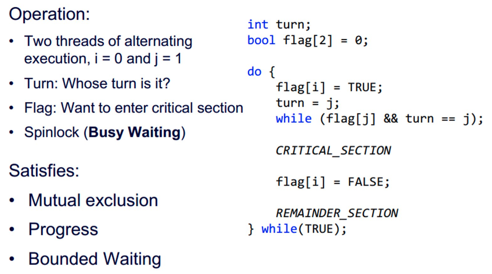

# 第三节 Concurrency: Mutual Exclusion and Synchronization - 并发性：互斥和同步

在多道程序(Multiprogramming)间，进程间不仅只有“争夺处理器资源”的关系，  
其间还可能存在同步、通信。

## 一、Principles of Concurrency - 并发的原理

不能通过控制进程的顺序，来确定多个进程的结果。

### 2. Race Condition - 竞争条件

发生在多个进程或线程读写数据时，  
此时由最后执行（竞争“失败者”）的进程，决定最终的数据。

### 3. OS Concerns - 操作系统关注的问题

需要关注以下问题：

* be able to keep track of various processes​
* allocate and de-allocate resources for each active process​
* protect the data and physical resources of each process against interference by other processes​
* ensure that the processes and outputs are independent of the processing speed​

### 4. Process Interaction - 进程的交互

### 5. Mutual Exclusion - 互斥

当一个数据正在被操作的时候，不希望别的进程再操作它。  
方法可以为“上锁”。

* Critical Section - 临界区  
  一段需要被保护的代码。

对于互斥的机制，需要满足以下要求：

* Must be enforced​
* A process that halts must do so without interfering with other processes​
* No deadlock or starvation​
* A process must not be denied access to a critical section when there is no other process using it （进步）​
* No assumptions are made about relative process speeds or number of processes​
* A process remains inside its critical section for a **finite time**.  
  一个进程驻留在临界区的时间必须有限（否则可能进程异常结束，则一直被上锁）。

> 举例 - Petersons Algorithm​：
>
>   
> 是针对进程`i`的一个代码描述。
>
> 其中`while`的作用就是使进程`i`处于等待，  
> 直到`j`不再需要互斥，或者不再被执行。

### 6. Mutual Exclusion Tools - 互斥的工具

分为硬件支持和软件支持：

* Hardware Support
  * Interrupt
  * Machine instruction
* Software Support
  * **Semaphore** - 信号量
  * Monitor - 管程
  * Message - 消息传递

## 二、互斥：硬件的支持

### 1. Interrupt

为了保证互斥，只要让该进程不被中断即可。

### 2. Special Machine Instructions​ - 特殊机器指令

主要是`compare`和`swap`指令。

* 优点
  * 容易实现
  * 可用在多处理器上
* 缺点
  * 忙等待
  * 可能发生饥饿
  * 可能发生死锁

## 三、Semaphore - 信号量

信号量可视为一个整形变量，包含三个操作：

1. 初始化为非负数。
2. `semWait` - 使信号量减1。  
   若值$<0$，阻塞该进程。
   用来接受信号。
3. `semSignal` - 使信号量加1。  
   若值$\le0$，`semWait`阻塞的进程解除阻塞。  
   用来传输信号。

还可以分成强弱信号量。

### 2. 例题 - 生产消费者问题

* 生产者：产生某种类型的数据，并存放到buffer（缓冲区）中
* 消费者：从buffer中取数据。

