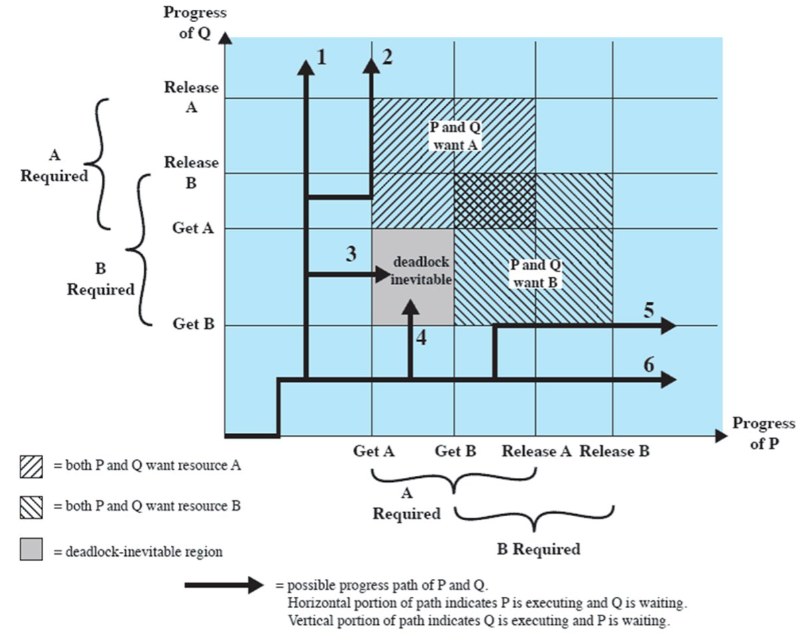
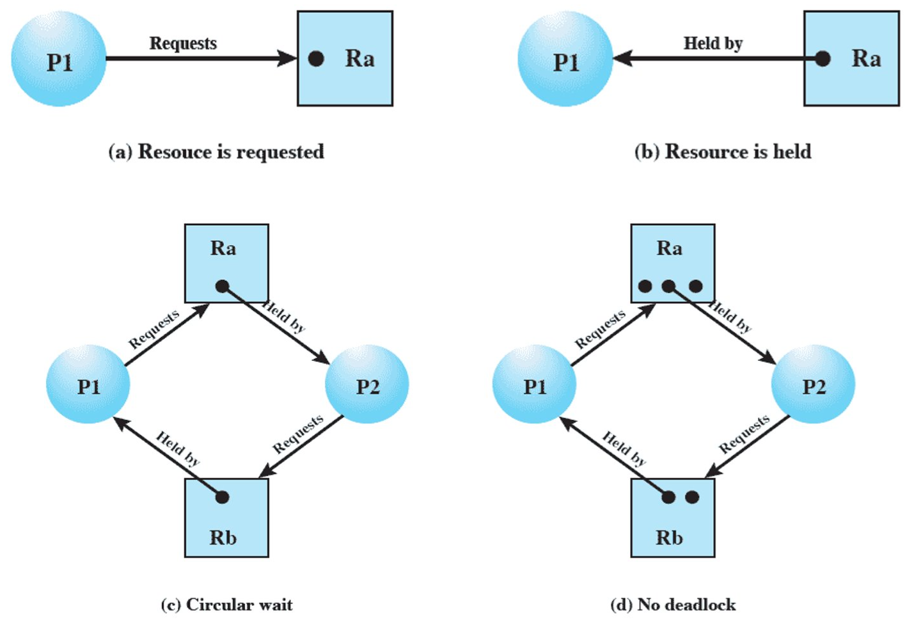

# 第四节 Concurrency: Deadlock and Starvation - 并发性：死锁与饥饿

死锁：多个进程在多个资源分配时，因为每个进程都占有其他进程所需要的资源，  
每个进程都在等待其他进程的资源被释放，互不相让，因此产生死锁。

> 与互斥的区别：
>
> 互斥 - 是对一个资源而言。  
> 死锁 - 对多个资源而言。

死锁只有缓解的方法，没有彻底解决的方法。

包含两个方面：

1. 设计程序的时候，尽量不存在死锁区域。
2. 执行程序的时候，尽量避开死锁区域。

## 一、Joint Progress Diagram - 状态图

  
死锁区域中，无法继续向右（进程P要等待进程Q的B资源）和向上（进程Q要等待进程Q的B资源）执行。

## 二、资源的分类

* 可重用资源
* 不可重用资源

对于可重用资源，有时候即便**只是一种资源**，但可能需要等待另一个进程的释放，  
此时**也会发生死锁**。

## 三、Resource Allocation Graphs - 资源分配图

* $R_i$ - 表示资源集，里面的黑点数代表资源个数
* $P_i$ - 表示进程

## 四、死锁发生条件

四个条件

* **Mutual Exclusion** - 互斥
* **Hold-and-Wait** - 持有等待
* **No Preemption** - 非抢占
* **Circular Wait** - 循环等待

## 五、解决死锁

三种解决方式：

* Prevent Deadlock - 防止死锁  
  建立约束，直接规定不能产生死锁。
* Avoid Deadlock - 避免死锁  
  规划路径来避免死锁。
* Detect Deadlock - 检测死锁  
  随便做，运气好就无事发生；运气不好检测到死锁就退回。

干预越来越少、实现越来越简单、解决力度越来越弱。

### 1. Prevent Deadlock - 防止死锁

只要死锁发生条件有一个不满足，就不会发生死锁。

* 互斥  
  *是并发操作的必要条件，因此必须满足，无法解决。*
* 持有等待  
  对于所需要的资源，要么一点不给，要么一次性给完。  
  不存在只给部分的情况，因此解决该问题。

  缺点：会降低系统效率。
* 非抢占  
  由管理者介入来执行抢占。
* 循环等待  
  对进程给定一定顺序。

  缺点：不符合进程要求。

虽然想法好、力度也好，但实现存在巨大问题。

### 2. Avoid Deadlock - 避免死锁

通过一些方式，干预执行路径，让其绕过死锁区。

可采用算法：The banker’s algorithm​（银行家算法）。  
下面介绍该算法：

首先定义两种状态

* Safe State - 安全状态
* Unsafe State - 危险状态

然后建立“进程资源需求表组”：

* Claim - 需求表
* Allocation - 分配表
* C-A则是还需要的表

再建立“资源剩余表”：

* Resources vector - 总共资源数
* Available vector - 剩余资源数

