# 第一节 Memory Management - 内存管理

在单道程序设计系统(Uniprogramming system)中，主存只被分为两部分：

* Kernel space - 内核空间（驻留监控程序）：供操作系统使用
* User space - 用户空间：供当前正在执行的程序使用

在多道程序设计系统中(Multiprogramming system)种，还要再内存中进一步细分“用户”部分，以满足多个进程的要求。

**细分的任务由操作系统动态完成**，这个管理操作称为“**内存管理**”(Memory management)。

## 零、Summary - 概述

### 1. MM's Requirement - 内存管理的需求

* Subdividing memory to accommodate multiple processes.  
  **划分**内存以满足多个进程的要求（存放进程数据在用户区）。
* Memory needs to be **allocated efficiently** to pack as many processes into memory as possible.  
  进程需要被**有效地分配**到划分的内存中，尽可能越多越好。  
  这样才能使得处理器利用率和系统效率提升。

### 2. MM's function - 具有的功能

* Relocation - 重定位功能  
  当进程从外存装载到内存中时，需要对地址进行转换和重新计算。
* Memory Protection - 存储保护  
  对于不同的进程（甚至是父子进程），需要保护各自分配的内存不被互相影响，否则应定义为非法访问而终止操作。
* Memory Sharing - 存储共享  
  将多个进程常用的相同功能（如打印）进行共享，避免空间浪费、提高内存空间利用率。
* Logical/Physical Organization - 逻辑/物理组织  
  程序在外存和内存中的组织是不同的，前者是逻辑组织；后者是物理组织。

### 3. Address - 地址

提到内存管理，必须要先了解地址这一概念，  
地址可以理解为用来管理**各种设备的编号**，只有给这些设备编号才能唯一找到并管理它们。  

广义的内存指各种外部设备，包括内存；键盘、打印机等外设，  
狭义的内存才专指内存条提供的的主存。

地址最基本可分为：逻辑地址(Logical Address)和物理地址(Physical Address)。

* Logical Address - 逻辑地址  
  CPU分配给每个进程的地址，是一种**虚拟地址**，  
  逻辑地址与进程实际在主存中的是不一样的，因此必须被转换为物理地址才能被处理器执行。  
  是一种**相对地址**(Relative address)。
* Physical Address - 物理地址  
  进程或数据存放在**主存中的准确地址**，  
  该地址通常不能由用户程序直接访问或查看。  
  *也就是如机组课程中学的，传到数据总线中用于定位主存中哪个存储芯片的xy坐标。*  
  是一种**绝对地址**(Absolute address)。

> 拓展 - 为什么要分为逻辑地址和物理地址：
>
> 可能存在疑问：为什么不能直接使用物理地址，而非要经过逻辑地址这一层转换。
>
> 首先一个最与我们编程相关的原因：  
> 对于程序中看起来（逻辑地址）是**连续存放的数据**，可能在**主存中（物理地址）并不是连续**的。  
>
>> 因为主存内其实很乱，各种程序在里面进进出出，到处申请释放内存，  
>> 所以主存里面其实是千疮百孔的，很难找到一片完整的连续内存。
>>
>> 此时如果直接使用物理地址，那么对于程序中如数组这样的数据，  
>> 我们看到的可能`a[0]`地址是`0x6345`，`a[1]`地址却跑到`0x8F1C`去了，  
>> 总之就是很乱，不方便使用。
>>
>> 因此如果我们添加这样一个“逻辑地址”来映射，  
>> 把`a[0]`的地址就令为`0x0000_0000`，`a[1]`的地址令为`0x0000_0001`，  
>> 这样对程序员就很友好很清楚了。
>>
>> 但CPU是认不到`0x0000_0000`的，它只认得`0x6345`，  
>> 我们就使用这样的能让数组连续存储的地址方式，至于真正的物理地址，交给某个部件或系统去转换就可以了【逃x……  
>> 这也就是后面的分页机制……
>
> 这只是逻辑地址的其中一条作用或好处：将混乱的物理地址变为更符合人直观思维的逻辑地址。  
> 还可以举出一条作用：**扩展内存**。  
> 上面举例的时候专门将逻辑地址的位数变多了，就是反应这个作用，  
> 这是后面要介绍到的“虚拟内存”技术。  
> 这里先简单讲解虚拟内存，就是OS把硬盘的一部分空间偷偷充作内存，  
> 因此内存地址变成虚拟地址来表示，虚拟地址是远大于实际的内存即物理地址的。
>
> ---
>
> 拓展 - 逻辑地址、虚拟地址、线性地址、物理地址的区别：
>
> * 逻辑地址：在上文中已讲解，是操作系统分配的地址。  
>   在组成上，是由“段选择符 : 偏移量”两部分组成（logical address = selector : offset)。
> * 虚拟地址：可以当作就是段内偏移(offset)。  
>   C中的地址`&a`就是a的虚拟地址
> * 线性地址：是逻辑地址根据段选择符和偏移量转换得到的地址。  
>   即：线性地址 = 段基地址 + 偏移量，此时得到的是一个相加后的结果地址。  
>   段基地址：是根据段选择符，在段表中查找到的，该段的段首地址。
> * 物理地址：是线性地址根据分页系统转换得到的地址。  
>   如果没有分页，物理地址 = 线性地址。
>
> 有关逻辑地址和分段系统来源的解释：  
> 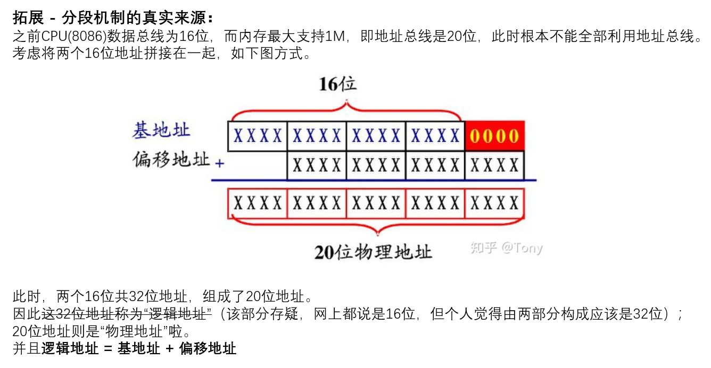
>
> 有关四种地址的关系（个人总结）：  
> 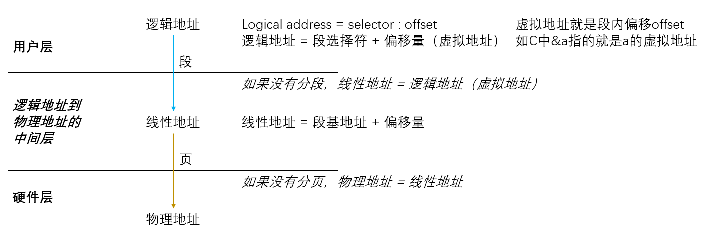
>
> 同时还需要知道：广义的物理地址**并不仅表示主存**这个部件的地址，  
> 其也可以用来管控各种外设，如：硬盘、打印机等都需要地址来访问。  
> 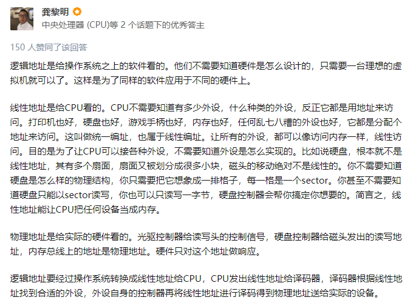

## 一、Memory Management Requirements - 内存管理需求

### 1. Rolocation - 重定位

> 定义 - 重定位：
>
> 重定位就是把程序的**逻辑地址**空间变换成内存中的实际**物理地址**空间的过程。  
> 它是实现多道程序在内存中同时运行的基础。

重定位有两种，分别是动态重定位与静态重定位。

**为什么需要重定位：**

* Active processes need to be able to be **swapped in and out** of main memory in order to maximize processor utilization,  
  为了最大化处理器使用率，活跃进程会被**换入换出内存**。  
  But it may be swapped to disk and returned to main memory at a **different location** (relocated).  
  但换入时，不一定回到原来的地址，因此需要**重新计算新的物理地址**。
* Programmers typically do not know in advance **where** programs executed by both themselves and others **will be resident in main memory**.  
  因为上面经常换入换出这一点，程序员通常不知道自己以及其他程序运行时，存放在内存的哪里。  
  但**OS必须清楚地知道**程序执行时的地址，  
  即知道进程控制信息(Process Control Information)和执行栈(Execution stack)的位置，以及进程开始执行程序的入口点(entry point)。
* *Memory references(存储引用) must be translated in the code to actual physical memory address.  
  *“**存储引用**”时需要将代码翻译为实际的**物理地址**。
  > 拓展简介 - 存储引用：
  >
  > 指的就是程序里调用函数时，只用写函数名便能调用该函数。  
  > 如程序里用`printf()`函数，直接写该函数名便能调用，但此时并不知道`printf()`函数代码装载在内存的地址。

**什么时候需要重定位：**

* When program **loaded** into memory the actual(absolute) memory locations are determined.  
  当程序装入内存后，实际存储的地址（物理地址）就需要被决定。
* A process may occupy different partitions which means different absolute memory locations during **execution** (from **swapping**).  
  一个进程在执行（或者换入换出）时可能占用不同分区，即占用不同物理地址。
* ***Compaction** will also cause a program to occupy a different partition which means different absolute memory locations.  
  *当使用“紧凑技术”(Compaction)时，程序也会占用不同的分区和地址，需要再次转换。  
  > 拓展简介 - 紧凑技术：
  >
  > 将内存空间中碎片化（不同程序占不同空间，互相不是连续的）的内容和地址，  
  > 通过移动变为一端是被占用的部分，另一端是空闲的部分。

即：进程装入内存、换出换入后、存储引用、使用紧凑技术时。

### 2. Protection - 存储保护

**什么是存储保护：**

* Processes need to **acquire permission** to reference memory locations for reading or writing purposes.  
  进程必须要**申请授权**，才能访问某个内存地址并进行读写。
* **Process** should **not be able** to **reference memory** locations, **branch to an instruction** in another process **without permission**.  
  **进程**在**没有授权**时，**不能访问**其他进程的内存地址或**跳转**到(branch to)另一个进程的指令。
* Normally, a user **process cannot access** any portion of the **OS**, neither program nor data.  
  通常，用户进程**不能访问操作系统（内核）的任何部分**，包括程序和数据。

**怎么进行存储保护：**

* Satisfaction of the **relocation** requirement **increase** the **difficulty of** satisfying the **protection** requirement, because location of a program in main memory is unpredictable.  
  当满足了“重定位”需求后，会增加满足“存储保护”需求的难度，因为程序在主存中的位置是**不可预测**的。  
* **Impossible** to **check absolute addresses** in programs **at compile time** since the program could be relocated.  
  在编译的时候不可能检查物理地址（因为重定位之前真正的物理地址不可预测），直到程序被重定位才可以。  
  Memory references generated by a process must **be check at run time**.  
  只能**在程序运行的时候检查**所有内存访问，确保它们只访问所分配的内存空间。
* Must be checked during **execution by the processor**(hardware) rather than OS(software).  
  存储保护**由处理器（硬件）来实现**，而不是操作系统（软件）来实现。  
  *包括之前的重定位，也是由硬件实现。*
* Mechanisms that **support relocation also support protecetion**.  
  **支持重定位**的机制也**支持存储保护**。

### 3. Sharing - 共享

* Allow several processes to access the same portion of memory.  
  允许**多个进程访问**存储空间的**相同部分**（相同分区）。
* Better to allow process(person) access to the same copy of the program rather than have their own separate copy.  
  最好让进程**能共享则共享空间**，而不是自己拥有相同功能的自己的拷贝。  
  这样才能最大程度利用空间。
* Memory management shuold **allow controlled access** to shared areas of memory **without compromising essential protection**.  
  内存管理需要在**不破坏(compromising v.违背)基本保护的前提**下，**允许**对内存共享区域进行**受控访问**。
* Mechanisms used to support relocation support sharing capabilities.  
  支持重定位的机制(mechanisms)也支持共享。

### 4. Logical Organization - 逻辑组织

指的是操作系统是怎么组织存储介质的。

* Memory is organized as **linear**.  
  在逻辑组织中，存储空间是被**线性组织**的。
* Programs are written in modules.  
  程序是由一个个“**模块**”编写的。
  * Modules can be written and compiled independently.  
    模块能被单独编写、编译。  
    但不能单独执行，必须程序的所有模块一起执行。
  * **Different degrees of protection** given to modules (read-only, execute-only, ...).  
    不同的模块能分配**不同的保护权限**。
  * Shard modules.  
    模块可以被多个进程共享。
* Segmentation is the tool that most readily satisfies requirements.  
  “**分段技术**”是一个容易满足需求的工具，将在之后介绍该内存管理技术。

主要需要理解“线性组织”这个概念。

### 5. Physical Organization - 物理组织

指的是计算机的存储介质是怎么组织的。

* Computer memory is organized into at least two levels, referred as **main memory** and **secondary memory**.  
  计算机的存储空间可以分为两层：**主存**（内存）和**外存**。  
  【只是一个大体的原则，比较粗糙，实际上还有多级存储体系（金字塔结构）。
  * 内存易失（**volatile**)，不能提供永久性存储，用于保存当前使用的程序和数据。
  * 外存慢、便宜，且非易失，可以用于长期存储(long-term storage)程序和数据。
* Moving information between the two levels of memory should be a **system responsibility**. It cannot leave the programmer with the responsibility to manage memory.  
  在两级存储器间**移动信息的任务**应该**交给系统负责**，  
  程序员不负责内存管理，因为以下两点原因：
  * **Memory available** for a **program plus its data** may be **insufficient**.  
    对于程序代码和数据来说，**可用的存储空间可能不够**，因此产生了覆盖技术(Overlay)。
  * The programmer must engage in a practice know as overlaying, but overlay programming **wastes programmer time**.  
    在上述情况下，程序员需要采用“覆盖”技术来组织程序和数据，但让程序员来实现覆盖技术太**浪费时间**。
    > 简介 - Overlay（覆盖技术）
    >
    > Overlaying allows various modules to be **assigned the same region of memory** but is time consuming to program.  
    > 覆盖允许多个模块分配在同一个内存区域上，但整个程序仍能运行。
    >
    > 程序只能分配一定的内存空间，  
    > 通过把程序划分成若干模块，模块之间可以覆盖。  
    > 因此虽然只有较少的内存空间，但各模块都可以运行。
    >
    > 并且目前已基本不采用这种技术。
  * Programmer does not know **how much space will be available**.  
    程序员**并不知道**实际还**剩多少可用空间**（只知道逻辑地址空间）。

---

以下部分开始具体介绍内存管理的功能。

内存管理技术有如下几种：  
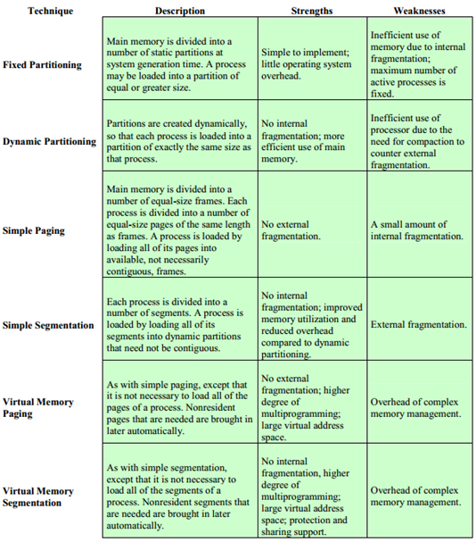 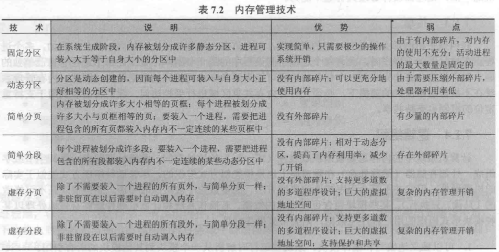

* Fixed Partitioning - 固定分区
* Dynamic Partitioning - 动态分区
* Simple Paging - 简单分页
* Virtual Memory Paging - 虚拟分页
* Simple Segmentation - 简单分段
* Virtual Memory Segmentation - 虚拟分段

对于简单和虚拟技术的区别：  

* 简单 - 程序执行之前，把**程序和数据全部装入内存**。
  * 简单分区
  * 简单分页
  * 简单分段
* 虚拟 - 程序执行时，只把**需要的装入内存**，之后需要的再装入。
  * 虚拟分页
  * 虚拟分段

本节先介绍简单技术，  
将分别介绍：**分区**、**分页**和**分段**三个功能。  

对于这三个功能的区别，主要是看给进程分的**空间连不连续**，  
分区为连续；分页、分段为离散。

* 分区 - 连续  
  一个进程占一整块，在物理上都是连续的。
* 分页 - 离散  
  把内存划分成若干个等大小的区域，称为页框(frame)，  
  对于进程，可以占用若干页面，**不一定连续**。  
  但需要知道占用的哪些页框，然后串在一起形成逻辑连续。
* 分段 - 离散  
  把内存划分成若干分区。  
  对于进程，可以按模块，每个模块占用一个分区。

## 二、Partitioning - 分区

对于用户可用的用户区，需要决定怎么把他分配给各种进程中。  
最容易想到的方法就是：直接划分成若干区块，然后进程就装到这些区块里。

分为固定分区和动态分区。

### 1. Fixed Partitioning - 固定分区

系统初始启动时，将内存划分成**数目固定**、**尺寸固定**的多个分区。  
进程运行时，就直接装进到相应的分区当中就行。

一般采用**固定大小**的分区(Equal-size partitions)：

#### (1) Equal-size partitions - 固定大小固定分区

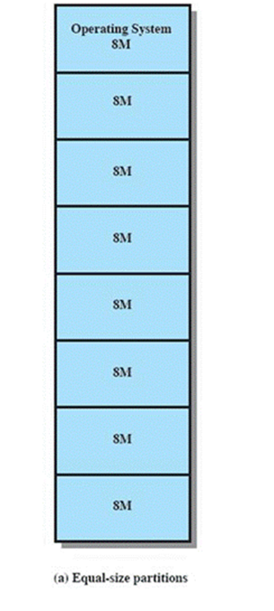

**方法：**

* Any process whose size is **less than or equal** to the partition size can be loaded into **an available partition**.  
  任何大小**小于等于分区大小**的进程，都可以被**装到一个可用的分区**中。
* If all partitions are full, the OS can swap a process out of a partition.  
  如果所有分区都满了，OS可以把一个进程从某个分区中**换出**。（当该进程优先级较高时）

**存在问题：**

* A program may be too big to fit into a partition.  
  一个进程可能比分区大小更大。  
  The programmer must design the program with "**overlays**".  
  此时程序员需要采用“**覆盖**”技术来解决问题。（在前面的[物理组织](#5-physical-organization---物理组织)这一部分内有提到）  
  但其实现比较复杂。
* Main memory utilization is **inefficient**. Any program, no matter how small, occupies an entire partition.  
  主存的**利用率低下**。任何进程都会占用一整个分区，即便它很小。  
  任何一个分区被分配给一个进程后，其剩余没用的空间不能再分配给其他进程（分配最小单位为区）。  
  This is called "**Internal fragmentation**".  
  这个现象被称为“**内零头**”，或称为内部碎片。

Both of these problems can be lessened, though not solved, by using unequal-size partitions.  
上述两个问题，可以采用“大小不同分区”方法来缓解，但不能解决。

#### (2) Unequal-size partitions - 不定大小固定分区

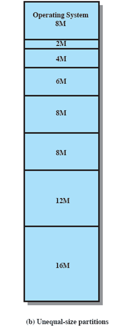

将分区的**大小适当调整**，分为大分区和小分区，  
但还是**提前**把所有内存**划好**分区，仍是固定分区。

只能说稍微减轻上述的缺陷，并不能完全解决。

#### (3) Memory Assignment - 内存分配方式

* 固定大小的**放置算法**(Placement Algorithm)：  
  由于每个分区都是等大小的，不需要考虑选择哪个分区，  
  只用选择空闲的放就是了。
* 不定大小的放置算法：  
  * Can assign each process to the smallest partition within which it will fit.  
    基本原则：给进程分配能装得下它的最小分区（浪费最小原则）。
  * Queue for each partition.  
    需要排队来分配分区。  
    存在以下两种排队方式：
    1. 将进程直接按基本原则分配好，然后在各自的分区排队。
    2. 将进程统一起来排队，然后每次分配时按基本原则计算分配到哪。
    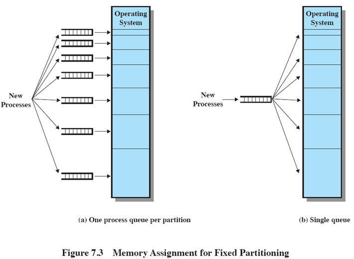
  * Processes are assigned in such a way as to minimize wasted memomry within a partition.  
    最小化对内存空间的浪费。

#### (4) Benefits and Disadvantages - 优点与缺陷

* 优点：方案简单、对操作系统的开销小，适用于简单的操作系统。  
* 缺陷：
  * The number of partitions specified at system generation time limits the number of active processes in the system.  
    分区的数量会**限制**在系统中**最多活跃的进程数**。
  * Small jobs will not utilize partition space efficiently.  
    小任务不能很好的利用划分的空间。
  * It's difficult to know how large each process may become.  
    不可能总是知道所有进程所需要的空间。

### 2. Dynamic Partitioning - 动态分区

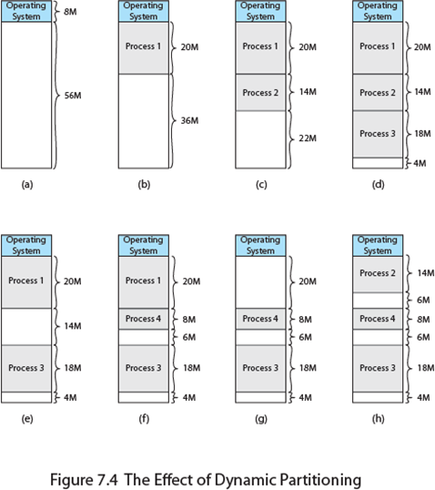

* Partitions are of **variable length and number**.
  分区的**大小和数目**都是可变的。
* Process is allocated exactly as much memory as required.  
  进程要多少空间就给多少。

缺陷：

* Eventually get **holes in the memory**, this is called "**external fragmentation**".  
  最后会在内存里形成多干的“洞”，被称为“**外零头**”。  
  产生原因：随着进程的结束，分配内存的回收，原本紧邻着分配就变得不再连续，之间会出现洞(Holes)。

注：内零头是绝对的（分区内剩余空间未使用可以画出来）；  
而外零头是相对的（可能这个大进程装不下，但换成小进程就装下了）。

解决方法：  

* Must use "**compaction**".  
  应当使用“**紧缩**”技术来解决外零头。  
  对于compaciton：
  * Technique for overcoming external fragmentation.  
    用来解决外零头的技术。
  * OS **shifts processes** so that they are contiguous.  
    OS会**移动进程**来让他们紧缩。
  * Free memory is together in one block.  
    让内存合并到一块。
  * **Time consuming** and wastes CPU time.  
    会造成**额外的时间开销**（并且开销较大）和CPU占用，

放置算法(Placement Algorithms)：

* Best-fit algorithm - 最佳适应算法  
  Choose the block that is **closest in size** to the request.  
  直接选择**大小最接近**的块分配。
  * Worst performer.  
    会让更多的外零头出现，需要更多的紧缩操作，故表现较差。
* First-fit algorithm - 首次适配算法  
  Begis to **scan memory from the beginning** and chooses the **first available block** that is large enough.
  **从头遍历**，直到找到**第一块可用**（能够装下）的分区。
  * Simplest, **Best** and Fastest.  
    简单、**最好**、快速。
* Next-fit algoritm - 下次适配算法
  Begin to scan memory from the **location of the last placement** and chooses the **next available block** that is large enough.
  从**上一次放置**的位置遍历，选择其后的**第一块可用**分区。
  * Average use, Broke largest block.  
    均匀使用内存，会拆分在后面的大块。  
    但因为要保持大块，所以也需要较多的紧缩技术。

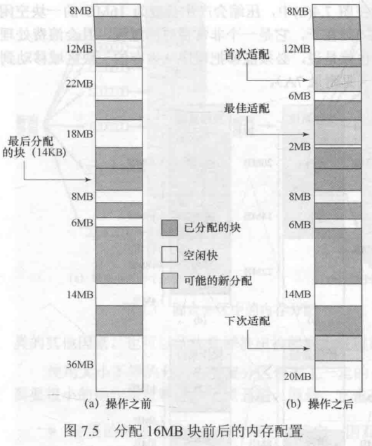

### 3. Buddy System - 伙伴系统

是对固定分区和动态分区的折中方案。  
固定分区限制活动进程数量，且内存利用率低；动态分区维护复杂，可能造成紧缩操作的开销。

伙伴系统中内存块大小为$2^K$个字，满足$L\le K\le U$，  
其中$2^L$表示分配的最小块尺寸，$2^U$表示最大块（通常就是整个可供分配的内存大小）。

主要就两个操作：**分裂和合并**。

* 分裂操作
  最初将可分配空间视作**1个**$2^U$的整块。  
  若请求的大小$S$为$2^{U-1}\sim2^U$范围，称为恰好大于$S$的最小快，则直接分配。  
  否则：**不断二分**，**直到满足**上述条件的最小块再分配。
* 合并操作  
  对所有分裂操作得到的若干块，将尺寸相同的记录下来，用列表$i$记录，代表尺寸$2^i$  
  则分裂操作是从$i+1$列表中选一个，在$i$列表生成两个。  
  对于**相邻的两相同块**，若因进程被释放，**都不在被占用**，  
  则可以**进行合并**操作，将两个相邻的$i$合并为$i+1$。

过程其实很好理解，分配的时候找最小块分配，能合并就合并。  
看示例即可。
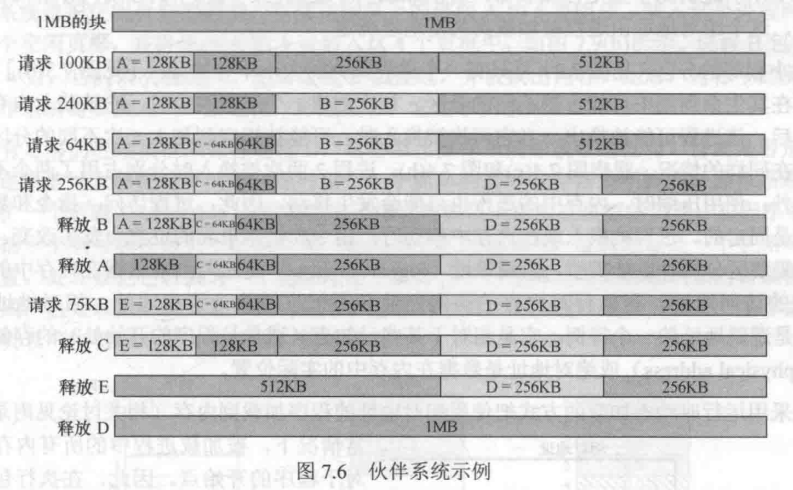

二分操作，也可以用树形来表示。  
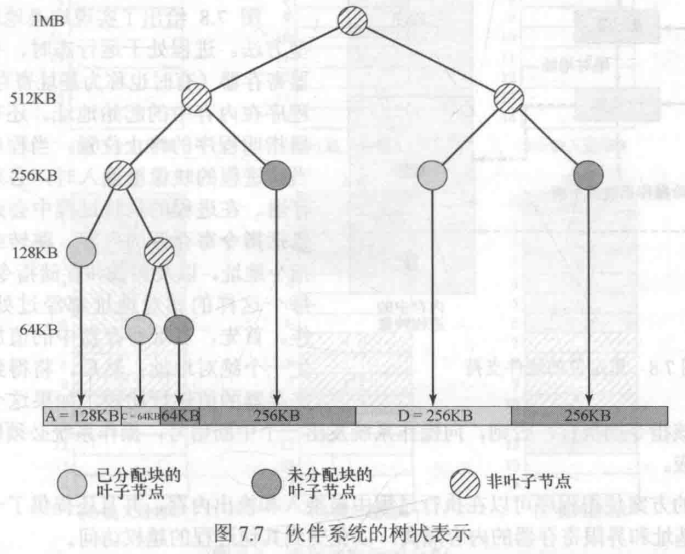  

### 4. Relocation - 重定位

即：**绝对地址(Physical address)（或称绝对地址）=逻辑地址(Logical address)（或称相对地址）+基地址**。

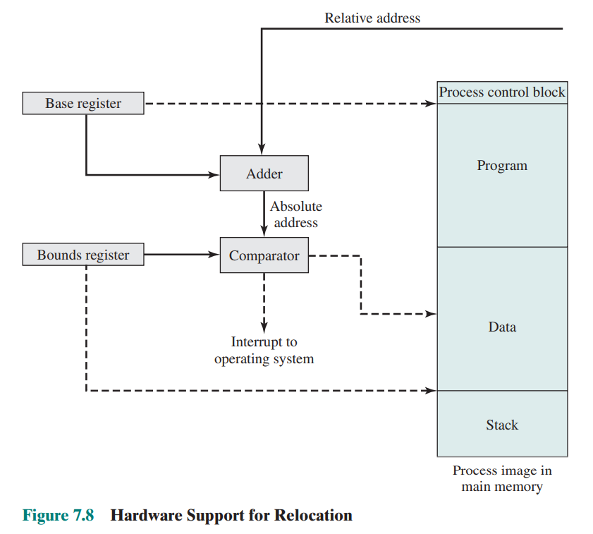

* Base register - 基址寄存器：存放该程序进程映像的起始地址。
* Bounds register - 界限寄存器：存放程序的最大地址。

相对地址加上基址后，得到的绝对地址先于界限地址比较，  
在范围内则读取，否则判断为越界处理。

## 三、Paging - 分页

### 1. 分页方法

固定分区产生内碎片，动态分区产生外碎片，因此都不怎么适合。  
原因：都只对内存空间进行处理，而没考虑对进程本身占用空间也进行处理。

因此分页技术则不仅对内存进行了划分，也对进程进行了划分。  
同时另一个改进是：**不需要进行连续的分配**。（个人认为是最主要的改进）

则分页技术：

* 将**内存**划分为**大小固定、相等、较小**的块，称为“**页框**”(Page Frame)。
* 将**进程**划分为同样大小的小块，称为“**页**”(Page)。
* 在主存中寻找满足page要求的page frame（不一定连续），装载，记录到该进程的页表。

可以说分页类似于固定分区，不过分区很小，一个程序可以占据多个分区且不用连续。

采用分页技术装载内存示例（A分为4页、B分为3页、C分为4页、D分为5页）：  
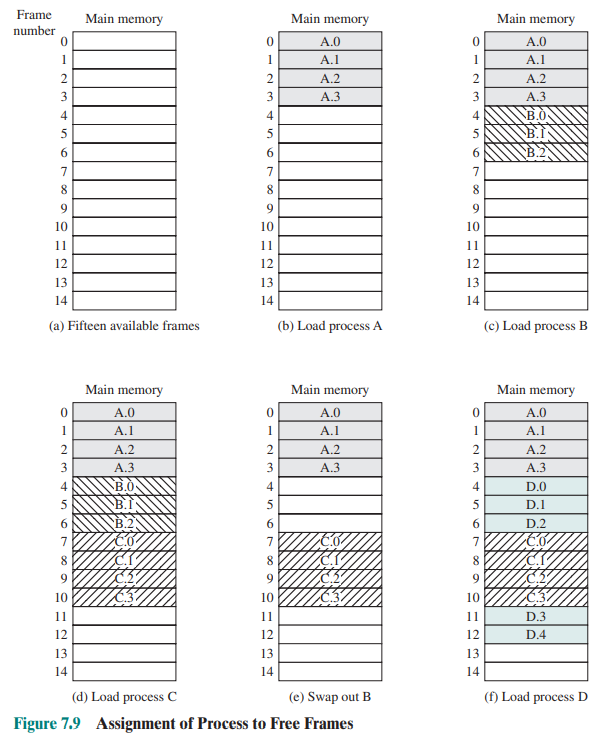  

因为不连续，没法通过简单的连续寻找来找到所分的页，  
因此需要采用**页表(Page Table)**，给出了每个进程**page所分配到的page frame**。

上例中的页表如下图：  
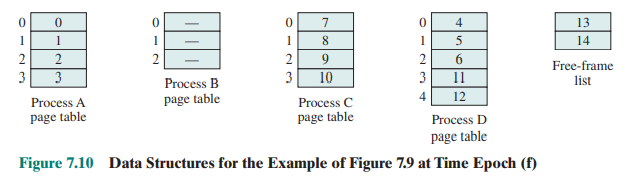  

### 2. 地址确定

逻辑地址组成：**页表内页号$n$ + 页框内偏移量$m$**

* 页表内页号：某进程**页表内的下标**。  
  注意：页号不是代表是主存的哪个页框，而代表是页表的下标。  
  如C的`010;...`，不是代表主存中的1页框，而是读页表后为`8`，是主存的8页框，
* 页框内偏移量：在page frame的下标（即偏移量）。  
  最大偏移量**跟页大小一致**。

$n,m$确定方法：

* 页框偏移量$m$由页的大小决定。
* $B$为计算机位数，则$n=B-m$。

规定了页大小必须是$2$的幂。

对于物理地址：  
由$n$找到$k$，则page frame的物理起始地址为$k\times2^{bit(m)}$，然后加上偏移量$m$即可。

如下，16位机，分页$1K$(10bit)，则：  

* 页号$n$ - 6位
* 页内地址$m$ - 10位
* 物理地址 = $T(n)\times2^{10}+m$

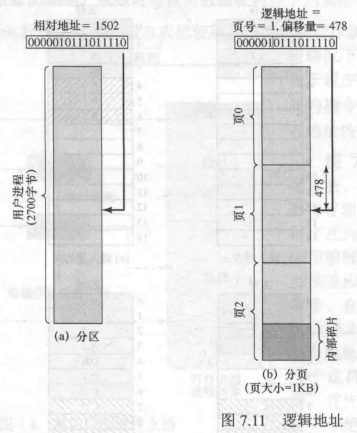  

## 四、Segmentation - 分段

把程序和数据划分成几个段(segment)，但**大小不等**。

可以说分段类似于动态分区。但可能占据多个分区，且不一定连续。

同样有个段表，不过不像分页一样属于某个进程，而是属于全体进程的。

则分段技术：

* 将**进程**根据功能，划分为大小不同的小块，称为“**段**”(segment)。
* 若够分配，在主存中直接开辟这segment要求的空间，装载，记录到系统段表。  
  注：每一段是需要连续分配内存的，但同一程序的若干段不一定连续。

对于地址，  
逻辑地址组成同样为：**段表内段号$n$ + 段内偏移量$m$**  
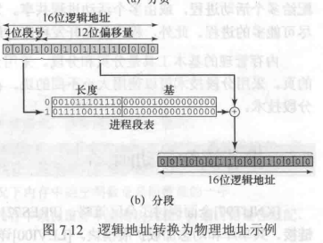

段表中的长度，代表这一段最大的空间范围（在分页中，每页长度一样且固定，故不用记录），  
主要是用来判断偏移量在这个段里面的，如果**偏移量>长度则该地址无效**，会发生段错误(Segment failed)，  
基则是这一段的起始地址。

物理地址 = $T(n)+m\quad(m<L(m))$（$T(n)$为根据段表查到的“基”、$L(n)$为根据段表查到的“长度”）

## 五、Summary - 小结

分页分段，因为不连续，对地址的管理更复杂，  
首先需要建立各种表来记录不连续的分配，  
其次就是对地址（逻辑到物理地址）的转换

分页：

* 页号$n$：在页表中的编号，通过这个得到帧号$k$。
* 帧号$k$：在主存中页框的编号，通过这个可以得到每一页框的物理起始地址（线性转化$n*2^k$）。
* 偏移量$m$

分段：

* 段号$n$：段表中的编号，通过这个得到基$T(n$
* 基$T(n)$：在主存中段的起始地址
* 偏移量$m$
