# 第二节 Virtual Memory - 虚拟内存

在上一节的后部分，已经开始把进程分块（页或段），并且可以**不连续地存放**。  
因此再次考虑：都分块了，每次只读取需要的块，就考虑**不完整地存放**，只把需要的部分存到内存。

内存中只要保有待取的下一条指令所在块，以及待访问的下一个数据单元所在块，  
程序就可以暂时执行下去（虽然执行一条指令都就无法执行了）。

* **Resident set** - 常驻集（驻留集）：进程执行的任何时候都在内存的**部分**，称为进程的常驻集。  
  个人理解为：进程在某时间内所能拥有的页框的数量（如果固定分配就与时间无关）。

采用虚拟内存带来的效果：

* More processes may be maintained in main memory.  
  在内存中可以保留更多的进程。
* A process may be larger than all of main memory.  
  进程占用空间可以比内存的全部空间还大。

因此在拥有虚拟内存技术后，内存被分为两类：

* Real Memory - 实存储器  
  就是你的那几根内存条。  
* Virtual Memory - 虚拟内存  
  分配在磁盘上的，程序员和用户所感觉的一个更大的内存。

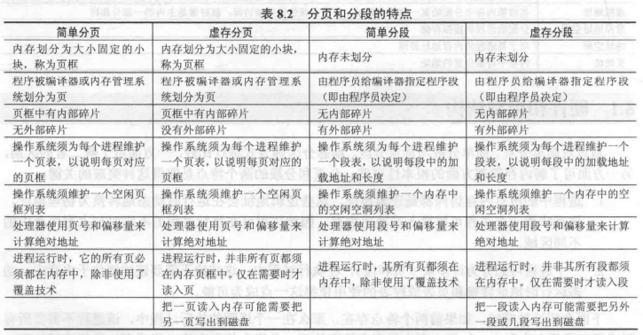 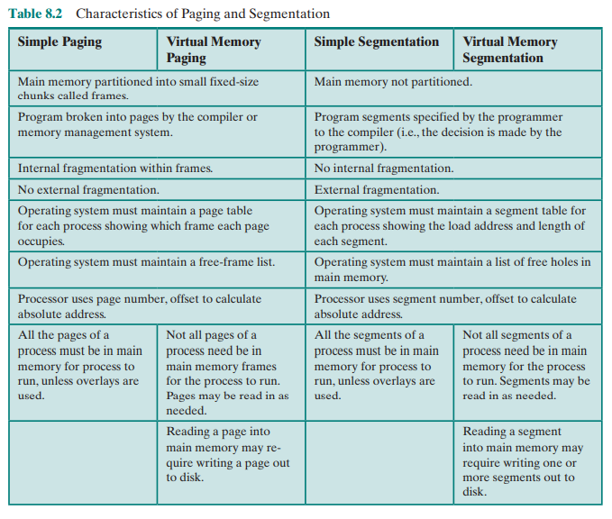

OS需要避免像IJN在中途岛那样，刚把某一块“感觉不需要”的内存换出，去装载另一块被请求的数据，  
但下一秒刚刚被换出的内存又被请求了，不得不再把“刚刚换出”的内存重新装进来，  
这种神必行为称为“系统抖动”(thrashing)，使得CPU大部分时间用来交换块而非执行指令。、

出现了很多算法来避免抖动，都本质上是“根据最近的历史，来预测将来最可能用到的块”。  
基于的是机组上学的“局部性原理”(principle of locality)。

虚拟内存管理格式（地址）如下：  
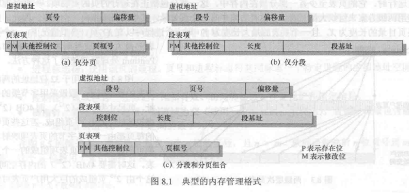 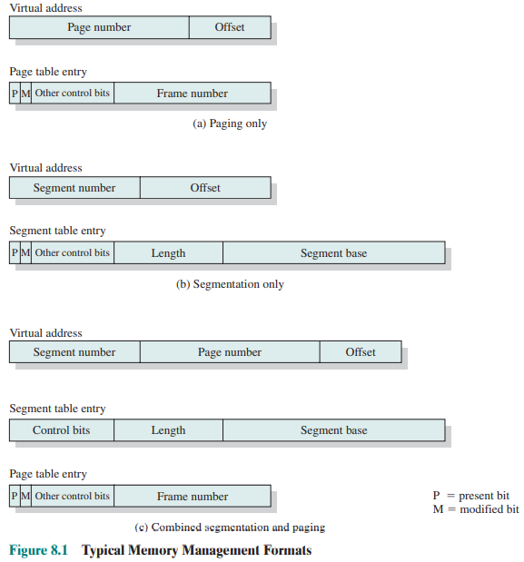  
除了“控制位”，来记录有关虚拟内存的状态（如上面的`P`，表示是否在内存中），其他都跟之前的相同。

## 一、Hardware and Control Structures - 硬件

### 1. Paging - 分页

页表的结构如下：
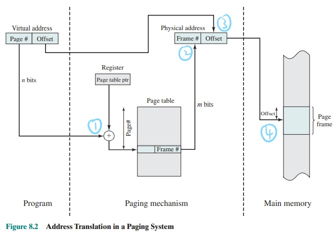  
页表需要常驻在内存中，可以用一个寄存器来存储页表的起始地址。

虚拟内存很大，因此直接这样存放页表，页表也很大。  
页表的处理有三种方式：

#### (1) Two-Level Hierarchical Page Table - 两级页表

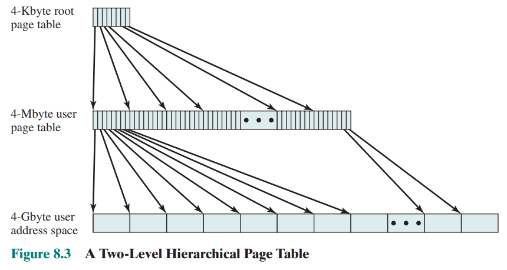

页表和其他页一样都服从分页管理，  
即把页表也放在虚拟内存里，在需要用到的时候再放到内存中【不是套娃！……  

然后内存里存放的称为“页目录”，其每项都指向一个页表。  
如果页目录的长度（位数）是$X$，页表的长度是$Y$，则一个进程可以拥有$XY$页。  
（相当于正方形面积最大，当同样$2X$长度，$X^2\ge2X$）

> 书中给出了有关直接存放整个页表所占用巨大空间，以及采用二级页表解决的实例：  
> 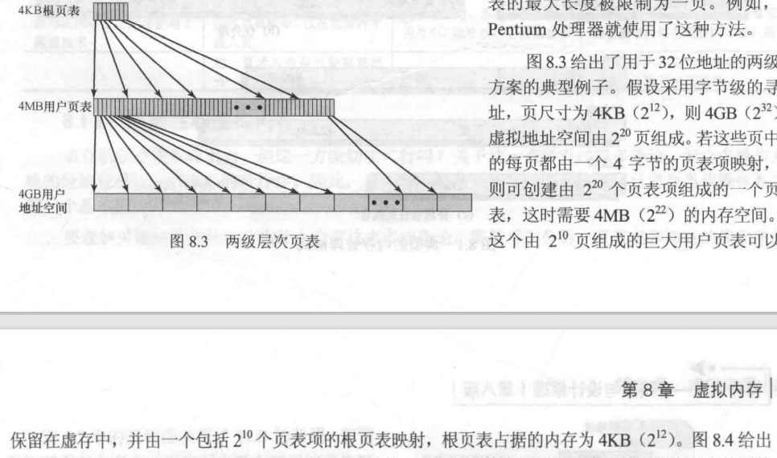

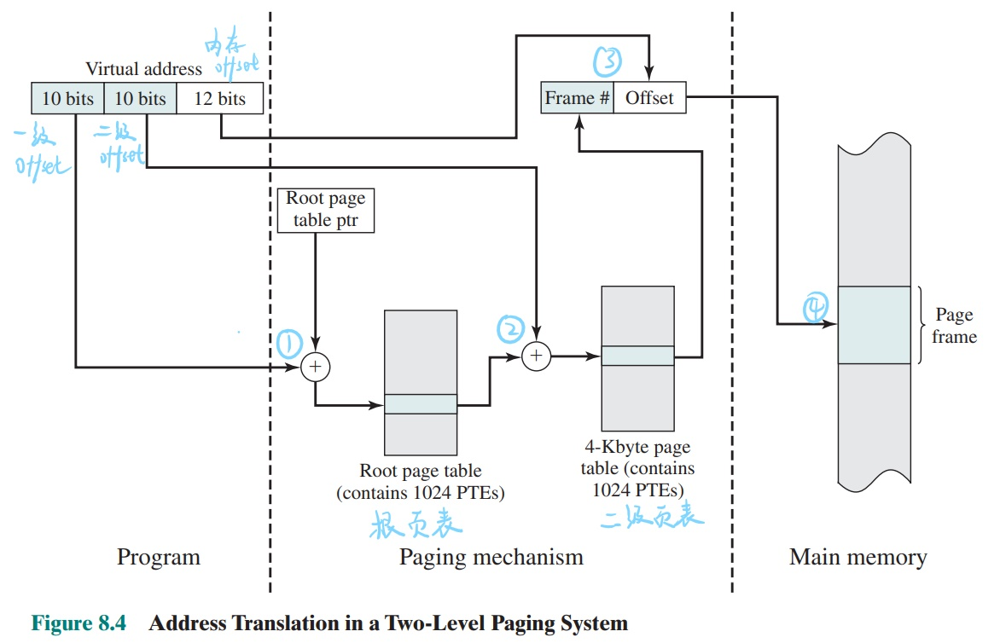

#### (2) Inverted Page Table - 倒排页表

无论采用二级页表，还是下面的快表TLB，其本质还是建立于原本的页表结构上，  
原本的页表结构：根据虚拟地址的页号Page #，得到逻辑地址的帧号Frame #，  
页表是以页号page index为索引index，存放是的帧号，则页表注定**与虚拟地址的大小有关**。
而**虚拟地址大**，**页号多**，所以**页表大**。

如果反过来想：  
页表是以帧号frame index为索引index，存放的是页号，则**页表只会与物理地址的大小有关**。  
（即便不采用什么多级，最多也就内存大小/页框大小那么多帧，而物理地址远远小于逻辑地址）

即思路：

* 不让页表与逻辑地址空间的大小相对应
* 让页表与物理地址空间的大小相对应

但怎么通过逻辑地址中的“页号Page #”，找到对应的帧号呢，  
这个时候不能直接查表，就可以利用hash，将逻辑地址的页号先映射到一个“**可能的**页表下标`index`”，  
此时检查该页表项的"Page #"，是不是跟逻辑地址的"Page #"一致，  
一致那就很幸运，代表一次hash就映射成功，那么hash的结果`index`，也刚好就是物理地址的"Frame #"

但如果不一致，证明hash冲突，此时页表会用“冲突链”来处理hash冲突，  
页表项还会存放一个`next`，指向冲突后的下一个可能项，  
接着再匹配判断，直到找到最后的`index`，匹配成功，则是对应的物理地址"Frame #"。

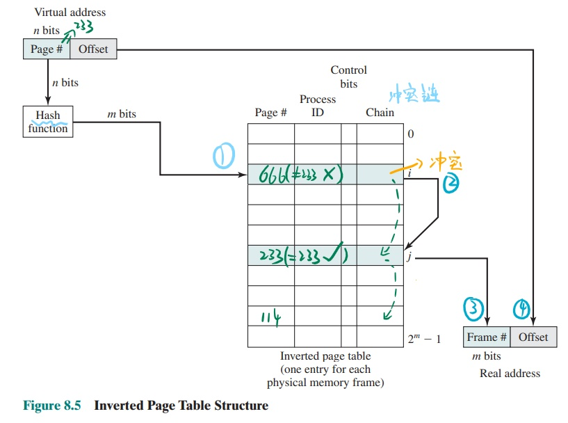

#### (3) Translation Lookaside Buffer(TLB) - 转换检测缓冲区（快表）

**类似于高速缓存Cache**，  
不过里面存的不是直接的数据，而是Page #与Frame #之间的关系的一个**小而快的页表**，  
因此也称为快表。

查询方式如下：  
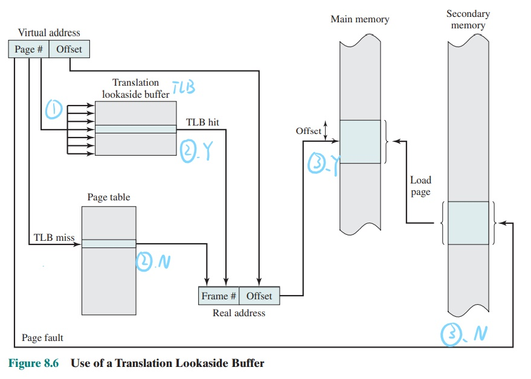  
注意：因为其为一种特殊的Cache，是硬件实现，所以是“关联存储”(Associative memory)，  
是一次性将所有项进行匹配，而不是一个个按顺序匹配【所以Cache才快啊！【敲……

1. 先到TLB进行**一次查询**，Hit就直接得到物理地址，否则到页表查找。
2. 到页表中**依次按顺序匹配**，找到了就得到物理地址，否则发生“缺页”(Page fault)错误。
3. 发生缺页错误，就到磁盘上区找到相应的页并装载。

### 2. Segmentation - 分段

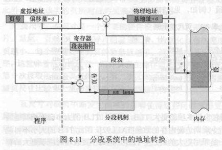

【考到就886咯……

### 3. Combined Paging and Segmentation - 段页式

* 页：碎片少，更有效利用内存；但对程序员透明，程序员不方便对自己程序管理。
* 段：对程序员可见，能用来将程序按模块划分为相应段，便于管理，支持共享和保护；但碎片多。

融合！

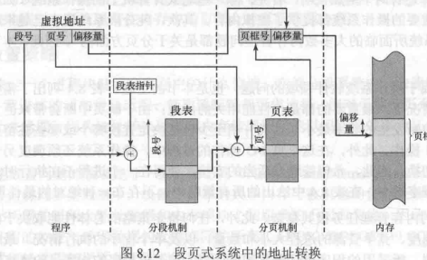

## 二、Operating System Software - 软件

基本问题：

* 怎么取：在内存中选哪些单元放。
* 怎么放：怎么放到所取单元。
* 怎么换：缺页时，把需要的页换掉哪些占用的页。

评价标准：

主要考虑 - **Performance**

Overhead - 开销来源：

* **Replacement** - 页面替换
* **I/O** - 读取页面
* Process switch - 进程切换

发生缺页的时候会进行读取页面和页面替换，因此主要考虑：  
Minimize the rate of **page faults**.  
最小化**缺页率**。

有关下面各种策略的一览：  
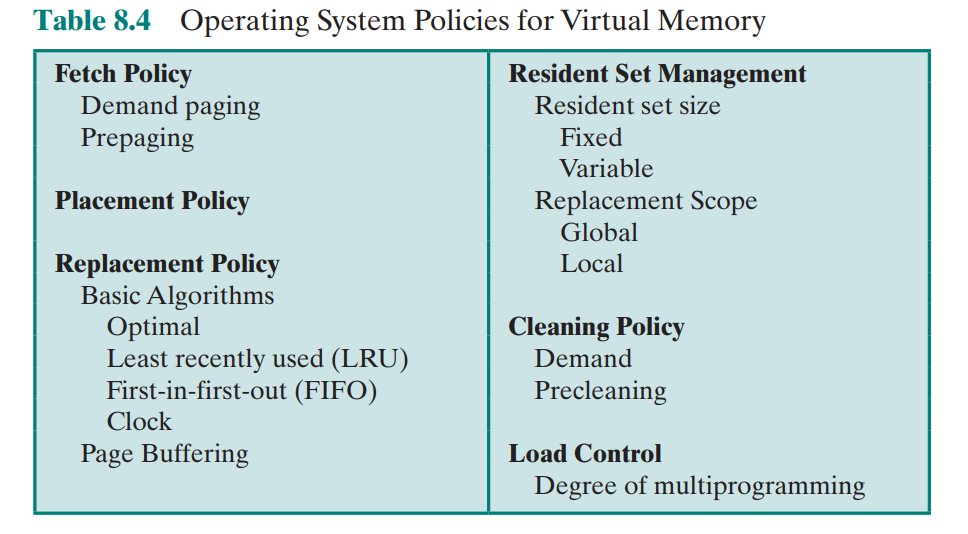

### 1. Fetch Policy - 读取策略

摸！……

### 2. Placement Policy - 放置策略

决定放在哪一个真实内存的片段中。

之前的BB、NF、FF在此时差异并不大了。

### ⭐3. Replacement Policy - 置换策略

当发生缺页时，要把页换进来。  
评价一个分页的方法，主要就是看置换策略好不好。

目标：  
The page that is removed be the page **least likely to be referenced** in the near futuer.  
在最近的将来，被移除的页**最少可能被访问到**。

下面各种置换策略总览：
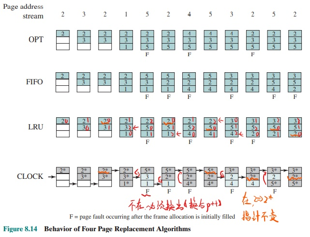  
注：一定要把缺页$F$标注出来。

#### (1) Optimal Policy - 最优算法(理想模型)

策略：

* Select the page for which the time to the next reference is the longest.  
  选择一个页面，其在后面的时间**最晚被再次访问**，或说下次再访问隔得最久。

就是**严格按照置换目标**执行的策略，因此肯定**缺页率最低**，是最好最优的。  
但计算机**很难知道将来的访问顺序**，因此**基本上不可能实现**。

就是最理想的一个策略，但不可能被实现，只能作为一个评价标准。

#### (2) First-in-first-out (FIFO) - 先进先出算法

策略：直接循环置换内存中先被放进来的页。

* Treats page frames allocated to a process as a **circular buffer**.
  把分配给进程的页框都看做一个循环缓冲区（循环队列）。
* All that is required is a pointer that circles through the page frames of the process.  
  只需要一个指针指向这个“循环队列”，  
  当需要换出的时候就把指向的页换出，然后指针++。
* Page that has been in memory the longest is replaced.  
  其实代表的隐含含义是：置换在内存中**滞留了最长时间**的页。

虽然简单，但缺页发生的较多。

#### (3) ⭐Least Recently Used (LRU) - 最近最少使用

策略：置换内存中**最长时间未被再次访问**的页。

是最常用的。

#### (4) Clock Policy - 时钟策略

基于FIFO的方法发展，用指针`pointer`来控制循环队列，  
又融合了LRU的思想，需要用一种方法记录该页最近是否被再访问。

思路为：给页框添加一个“使用位”(use)。  
需要换出时，则根据`use`判断。

* 当`use=1`时，代表最近被访问过，不换出；  
* 当`use=0`时，代表最近未被访问过，换出该页。

**方法：**

每有一个页请求时，先看是否在内存中：

* 若在，则将该页的`use`置1；  
* 若不在，需要放入
  * 若`pointer`所指的页直接能放入（为空闲页），则放入。  
  * 若`pointer`所指的页被使用，且`use=0`：则换出这个并放入。
  * 若`pointer`所指的页被使用，但`use=1`：则**将其`use`置0**，并查找下一个页（`pointer++`）。

在需要换出时，则循环遍历，  
最关键的是当前页`use=1`时，把它置成0，  
这样在都`use=1`转完一圈后，其实就是选择当前`pointer`的页换出。

这样可以近似为，选择了之前最久未被再访问的页换出。  
但肯定不是最精确的近似（甚至可以说效果较差），  
因为全`use=1`下，即便当前所指页前一次就被访问过，`use`还是1，转一圈还是换他。

### 4. Resident Set Management - 驻留集管理

驻留集的大小会影响性能：

* 分配给进程的内存越小：
  * 驻留在内存的进程数越多，OS在CPU空闲时越容易直接在内存找到一个Ready进程让CPU不要摸鱼，而不用通过耗时的交换来找Ready进程，**减少了因交换消耗的处理器时间**。
  * **进程的缺页率会很高**，造成大量的页面置换操作。
* 分配给进程的内存越大：
  * 上述相反。
  * 当大到一定程度时，因为局部性原理，每个进程浪费了多余的空间，缺页率并不会明显下降。

对于驻留级的管理，有两个维度：

* 有关**驻留集大小分配**的两种策略
  * Fixed-allocation - 固定分配策略  
    在进程创建时，便**分配固定数量的页框**(frames)，其数量可以根据进程类型或程序员手动确定。
  * Variable-allocation - 动态分配策略  
    进程的页框在其生命周期内，**根据其“缺页率”**(levels of page faults)而**动态变化**，缺页率高就多整点，少就多剥削点。
* 有关发生缺页而需要置换的两种策略
  * Local replacement policy - 局部置换策略  
    所替换的页面**仅在**发生缺页的**本进程**中选择（不会造成页框数量变动）。
  * Global replacement policy - 全局置换策略  
    所替换的页面在**内存中所有**未被锁定的页中选择（可能造成页框数量动态变化）。

虽然动态分配看起来很好，但别忘了要评估“该进程是不是要多点或少点页框”，也会造成消耗。  
【偷懒效果会差点，认真身心会累点……

其中固定分配策略不可能搭配全局置换策略（否则页框数量变化），  
动态分配策略自然能搭配全局置换策略（页框数量在置换的时候就产生**实时变动**），  
但也可以搭配局部置换策略（页框数量**单独根据缺页率变动**）。

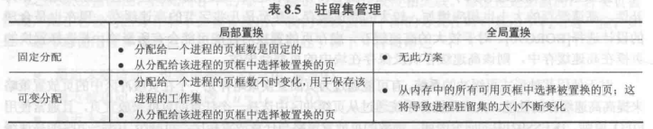

对于“固定分配-局部置换”和“可变分配-全局置换”很好理解，这里不介绍【*其实就是摸了……*  
主要介绍怎么实现“可变分配-局部置换”中，何时、怎么修改页框大小。

---

采用的是：**Working Set Strategy - 工作集策略**  
是解决驻留集大小变化的方法。

也是跟之前一样，**根据过去**的经验，来**推测将来**所需要的Frame数量。

工作集定义：
$$
W(t,\Delta)
$$

与两个参数有关：

* $t$ - 当前时间
* $\Delta$ - 工作集窗口(Window size)：当前时间的前面一段时间（就是过去的经验）

代表这一段时间，页面的集合。
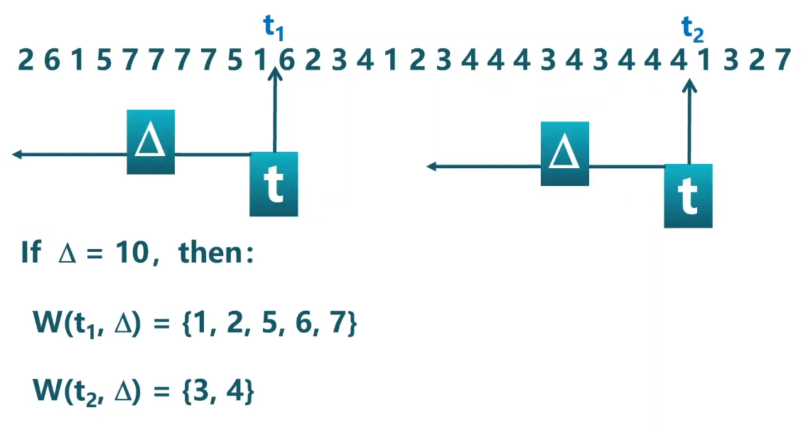

存在形式：

* $W(t,\Delta)\in W(t,\Delta+1)$
* $1\le W(t,\Delta) \le \min(\Delta,N)$（$N$代表进程的页数）

对于$\Delta$的确定很关键：

* $\Delta$过小 - 变化范围($\mathrm{card}(W)$)虽然小，但相应工作集也小，相当于驻留集小。
* $\Delta$过大 - 变化范围很大，很容易造成大波动，导致驻留集分配也会波动。

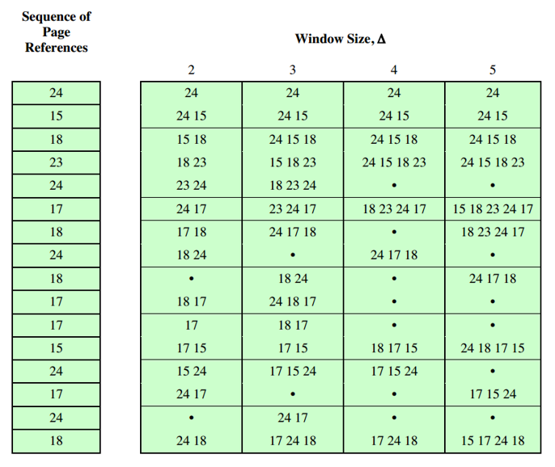  
可以看到$\Delta=2$时，波动范围为$1\sim2$；而$\Delta=5$时，一会只有$1$个，一会又有$5$个。

在后面决定每一时刻$t$实际使用的Frame数量时，就根据每个时刻$t$的$W(t,\Delta)$来决定。  
如果$W(t-1,\Delta)=4$，有$4$个页面，  
但$W(t,\Delta)=3$且命中，就会释放不在集合$W$里的那个页框。

---

局部性原理是基于进程在某一个函数中运行得到的，  
也就是如果进程运行在一个函数中，那么工作集是**趋于稳定**的，对应下图的"Stable"状态，  
但如果从一个函数跳转到另一个函数，这个过程中页面就会**突变变多**，后面再**趋于另一个函数的稳定**状态，  
这个抖动则对应下图的"Transient"，此时预测就不靠谱。

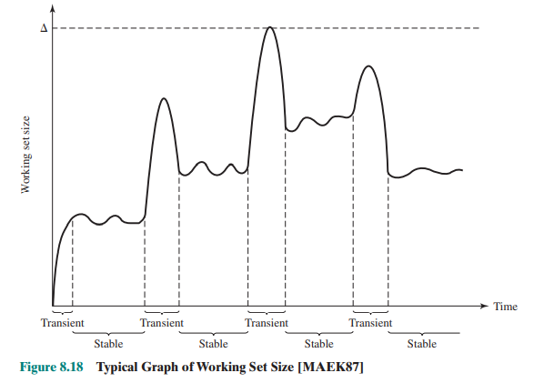

### 5. Clearing Policy - 清除策略

摸！……

### 6. Load Control - 加载控制

摸！……
