# Ep.4 Scheduling - 调度

内存中存在多个进程，  
每个进程要么在处理器上运行(Running)，要么在等待处理器运行或某事件发生(Not running)。  
因此需要研究处理器对进程的调度方法。

**目的**：  
让进程以系统任务要求的方式，被处理器安排执行，  
比如响应时间要求(Response time)、吞吐率(Throughput)、处理器效率(Processor efficiency)等。

## 一、Types of Processor Scheduling - 处理器调度的类型

根据处理器执行某功能（状态切换）时的相对时间比例(Relative time scales)，分为以下三类：

* Long-term scheduling - 长程调度  
  为进程创建(New → Ready(R/S))的调度。
* Medium-term scheduling - 中程调度  
  为换入换出内存(Ready(Blocked) ⇌ R/S(B/S))的调度。
* **Short-term scheduling - 短程调度**  
  为就绪态转入运行态(Ready → Running)的调度。
* *I/O scheduling - I/O调度  
  为可用I/O设备决定处理哪个进程的I/O请求时的调度。

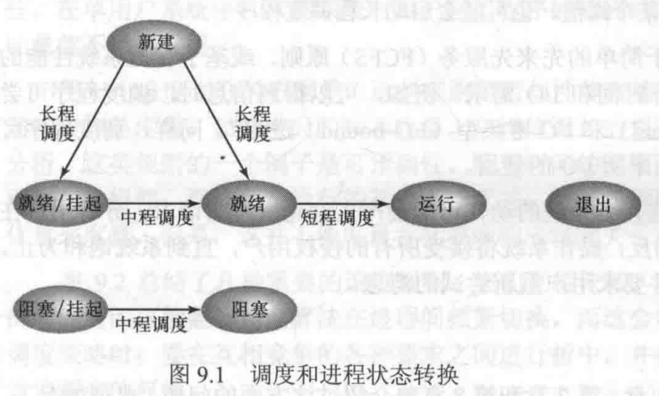  
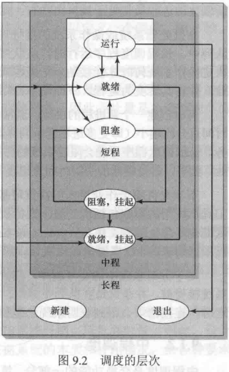

前三种属于处理器调度(Processor scheduling)，  
第四种将在后面着重讲解。

长程调度与中程调度属于系统并发度有关，于之前有讲，【？……  
因此本章主要讨论**短程调度**。  
且只考虑简单的单处理器系统的调度情况。

### 1. Long-term Scheduling - 长程调度

长程调度为被调度作业或用户程序**创建进程**、**分配**必要的系统**资源**、并将新创建的进程**插入Ready队列**。  
对于支持交换操作（换入换出）的系统来说，新加载的进程可能会进入Ready/Suspend队列。

决定以下事项：

* **Which** programs are **admitted** to the system for processing?  
  决定**哪些**程序被**加载**到系统中变为进程从而执行。  
  取决于调度算法。
* **How many** programs are admitted to the system?  
  决定多少个程度被加载。  
  取决于系统并发度(Degree of multiprogramming)。
* **When** does the scheduler be invoked?  
  决定该调度算法何时执行。
  * 当有进程终止退出(Terminate)时。
  * 当处理器空闲(Idle)超过一定时间(Threshold, 阈)时。

### 2. Medium-term Scheduling - 中程调度

中程调度为换出到磁盘的进程进入内存准备执行，或者反之。

* 配合“对换技术”使用。
* 目的是提高内存的利用率和系统吞吐量。

### 3. Short-term scheduling - 短程调度

也称"Dispatcher"（分派程序）。

* 决定内存中哪一个进程被处理器执行。
* 执行频率最高，且快速。

当当前进程阻塞，或需要抢占(Preempt)当前进程时，执行短程调度
常见发生短程调度的时机如下：

* Clock interrupts - 时钟中断
* I/O interrupts - I/O终端
* Operating system calls - 操作系统调用
* Signals - 信号发生

## 二、Criteria & Policies of Scheduling - 调度算法的规则与策略

### 1. Short-term Scheduling Criteria - 短程调度算法规则

需要对各种短程调度策略建立评判规则，  
通常有两种维度的划分分为“面向用户”和“面向系统”两个维度。

* 面向维度
  * **User-oriented** - 面向用户的规则：如响应时间(Response time)。
  * **System-oriented** - 面向系统的规则：如吞吐量(Throughput)。
  
  面向用户的规则对所有系统都很重要；  
  面向系统的规则在单用户系统(Single-user systems)中重要性较低。
* 性能维度
  * **Performance-related** - 与性能相关的规则：定量的，如响应时间和吞吐量。
  * **Non-performance related** - 与性能无关的规则：定性的，如可预测性(Predictability)。

各种调度规则如下图：

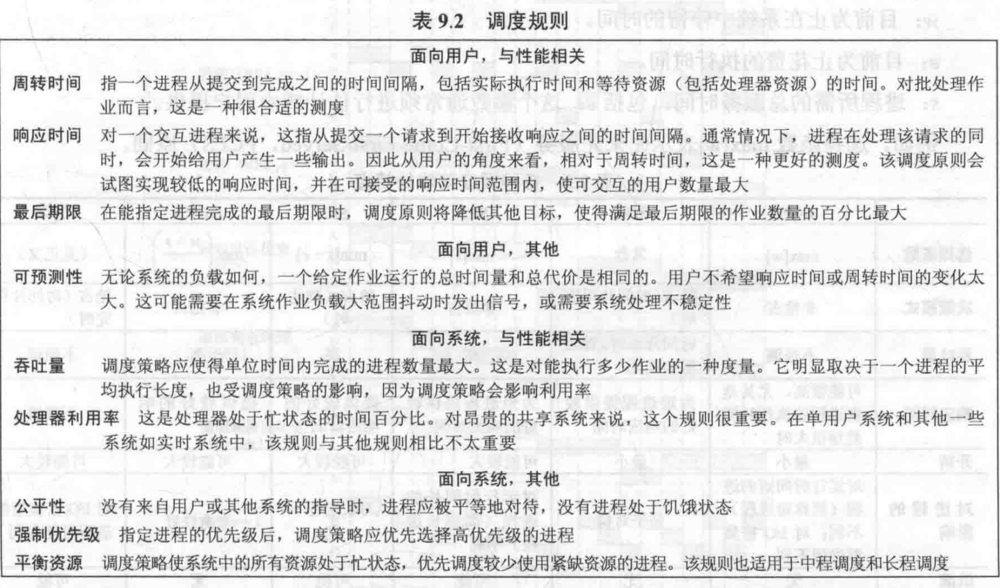  
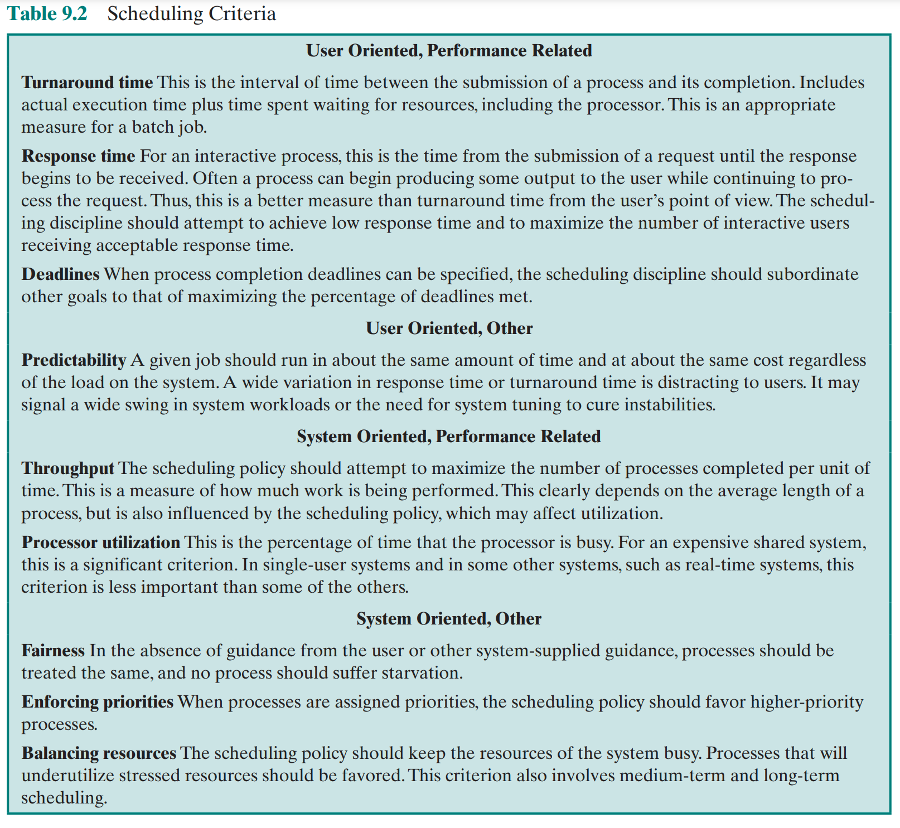

### 2. Priorities of Processes - 进程的优先级

当OS对进程分配了不同的优先级(Priority)时，  
则执行调度时需要考虑优先级。

可用排队模型表示存在优先级的调度方式：  
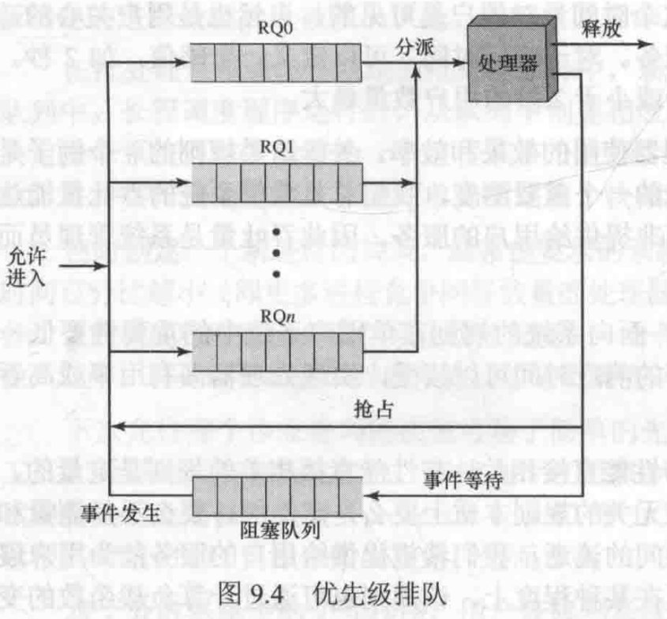
其中简化了多个阻塞队列，并省略了挂起队列。

用$RQ$代表不同优先级队列，  
队列按照优先级递减的顺序排列，即$[RQ_i]>[RQ_j] (i>j)$。  
*需注意：在UNIX中，值越大代表的优先级越小，与上述规则反之。*

则执行短期调度时：

* 若高优先级队列($RQ_0$里存在进程，则从高优先级队列中选取进程。
  * 对于高优先级队列内部的进程，根据具体的短程调度决策(Scheduling policy)决定。
* 若高优先级队列为空，则从下一级优先级队列($RQ_1$)中选取进程。

存在的问题为：  
处于低优先级的进程可能长期处于饥饿状态(Starvation, 指得不到处理器资源的分配)，  
若不希望该情况出现，可以让优先级随时间(age)或执行历史(execution history)而变化。

### 3. Elements of Scheduling Policies - 调度策略的要素

#### (1) Selection Function - 选择函数

处理器会根据这个选择函数，  
来选择在Ready中的哪一个进程，转到Running执行。

故各种调度算法实际上就是决定这个选择函数如何编写。

存在三个关键参数：

* $w$ - **到达时间**  
  Time spent in system so far, waiting.  
  在Ready中等待了多长时间。
* $e$ - **执行时间**  
  Time spent in execution so far.  
  此刻位置该进程执行了多少时间。
* $s$ - **服务时间**  
  Total service time required by the process.  
  一个进程以及它所需的服务需要多少时间。

选择函数则为这三个参数的函数：
$$
f(w,e,s)
$$

但只根据这三个参数来判断有些简陋，其只考虑了时间，  
因此不满足评价指标中的内存指标等。

#### (2) Decision Mode - 决策模式

说明选择函数开始执行的瞬间处理方式，指是否能中断当前运行进程，  
分为以下两类：

* Preemptive - 允许抢占  
  当前正在运行的进程可能被OS中断，并转为Ready。
* Nonpreemptive - 非抢占  
  这种模式下，一旦进程处于Running，则会不断执行直到终止，除非因等待I/O或服务被阻塞。

抢占策略与非抢占策略相比，虽然会带来更大的开销，但能更加公平地为所有进程服务。  
使用有效的抢占却略，提供较大内存，可以降低抢占带来的开销。

#### (3) Turnaround Time (TAT) - 周转时间

* Turnarount Time - 周转时间  
  为驻留时间$T_r$，或说该进程在系统中花费的总时间（等待时间$w$+服务时间$s$）。  
  $$
  TAT(T_r)=w+s
  $$
* Normalized Turnarount Time - 归一化周转时间  
  为驻留时间$T_r$与服务时间$s$的比值。  
  $$
  nTAT=T_r/s=\frac{w+s}{s}
  $$
  描述一个进程的相对延迟(Delay)情况。  
  比值越大，代表服务级别(level of service)越低。

## 四、Alternative Scheduling Policies - 可选择的调度策略

考虑两点问题：

1. 什么时候做决策（什么时候计算选择函数）
2. 怎么做决策（怎么算选择函数）

### 1. First-Come-First-Serverd (FCFS) - 先到先服务

* 选择函数$f(w,e,s)$：
  $$
  f()=\max(w)
  $$
* 决策模式：非抢占。

就谁先来，谁Running。

评价：

* **公平性好**（因为谁先来就谁先执行）。  
* 更**偏向长进程**，对短进程不友好。
* **对处理器密集型进程(Processor-bound Processes)有利**，但不利于I/O密集型进程(I/O-bound Processes)。  
  * 当执行到一个PBP时，其他所有IOBP需要等待，而不能执行后放入Blocked，I/O空闲。
  * 当PBP完成后，IOBP迅速通过处理器并占用I/O，使一些PBP不能使用I/O而Running，处理器空闲。
* 故FCFS可能导致处理器和I/O设备都不能得到很好的利用，**利用率低**。

FCFS本身对单处理器系统而言不太适用，  
但其搭配优先级策略后会成为很有效的调度方式，  
因此大部分调度策略都是选择FCFS+优先级策略。

### 2. Round Robin (RR) - 轮转

* 选择函数$f(w,e,s)$：
  $$
  f()=\max(w)
  $$
  *虽然书上写的是$f=C$为常数，但实际上选择的时候还是跟FCFS策略一样，个人这样写好理解些。*
* 决策模式：抢占，发生于$e>q$时（$q$为时间片）。

是对FCFS针对短进程不友好现象的改进。

增加了一个时间片(Time slice)的限制$q$，  
当进程执行时间$e>q$时，则**抢占**(interrupt)进程。

> 讨论 - 对于$q$的选取：
>
> * 由于进程切换、调度等都需要额外开销，所以$q$不能太小
> * $q$太大，则退化为FCFS
>
>一般将$q$定为略大于一次典型交互的时间。

评价：

* 在通用的**分时系统**(Time-sharing System)和**事务处理系统**(Transaction System)中**特别有效**。
* 仍然**偏向PBP**，对IOBP不公平。  
  因为对于IOBP，在进入处理器较短的时间内（通常会小于$q$）便需要I/O操作进入BLocked；  
  而PBP则能完整的使用掉一个时间片$q$。  
  导致**IOBP性能降低**，使用**I/O设备低效**，**响应时间变化大**。

> 拓展 - 虚拟轮转法 (Virtual Round Robin, VRR)
>
> 针对IOBP的不公平性，该方法新增了一个FCFS辅助队列(Auxiliary queue, 辅助队列)。  
> 当因I/O阻塞的进程事件发生时，则不再普通的回到Ready中，而是来到这个辅助队列。  
> 这个队列里的进程优先级都高于Ready中的，因此会使IOBQ更快速被执行。
> 数据表明，这个方法比RR确实更公平。

### 3. Shortest Process Next (SPN) - 最短进程优先

* 选择函数$f(w,e,s)$：
  $$
  f()=\min(s)
  $$
* 决策模式：非抢占。

选择服务时间最短的执行直至完成。  

评价：

* 对**短进程友好**。
* **响应时间**整体有明显**提升**。
* 响应时间波动性增加，**降低了可预测性**。
* 真实的**服务时间$s$很难确定**。
* 如果持续提供短进程，**长进程**则可能处于**饥饿(Hunger)**。
* 因为缺少抢占机制，在**分时系统**和**事务处理系统仍不理想**。

---

对服务时间的估计：

由于生产环境中，相同作业会频繁运行，  
故可以收集它们的统计值，求平均来估计服务时间$s$。

记：$S_{i+1}$代表第$i+1$个实例的估计服务时间，$T_i$为观测记录的第$i$个实例的实际服务时间。
平均值的计算有以下方法：

1. 简单算术平均
   $$
   S_{n+1}=\frac{1}{n}\sum_{i=1}^n T_i
   $$

   为了避免重复求和计算，可以改写为$S_{n+1}=\frac{1}{n}T_n+\frac{n-1}{n}S_n$
2. 指数平均  
   算术平均对每个实例的权重相同，但实际上我们希望对最近发生的实例以更高权重【*肯定更信最近发生的实例啦.jpg……*
   $$
   S_{n+1}=\alpha T_n+(1-\alpha)S_n
   $$
   $\alpha(0<\alpha<1)$为常数加权因子。  
   这样在计算的时候，越旧的实例的权重就越小。

   当$\alpha$越接近$1$时，平均值则能更快速放映观测值的迅速变化，  
   但会导致微小的波动便立即影响到平均值，使其急剧变化。

### 4. Shortest Remain Time (SRT) - 最短剩余时间

*就是SPN的抢占版。*

* 选择函数$f(w,e,s)$：
  $$
  f()=\min(s-e)
  $$
* 决策模式：抢占，发生于新进程加入Ready时。

调度程序(Dispatcher)总是选择预期剩余时间最短的进程。

当新进程加入Ready时，则会与当前Running进程相比，  
若预期剩余时间更短，则发生抢占。

评价：

* 对**短进程更加友好**（偏向）。
* 不会像RF一样有额外的中断（**中断次数较少**）。
* 从周转时间(TAT)来说，SRT性能好于SPN。
* 同SPN，仍有**长进程饥饿**风险。
* 需要**记录**过去的服务时间（**执行时间**$e$），增加了开销。

### 5. Highest Response Ratio Next (HRRN) - 最高响应比优先

* 选择函数$f(w,e,s)$：
  $$
  f()=\max(\frac{w+s}{s})=\max(nTAT)
  $$
* 决策模式：非抢占。

归一化周转时间(nTAT)能反映响应比，可以作为性能测度。

该算法使这个值平均最小，  
因此每次选取nTAT最小的进程执行。

评价：

* 效果不错，其说明了进程的**年龄(age)**。  
  刚开始偏向短作业，  
  但随着长进程长期得不到服务（年龄增高），$w$增加值变高，从而在竞争中赢过短进程。
* 也需要估计服务时间$s$。

### 6. Feedback - 反馈法

* 该算法不是用简单的选择函数$f(w,e,s)$来决定，  
  而是划分成不同的优先级队列来选择。

  但总体选择的是最小的运行时间$\min(e)$。
* 决策模式：抢占，发生于$e>q$时（$q$为时间片）。

该方法优先**考虑短作业**，并且**不用计算服务时间**$e$，  
方法为：对运行时间较长的作业进行处罚。

新进程进入最高优先级队列$RQ_0$
进程每次**被抢占后**，则将**优先级降低**，  
使得短进程因迅速执行完，优先级影响不大；  
而长进程则因被抢占多次，优先级多次降低，渐渐抢不过短进程。

对于**同一优先级队列**的进程，除了最后一级外，简单**采用FCFS**即可。  
**最低级的队列**，因为抢占后会回到该队列（不能再降低），所以可用**RR**。

评价：

* **新进程、短进程会优先**于老进程、长进程。
* **长进程的周转时间**可能会惊人地**增加**。
* 新作业频繁进入，**长进程**仍然可能**饥饿**。  
  改进方法：
  1. 记录等待时间$w$，超过一定阈值时则升级。
  2. 对不同优先级的等待队列$RQ_i$，安排不同的时间片$q_i$（可取$q_i=2^i$）。

---

各种调度策略的特点如下：  

调度进程按照各调度算法的安排示例可见下图：  
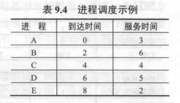 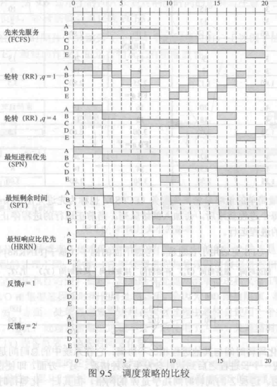

一般都用前两个策略（FCFS、RR），  
因为$w$（等待时间）完全可以确定，多久到就是多久，  
但对于$s$（服务时间）不能完全确定，只能估计。

## 五、Performance Comparison - 性能比较

各种调度策略的性能是选择调度策略的关键因素之一，  
但性能取决于各种各样的因素，不好直接比较。  
可以通过下面的分析方法得出一些结论。

### 1. Queneing Analysis - 排队分析

对于选择与服务时间$s$无关的任何调度原则，都满足以下关系：
$$
\frac{T_r}{T_s}=\frac{1}{1-\rho}
$$
其中：  
$T_r$为周转时间，指在系统中的时间、等待时间和执行时间的总和；
$T_s$为平均服务时间，是运行状态的平均时间；
$\rho$为处理器的利用率(Processor utilization)。

> 注意 - 处理器的利用率并不是越高越好：
>
> * 对于追求高吞吐量的系统来说（面向系统），处理器利用率自然越高越好。
> * 对于追求响应速度的系统来说（面向用户），高利用率从上式可看出，意味着用户即时请求得不到迅速的响应（$T_r$过长）。

*注：具体的分析方法涉及排队公式、泊松模型和指数服务时间，故略过公式推到部分，只给结果。*

以下考虑两个优先级类的情况，  
每个类中进程数相同，且低优先级类平均服务时间$s$是高优先级的$5$倍。  
以此来希望选择短进程。

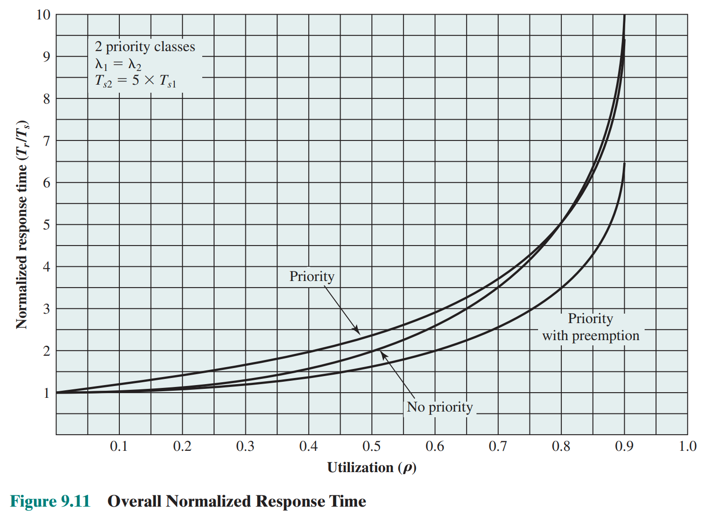  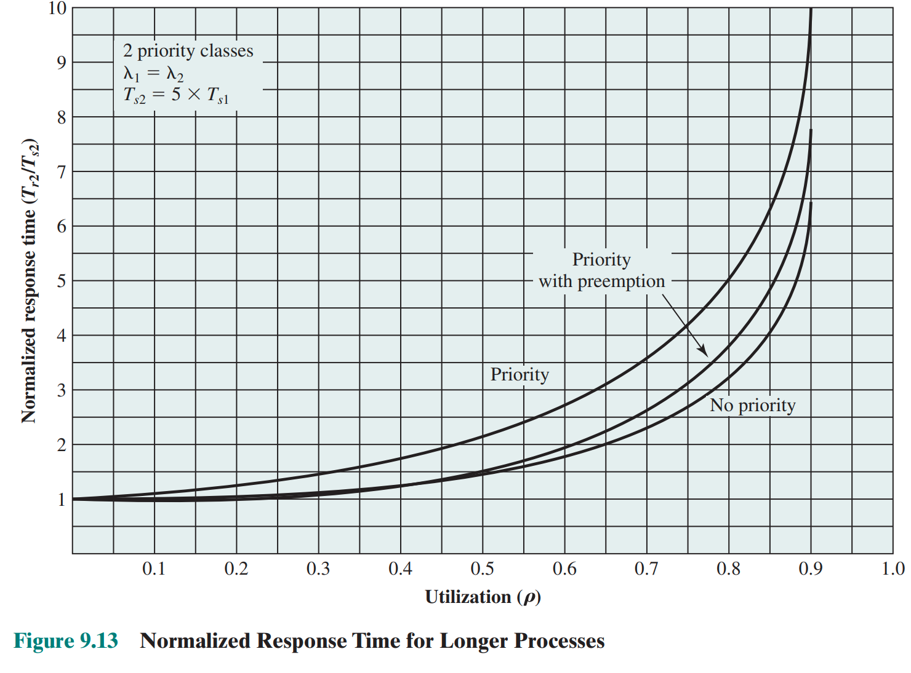

可以看到有以下三种情况：

* 整体性能并未有太大不同。  
* 考虑高优先级中短进程时，使用优先级以及抢占会使得性能提高。  
* 考虑低优先级中长进程时，则会使性能下降。

---

接下来将进程按照服务时间的百分比进行分组，每组500个进程。  
服务时间最短的500个进程在第一个百分点$1$，次短的一组在第二个百分点$2$……  
可以得到有关归一化周转时间$nTAT$和等待时间$w$与各长短进程的关系。

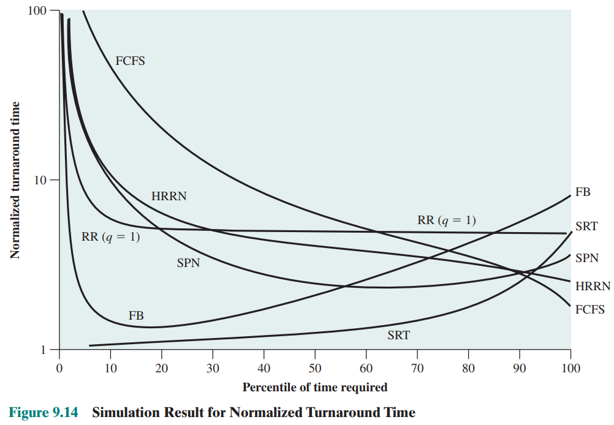 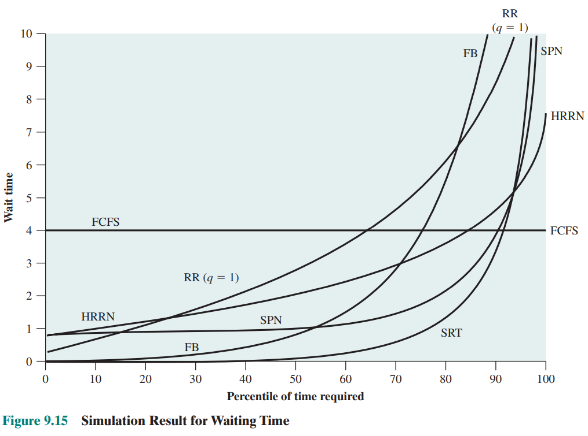

可以得到以下信息：

* 有关FCFS
  * 从$nTAT$看，FCFS的性能非常差，$\frac{1}{3}$的进程$nTAT$都超过了服务时间$s$的十倍，并且都是最短的进程。
  * 从$w$看，FCFS绝对等待时间一致，因为FCFS的调度算法与服务时间$s$无关。
* RR对所有进程的$nTAT$都约为$5$，因此公平对待所有进程。
* 除最短进程外，SPN法比RR好；而SRT除最长进程外，都比SPN好。
* FCFS更偏向长进程，SPN更偏向短进程，HRRN是两者折中。
* FB对短进程执行结果很好。

## 六、Fair-Share Scheduling - 公平共享调度

对于多用户系统，用户关心的不是某个特定的进程如何执行，  
而是构成应用程序的**一组进程**如何执行，  
因此需要产生**基于进程组(Process Sets)的调度策略**。  

这种方法则称为“公平共享调度”。
> 拓展 - 共享：
>
> 指的是多用户中不同用户对于系统资源的分配权重。  
> 每个用户被指定了某种类型的权值，这个权值定义了用户对系统资源的共享
>
> 如A权值是B两倍，则在长期结果看，A可以完成的工作是B的两倍。

公平共享调度程序(Fair-Share Scheduler, FSS)关心的则是“公平的共享”，  
需要监视(monitor)使用情况，对于占有较多资源(More than their fair share)的用户，则会分配较少资源(give fewer resources)；而对于占用较少的则分配更多，以达到公平。

---

调度方式：  
进程的优先级随着“进程**本身**使用处理器”和“进程**所在组**使用处理器”两个方面而降低。

* 对组内进程：实施某种调度策略，  
* 对组间进程组：实施RR。

  
对于组间：处理器的$50\%$分配给第一组A；$50\%$分配给第二组B和C。
