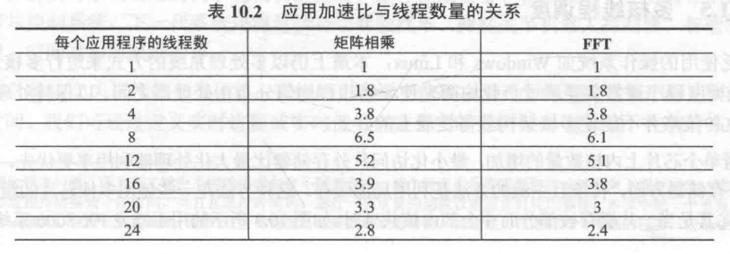
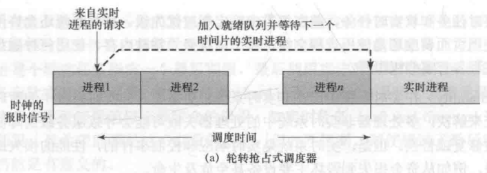
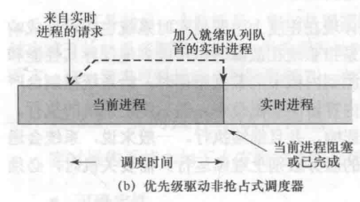
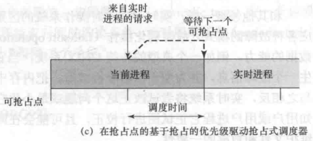
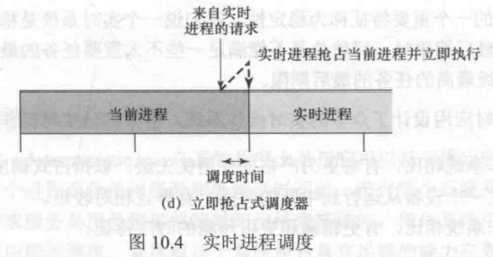

# 第二节 Multiprocessor Scheduling - 多核处理器调度

当从上节中的一个处理器，扩展到多个处理器时，便会出现各种问题。

自己一个人的时候想怎么做就怎么做，自己约定一套规则自己做就行，  
但人一多起来，就要涉及到统筹安排了。  
因此需要考虑多核系统如何进行调度。

并且一个人的时候只能做一件事，挨着慢慢做就行，  
人多的时候，即可以让多个人同时做一份工作，就需要考虑任务的子任务  
因此需要考虑“**线程**”这一单位了。

## 一、Multiprocessor and Multicore Scheduling - 多处理器与调度

多处理器系统，也分为以下三类：

* [Loosely coupled/Distributed] Multiprocessor, Cluster - 松耦合、分布式多处理器，集群  
  由一系列相对自治的系统组成，每个处理器都有自身的内存和I/O通道（个人理解为多个处理器之间互相独立，甚至可以看成n个单核计算机）。
* Functionally specialized processors - 专用处理器  
  有一个通用的主处理器，专用处理器由主处理器控制，并为主处理器服务。
* Tightly coupled multiprocessor - 紧耦合多处理器  
  操作系统完全控制所有的处理器，共享同一个内存。

本节主要介绍紧耦合多处理器系统。

> 拓展 - 紧耦合和松耦合的区别：
>
> * 紧耦合：处理器共享内存，因此数据间传输速率快、交互快、反应快，用于实时、并行处理系统。
> * 松耦合：每个处理器有独立的内存，数据见传输慢、交互慢、反应慢，用于分布式系统。

### 1. Granularity - 粒度

描述进程之间的**同步度**（并行性）。

可以划分成五种粒度：

1. Fine - 细
2. Medium - 中等
3. Coarse - 粗
4. Very Coarse - 极粗
5. Independent - 无约束

#### (1) Independent Parallelism - 无约束并行性

为独立无关的应用或作业，进程间**没有显式的同步**。

典型应用是分时系统，每个用户执行一个特定的应用。

#### (2) Coarse/Very Coarse-Grained Parallelism - 粗、极粗粒度并行性

进程之间存在同步，但同步级别很粗。  
可以处理为多道程序单处理器上的并发进程。
> 拓展 - 多道程序：
>
> 内存中支持多个进程并发执行（注意不是并行），  
> 就可以理解为支持多进程调度的单核处理系统。  
> 对应单道程序则是内存中同时只能存在一个进程。

当进程间的交互不频繁时，采用“分布式系统”能提供很好的[加速比](../../Ep.2%20Process%20Management/2.%20Thread/2.2-Pocess_Management-2.md#三multicore-→-multithread---多核与多线程)(Speedup)。  
但当交互开始频繁时，其使用网络通信的开销可能会抵消带来的加速比，  
因此采用多处理器组织结构会更好。

#### (3) Medium-Grained Parallelism - 中粒度并行性

为**线程级并行**。  
即对应进程中的线程。

需要程序员显式地指定应用程序潜在的并行度。

应用程序中的各线程**交互非常频繁**。

#### (4) Fine-Grained Parallelism - 细粒度并行性

为**指令级并行**。  
比线程更加复杂。

### 2. Design Issues - 设计的问题

多处理器的调度涉及三个问题：

1. Assignment of processes to processors.  
   如何把进程分配到处理器。
2. Use of multiprogramming on individual processors.  
   在每个处理器上如何管理多个进程（单处理器上的多道程序设计）。
3. Actual dispatching of a process.  
   一个进程的实际分配。
  
所用方法取决于两个指标：

1. Granularity of the applications - 应用程序的粒度级
2. Number of processors available - 可用处理器数量

#### (1) Assignment - 把进程分配到处理器

若处理器结构统一、性能一致，没有优势处理器，  
则可以将所有处理器视为一个资源池，按照要求将进程分配到相应处理器。

存在两种分配方式：

* Static - 静态分配  
  进程一旦分配到某个处理器，则不会再变化。
* Dynamic - 动态分配  
  进程能在不同的处理器队列间转移。

---

针对分配程序（Dispatcher, 操作系统的核心功能，用于其他进程的调度），也需要分配处理器，  
存在两种方式：

* Master/Slave Architecture - 主从式结构  
  OS的核心功能总**运行在某个特定的处理器**上，称为主处理器。  
  主处理器负责调度作业，其他处理器则执行用户程序。
* Peer Architecture - 对等式结构  
  OS能在任何一个处理器上执行。  
  增加了操作系统的复杂性。

#### (2) Multiprogramming - 在单处理器上使用多道程序设计

如果采用静态分配，需要考虑处理器是否支持多道程序，  
否则如果某进程因等I/O被阻塞，则会产生资源的浪费。

但多处理器中不用再关心处理器的利用率，  
而是怎么为应用提供最好的平均性能。

#### (3) Dispatching - 进程分派

选择哪个进程运行。  

多道程序单处理器上，其他非FCFS的策略可能提高性能，  
但多处理器上却不必要，甚至可能会有反作用。

### 3. Processor Shceduling - 进程调度

对于多核处理器，因为各调度算法性能差不多，**直接采用FCFS**。

### ⭐4. Thread Scheduling - 线程调度

多处理器系统才能发挥线程的全部实力，  
可以开发应用程序中真正的**并行性**。

当一个应用程序的各个线程都在独立的处理器执行时，性能则会显著提升。  
但线程管理调度方法不同，会对形成产生较大影像。

存在四种方法：

* Static scheduling - 静态调度
  * Load Sharing - 负载分配
  * Gang Scheduling - 组调度
  * Dedicated processor assignment - 专用处理器分配
* Dynamic scheduling - 动态调度

#### (1) Load Sharing - 负载分配

一个处理器 → 所有线程。  
相当于处理器选择线程。

将负载均匀地分派到每个处理器上。  
系统维护一个Ready的全局队列，只要有处理器空闲，就从队列里选择一个线程。  
因此线程会在所有处理器上游走。

* 方法：
  * First-come-first-served (FCFS) - 先来先服务
  * Smallest number of threads first - 最小线程数优先（Preempt版）。
  * Preemptive smallest number of threads first - 最小线程数优先（非Preempt版）
* 优点：
  * 确保有工作可做时，处理器不会有摸鱼的。
  * 不需要集中调度程序，每个处理器自己根据调度例程，直接从全局队列里拿来。
* 缺点：
  * 全局队列的查找为瓶颈（大量处理器同时在队列进行查找工作时）。
  * 如果被抢占的进程不在同一个处理器上恢复，要给每个处理器配备个高速缓存，效率低。
  * 如果将所有线程视为一个公共的线程池，当一个程序的线程需要高度合作时，进程切换则会影响性能。

*但仍是用得最多的方案。*

#### (2) Gang Scheduling - 组调度

一个处理器 → 一组相关的线程。

给线程分配了组，不能在所有处理器上游走。  

能使得进程的开销变得最小。  
对处理器时间片分配的方法：可以直接根据进程数平均分，也可以根据线程数加权。

#### (3) Dedicated Processor Assignment - 专用处理器调度

若干处理器 → 一组相关的进程。  
相当于线程选择处理器。

能最大程度利用线程的并行性，  
但也最浪费资源。

  
在8个线程之前，因为每个线程都能利用，加速比增加；  
在8个线程之后，便会有线程分配不到处理器，加速比下降。

#### (4) Dynamic Scheduling - 动态调度

进程中线程的数量可以动态改变。

【*新技术，不是很明白，等慢慢摸索……*

## 二、Real-Time Systems - 实时系统

### 1. Definition - 定义

所谓实时，即是要**即时响应**外部事件。  
如交通管制系统，比如即使根据交通状况（外部事件），做出相应的指令（即时响应）。

实时计算现在越来越重要，而操作系统的**调度程序**是其中最关键的部件。  
【*否则乱调度都摸鱼的话，怎么可能做出即时响应……*

在实时系统中，**进程(Process)与任务(Task)不做区分**，  
一个进程创建出来就是为了即时完成一个任务的。  
**一般都称为Task**。

---

对于实时系统正确性的评价，取决于两个方面：

* Logical Result of the Computation - 运算逻辑结果  
  就是你结果算对没有、响应得对不对。
* **Time the Result Produced - 结果响应时间**  
  就是有没有及时给出结果。

要求及时响应，因此需要给出一个**最后期限"Deadline"**。
针对第2个方面的满足程度，分为两种实时系统：

* Hard real-time task - 硬实时任务  
  任务**必须满足在deadline内完成**，否则会带来不可接受的损失。
* Soft real-time task - 软实时任务  
  任务虽然也有deadline，但只是**希望能做到**，要求不那么严格。

---

实时任务另一个特征是周期性(periodic)。

* 周期性任务(Periodic task)：  
  要求“每$T$个单位执行一次”、“每隔周期$T$执行一次”。  
* 非周期性任务(Aperiodic task)：  
  需要明确规定起止时间（开始或结束的deadline），或者结束时间与开始时间的约束。

### 2. Characteristics - 特点

#### (1) Determinism - 可确定性

因为每个任务安排好了起止时间，并尽量希望按照这个时间执行。  
因此可以按照固定的、预先确定的时间或时间间隔执行任务。

度量方式可为：从高优先级设备**发起中断请求**，到**开始中断服务**之间的延迟。  
非实时操作系统，这一延迟可以达到几十到几百ms，  
而实时操作系统，这一延迟上限是几μ's到1毫秒。

#### (2) Responsiveness - 可响应性

从作业到达到第一次执行（响应）的时间。*【？……*  
与中断机制有关。

> 区别 - 可确定性与可响应性：
>
> *个人没找到有直接解释这两特性的定义说明，因此只能根据个人理解辨析，不一定正确。*
>
> * 可确定性：关注的是操作系统获知有一个中断之前的延迟。  
>   指某设备需要中断，传递给OS开始执行中断服务的时间（但此时中断服务还没开始执行，只是传达到了）。
> * 可响应性：关注的是OS为中断提供服务的时间。  
>   指的是完成这个中断响应所需要的时间。

#### (3) User Control - 用户控制

非实时系统中，用户对系统比较佛性，只要你能做完做正确就行，因此对OS的Dispatcher控制很少。  
而实时系统中，用户要严格规定deadline，因此必须精确地控制每个任务的优先级。

因此用户有更多控制的权限，  
如：区分软硬实时任务、确定优先级、指定一些特性（常驻内存、磁盘传输算法、权限等）。

#### (4) Reliability - 可靠性

非实时系统中，系统宕了就宕了，重启再执行就完事，反正时间有的是，  
特别是多核系统中，就算处理器坏了，就让他坏着让别的处理器忙，直到这个处理器被修好【*或者都坏了xd……*  
但实时系统中可不敢如此。

因此必须要保证实时系统的可靠性，  
否则会发生灾难性的后果（资金损失甚至危及生命）。

#### (5) Fail-Soft Operation - 故障弱化操作

正因为要保证可靠性，所以对一些错误故障能化解就化解了。

故障弱化操作指：系统在故障时，尽可能多地保存其性能和数据，  
非实时系统中发生故障，可能会产生故障信号，把内容储存到磁盘，然后终止系统的执行；  
而实时系统中发生故障，**尽量不会终止系统**，而是尝试改正错误或最小化其影响，并继续执行。
即便要关机，也要维护文件和数据的一致性。

因此实时系统有一些容错机制。

---

故障弱化运行还有个重要特征称为**稳定性**(Stability)，  
但这里指的是：  
即便这个系统总是不能满足一些不重要任务的deadline，它也总能**首先满足最重要**、优先级最高**任务的deadline**。

### 3. Types & Informations of Real-Time Process Scheduling - 实时系统调度的种类和所需信息

#### (1) Analysis of Uniprocessor Scheduling - 单核调度算法分析

可以先分析之前的非实时系统调度算法，拿来能不能直接用。

1. RR Preemptive Scheduler - 基于时间片的轮转  
     
   实时进程必须等待之前的进程时间片都用完，才轮到它。  
   因此直接难以接受。
2. Priority-dirven Nonpreemptive Scheduler - 基于优先级的非抢占  
     
   因为不能抢占，即便有了优先级是下一个执行，但也要等正在执行的进程结束或阻塞。  
   所以一般也不能接受，除非要求不严格。
3. Priority-dirven Preemptive Scheduler - 基于优先级的抢占  
     
   会在进程中设置可以抢占的时间点（基于时钟分配），  
   如果实时进程降临，会在下一个可抢占的时间点进行中断。  
   *注：进程不能总是立刻中断，如在原语操作时，必须等原语执行完。*

   但需注意⚠：不一定实时系统都要求能抢占，因为**抢占也有开销**。
4. Immediate Preemptive Scheduler - 立即抢占  
     
   只要不是原语或者临界区等完全不能中断的地方，都会直接立刻中断。

对于第二、三种就可以接受了，  
若需要更严格的中断机制，则采用第四种。

#### (2) Types of Real-Time Scheduling - 实时调度的种类

而针对专门的实时系统调度算法，  
唯一目的就是“在deadline之前完成”。

但大多数现代实时系统无法直接处理任务截止时间，  
只能提高响应速度，以尽快调度任务。

有三个步骤：

1. 是否执行可调度性分析(Schedulability Analysis)。  
   只是根据策略分析出某个进程能否被调度，而不会具体选择。
2. 如果执行动态分析还是静态分析。  
   静态：分析好后结果不变化或者很难变化；动态：根据当前进程随时调整分析。
3. 当分析完后，是否得到一个调度计划(Scheduler Plan)。  
   若得到调度计划，则可以严格按照这个计划来执行调度，但通常很难得到。

则有以下算法的**类型**：

* Static table-driven approaches - 静态表调度法
  1. 所有任务运行前就执行分析。
  2. 静态分析。得到表后很难更改。
  3. 能得到一个调度计划。可以根据调度发确定所有任务何时执行。

  只适用于**确定的周期性任务**，所有的调度都根据静态表来完成，  
  可预测但十分不灵活，静态表一生成就很难更改。

  “最早截止时间优先”(EDF)则属于此类。
* Static priority-driven preemptive approaches - 静态优先级抢占调度法
  1. 所有任务运行前就执行分析。
  2. 静态分析。分析出优先级后很难更改。
  3. 不得到调度计划。只给出任务的优先级，让调度程序根据优先级调度。  
  
  类似于非实时系统中的“基于优先级的抢占式调度”，  
  不过优先级决定**只与任务的限定时间**有关。

  如“速度单调算法”(RM)则属于此类。
* Dynamic planning-based approaches - 基于动态计划的调度法
  1. 在任务运行时动态分析。
  2. 动态分析。会随着新到达的任务和正执行的任务而创建新调度表。
  3. 能得到一个调度计划。也相当于个表，不过是动态变化的。
  
  在新任务到达后，再创建一个新的包含自身和之前任务的调度计划。
* Dynamic best effort approaches - 动态尽力调度法
  1. 不分析。试图满足所有的deadline，终止在运行但错过deadline的进程。
  2. /
  3. /

  实现简单，广泛运用在**非周期性**的实时任务。

#### (3) Informations of Real-Time Scheduling - 实时调度所需信息

当代实时系统设计目标：

* Real-time operating systems are designed with the objective of **starting real-time tasks as rapidly as possible**.  
  能尽可能快速地启动实时任务。
* OS emphasizes **rapid interrupt** handling and **task dispatching​**.  
  强调快速的中断处理和任务分配。
* Real-time applications are generally not concerned with sheer speed but rather with **completing tasks at the most valuable times**.  
  不关注处理任务的绝对速度，而关注在最有价值的时间内（一般就是deadline前）完成任务。
* **Priorities** provide a crude tool and do not capture the requirement of completion at the most valuable time​.  
  优先级提供了一个强有力的工具，让实时系统不再按照在最有价值的时间内完成任务来选择（而是优先级）。

所需知道每个任务的额外信息如下：

* Ready time​ - time task becomes ready for execution​.  
  就绪时间：任务开始准备执行的时间。  
  
  对于重复的周期任务，是一个事先知道的时间序列；  
  对于非周期任务，要么也知道这个时间，要么只知道什么时候真正就绪（就只你就绪了后我才知道）。
* Starting deadline​ - time task **must begin​**.  
  启动最后期限：任务必须开始的最晚时间。
* Completion deadline​ - time task **must be completed​**.  
  完成最后期限：任务必须完成的最后时间。

  通常是要么有Starting DD，要么是有Completion DD，**不会两者同时存在**。
* Processing time​ - time required to **execute** the task **to completion​**.  
  处理时间：从执行任务到完成任务所需时间。

  可以手动给出，也可以由操作系统估计（指数平均值）。
* Resource requirements​ - **resources required** by the task while it is executing​.  
  资源需求：任务在执行时所需要的资源集（处理器以外的资源）。
* Priority​ - measures **relative importance** of the task​.  
  优先级：度量任务的相对重要性。

  Hard real-time tasks可能具有“绝对优先级”。
* Subtask scheduler​ - a task may be decomposed into a **mandatory subtask** and an **optional subtask**​.  
  子任务结构：一个任务可分解为一个必须执行的子任务，和一个可选的子任务。

  只有mandatory subtask拥有硬最后期限(hard deadline)。

### 4. Examples of Real-time scheduling

以下为具体的实时调度算法。

#### (1) Earliest Deadline First(EDF) - 最早截止时间优先

为一种期限调度(Deadline Scheduling)的算法，  
在这种调度算法中，最关注的只有deadline。

需要给出以下所需要的信息：

* Ready Time - 到达时间
* Starting deadline - 启动截止时间
* Completion deadline - 完成截止时间  
  和启动截止时间一般不会同时出现，只给其一。
* Processing time - 处理时间  
  处理时间小于等于周期时间，为其所需的运行时间。
* Resource requirements - 资源请求
* Priority - 优先级
* Subtask scheduler - 子任务调度
  * Mandatory subtask - 强制子任务  
    存在硬截止时间(Hard Deadline)
  * Optional subtask - 非强制子任务

最基本的元素：周期$T$和服务时间$C$，  
可能还有完成最后期限$D$。

决策方式：  

* 选择最早的deadline任务调度（最早截止时间优先），以求最小化错过deadline的任务占比。
* 如果给定的是**Starting deadline**，用**非抢占**的模式比较好。  
  给定的为起始截止时间的话，一般都对任务要求不严格。
* 如果给定的是**Completion deadline**，用**抢占**的模式比较好。  
  给定的为**Completion deadline**，一般是硬实时任务，因此需要抢占来即时处理。

---

对于周期性的任务：

* 给定**起始截止时间**，则用**非抢占**模式。  
  当某任务开始时间到达deadline后，则等正在执行的任务能被中断（非原语等），再中断并转到该到达deadline进程上。  
  *因此实际上为一种“抢占”方案，不过没那么明显。*
* 给定**结束截止时间**，则用**抢占**模式。  
  则强制抢占。

则：采用**静态表驱动**的**最早截止时间**的优先调度算法。

---

对于非周期性的任务：

可以采用最早截止时间优先(EDF)调度算法，或者允许CPU空闲的EDF算法。

允许CPU空间的EDF算法，即是完全优先调度最早截止时间的任务，  
即便他**可能还未就绪**，此时也**允许CPU空闲等待**他。

尽管CPU利用率不高，但能保证系统任务都按要求完成。

#### (2) Rate Monotonic Scheduling (RMS) - 速率单调调度

是一种优秀的处理周期性任务中多任务调度冲突的方法。

到达速率越快，优先级越高。
