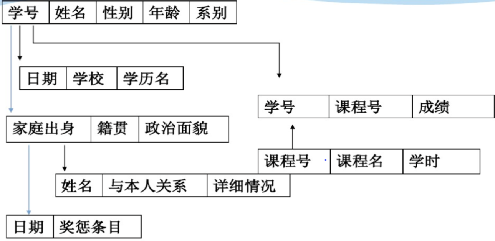
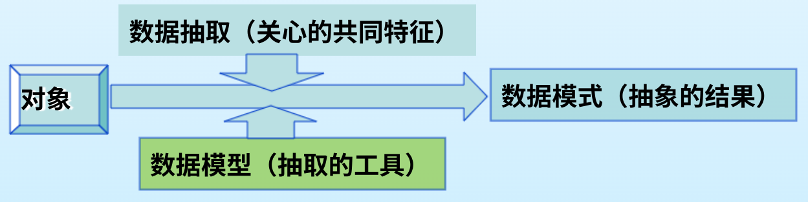
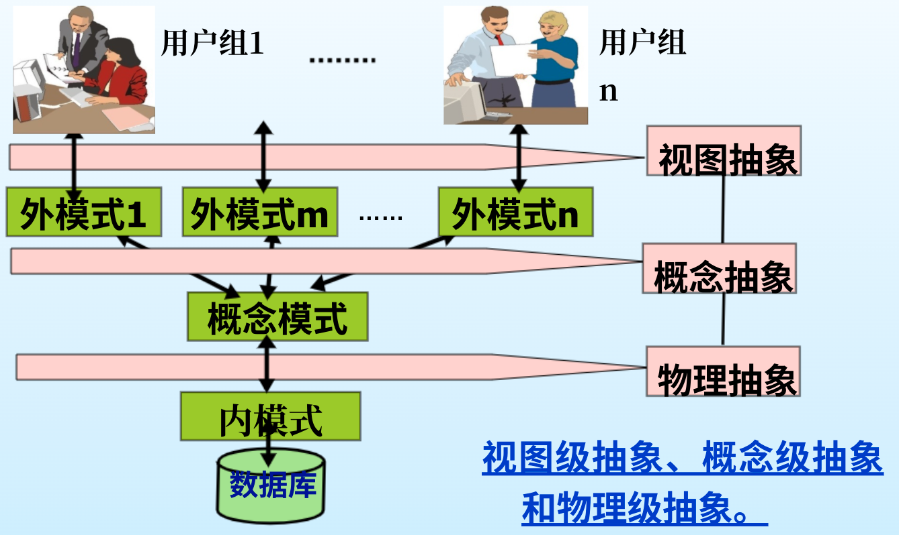
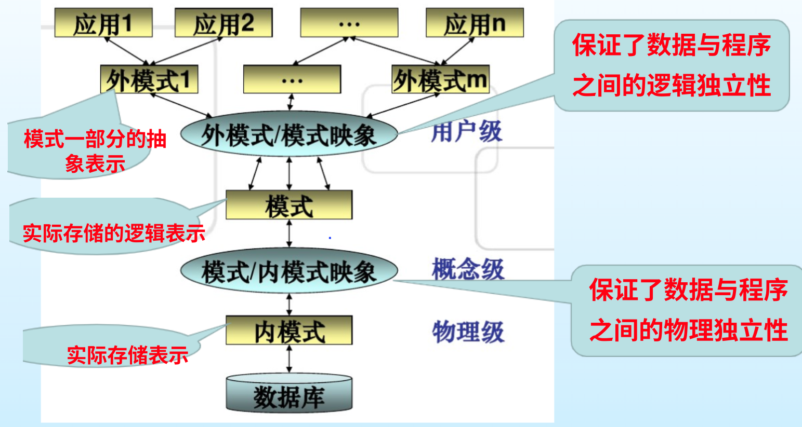

# Ep.1 数据库系统概述

整个数据库以数据管理系统(DBMS)为核心。

## 一、数据管理的发展

### 1. 人工管理阶段  

* 应用需求：科学计算
* 硬件水平：无直接存储存取设备
* 软件水平：没有操作系统
* 处理方式：批处理
* 数据的管理者：**程序员**
* 数据储存：**不保存**
* 共享程度：**无共享**
* 数据独立性：不独立，完全依赖于程序
* 数据控制能力：应用程序自己控制

### 2. 文件系统阶段  

*相当于简单的使用C语言中的`fopen`,`fclose`等文件命令，再搭配`struct`、链表等数据结构来储存数据。*

* 应用需求：科学计算、管理
* 硬件水平：磁盘
* 软件水平：**有文件系统**
* 处理方式：联机实时处理、批处理
* 数据的管理者：**文件系统**
* 数据储存：**长期保存**
* 共享程度：共享性差
* 数据独立性：独立性差，逻辑结构修改必须修改程序
* 数据的结构化：记录内有结构，整体无结构
* 数据控制能力：应用程序自己控制

优点：

* 能**永久储存**数据。
* 实现数据**部分的结构化**。
* 数据的管理者是**文件系统**，而不再是人工。

缺陷：

* 其数据（文件）与应用程序是强耦合的，数据的结构是靠程序定义和解释的，文件完全**依赖于程序**。
* 数据之间**不能共享**。
* 无法处理**超大量数据**。  
  链表要将数据一次性读入内存，而32位最高访问4G。
* 多用户**并发访问**，会产生问题和冲突。
* **故障情况**下的恢复。
* **安全性**的问题。
* 数据的**完整性**问题。  
  同一个数据可能出现在多个数据结构中（如学号），当修改之后所有都要修改。

此时应用程序有自己严格所对应的数据文件，所以不同的程序不能访问不同的文件，数据之间不共享。  
同时因为文件之间独立，所以数据整体无结构。  
*（比如学生就是学生系统的文件，课程就是选课系统的文件，学生和课程之间没有联系）*

## 二、DBMS的基本功能

针对文件系统的几大缺陷，数据库管理系统(DBMS)应运而生，  
因此DBMS即为抽出以下**五个公共功能**所形成的：

> 定义 - 数据库管理系统(DBMS)：
>
> 数据库管理系统是一个**通用**的软件系统，有一组计算机程序构成，**用于科学地组织和存储数据、高效地获取和维护数据。**

### 1. 数据独立性

将数据结构和数据文件与应用程序分离，数据完全**由数据库管理系统管理**，从而使数据独立于与应用程序。

存在以下两个方面的独立性：

1. 物理独立性  
   应用程序与存储在磁盘上的数据库中数据是相互独立的，因此用户不需要了解怎么存储，数据的物理存储位置改变了，应用程序不用改变。  
   关键：**存储位置**。
2. 逻辑独立性  
   应用程序与数据库的逻辑结构是相互独立的，数据的逻辑结构改变时，用户程序也可以不变。  
   关键：**数据结构定义**。
  
由于与应用程序独立，所以也解决了大容量数据的问题（不需要再预先读取所有数据）。

### 2. 数据安全性

提供授权子系统，每个用户或用户组有一个通过口令保护的帐户，并有不同的访问权限。

### 3. 数据完整性

DBMS建立了各种完整性约束，数据检验规则等，使得数据完整。

同时也完成了数据的**整体结构化**。  
*（比如对于学生，学号是最关键信息，有学号就能完全确定这个学生，其余数据都跟学号连接起来。）*

### 4. 并发控制

通过“事务”和“加锁”等方法实现多个用户访问不冲突。

### 5. 故障恢复

通过“日志”实现故障的恢复，数据库在执行某个程序发生故障后，DBMS也能通过日志恢复到这个程序执行前的正确状态。

## 三、数据库相关概念

### 1. 数据

> 定义 - 数据：
>
> 是描述现实世界中各种**具体事物**，或**抽象概念**的、可存储并具有明确意义的**信息**。

或者可以说：数据就是描述事物的**符号记录**。

特点：

* 数据与语义不可分割。  
  *（如"2020123456,小明"这条数据，小明的语义就是姓名）*

### 2. 数据库

> 定义 - 数据库：
>
> 是相互**关联**的**数据集合**。  
> 数据库中的数据是按一定的**数据模型**组织、描述和存储的。

如学校系统数据库，含有学生、教师、课程等相关数据。

特点：

* 永久存储
* 有组织
* 可共享

### 3. 数据库系统

> 定义 - 数据库系统：
>
> 在计算机系统中引入数据库后的系统构成，由**数据库**和**数据库管理系统**构成。

即为：DB+DBMS+数据库管理员+应用程序+用户

### 4. 数据库操作

数据库应用中，常见的操作有：

* 增加
* 删除
* 查找
* 修改

### 5. 视图

> 定义 - 视图(View)：
>
> 不同的视角截取同一数据库的子集，称为数据库的一个视图。

对于不同层次的用户，给出同一数据库的不同视图。  
*（如学生只需要学校数据库里的成绩信息，辅导员需要学校数据库里成绩、家庭情况等信息）*

## 四、数据库设计的相关概念

### 1. 数据抽象 (Data Abstraction)

是一种数据抽取的**过程**。

每一个事物有无限多个特征，根据不同用户需求抽取所关注的特征。  
*（如学生的特征：学号、姓名、监护人、身高、长相、皮肤颜色等）*

通过对数据不断地数据抽象，从而实现现实系统中的数据存放到DBMS的目的，  
也就是实现数据的计算机管理。

### 2. ⭐数据模型 (Data model)

是对数据进行抽象化表示、存储和操作的**工具**。

主要是用逻辑概念（如对象、对象属性、对象联系等）来表示数据。  
模型的好坏决定了数据库的性能。

#### 三个要素

1. **数据结构**：描述实体本身，以及实体之间的关系。
2. **数据操作**：增删查改。
3. **数据约束**：数据本身的约束（比如学号必须是数字），以及数据之间的约束（比如性别为男的同学宿舍号不能是女生宿舍）。  
   各种约束限定数据库状态以及状态的变化，以保证数据的合理。

#### 三个评价标准

因为数据模型就是对现实世界的模拟、描述或表示，所以有下面三个评价标准。

1. 比较真实地描述现实世界。
2. 易于为用户理解。  
   使用数据库的大多数用户都是计算机基础薄弱的一般人员，因此要易于理解。
3. 易于在计算机上实现。  

其中第二点与第三点之间存在一定矛盾。

### 3. 数据模式 (Data Schema)

数据根据数据模型抽取的**结果**。

对象通过数据模型来进行数据抽取，得到数据模式。  
也是描述数据的模板。

---

三者一个是过程、一个是工具、一个是结果，  
呈下图的关系：

## 五、数据库系统的抽象层次

存在三个抽象层次（阶段）：

### 1. 视图级抽象 - 外模式

针对不同用户组**各自的要求**，设计出多套视图(View)。

得到的为多套“**外模式**”，面向用户。  
> 定义 - 外模式：
>
> 外模式也称子模式或者用户模式，表示数据库用户能够使用的部分数据的逻辑结构和特征，是**用户的数据视图**。  
> 外模式面向用户，用于描述用户所关心的数据。

### 2. 概念级抽象 - 概念模式

将不同用户组的要求合并**统一**，并解决部分冲突加以约束。  

得到一套“**概念模式**”，**也称模式**。
> 定义 - 模式：
>
> 模式也称逻辑模式，表示数据库中全体数据的**逻辑结构、数据之间的联系、安全性和完整性要求**，是完整的数据视图。模式所描述的逻辑结构包含了整个数据库。

### 3. 物理级抽象 - 内模式

将统合起来的要求（概念模式）抽象成计算机能懂的数据库。  
**选择**合适的数据库管理系统，并将要求**建立**起来。  

得到一套“**内模式**”。
> 定义 - 内模式：
>
> 内模式也称存储模式，表示数据库中数据物理结构和存储结构。  
> 记录的**存储方式**（顺序存储，按照B树结构存储等）、**索引的组织方式**、数据**是否压缩存储、加密**等。

---

> 讨论 - 三层抽象的原因：
>
> 1. 传统的数据模型难以同时实现“易于被用户所理解”和“易于在计算机上实现”，  
>    因此需要分而治之，通过划分阶段，不同阶段采用不同的数据模型。
> 2. 三层抽象与数据库实际的设计过程相吻合，  
>    需要在分组调研设计的基础上进行整体设计，继而根据数据量及要求采用DBMS存储数据。

## 六、数据模型的分类

由于不同的抽象级别，数据模型也存在相应级别。

**最重要的为逻辑数据模型**。

### 1. 概念数据模型

面向用户、现实系统的数据模型，用于与用户交互。  
一般为ER图(ERM)。

对应视图级抽象、概念级抽象。

### 2. 逻辑数据模型

具体的DBMS能实现支持管理的数据模型，面向DBMS。  

如：

* **关系数据模型**
* 层次数据模型（树状）
* 网状数据模型

对应物理级抽象。

### 3. 物理数据模型

涉及数据的物理储存结构，具体存储在磁盘等的数据模型。  
与具体的DBMS和操作系统有关。

对应物理级抽象。

## 七、抽象层次之间的二级映象

二级映象可以实现DBMS三个抽象层次之间的联系和转化。

### 1. 外模式 - 模式映象

每一个外模式，数据库系统都有一个外模式 - 模式映象，定义了外模式与模式之间的对应关系。
*（也就是上图中外模式与模式之间的连线箭头）*

当模式更改后，数据库管理员只用修改相应的外模式 - 模式映象，保证各个外模式不变。  
而应用程序是根据数据的外模式编写的，应用程序不必修改，从而**保证逻辑独立性**。

### 2. 模式 - 内模式映象

定义了数据**全局逻辑结构**与**存储结构**之间的对应关系 ，  
数据库中模式 - 内模式映象是唯一的。

当数据库的储存结构改变后（如更改储存的物理位置），数据库管理员只用修改相应的模式 - 内模式映象，保证模式不变。
应用程序同样不受影响，故**保证物理独立性**。

---

数据库的二级映像：保证了数据库外模式的稳定性；从底层保证了应用程序的**稳定性**。

## 八、数据库的语言

在了解语言前，需要先知道使用数据库的各种人员。

### 1. 数据库的使用角色

1. 数据库管理员  
   负责数据库监控、日常维护和管理。
2. 数据库应用开发人员  
   分析用户需求，为每个用户建立一个适于业务需要的外部视图，  
   负责从“外部模式”→“概念模式”→“内模式”→“建立数据库”的过程。
3. 最终用户  
   是现实系统中的业务人员，为了查询、更新、以及产生报表等需要而访问数据库的人。  
   *（如银行的柜员、商业分析师等。）*
4. *有关的软件工程师  
   开发数据库工具软件报、系统分析等。

### 2. 数据库的语言与SQL

针对上述主要的前三种角色，有以下三种语言：

* 数据库设计人员 - 数据定义语言(DDL)  
  完成对数据库模式的描述，定义数据结构和数据的完整性约束。
* 数据库管理员和用户 - 数据操作语言(DML)  
  对数据进行“增删改查询”等操作。
* 数据库管理员 - 数据控制语言(DCL)  
  对数据库进行管理，包括定义用户、为用户授权、设置系统参数、调整系统性能等。

---

SQL（结构化程序语言），综合了上述各方面在同一个语言中，是关系型数据库管理系统支持的数据库语言。  
相当于上述**三种语言的一个集合体**。

SQL语言既可以作为交互式（Interactive）数据库语言使用，  
也可以嵌入（Embedded）到程序设计语言中作为其子语言使用。

> 拓展 - SQL的三个字语言命令：
>
> 1. DDL：`create`,`prop`,`alter`
> 2. DML：`insert`,`update`,`select`,`delete`
> 3. DCL：`grant`,`revoke`