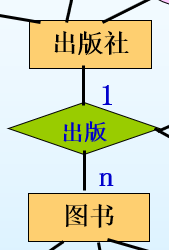
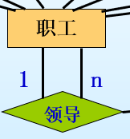
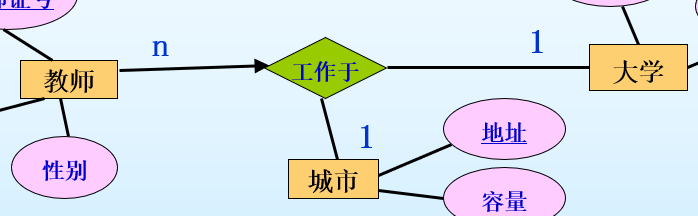
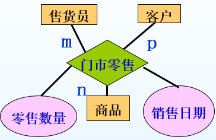
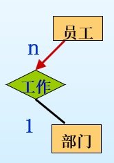
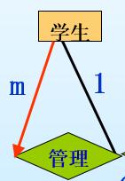
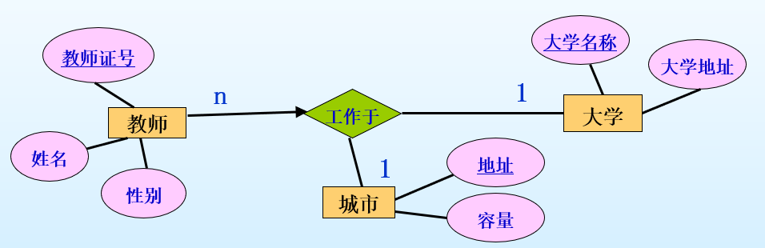
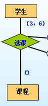
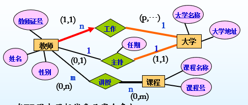
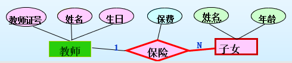

# 第一节 基本实体联系模型

一般称为E-R模型。

> 定义 - 实体联系模型 (Entity-Relationshil model):
>
> 用于描述信息世界的**概念数据模型**。  
> 它通过画图将实体以及实体间的联系刻画出来，为客观事物**建立概念数据模型**。

## 一、 数据结构描述

E-R模型用**实体型和属性**来描述**现实实体**，  
用**联系型和属性**来描述**实体间联系**。

### 1. 实体的基本概念

#### (1) 实体 (Entity)

现实世界中有区别于其他对象的对象，  
可以是具体的也可以是抽象的。

> e.g.
>
> * 某位学生（具体实体）
> * 某门课程（抽象实体）

注意：实体是具体到**某一个事物**，  
如某位学生只能是具体的一个人，而不是学生这一类。

#### (2) ⭐实体型 (Entity set)

属于**同类**的所有实体的**集合**。  
一个实体集中所有实体具有**相同的属性**。  
在不混淆的情况下可以简称为实体。

> e.g.
>
> * 学生（各种学生都有相同属性）
> * 课程（各种课程都有相同属性）

注意：这是个“集合”的概念，  
如学生就是指所有学生。

#### (3) ⭐实体型的属性 (Attribute)

指实体型的**特征或性质**，  
实体则用属性描述。

属性的**取值范围**称为**域**(Domain)。

> e.g.
>
> * 学生的“姓名”、“生日”等。
> * 课程的“课程代码”、“课程名”等。

**属性的分类**：

* 按结构分类
  * 简单属性：不可再分的属性。
  * 复合属性：可以被划分为更小的子属性。
    > e.g.
    >
    > * 住址（由为省、市、区等区划组成）
    > * 身份证号（由各种字段组成）
    > * 姓名（由姓氏和名字组成）

* 按取值分类
  * 单值属性：只有一个取值（如：学号）。
  * 多值属性：可以有多个取值（如：学位，可以有多个学位）。
  * 导出属性：从另一个属性得到的属性（如：从生日可以得到年龄）。
  * 空值属性：值不确定或者无值的属性（如：书籍的附件属性可以为空、在校大学生的学位）。

#### (4) ⭐实体型的键 (Key)

具有唯一标识特性的一个或一组属性，用于唯一标识一类**实体集中的实体**。  
也称“唯一约束”。

> e.g.
>
> * 学生（实体）的学号（唯一标识属性）。  
>   知道了学号就可以唯一确定学生（实体集）中的某位具体学生（实体）。

**键的分类**：

1. 按属性构成分类
   * 简单键：由一个属性构成。
   * 复合键：有多个属性构成。
2. 按属性个数分类
   * 超键 (Super Key)：  
     能唯一标识实体的**属性集合**。
     > e.g.
     >
     > 虽然{姓名}不是键，  
     > 但{学号}、{学号, 姓名}等等是超键。
   * 候选键 (Candidate Key)：  
     能唯一标识实体的**最小属性集合**。  
     > e.g.
     >
     > 若属性只有学号姓名时，为{学号}；  
     > 多了身份证号时，为{学号}和{身份证号}。
   * 全键：  
     能唯一标识实体的**最大属性集合**，即包含所有属性的键。
   * 主键 (Primary Key)：  
     在多个候选键中，需要选择一个作为主键。  
     > e.g.
     >
     > {学号}和{身份证号}都是候选键，可以选学号作为主键。

### 2. 联系的基本概念

#### (1) 联系 (Relationship)

两个或多个**实体型**间的**关联**。
> e.g.
>
> * 学生和课程之间，存在“选课”的联系。  
> * 商品、售货员、客户之间，存在“商品销售”的联系。

**同样的实体型**间可以存在**多个联系**。
> e.g.
>
> 员工和部门之间，存在“工作”和“管理”的联系。

#### (2) 联系型 (Relationship Set)

同一类的一组联系。  
联系型的实例是联系的集合。  
在不混淆的情况下，联系型可简称为联系。

*跟实体和实体型的区别一样，一般说联系都是指联系型。*

#### (3) 联系的描述属性 (Description Attribute)

记录**联系间的信息**。

> e.g.
>
> * 选课联系的“成绩”。  
> * 商品零售联系的“价格、数量”。

#### (4) 联系的标识 (Identification)

联系由所参与**实体的键**来确定。  
联系也存在主键，一般由所关联**实体的主键**构成。

> e.g.
>
> * 选课联系由“学号”（学生主键）和“课程号”（课程主键）构成。  
> * 商品零售联系由“商品条码”、“售货员工号”、“客户编号”构成。

*即对应于实体的键概念。*

#### (5) 联系型的阶 (Degree)

一个联系所关联的**实体的数量**，  
称为$n$元联系。

* 一元联系：学生中“管理”的联系、零件中“装配”的联系。
* 二元联系：学生与课程间“选课”的联系。
* 三元联系：售货员、商品、客户间“零售”的联系。

---

区别实体型和联系的方法：  
实体集是名词，联系是动词。

### 3. 实体和联系的E-R图表示方法

* 实体型 - 矩形
* 属性 - 椭圆
  * 主键属性 - 用下划线标出
  * 导出属性 - 用虚线椭圆
  * 多值属性 - 用双椭圆
  * 复合属性 - 在该椭圆下再用椭圆标出组成的属性

* 联系型 - 菱形
* 联系描述属性 - 椭圆

## 二、数据约束描述

存在三种约束：

1. 一般性约束
2. 键约束
3. 参与约束

### 1. 一般性约束

用来描述一对联系中若干个实体之间的**数量约束**。  
分为三种：

1. 一对一约束
2. 一对多约束
3. 多对多约束

> 定义 - 一般性约束：
>
> 设：存在实体集$A$和$B$。
>
> * 一对一约束$1:1$  
>   $A$中的一个实例，与$B$中的实例一一对应。
>
>   如：主任与部门间管理的联系。  
>   （一位主任只能管理一个部门，一个部门只能被一位主任管理）
> * 一对多约束$1:n$  
>   $A$中一个实例，$B$中有$n(n\ge0)$个实例对应；  
>   但$B$中一个实例，$A$中只有一个实例对应。
>
>   如：教师与学校间工作的联系。  
>   （一位教师只能工作与一个学校，一个学校可以被多位教师工作）
>
>   *注意存在顺序，根据题目可能是多对一$n:1$的联系。*
> * 多对多约束$n:m$  
>
>   如：学生与课程间选课的联系。  
>   （一个学生可以选多门课程，一门课程可以被多个学生选择）

⭐**一般性约束在ER图上的表示**：  
在联系上用$1$和$n,m$，标出一般性约束。

对于$1:n$型：$n$标注在“一个A”对面的“B”那条线上。  
 

多元联系也存在一般性约束。  
   

### 2. 键约束

> 定义 - 键约束：
>
> 如果在一个联系R的实例中，所关联的实体A最多只能出现在一个联系实例中，它就可以唯一确定该联系。  
> 此时$A$与联系间存在键约束。

有些教材中也称为“实体对应约束”。

---

说明 - 什么是实例：

定义中的联系R（指联系型）的实例是指某一具体的联系。  
比如员工和部门（实体型）的“工作”（联系型）联系，  
则某一**具体的员工**与其**对应部门**（实体）的**具体联系**则为联系型的**实例**。

按照上例继续说明 - 为什么可以具体确定实例：

* 给定某一具体**员工**，因为其只能工作与一个具体部分，只存在一个实例，**可以具体确定**；  
* 给定某一具体部门，因为可能有多个具体员工，存在多个实例，不能具体确定。  

因此“员工”可以作为键约束。

---

⭐总结为：

* 对于一对多：一般为**标$n$的（标$1$对面的线）**为键约束，加箭头。
* 对于一对一：**两个都为**键约束，都加箭头。

⭐**键约束在ER图中表示**：  
对“实体对应约束”的实体与联系间的**线加上箭头**。
> 若**联系有属性**的时候，可以**不为键约束**，此时可加可不加。

好处：  
实体能够代表联系，因此转化的时候可以少转化联系的表。  

拓展：  
多元联系间存在一般性约束，故也存在键约束。  
也是**非标$1$的线**加箭头。

### 3. *参与约束

> 定义 - 参与约束：
>
> 参与约束是实体与联系之间的约束，  
> 表示实体型中实体如何参与到联系中。  

也称“实体关联约束”。

表示一个实体$A$与实体$B$最少以及最多发生多少联系。
> e.g.
>
> 学生和课程间选课的联系：
>
> * 一个学生最少选$3$门课，最多选$6$门课。则为$(3,6)$
> * 一个课程最少可以不被选，最多被选$50$次，则为$(0,50)$。

⭐**参与约束在ER图中表示**：  
在$1$个$A$的线上**用$(\min,\max)$表示**。  
⚠注意：与一般性约束**标注位置是反的**！一般性约束标注在对面的。  
  
*上图故意只标了一侧的一般性约束和参与约束，就是为了说明两者位置不同。*

* 完全参与：  
  实体集中每个实体都参与到联系型R中的至少一个联系。  
  即为$(n,\cdots)(n\ge1)$。

  如：教师和大学间工作的联系，教师肯定至少工作于一个大学，大学也肯定至少被若干个教师工作，双向均为完全参与。

  ⭐**ER图中**：  
  线**加粗表示**（或者双横线）。
* 部分参与：  
  只有一部分实体参与到联系。
  即为$(0,\cdots)$。

  如：教师和课程间授课的联系，教师不一定全部都授课。

  ER图中：  
  线不变。

---

⭐对以上的步骤总结：

1. 一般性约束 - $1,n,m$：分别问“能联系几个”，写在对面线。  
   *一般性约束实际上问的最多能联系几个，为参与约束的上限。*
2. 键约束 - 箭头：$1$对面加箭头。
3. 参与约束 - $(\min,\max)$：分别问“最少最多能联系几个”，写在本侧线。
4. 完全/部分参与 - 加粗线：将$(n,\cdots)$加粗。

## 三、弱实体

前面讨论的实体型，都会存在一个键，  
如果有不存在键的实体，则称为弱实体。

> 定义 - 弱实体/强实体：
>
> * 没有键属性的实体型为弱实体型，依赖于其他实体型而存在。
> * 存在键属性的实体型为强实体型，也称父实体、主实体。

虽然现实世界不可能存在没有主键的实体，  
但如果在数据库设计中，不需要在意某实体的主键而省略舍弃，则会出现弱实体。

> e.g.
>
> * 学校系统中对于学生的监护人。  
>   一般只需要监护人的姓名（**姓名可能相同**，因此不是候选键），  
>   因此监护人不存在键（指主键），为弱实体，必须**依赖于学生来确定**。
> * 一栋教学楼里的教室房间。  
>   如果不同楼**房间号存在相同**的话，不能只单独通过房间号来确定教室房间，  
>   因此教师房间不存在键，为弱实体，必须**依赖于教学楼来确定**。

上例可看出：单看弱实体，其之间的属性可能完全相同，不好区分。  
因此弱实体必须与强实体配对，即**与强实体之间要存在联系**。

如：弱实体$A$与强实体$B$之间存在关联$R$。  
则：

* 识别实体型 - 称$B$为“**识别**实体型”
* 识别联系 - 称$R$为弱实体$A$的“识别联系”。

该识别联系**只能为$1:1$或$1:n$联系**，其中一个弱实体只能对应一个强实体。  
如上：一个监护人只能对应一个实体；一个教室房间只能对应一个教学楼。  

⭐**弱实体在ER图中表示**：  
弱实体与识别联系的**方框加粗**表示。

---

* 部分键：弱实体可以设定部分键，也能区分不同弱实体，但可能存在冲突。（如姓名）

⭐**部分键在ER图中表示**：  
部分键（属性）加**虚下划线**。

