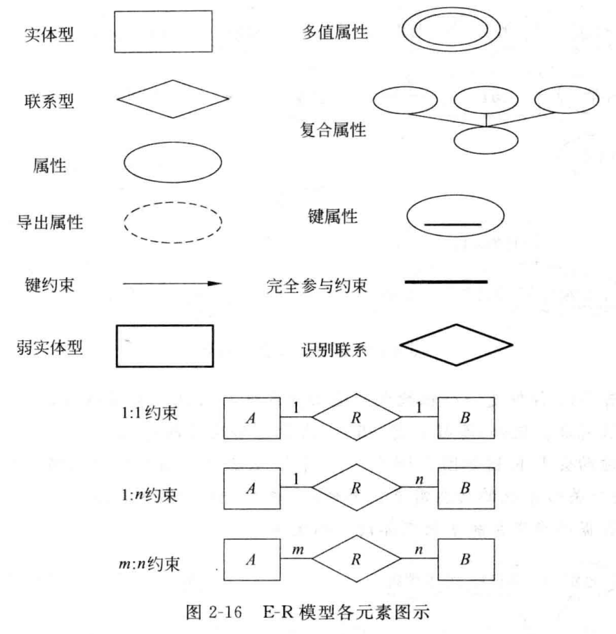
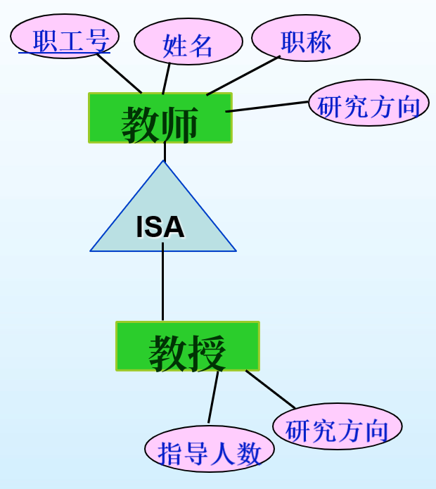
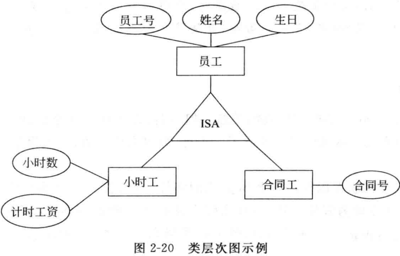
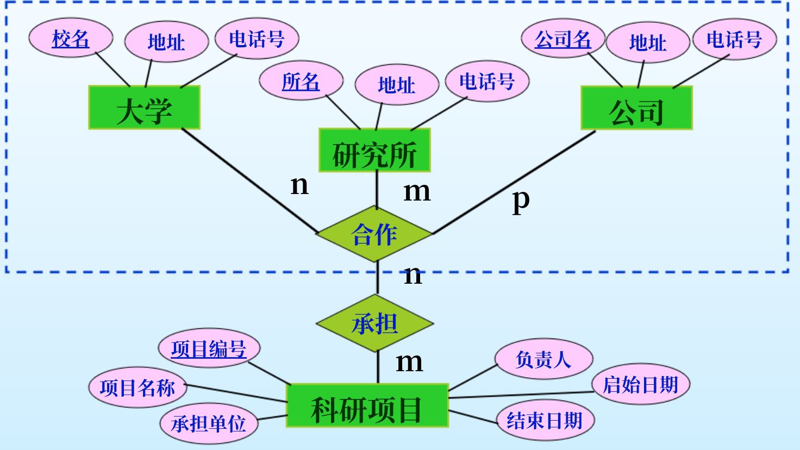
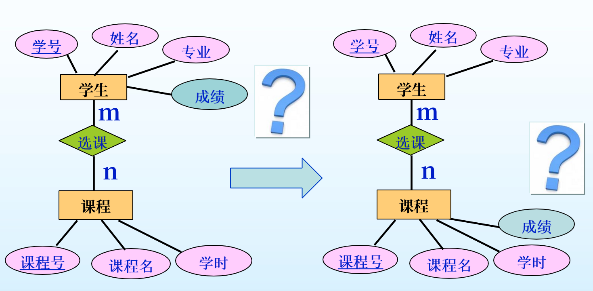
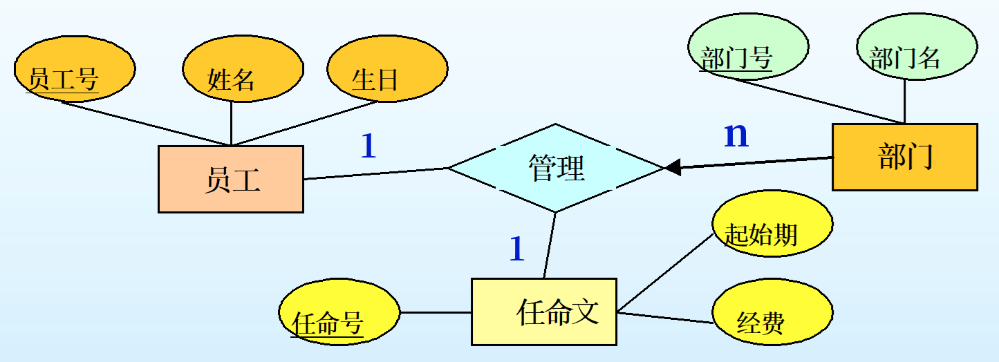

# 第一节 基本实体联系模型

一般称为E-R模型。

> 定义 - 实体联系模型 (Entity-Relationshil model):
>
> 用于描述信息世界的**概念数据模型**。  
> 它通过画图将实体以及实体间的联系刻画出来，为客观事物**建立概念数据模型**。

## 一、数据结构描述

E-R模型用**实体型和属性**来描述**现实实体**，  
用**联系型和属性**来描述**实体间联系**。

### 1. 实体的基本概念

#### (1) 实体 (Entity)

现实世界中有区别于其他对象的对象，  
可以是具体的也可以是抽象的。

> e.g.
>
> * 某位学生（具体实体）
> * 某门课程（抽象实体）

注意：实体是具体到**某一个事物**，  
如某位学生只能是具体的一个人，而不是学生这一类。

#### (2) ⭐实体型 (Entity set)

属于**同类**的所有实体的**集合**。  
一个实体集中所有实体具有**相同的属性**。  
在不混淆的情况下可以简称为实体。

> e.g.
>
> * 学生（各种学生都有相同属性）
> * 课程（各种课程都有相同属性）

注意：这是个“集合”的概念，  
如学生就是指所有学生。

#### (3) ⭐实体型的属性 (Attribute)

指实体型的**特征或性质**，  
实体则用属性描述。

属性的**取值范围**称为**域**(Domain)。

> e.g.
>
> * 学生的“姓名”、“生日”等。
> * 课程的“课程代码”、“课程名”等。

**属性的分类**：

* 按结构分类
  * 简单属性：不可再分的属性。
  * 复合属性：可以被划分为更小的子属性。
    > e.g.
    >
    > * 住址（由为省、市、区等区划组成）
    > * 身份证号（由各种字段组成）
    > * 姓名（由姓氏和名字组成）

* 按取值分类
  * 单值属性：只有一个取值（如：学号）。
  * 多值属性：可以有多个值（如：学位，可以有多个学位（理科、工课）、房产（可以有多套））。  
    **⚠注意**：多值属性不代表有多个取值可以选择（性别也有多个值（男、女）可以选择），而是代表有多个值。
  * 导出属性：从另一个属性得到的属性（如：从生日可以得到年龄）。
  * 空值属性：值不确定或者无值的属性（如：书籍的附件属性可以为空、在校大学生的学位）。

#### (4) ⭐实体型的键 (Key)

具有唯一标识特性的一个或一组属性，用于唯一标识一类**实体集中的实体**。  
也称“唯一约束”。

> e.g.
>
> * 学生（实体）的学号（唯一标识属性）。  
>   知道了学号就可以唯一确定学生（实体集）中的某位具体学生（实体）。

**键的分类**：

1. 按属性构成分类
   * 简单键：由一个属性构成。
   * 复合键：有多个属性构成。
2. 按属性个数分类
   * 超键 (Super Key)：  
     能唯一标识实体的**属性集合**。
     > e.g.
     >
     > 虽然{姓名}不是键，  
     > 但{学号}、{学号, 姓名}等等是超键。
   * 候选键 (Candidate Key)：  
     能唯一标识实体的**最小属性集合**。  
     > e.g.
     >
     > 若属性只有学号姓名时，为{学号}；  
     > 多了身份证号时，为{学号}和{身份证号}。
   * 全键：  
     能唯一标识实体的**最大属性集合**，即包含所有属性的键。
   * 主键 (Primary Key)：  
     在多个候选键中，需要选择一个作为主键。  
     > e.g.
     >
     > {学号}和{身份证号}都是候选键，可以选学号作为主键。

### 2. 联系的基本概念

#### (1) 联系 (Relationship)

两个或多个**实体型**间的**关联**。
> e.g.
>
> * 学生和课程之间，存在“选课”的联系。  
> * 商品、售货员、客户之间，存在“商品销售”的联系。

**同样的实体型**间可以存在**多个联系**。
> e.g.
>
> 员工和部门之间，存在“工作”和“管理”的联系。

#### (2) 联系型 (Relationship Set)

同一类的一组联系。  
联系型的实例是联系的集合。  
在不混淆的情况下，联系型可简称为联系。

*跟实体和实体型的区别一样，一般说联系都是指联系型。*

#### (3) 联系的描述属性 (Description Attribute)

记录**联系间的信息**。

> e.g.
>
> * 选课联系的“成绩”。  
> * 商品零售联系的“价格、数量”。

#### (4) 联系的标识 (Identification)

联系由所参与**实体的键**来确定。  
联系也存在主键，一般由所关联**实体的主键**构成。

> e.g.
>
> * 选课联系由“学号”（学生主键）和“课程号”（课程主键）构成。  
> * 商品零售联系由“商品条码”、“售货员工号”、“客户编号”构成。

*即对应于实体的键概念。*

#### (5) 联系型的阶 (Degree)

一个联系所关联的**实体的数量**，  
称为$n$元联系。

* 一元联系：学生中“管理”的联系、零件中“装配”的联系。
* 二元联系：学生与课程间“选课”的联系。
* 三元联系：售货员、商品、客户间“零售”的联系。  
  **⚠注意**：三元联系三者之间都有联系，不是两个二元联系。  
  > e.g.
  >
  > 演员、导演和电影公司，就只能是两个二元联系，而不是三元联系。  
  > 否则就是电影公司招聘演员时，必须也要招聘个导演（两者有联系）。

---

区别实体型和联系的方法：  
实体集是名词，联系是动词。

### 3. 实体和联系的E-R图表示方法

* 实体型 - 矩形
* 属性 - 椭圆
  * 主键属性 - 用下划线标出
  * **导出属性** - 用虚线椭圆（容易遗忘标注）
  * 多值属性 - 用双椭圆
  * 复合属性 - 在该椭圆下再用椭圆标出组成的属性

* 联系型 - 菱形
* 联系描述属性 - 椭圆

## 二、数据约束描述

存在三种约束：

1. 一般性约束
2. 键约束
3. 参与约束

### 1. 一般性约束

用来描述一对联系中若干个实体之间的**数量约束**。  
分为三种：

1. 一对一约束
2. 一对多约束
3. 多对多约束

> 定义 - 一般性约束：
>
> 设：存在实体集$A$和$B$。
>
> * 一对一约束$1:1$  
>   $A$中的一个实例，与$B$中的实例一一对应。
>
>   如：主任与部门间管理的联系。  
>   （一位主任只能管理一个部门，一个部门只能被一位主任管理）
> * 一对多约束$1:n$  
>   $A$中一个实例，$B$中有$n(n\ge0)$个实例对应；  
>   但$B$中一个实例，$A$中只有一个实例对应。
>
>   如：教师与学校间工作的联系。  
>   （一位教师只能工作与一个学校，一个学校可以被多位教师工作）
>
>   *注意存在顺序，根据题目可能是多对一$n:1$的联系。*
> * 多对多约束$n:m$  
>   如：学生与课程间选课的联系。  
>   （一个学生可以选多门课程，一门课程可以被多个学生选择）

ER图中：
在联系上**用$1$和$n,m$**，标出一般性约束。

只是代表数量上的约束。

### 2. 键约束

> 定义 - 键约束：
>
> 如果在一个联系R的实例中，所关联的实体A最多只能出现在一个联系R实例中，它就可以唯一确定该联系。  
有些教材中也称为“实体对应约束”。

* 对于一对多：一般为标$n$的为“实体对应约束”。
* 对于一对一：两个都为“实体对应约束”。

ER图中：
对“实体对应约束”的实体与联系间的线**加上箭头**。
> 若联系有属性的时候，可以不为键约束，此时可加可不加。

好处：实体能够代表联系，因此转化的时候可以少转化联系的表。  
拓展：多实体间的联系也存在键约束。

### 3. *参与约束

*考试不会考。*

实体参与联系的数量。

ER图中：  
**用$(min,max)$表示**。

还存在以下两种分类：

* 完全参与  
  如教师和大学间工作的联系，教师肯定工作于大学，大学给教师提供工作。  
  即为$(n,...)(n\ge1)$

  ER图中：  
  **线加粗表示**。
* 部分参与
  如教师和课程间授课的联系，教师不一定全部都授课。  
  即为$(0,...)$

### 4. *排除约束

有时候若干个实体型间，不可能同时出现两种联系，则需要排除约束。
> e.g.
>
> 一个工作可能被分配到公司内部完成，也可能外包到第三方公司完成，  
> 但不可能同时出现两个联系。

ER图中：  
对两个联系间用“——OR——”连上表示。

## 三、弱实体

> 定义 - 弱实体：
>
> 没有键属性的实体型为弱实体型，存在键属性的实体型为强实体型。

虽然现实世界不可能存在没有主键的实体，  
但如果在数据库设计中不需要在意某实体的主键，则会出现弱实体。

如：学校系统中对于学生的监护人，可能只需要监护人的姓名，因此监护人为弱实体，必须依赖于学生来确定。

因此弱实体必须与强实体配对，即与强实体之间要存在联系，  
**该联系只能为$1:1$或$1:n$联系**，  
弱实体与识别实体型之间的联系，称为弱实体的“识别联系”。

弱实体存在部分键，也能区分不同弱实体，但可能存在冲突。（如姓名）

**ER图中：**  

* 识别联系 - 粗线条
* 部分键 - 加虚下划线  
  *拓展：在转换的时候，弱实体的部分键会与识别实体型的主键，共同组成弱实体的主键。*

## 四、E-R图各元素总结

## 五、扩展实体联系模型

有时候会出现超出ER模型描述能力的问题，因此需要扩展，  
称为扩展实体联系模型(EERM)

### 1. 类层次

有时候需要将实体型中实体再继续分成子类别。  
分类后，体现出一种类层次（也是一种联系），  
最上层为超类(Super Class)，下层为子类。

> e.g.
>
> * 员工按照合同制，可以分为“合同工”和“小时工”
> * 大学学生，可以分为“本科生”和“研究生”

每个**子类**还会有自己**独有的属性**，其在子类之间**不共有**。  
对于**超类的属性**，则是所有子类**共有**的。

子类不存在主键。

需注意：类层次并不是将超类完全划分成子类，  
即也存在**只是超类**而不是任何一种子类的实体。  
因此与编程中面向对象不同：编程中超类不存在实例，而ER模型中可以。
> e.g.
>
> 对于“教师”实体型，存在一类特殊的“教师”为“教授”，  
> “教授”是一个“教师”。
>
> 此时只划分了一类，但并不代表所有教师都是教授了。  
> 也存在只是超类“教师”的实体。

---

因为类层次本身也是一种特殊的联系，为“层次”联系。  
为了特殊区别，ER图中：  

* 采用统一的名字"ISA"(is a, 是一个)来表示
* 将原来表示联系的菱形，改为正三角形。
* 超类连在三角形上顶点，子类连在下方。

### 2. 聚集

> 定义 - 聚集：
>
> 聚集是将联系以及该联系所关联的实体一起，作为一个高层实体（或虚实体）来对待，该高层实体即为聚集。

有时候联系本身可能也存在联系，  
便称为“聚集”。

代表该联系以及该联系所聚集的实体，共同参加了一个更高级的与高层实体的联系。

> e.g.
>
> 大学、研究所、公司共同以“合作”联系，  
> 然后“合作”去“承担”一个科研项目。

## 六、利用ER图进行概念数据库设计

关键确定下面四类问题：

1. 一个概念是实体还是属性。
2. 一个概念是实体的属性还是联系的属性。
3. 是用二元联系还是多元联系。
4. 是否有弱实体需要考虑。

### 1. 实体和属性的取舍

#### (1) 作为实体还是作为属性

例：

1. 工作和工资：  
2. 课程和教室：  
   若不需要考虑教室的特性，则作为属性；否则作为实体。
3. 货品和仓库：  
   若货物只存放在一个仓库，则仓库可以作为货物的属性。  
   若还关心仓库的地点、面积、类型、成本等，应该作为实体。

#### (2) 复合属性的隐患

#### (3) 多值属性的处理

会造成数据的冗余（有多少种取值就有多少行）。

解决方法：

1. 多增加几个属性，来代替多值属性
2. 将其设置为弱实体。（最好的方法）  
   可以将属性与实体间隔离开，则以后只用变化弱实体即可。

### 2. 属性在实体和联系间的取舍

一个属性是实体的属性还是联系的属性。

区别：

* 作为实体（型）的属性：代表的是一种平均的、总的属性
* 作为联系（型）的属性：代表的是每一个联系的具体的该属性。

例1 - 学生课程间选课联系：
  

若作为学生或课程这两个实体的属性，代表的是学生的平均成绩或者该课程的所有学生平均成绩。  
所以应该放在联系“选课”上，代表**每个学生在该课程上具体的成绩**。

---

例2 - 员工对多个部门的管理：  
一个员工可能管理多个部门，但给的“经费”是其所管部门的总和。

则应该安排在一个属性上，  
且应该单独设置个属性，代表任命（文件），此时含有“经费”属性，代表所有经费。  

### 3. 二元联系和多元联系的取舍

如上面多元联系的介绍所说，  
确定是多个二元联系还是用多元联系，  
主要看多个实体之间是否两两均存在联系。

但三元联系仍要考虑：是否这一联系会发生多次而实际上只进行一次。  
比如顾客从销售人员购买商品，可能会购买多件商品，但付款一次。  
此时就应该将原来的“购买”联系的各种属性，单独列为一个实体“支付”。

### 4. ER模型存在的问题

#### (1) 扇形陷阱

银行，有很多柜台，有很多员工。

若以银行为主体，知道银行有柜台，知道银行有员工，  
但不知道某个员工在哪个柜台工作。

此时中心实体的联系形如扇形发散，称扇形陷阱。  
（即有两个联系连到自己，自己的线都是$1$）

此时交换一方，如改人员为中心。

#### (2) 深坑陷阱

银行柜台，有员工，每个柜台提供不同的服务。

客户只需要知道哪个柜台能提供什么服务，而不是想知道哪个员工在哪个柜台。

？

### 5. 设计步骤

1. 分析实体和属性
2. 分析联系和属性
3. 将实体与联系建立关系
4. 分析实体与联系的各种完整性约束（一般性约束、键约束、*参与约束）
