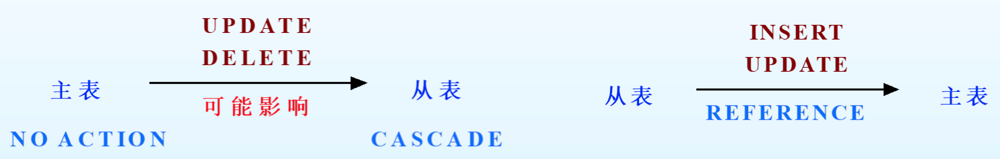
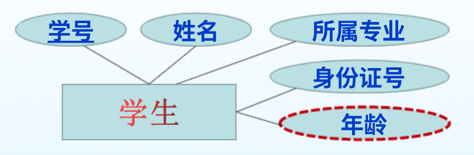

# 第一节 关系模型的数据结构

关系数据模型表达数据结构，就是用“**关系**”。

## 一、关系

### 1. 概念

> 定义 - 关系
>
> 用于描述数据本身、数据之间联系，俗称“表”。

如：一张“学生信息表”。

是关系数据模型中，用来表示实体的方法。  
*概念数据模型（ER图）中，是用实体型和属性表示。*

构成：

* 列 - 对应ER模型中的“**属性**”，用$A_i$表示。  
  有时候也称“字段”(Field)、“成员”。  
  其取值范围也称为“域”。
* 行 - 对应每一个具体实例（ER图中没有，只是概念），称为“**元组**”(Tuple)。  
  一般也称“记录”。
  表示为：$t=<a_1,a_2,\cdots,a_n>$（属性的集合）

其他概念：

* 关系模式：由关系名、各个属性构成。  
  表示为：$R(A_1,A_2,\cdots,A_n)$，$R$为关系名，$A_i$为关系$R$的各个属性。（就相当于表的第一行）
* 关系实例：关系集或元组集（即这张表），简称关系。  
  行序不重要；**列序很重要**。  
  元组的字段必须对应关系模式中的字段。  
  表示为：$\{<a_1,a_2,\cdots,a_n>\}$
* 候选键：能唯一**识别**关系实例中**元组**的**最小字段集**。
* 主键

### 2. 特性

关系是一个集合。  
集合的元素是元组，每个元组的属性数目应该相同。

关系是一种**规范化**了的二维表格，不是一般的二维表。

1. 关系中每一个属性都不可分割（因此不能有符合属性）。
2. 关系中不允许有重复元组。
3. 关系是元组的集合，没有行序。
4. 关系的列有序。

## 二、完整性约束

数据完整性是指：数据库中存储的**数据是有意义的或正确的**，也就是和现实世界相符。  
关系模型中的**数据完整性规则**，是对关系的某种**约束条件**(IC)。

但进行数据操作后，DBMS会自动根据约束来判断数据是否合法，从而决定接受还是拒绝操作。

只能判断是否合法，而不能判断是否正确。  
> e.g.  
>
> 对于成绩，满分100，则合法值为$[0,100]$。
>
> * 将成绩输成101，非法，不接受。
> * 将成绩90分输成9分，都是合法的，接受。

分类和具体约束如下：

* 实体完整性约束
  * 域约束​：取值限制。
  * 主键限制：主键就是一切。
  * 唯一限制：对于不是主键的其他候选键，必须唯一。
* 参照完整性约束
  * 外键限制：实体和实体间的约束，对应ER中各种约束。
* 自定义完整性约束
  * 一般性限制：其他一般性检查，如电话号码11位。

DBMS存在一个子系统ICs，自动检查约束。

### 1. 实体完整性约束

> 定义 - 实体完整性：
>
> 指关系数据库中，所有的表都有主键，且表中不允许无主键值或重复主键的元组。

* 域约束（**不一定正确**）  
  就是数据的类型，如：`int`、`char(6)`。
* 主键限制(**Primary Key** Constraint)
  * 概念：针对主键而言，保证主键的完整性。
  * **要求**：主键值**必须唯一**，且**不能为空**。
* 唯一限制(**Unique** Constraint)
  * 概念：针对非主键的候选键而言，保证候选键的完整性。
  * 要求：**值唯一**，但允许有一个且**仅有一个空值**（两个的话就想同了）

### 2. 参照完整性约束

也称引用完整性。

在关系模型中，实体与实体之间的联系用“关系”表示，  
因此存在着关系与关系间的引用。

#### (1) 外键约束

> 定义 - 外键：
>
> 外键(Foreign Key)：一张表中的某个字段**是另一个表中的候选键/主键**。  

有外键的表为“从表”，在另一张表做主键的表为“主表”。
> e.g. “学生表”里存在字段“班号”，其为“班级表”里的主键。  
> “学生表”为从表，“班级表”为主表。

一般是转化ER图中的“联系”：

* 拥有键约束的且无属性的联系，可以**转化到被键约束的实体**，  
  转化为关系模型时，则会使联系丢失，  
  所以可以将联系的**另一个实体的主键**，**作为该实体的外键**，从而**拥有外键约束**建立联系。
* 若拥有键约束但也有属性，则联系要**转化为新表**，  
  此时将联系的**若干实体的主键**，**作为联系新表的外键**，从而建立若干实体间的联系。
  一元联系也会转换，外键是自己表的主键。

#### (2) 表间影响

当对通过外键联系的表做操作时，会产生影响：

* 对主表中的主键做操作
  * 插入：要求插入值满足主键限制即可，不影响其它表。​
  * **修改**：可能会影响与该主键相关的从表的外键值。
  * **删除**：可能会影响与主键相关的从表的外键值。  
  
  因此对于修改和删除有两种策略：
  * `CASCADE` - 级联：主表中主键修改，从表中重建也全部修改。若主键删除，直接删除从表中对应该键的元组（行）。
  * `NOACTION` - 拒绝操作：不允许修改或删除主表的主键。
* 对从表中的外键做操作
  * **插入**：要求插入的外键值“参照”主表中的主键值。
  * **修改**：也要参照主键值。
  * 删除：直接删就行了，不影响主表。
  
故维护表间数据的完整性，实际是从两个方向上完成：

* 主表→从表：“级联”或“禁止”
* 从表→主表：“参照”



#### (3) 实现方法

1. 利用外键约束  
   对从表定义外键限制（或称参照完整性）完成主表和从表间两个方向的数据完整性。
2. 利用触发器  
   主表的触发器维护主表到从表方向的数据完整性，  
   而从表的触发器维护从表到主表方向的参照完整性。
3. 断言限制  
   检查表中个别列、整个表或表与表之间是否满足注定条件。

### 3. 自定义完整性约束

数据库都需要实现上面两种约束，  
但用户自己也可能需要定义一些约束。

如：

* 某个属性不能为空。
* 某个属性取值在某个范围。
* 某些属性间存在函数或逻辑关系。

### 4. 约束的实施

关系创建并制定了ICs后，当进行数据操作时，则应该检查。

* 域约束、主键限制和唯一限制：可以在操作的时候就直接检查并直接决定接受或拒绝。
* 外键限制：较复杂，需要从两个方向进行。

## 三、SQL Server完整性约束

不同于第二章的概念数据模型，对应概念数据模型，  
本章对应逻辑数据模型，因此需要选择具体的DBMS。

对于SQL，是一个标准，  
不同DBMS有自己的实现方式，称为数据库方言。

### 1. T-SQL语言

对于Microsoft的SQL Server,则采用的是Transact-SQL,  
称为事务SQL。

T-SQL由SQL语句（DDL、DML、DCL）、函数和存储过程组成。  
还具备过程控制能力和事务控制能力。

有两类变量：

* 局部变量：用户自己定义的变量。用`@`表示。  
  如`@name`。
* 全部变量：由系统定义，只能应用，不能修改和定义，用`@@`表示。  
  如`@@error`。

下面将DDL。

### 2. 完整性定义——表的定义及基础操作

#### (1) 表的定义

```SQL
CREATE TABLE [数据库名.[拥有者]. | 拥有者.] 表名
  ( { <列定义>
    | 列名 AS 列计算表达式
    | <表级约束> }
  | [ { PRIMARY KEY | UNIQUE } [,...] ]
  ) [ON {filegroup| DEFAULT}]

<列定义>::= 
   { <列名> <列类型> [NULL|NOT NULL] }
   [ [ DEFAULT 常数表达式]
   | [ IDENTITY [ ( 初值 , 步长 ) [ NOT FOR REPLICATION ] ] ] 
   [ROWGUIDCOL]
   [ <列级约束> ] [ ... ]
   
<表级约束>::=
  [CONSTRAINT 约束名]
  { [ FOREIGN KEY [(列名 [,…])] REFERENCES 参照表[(参照列[，…])] ]
    [ON DELETE {CASCADE | NO ACTION}]
    [ON UPDATE {CASCADE | NO ACTION}]
  }
```

* `[]` - 代表可省略。
* `[,...]` - 代表可重复。
* `()` - 就是对小括号，源码中要写。
* `<>` - 代表一种定义（一个语句块），定义在后面用`::=`表示。
* `{ | }` - 必须选择其中一项。

#### (2) 表的插入、查询

插入：

```SQL
INSERT
```

查询：

```SQL
SELECT
```

最基础：`SELECT * from ...`

> e.g.
>
> 对如下ER图进行建表：
> 
>
> 则对应代码：
>
> ```SQL
> CREATE TABLE Student
> (
>   SNo char(10) Primary Key,
>   SName varchar(20) Not Null,
>   Major varchar(50) Not Null,
>   SIDC char(18) Unique,
>   SAge as datepart(yyyy, GetDate()) - datepart(yyyy, convert(DateTime, substring(SICD,7,8)))
> )
> ```
>
> 接下来还可以执行操作：
>
> ```SQL
> INSERT Student values('1001','王晓丽','计算机应用','120221200005110027')
> INSERT Student values('1002','张大强','物联网','510106199806250228')
> INSERT Student values('1003','余丽丽','物联网','510106199908260335')
> ```
>
> ---
>
> 对外键的代码：
>
> ```SQL
> CREATE TABLE CTake
> (
>   CID char(10) Foreign Key references Course(CID), 
>   SIDC char(10) Foreign Key references Student(SIDC) On DElETE cascade On UPDATE cascade, 
>   mark smallint,
>   term date,
>   Primary Key (CID,SIDC) /* 注意： 联合主键只能这样定义，不能在字段后面加Primary Key */
> )
> ```

#### (3) 常用函数

常用的日期处理函数：

```SQL
GetDate() /* 返回系统（是服务器端，不是用户端）日期的日期与时间 */
DateDiff(interval, date1, date2) /* 返回date1与date2之间，关于interval（如DD,YYYY）的差值date2 - date1 */
DateAdd() /* 同diff, 但是加。 */
DatePart(interval, date) /* 从date中某一部分 */
DateName(date) /* 返回名字 */
```

常用的字符串处理函数：

```SQL
Left(char, int) /* 从最左侧取n位 */
Right(char, int) /* 从最右侧取n位 */
SubString(char, int n, int m) /* 从n位开始截取m位 */
```

### 3. 数据类型

* 整数数据类型
  * `int` - 默认的整数类型，规定为4个字节($-2^{32}\sim2^{32}-1$)。
  * `bigint` - 8个字节($-2^{64}\sim2^{64}-1$)。
  * `smallint` - 2个字节($-2^{15}\sim2^{15}-1$)。
  * `tinyint` - 1个字节($-2^8\sim2^8-1$)。
* 浮点数数据类型
  * `decimal(p, s)` - 精确浮点数
    * p - 数字的精度，范围为$1\sim38$（默认为18）。
    * s - 取值范围为$0\sim p$
  * `real` - 精确到7位，占4字节。
  * `float` - 精确到15位，占8字节。
* 字符数据类型
  * 非Unicode字符数据
    * `char(n)` - 固定长度字符串，长度不足$n$时会填充空格。  
      n范围为$0\sim255$。  
      不能统一用`char`，否则浪费空间。
    * `varchar(n)` - 可变长度字符串，不会补空格，而会自动收回多余长度空间。  
      n范围为$0\sim255$。  
      不能统一用`varchar`，否则会降低效率。
    * `text` - 存放$0\sim65535$个字符的字符串。
  * Unicode字符数据
    * `nchar`
    * `nvarchar`
    * `ntext`
* 日期和时间数据类型
  * `DateTime` - 存储日期和精确时间，格式：`YYYY-MM-DD hh:mm:ss[.nnn]`。占8字节。
  * `SmallDataTime` - 储存日期和简单时间，格式`YYYY-MM-DD hh:mm:ss`。占4字节。
  * `Data` - 只存储日期。占3字节。
  * `Time` - 只存储超精度时间，格式`hh:mm:ss[.nnnnnnnn]`，精度为100ns，占3-5字节。
* 货币数据类型
  * `Money` - 范围$-2^{63}\sim2^{63}-1$，精度为$19$，小数位数为$4$，占8字节。
  * `SmallMoney` - 范围$-2^{31}\sim2^{31}-1$，精度为$10$，小数位数为$4$，占4字节。
* 位数据类型
  * `bit` - 只取`0`、`1`，约等于`bool`。
  
### 3. 完整性验证

#### (1) 默认值 - default

为列或“用户自定义数据类型”指定缺省值，只能拥有一个。  
如果用户没有在该字段上给出初始值，则用默认值。

1. 给某个表的某个字段定义默认值

   ```sql

   ```

2. 用单独的命令创建`default`  
   有些默认值可能是多组共用的，  
   或者一段时间后想给某表加上默认值，  
   则采用这种方式。

   ```sql
   CREATE DEFAULT def_name as <缺省值>
   sp_bindefault def_name,'Table.which'
   ```

需要取消绑定，则用`DROP DEFAULT`和`sp_unbindefault`

#### (2) 规则 - rule

只能单独定义。

```sql
CREATE RULE rule_name as <表达式>/*如: @mark between 0 and 100*/
sp_bindrule rule_name, 'Table.which'
```

可用以下规则：

* `in(...)` - 对字符串限定取值，限定为括号内的字符串。
* `between ... and ...` - 对整数限定取值
* `and ...`
* 关系式`<`、`<>`（不等于）
* `like` - 正则表达式规则

删除规则，`sp_unbindrule`和`DROP RULE`

#### (3) 检查 - check

跟规则类似，不过是在创建表的时候写的。  
用`constraint`表示要创建检查，然后输入检查名（可省略），  
接下来输入`check(...)`，`...`为同规则一样的表达式。

规则为动态绑定，检查为静态定义。

```sql
CREATE TABLE TableName
(
  ID char(4) Primary Key CONSTRAINT ID_constraint CHECK(ID in('1001','1002')) or like(...)
)
```

#### (4) 之前的完整性约束

1. 主键约束 - `primary key`
   对于一个主键，可以直接加在字段后，  
   对于联合主键，必须另外用`Primary Key(..., ...)`写出。
2. 唯一约束 - `unique`
3. 外键约束 - `foreign key`  
   两种策略：
   * `cascade`
   * `no action` - 默认
4. 触发器 - `trigger`  

   ```sql
   CREATE TRIGGER tri_name on table_name
   for { INSERT | UPDATE | DELETE} [,...]
   as <语句> return
   ```