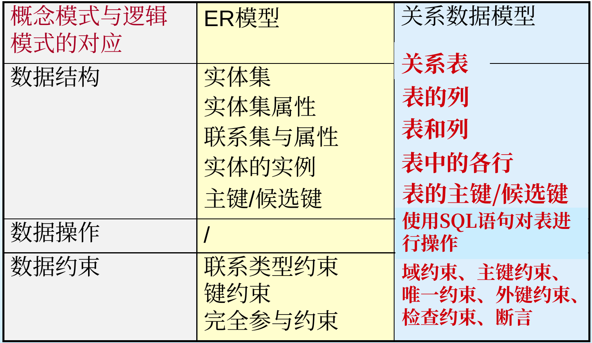
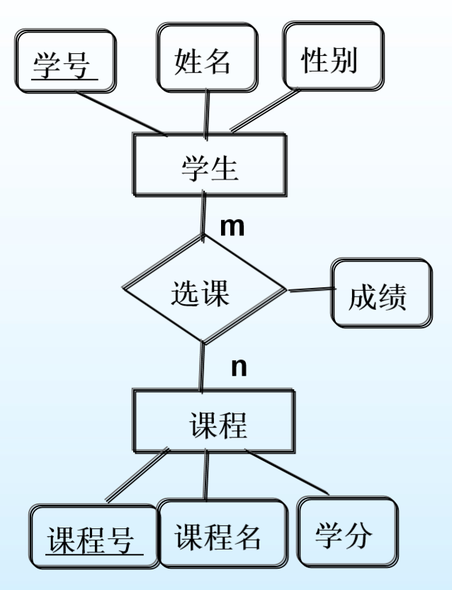
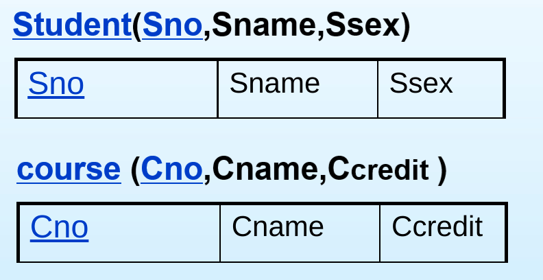
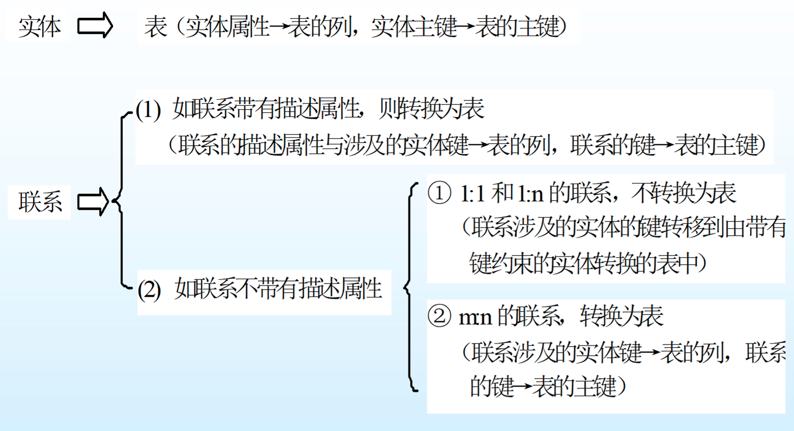

# 第四节 实体联系模型向关系模型的转换

实体联系模型转换为关系模型，  
就是将ER图转换为带有相关约束的表的集合。

## 一、实体转换方法

⭐一个实体型转换为一个关系模式（一张表）。

* 实体名→关系名
* 实体属性→关系属性
* 实体主键→关系主键

 

对于弱实体：需要把识别**实体型的主键**也**作为该弱实体的主键**。

对于一些特殊属性的处理方法：

1. 复合属性  
   将所有属性都列出来，作为原子属性。
2. 多值属性  
   在ER图中，讲述了多值属性应该转换为弱实体。  
   若ER图中未转换，在这里也转换为弱实体。

## 二、联系转换方法

### 1. n:m联系

对于n:m联系，也直接转换为一张表。

* 相连的各**实体的标识符**和联系**本身属性**→关系属性
* 各实体标识符（以及本身属性）→关系主键  

一般来说各实体的标识符组合，就能作为关系主键，  
但也可能需要结合联系本身的属性，才能作为主键。

### 2. 1:n和1:1联系

若该联系**没有属性**（即**存在键约束**），  
代表某实体可以代表该联系，  
所以可以**与实体的表合并**。  
方法为：在键约束的实体，加一个外键，为对面的主键。  
*注意：该外键不一定为本实体的主键。*

被合并的表写为：$R(\underline{P_1},\underline{P_n},A_1,A_n,B_1,B_n) B_1, B_n\textrm{为外键}$

但若联系**存在属性**，实体无法代表联系，  
因此仍**单独作为一张表**。
**⚠注意**：但此时，只有**标$n$实体的主键**和**本身属性**，作为**主键的部分**。

*图感觉有点问题，为什么公司名称不是主键？*

### 3. 一元或多元联系

跟上述三种差不多，  
也是多对多就一张表，一对多没属性就合并。

## 三、小结

