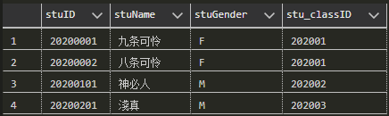

# 第一节 关系模型的数据结构

相较于ER模型，采用的是“实体”和“联系”来表达数据结构，  
关系数据模型表达数据结构，采用的用“**关系**”来表达。

## 一、关系 (Relation)

用来反映实体本身属性、实体之间联系的一张表。

### 1. 定义

> 定义 - 关系
>
> 用于描述数据本身、数据之间联系，俗称“表”。

如：一张“学生信息表”。  

是关系数据模型中，用来表示实体和联系的方法。  
*概念数据模型（ER图）中，是用实体型和联系型表示。*

### 2. 构成

* **列** - **字段**/成员/属性  
  表示为：$A_i$  
  其取值范围称为“域”。  
  对应ER模型中的“**属性**”。
* **行** - 元组/记录  
  表示为：$t=<a_1,a_2,\cdots,a_n>$（属性的集合），其中$a_i$为对应属性$A_i$的值。  
  对应每一个具体实例（ER图中没有实例，只是概念）。

### 3. 相关概念

* 候选键：能唯一**识别**关系实例中**元组**的**最小字段集**（存在若干个）。
* 主键(PK)：在若干个候选键中，**选择一个**作为主键（也可能由若干个主键共同决定）。
* 外键(FK)：一张表中某个属性，是另一张表的**候选键**或**主键**。
* **关系模式**：由**关系名**（表名）和其**各个属性**构成。  
  表示为：$R(A_1,A_2,\cdots,A_n)$。  
  * $R$为关系名。  
  * $A_i$为关系$R$的各个属性。
  * 主键：划下划线。  
  * 外键：先写在括号内，最后在括号外说明为外键。
  > 如 - 在学生信息表中表示为：$\textrm{stuTable}(\underline{\textrm{stuID}},\textrm{stuName},\textrm{stuGender},\textrm{stuClass}) \quad\textrm{stuClass为外键}$

  关系模型跟关系模式之间的关系，对应数据模型跟[数据模式](../../Ep.1%20概述/1-Introduction.md#3-数据模式-data-schema)之间的关系。
* 关系实例：为元组的集合（即**这张表**），简称关系。  
  表示为：$\{<a_1,a_2,\cdots,a_n>,<a_1,a_2,\cdots,a_n>,\cdots\}$
  > 如 - 在学生信息表中表示为：  
  > $\{<20200001, \textrm{九条可怜}, F, 202001>, <20200002, \textrm{八条可怜}, F, 202001>, <20200101, \textrm{神必人}, M, 202002>, <20200201, \textrm{淺真}, M, 202003>\}$

  行序不重要；**列序很重要**，  
  每个元组的字段必须对应关系模式中的字段。

### 4. 性质

关系是一个集合，  
集合的**元素是元组**，每个元组的**属性数目应该相同**。

关系是一种**规范化**了的二维表格，不是一般的二维表。  
因为存在以下性质：

1. 关系中每一个属性都不可分割（因此**不能有复合属性**）。
2. 关系中**不允许有重复元组**。
3. 关系是元组的集合，**没有严格行序要求**。
4. 关系的**列存在严格顺序**。
