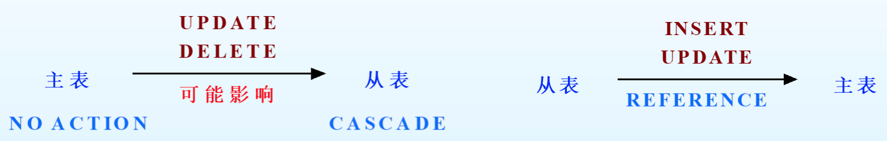

# 第二节 完整性约束

数据完整性是指：数据库中存储的**数据是有意义的或正确的**，也就是和现实世界相符。  
对于数据完整性，则要靠完整性约束(Integrity constraints, ICs)来保障。  
关系模型中的**数据完整性规则**，则是对关系的某种**约束条件**。

进行数据操作后，DBMS会自动**根据约束**来**判断**操作是否**合法**，从而**决定接受还是拒绝**操作。  
但**只能判断是否合法**，而不能判断是否正确。  
> e.g.  
>
> 对于成绩，满分100，则合法值为$[0,100]$。
>
> * 将成绩输成101，非法，不接受。
> * 将成绩90分输成9分，都是合法的，均接受。

---

完整性约束的分类和具体约束如下：

* 实体完整性约束  
  指关系数据库中，所有的表都必须有主键，且不允许某元组无主键或主键相同。
  * 域约束​：**取值范围**限制。
  * 主键限制：**主键**就是一切（非空且唯一）。
  * 唯一限制：对于不是主键的**其他候选键**，必须唯一（但可以空一个）。
* 参照完整性约束  
  关系与关系之间存在引用，也叫引用完整性。
  * 外键限制：**实体和实体间的约束**，对应ER模型中各种约束。
* 自定义完整性约束
  * 一般性限制：其他的一般性检查，如电话号码11位。

## 一、实体完整性约束

### 1. 域约束

指数据类型的类型，如：`int`、`char(6)`。  
如果为整数型，值就不能是字符等其他类型。

不需要显式指定，根据数据类型的定义自动起作用。

### 2. 主键约束 (Primary Key Constraint)

针对主键而言，保证主键的完整性。

要求**主键必须满足两个条件**：

* **值必须唯一**。
* **不能为空值(NULL)**。

一张表只能有一个主键（但可以由多个属性构成），因此只有一个主键约束，  
不需要显式指定，当指定主键后，主键约束自动起作用。

### 3. 唯一约束 (Unique Constraint)

针对非主键的候选键而言，保证候选键的完整性。

要求候选键必须满足两个条件：

* **值唯一**
* **最多允许有一个空值**（两个的话就相同了）

候选键**需要显式指定**。

## 二、参照完整性约束 - 外键约束 (Foreign Key Constraint)

### 1. 定义

> 定义 - 外键(Foreign Key)：
>
> 外键指一张表中的某个字段（列）**是另一个表中的候选键/主键**。  

在关系模型中，实体与实体之间的联系也用“关系”表示，  
因此存在着关系与关系间的引用，因此会产生外键。

* 从表：有外键的表。
* 主表：在另一张表做主键的表。

> e.g.  
>
> “学生表stuTable”里存在字段“班号classID”，其为“班级表classTable”里的主键。
>
> 因此该属性为外键，  
> “学生表”为从表，“班级表”为主表。

---

> 拓展 - 外键产生原因：
>
> 一般是从ER图中的“联系”转化而来。
>
> * 拥有键约束的且无属性的联系，可以**转化到被键约束的实体**。  
>   转化为关系模型时，会使联系丢失，  
>   所以可以将联系的**另一个实体的主键**，**作为该实体的外键**，从而因为外键约束建立联系。
> * 拥有键约束但存在属性的联系，联系要**转化为新表**，  
>   此时将联系的**若干实体的主键**，**作为联系新表的外键**，从而建立若干实体间的联系。
>
> 一元联系也会转换，外键是自己表的主键。
>
> 具体内容将在第五节“[实体联系模型向关系模型的转化](../5.%20实体联系模型向关系模型的转换/3.5-Relational_Data_Model-4.md)”讲到。

### 2. 表间影响

当对存在外键联系的若干表做操作时，  
需要考虑操作对约束产生的影响。

* 对**主表**中的主键、候选键做操作
  * 插入：要求插入值满足主键限制即可，不影响从表。​
  * **修改**：可能会影响与该主键相关的从表的外键值。  
    可以改变对应从表中所有外键值，也可以不允许修改主表。
  * **删除**：可能会影响与该主键相关的从表的外键值。  
    可以删除从表中所有对应外键的行，也可以不允许修改主表。
  
  因此对于主表的修改和删除，有两种策略：
  * `CASCADE` - 级联  
    主表中主键修改，**从表**中外键也全部修改。  
    若主键删除，直接删除从表中对应该键的元组。
  * `NO ACTION` - 拒绝操作  
    不允许修改或删除**主表**的主键。

  ⭐`CASCADE`是**对从表**的策略，`NO ACTION`是**对主表**的策略。
* 对**从表**中的外键做操作
  * **插入**：要求插入的外键值“参照”主表中的主键值。
  * **修改**：也要参照主键值。
  * 删除：直接删就行了，不影响主表。
  
故维护表间数据的完整性，实际是从两个方向上完成：

* 主表→从表：“级联”或“禁止”
* 从表→主表：“参照”

### 3. 数据完整性维护的实现

1. 利用外键约束  
   对从表**定义外键限制**（或称参照完整性），完成**主表和从表**间两个方向的数据完整性。
2. 利用触发器  
   *跟外键约束类似。*  
   主表的触发器维护主表到从表方向的数据完整性，  
   而从表的触发器维护从表到主表方向的参照完整性。
3. 断言限制  
   检查表中个别列、整个表或表与表之间是否满足指定条件。  
   有时候可能涉及以上约束不能实现的约束，则可以直接用断言限制`CHECK`条件判断。  
   > e.g. 住女生宿舍的同学不能是男生，则学生表的男生与宿舍的女生宿舍交集为空。

## 三、自定义完整性约束

数据库都能够实现上面两种约束，  
但用户自己也可能需要定义一些约束。

如：

* 某个属性不能为空。
* 某个属性取值在某个范围。
* 某些属性间存在函数或逻辑关系。

## 四、约束的实施

关系创建并制定了ICs后，当进行数据操作时，则应该检查。

* 域约束、主键限制和唯一限制：可以在操作的时候就**直接检查**并**直接决定接受或拒绝**。
* 外键限制：较复杂，需要**从两个方向进行**。
