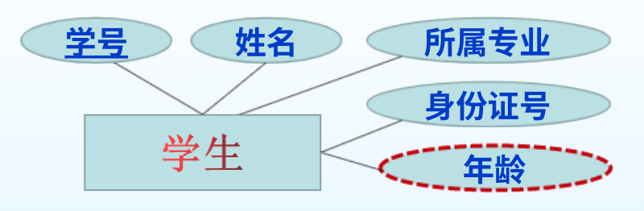
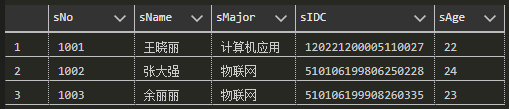

# 第三节 SQL Server基本操作和实现完整性验证

不同于第二章的ER图，对应的是**概念数据模型**，  
本章对应**逻辑数据模型**，因此需要选择具体的DBMS。

## 零、什么是SQL

接下来涉及具体的SQL语言，
因此首先先讲有关SQL的预备知识。

之前提及过，SQL是一种针对数据库进行各种操作的语言，  
虽然其叫“结构化查询语言”，但可以完成定义、增删查改、安全管理等各种功能。  
涉及三个子语言：数据定义语言DDL、数据操作语言DML、数据管理语言DCL。

而对于SQL，只是一个标准(ANSI SQL)，  
不同DBMS有自己的实现方式，互相有一些区别，称为“数据库方言”。  
如：MySQL、T-SQL、SQLite等，都基于ANSI SQL标准，但[又有一些不同](https://zhuanlan.zhihu.com/p/371465607)。

虽然有各种方言，但都是基于ANSI SQL基础上修改的，  
因此也是存在一些共性，都支持主要的关键词。

本节以SQL Server所用的T-SQL为例讲解。

## 一、T-SQL语言

对于Microsoft的SQL Server，则采用的是Transact-SQL，称为事务SQL。  
是对标准SQL的扩展。

T-SQL由“SQL语句”（DDL、DML、DCL）、“函数”和“存储过程”三部分组成。  
还具备过程控制能力和事务控制能力。

存在两类变量：

* 局部变量：用户自己定义的变量。用`@`表示。  
  如`@name`。
* 全部变量：由系统定义，只能应用，不能修改和定义。用`@@`表示。  
  如`@@error`、`@@rowcount`。

## 二、数据类型

### 1. 整数数据类型

* `Int` - 默认的整数类型，规定为4个字节($-2^{31}\sim2^{31}-1$)。
* `BigInt` - 8个字节($-2^{63}\sim2^{63}-1$)。
* `SmallInt` - 2个字节($-2^{15}(-32768)\sim2^{15}-1(32767)$)。
* `TinyInt` - 1个字节无符号数($0\sim2^8-1(255)$)。

### 2. 浮点数数据类型

* `Decimal(p, s)` - 精确浮点数
  * p - 数字的精度，范围为$1\sim38$（默认为18）。
  * s - 取范围为$0\sim p$。
* `Real` - 精确到7位小数，占4字节，范围为`-3.4E-38 ~ 3.4E+38`。
* `Float` - 精确到15位小数，占8字节，范围为`-1.79E-308 ~ 1.79E+308`。

### 3. 字符数据类型

* 非Unicode字符数据
  * `Char(n)` - 固定长度字符串  
    长度不足$n$时会在末尾填充空格。  
    n范围为$0\sim255$。  
    不能统一用`char`，否则浪费空间。
  * `VarChar(n)` - 可变长度字符串  
    不会补空格，而会自动收回多余长度空间。  
    n范围为$0\sim255$。  
    不能统一用`VarChar`，否则会降低效率。
  * `Text` - 文本类型  
    存放$0\sim65535$个字符组成的字符串。
* Unicode字符数据
  * `NChar`
  * `NVarChar`
  * `NText`

### 4. 日期和时间数据类型

* `DateTime` - 存储日期和精确时间，  
  格式：`YYYY-MM-DD hh:mm:ss[.nnn]`，占8字节。
* `SmallDataTime` - 存储日期和简单时间，  
* 格式`YYYY-MM-DD hh:mm:ss`。占4字节。
* `Data` - 只存储日期，  
  格式`YYYY-MM-DD`，占3字节。
* `Time` - 存储超精度时间，  
  格式`hh:mm:ss[.nnnnnnnn]`，精度为100ns，占3~5字节。

### 5. 货币数据类型

* `Money` - 范围$-2^{63}\sim2^{63}-1$，精度为$19$，小数位数为$4$，占8字节。
* `SmallMoney` - 范围$-2^{31}\sim2^{31}-1$，精度为$10$，小数位数为$4$，占4字节。

使用时数据前要加上货币符号，以辨别是哪国货币，  
否则默认为`￥`。

### 6. 位数据类型

* `bit` - 只取`0`、`1`，约等于`bool`。

输入非`0`时自动替换为`1`。
  
## 三、表的基本操作

### 1. 创建 - CREATE

> 表创建的语句范式：
>
> ```SQL
> CREATE TABLE [数据库名.[拥有者]. | 拥有者.] 表名
> ( { <列定义> | 列名 AS 列计算表达式 | <表级约束> }
> | [{ PRIMARY KEY | UNIQUE }[,…]]
> ) [ON {filegroup | DEFAULT}]
> 
> <列定义>::= 
>    { 列名 列类型 [NULL|NOT NULL] }
>    [ [DEFAULT 常数表达式] | [ IDENTITY (初值, 步长) [NOT FOR REPLICATION]] ] 
>    [ROWGUIDCOL]
>    [<列级约束>] [ ... ]
>    
> <表级约束>::=
>   [CONSTRAINT 约束名]
>   { [ FOREIGN KEY [(列名 [,…])] REFERENCES 参照表[(参照列[,…])] ]
>     [ON DELETE {CASCADE | NO ACTION}]
>     [ON UPDATE {CASCADE | NO ACTION}]
>   }
> ```
>
> * `[]` - 代表可省略。
> * `[,…]` - 代表可重复。
> * `()` - 就是对小括号，源码中要写。
> * `<>` - 代表一种定义（一个语句块），定义在后面用`::=`表示。
> * `{ | }` - 必须选择其中一项。

由于该范式（简化代码）过于抽象，【*且不保证正确性……*  
下面只给出几种常用建表的语句示例。

```sql
CREATE TABLE stuTable
(
  sNo char(8) Primary key, /* 学号 - 主键约束 */
  sIDC varchar(50) Not null Unique, /* 学生身份证号码 - 唯一约束 */
  sName varchar(10) Not null, /* 学生姓名 - 非空 */
  sFavorite varchar(100), /* 学生兴趣 - 可空 */
  s_classID char(6) Foreign key REFERENCES classTable(classNo) ON DELETE Cascade ON UPDATE Cascade, /* 学生班级 - 外键约束 */
  sGender char(1) CHECK(sGender IN ('F', 'M')) /* 学生性别 - 断言约束 */
  sAge AS DatePart(yyyy, GetDate()) - DatePart(yyyy, convert(DateTime, SubString(SCID, 7, 8))) /* 学生年龄 - 导出属性 */
)
```

### 2. 插入 - INSERT

> 插入的范式：
>
> ```sql
> INSERT [INTO] 表名或视图名 [(属性名序列)] VALUES (各列的值)[,…]
> ```

如：

```sql
INSERT INTO classTable VALUES('202001', '计算机2020-01班'),('202002', '计算机2020-02班')
INSERT INTO stuTable VALUES('20200101', '30201020001012001X', '张三', Null, '202001', 'F')
```

### 3. 查询 - SELECT

> 查询的范式：
>
> ```SQL
> SELECT 列 [INTO 新表名] FROM 源表
> [WHERE 条件表达式]
> [GROUP BY 分组表达式]
> [ORDER BY 排序表达式 [ASC | DESC]]
> [COMPUTE {AVG|COUNT|MAX|MIN|SUM}(表达式)[,…n] [BY Expression [,…n]]]
> ```

最基础的为：

```sql
SELECT * FROM table_name
```

代表输出表中所有数据。

---

> 例1 - 根据ER图进行建表、插入、查询操作：
>
> 对如下ER图进行建表：
> 
>
> 则对应代码：
>
> ```SQL
> CREATE TABLE Student
> (
>   sNo char(10) Primary key,
>   sName nvarchar(20) Not null,
>   sMajor nvarchar(50) Not null,
>   sIDC char(18) Unique,
>   sAge as datepart(yyyy, GetDate()) - datepart(yyyy, convert(DateTime, substring(SIDC,7,8)))
> )
> ```
>
> 接下来执行插入操作：
>
> ```SQL
> INSERT Student VALUES('1001','王晓丽','计算机应用','120221200005110027')
> INSERT Student VALUES('1002','张大强','物联网','510106199806250228')
> INSERT Student VALUES('1003','余丽丽','物联网','510106199908260335')
> ```
>
> 接下来进行查询操作：
>
> ```sql
> SELECT * FROM Student
> ```
>
> 
>
> ---
>
> 例2 - 对外键和多属性主键的建立：
>
> ```SQL
> CREATE TABLE CTake
> (
>   CID char(10) Foreign key REFERENCES Course(CID), 
>   SIDC char(10) Foreign key REFERENCES Student(SIDC) ON DElETE cascade ON UPDATE cascade, 
>   mark smallint,
>   term date,
>   Primary key (CID, SIDC, term) /* 注意： 联合主键只能这样定义，不能分别在字段后面加Primary key */
> )
> ```

### 4. 常用函数

#### (1) 日期处理函数

```SQL
GetDate() /* 返回系统（是服务器端，不是用户端）日期的日期与时间 */
DateDiff(interval, date1, date2) /* 返回date1与date2之间，关于interval（如DD,YYYY）的差值date2 - date1 */
DateAdd() /* 同diff, 但是加。 */
DatePart(interval, date) /* 从date中某一部分 */
DateName(date) /* 返回名字 */
```

#### (2) 字符串处理函数

```SQL
Left(char, int) /* 从最左侧取n位 */
Right(char, int) /* 从最右侧取n位 */
SubString(char, int n, int m) /* 从n位开始截取m位 */
```

## 四、完整性验证

### 1. 默认值 - default

为列或“用户自定义数据类型”指定缺省值，只能拥有一个。  
如果用户没有在该字段上给出初始值，则用默认值。

1. 给某个表的某个字段定义默认值

   ```sql

   ```

2. 用单独的命令创建`default`  
   有些默认值可能是多组共用的，  
   或者一段时间后想给某表加上默认值，  
   则采用这种方式。

   ```sql
   CREATE DEFAULT def_name as <缺省值>
   sp_bindefault def_name,'Table.which'
   ```

需要取消绑定，则用`DROP DEFAULT`和`sp_unbindefault`

### 2. 规则 - rule

**只能单独定义**。

```sql
CREATE RULE rule_name as <表达式>/*如: @mark between 0 and 100*/
sp_bindrule rule_name, 'Table.which'
```

可用以下规则：

* `in(...)` - 对字符串限定取值，限定为括号内的字符串。
* `between ... and ...` - 对整数限定取值
* `and ...`
* 关系式`<`、`<>`（不等于）
* `like` - 正则表达式规则

删除规则，`sp_unbindrule`和`DROP RULE`

### 3. 检查 - check

跟rule类似，不过是在**创建表的时候写的**。  
用`constraint`表示要创建检查，然后输入检查名（可省略），  
接下来输入`check(...)`，`...`为同规则一样的表达式。

规则为动态绑定，检查为静态定义。

```sql
CREATE TABLE TableName
(
  ID char(4) Primary Key CONSTRAINT ID_constraint CHECK(ID in('1001','1002')) or like(...)
)
```

### 4. 之前的完整性约束

1. 主键约束 - `primary key`
   对于一个主键，可以直接加在字段后，  
   对于联合主键，必须另外用`Primary Key(..., ...)`写出。
2. 唯一约束 - `unique`
3. 外键约束 - `foreign key`  
   两种策略：
   * `cascade`
   * `no action` - 默认
4. 触发器 - `trigger`  

   ```sql
   CREATE TRIGGER tri_name on table_name
   for { INSERT | UPDATE | DELETE} [,...]
   as <语句> return
   ```
