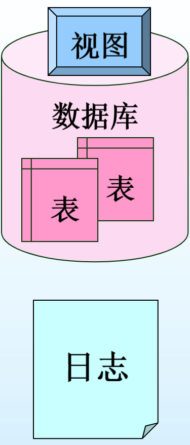
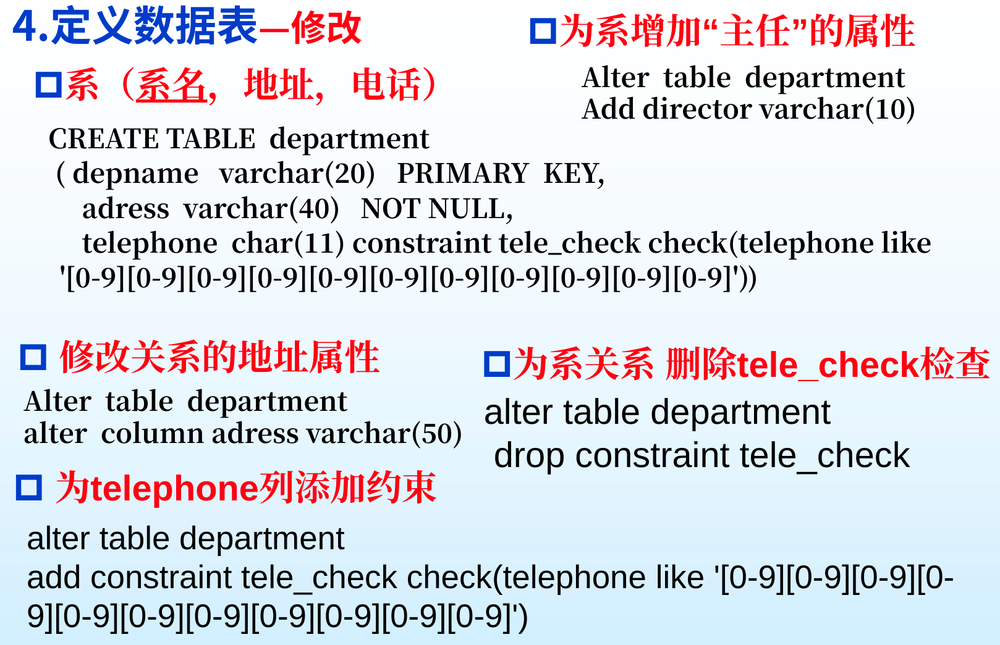
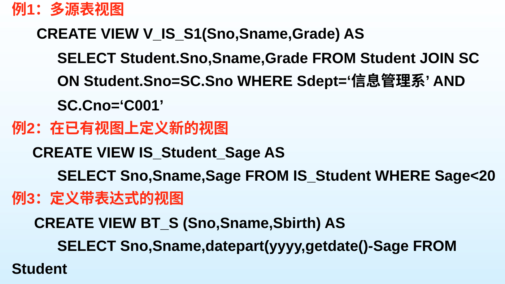

# 第一节 定义子语言DDL

操作一览（涉及以下几种的建立、修改、删除）：

* 数据库（模式）
* 数据库日志  
  记录所有的操作，使得操作可回溯。
* 数据库的表
* 视图  
  是观察数据的一种手段。
* 索引  
  用来快速找到所需要的数据，相当于书的目录。
* 规则  
  对数据进行完整性约束（静态）。
* 触发器  
  对数据进行完整性约束（动态）。
* 默认值
* 函数

## 二、DDL的关键字

* 操作
  * `CREATE`
  * `DROP`
  * `ALTER`
* 对象
  * `DATABASE` - 数据库
  * `TABLE` - 表
  * `VIEW` - 视图
  * `INDEX` - 索引
  * `TRIGGER`
  * `RULE`
  * `PROCEDURE`

索引、规则和默认值只能`CREATE`和`DROP`，不能修改`ALTER`。

默认值的格式：

```sql
CREATE DEFAULT dtf_term AS '1'
sp_bindefault dft_term, 'Ctake.term'
sp_unbindefault
DROP DEFAULT dtf_term
```

规则的格式：

```sql
CREATE RULE mark_rule AS @mark between 0 and 100
sp_bindrule mark_rule,'Ctake.mark'
sp_unbindrule  'Ctake.mark'
DROP RULE mark_rule
```

触发器的格式：

```sql
CREATE  TRIGGER  title_iu

    ON  titles  

    FOR INSERT, UPDATE

    AS

IF @@rowcount=0 RETURN

IF (SELECT Count(*) FROM publishers p, inserted i

                 WHERE p.pub_id=i.pub_id)= 0

    BEGIN

          RAISERROR 53334  '试图插入或修改非法的pub_id值'

          ROLLBACK TRANSACTION 

     RETURN

     END

RETURN
```

## 三、定义数据库和日志

> 定义 - 数据库和日志：
>
> * 数据库：是一个存储空间，用于存放相关数据集合。  
>   包括表、视图、索引、存储过程、触发器、与数据库安全性有关的控制机制以及其它对象等。 
> * 日志：是数据库故障恢复的重要手段和方法，用于记录对数据库的各种操作及所涉及的相关数据。  
>   实际上也需要一个存储空间。为安全起见，一般与数据库分开存放。



日志与数据库是绑定的，一块创建修改删除。

### 1. 数据库的创建

分为三个部分：

1. 数据库名
2. 定义数据空间
3. 定义日志

```sql
CREATE DATABASE 数据库名
  [ ON   [ < filespec > [ ,...n ] ] ] /* 定义数据空间 */
  [ LOG ON  {< filespec > [ ,...n ] } ] /* 定义日志 */
```

`<filespec>`为数据文件，定义如下：

```sql
< filespec > ::= [ PRIMARY ]
    ( [ NAME = 逻辑名 , ] 
    FILENAME = ‘OS文件的路径及名字’ 
    [ , SIZE = 文件初始大小 ] 
    [ , MAXSIZE = { 最大值 | UNLIMITED } ]
    [ , FILEGROWTH = 文件大小增量值 ] )
```

* 一个数据库**只能有一个主数据文**件，文件名为`*.mdf`，  
  可以有**多个次数据文件**，文件名为`*.ndf`。  
* **默认**数据都**存储在主数据文件**中，  
  除非指定存储在哪个数据文件。
* 在有些商用数据库中，创建数据库空间（data space)时，还需设定用户名和密码。

建议日志文件与数据库文件放在不同目录或服务器上，  
防止数据损坏时，无法通过日志恢复。

> 例 - 数据库和日志的创建：
>
> ```sql
> Create Database StudnetData
> On Primary      
>   ( Name       = StudentFile1,
>     Filename   = 'c:\data\StuFile1.mdf', 
>     Size       = 10MB,
>     MaxSize    = 1000MB,
>     FileGrowth = 5MB),
>   ( Name       = StudentFile2,
>     Filename   = 'c:\data\StuFile2.ndf',
>     Size       = 10MB,
>     MaxSize    = 1000MB,
>     FileGrowth = 5MB)
> Log On
>   ( Name       = Studentlog,
>     Filename   = 'c:\data\Stulog.ldf', 
>     Size       = 10MB,
>     MaxSize    = 1000MB,
>     FileGrowth = 5MB) 
> ```

### 2. 数据库的修改

数据库创建后，可以用`ALTER`修改数据库、增加新的数据或日志文件、删除已有文件、修改文件的设置。

```sql
ALTER DATABASE 数据库名
  { ADD FILE < filespec > [ ,...n ] 
  | MODIFY FILE < filespec > 修改数据或日志文件
  | REMOVE FILE 逻辑文件名 删除文件
  | ADD LOG FILE < filespec > [ ,...n ] 
  | MODIFY NAME = 新数据库名 修改数据库名 }
```

在修改命令`ALTER`中，增删改是以下命令（与DCL中增删改不一样）：

* 增加 - `ADD`
* 修改 - `MODIFY`
* 移除 - `REMOVE`

> 例 - 数据库的修改
>
> 例1：
>
> ```sql
> ALTER Database StudentData 
>   ADD File 
>   ( Name       = StudentFile3,
>     Filename   ='c:\data\StuFile3.ndf',
>     Size       = 10MB,
>     MaxSize    = 1000MB,
>     FileGrowth = 5MB)
> ```
>
> 例2：
>
> ```sql
> ALTER Database StuData 
>   MODIFY FILE
>   ( Name     = StudentFile1,
>     MaxSize  = 3000MB)
> ```

### 3. 数据库的删除

直接用`DROP DATABASE`。

```sql
DROP DATABASE 数据库名 [ ,...n ]
```

【慎重！可别删库跑路！……

## 四、定义表

对应数据库的“**内模式**”。

数据库只是容器，不组织数据，  
数据库中**最重要的是表**，后面的视图、索引、规则、默认值等都依附于表。

### 1. 表的创建

*在[第三章](./../../Ep.3%20逻辑数据模型%20-%20关系数据模型/3.%20SQL%20Server基本操作和实现完整性验证/3.3-Relational_Data_Model-3.md#1-创建---create)中范式已经给出。*

四大部分：

* 命令主框架
* 列定义
* 列级约束  
  主键约束、外键约束等
* 表级约束  
  断言等

### 2. 表的修改

修改内容：

* 列
  * 数据类型
  * 是否允许空值
  * 增加列
* 增加约束（包括表级和列级）
* 删除约束
* 触发器的起效失效

```sql
ALTER TABLE 表名 
 { [ ALTER COLUMN 列名{ 新数据类型 [NULL|NOT NULL]}]
   |ADD{[< 列定义 > ] | 列名 AS 计算表达式} [ , ...]
   | [ WITH CHECK | WITH NOCHECK ] ADD { <表级约束> } [ , ... ] 
   | DROP{[ CONSTRAINT]约束名 |COLUMN 列名 } [ , ... ]
   | { CHECK | NOCHECK } CONSTRAINT { ALL | 约束名 [ , ... ] } 
   | { ENABLE | DISABLE } TRIGGER  { ALL | 触发器名 [ ,...n ] } }
```

> 例 - 表的修改：
>
> 

存在限制：

* 一般不能修改数据类型为`Text`, `nText`, `Image`或`TimeStamp`的列。
* 不能修改计算的列、约束、默认值或者索引中引用的列。
* 不能对已有空值的列设为`NOT NULL`。
* 新增加的列不能定义为`NOT NULL`。  
  因为基本表在增加一列后，原有元组在增加的列上的值都被定义为空值。

### 3. 表的删除

```sql
DROP TABLE 表名 [CASCADE|RESTRICT]
```

确保只有**不存在**相关**视图**和**完整性约束**的表才能删除。

## 五、视图

对应数据库的“**外模式**”。  
*Tip: ER图对应“模式”。*

针对不同用户进行不同映射，  
既能起到安全的保护（隐私隔离），也能满足不同用户的需求。

> 定义 - 视图：
>
> 视图是一种数据库对象，它由多个字段列和数据行构成，这些列和行来自于一个或多个物理数据表。

视图是一个**虚拟表**，所对应的数据是存储在所引用的数据表中，被引用的表称为“基表”。  
因此必须要基于其他表或者视图（视图可以建立于其他视图之上）。

特点：

* 视图是由基表（实表）产生的表（虚表），视图的列可以来自不同的表。
* 视图的建立修改不影响基表。  
  *这里指的是对视图的修改，而不是内容的修改。*
* 对视图内容的更新（添加、删除和修改）直接影响基表。

限制：

* 当视图来自多个基表时，不允许添加和修改数据。
* 只能在当前数据库中创建视图。  
  可以跨表，但不能跨数据库。
* 不能将规则或default定义与视图相关联。
* 在定义视图的Select语句中不可以包含Order by、Compute或Compute by子句或Into关键字。
* 在某些情况下，视图创建者必须为视图中的列重新命名。

### 1. 视图的定义和修改

```sql
CREATE/ALTER VIEW [[拥有者.]视图名 [(视图属性名表) AS 查询语句]]
[WITH CHECK OPTION] /* 用来检查修改，在视图上的修改必须符合该条件 */
```

视图属性名表用来修改展示的数据名，重新命名，  
对应`SELECT`中的顺序。

用户可能会基于视图进行修改和删除，  
因此对该虚表的修改，需要满足基表的要求。

> 例 - 视图的创建：
>
> 
>
> 1. 基于多张表的若干属性，创建视图。
> 2. 基于一个视图进行筛选，创建新视图。
> 3. 用视图进行计算展现属性。

### 2. 视图的删除

```sql
DROP  VIEW  StuCourse
```

## 六、索引

> 定义 - 索引：
>
> 索引是关于数据位置信息的关键字表。  
> 用于快速在磁盘上定位所需数据，加快查询速度。

### 1. 索引类型

1. 聚簇索引  
   让表的数据按照索引的顺序存储。  
   **只能有一个**聚簇索引。
   *相当于书的目录。书的内容顺序更改，目录也要改*
2. 非聚簇索引  
   *相当于书的附录。但附录顺序变化与书的内容无关*

一般数据库会主动**按照主键构建**聚簇索引。

唯一索引是对索引属性的唯一约束，  
对建索引的属性不能重复。

### 2. 索引定义

索引也是数据，也需要存储。  
采用B树，包含索引页和数据页。

* 索引页：存放索引项和指向下一层的指针。
* 数据页：存放数据。

#### (1) 聚簇索引

聚簇索引的B树自下而上建立的。

最下层的叶节点存放的是数据，  
因此它即是索引页，同时也是数据页。

多个数据页生成一个中间层的索引页，  
数个中间层的节点的索引页合成更上层的索引页。  
类推，直到生成顶点的根节点的索引页。

高一层节点中每个索引项的索引关键字的值，是其下层节点中最大或最小索引关键字的值。

#### (2) 非聚簇索引

也是B树存储，但索引页和数据页并不存储在一起。  
因此更慢。

---

删除索引：

```sql
DROP INDEX 索引名称 ON 表/视图名
```

## SQL信息查询命令

* `sp_help` - 查看对象特征
* `sp_helptext` - 查看对象是怎么定义（创建的SQL语句）
* `sp_depends` - 查看有关数据库对象相关性的信息

