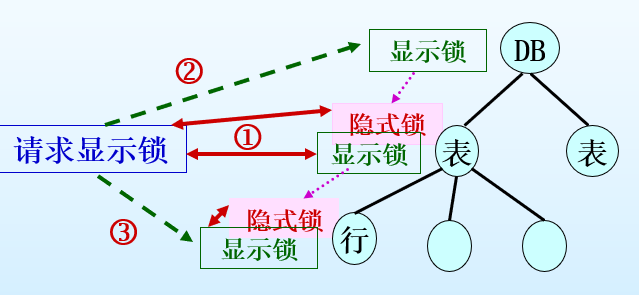
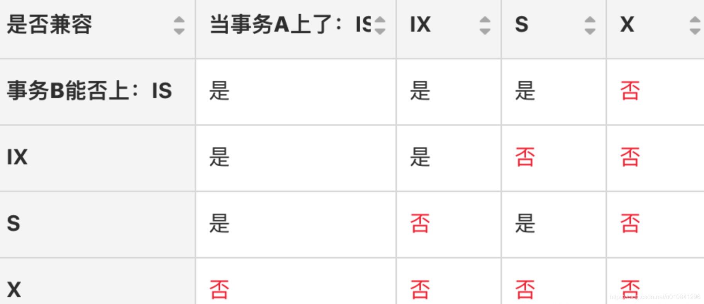

# 第五节 并发控制

## 一、数据库运行模式

1. 串行模式
2. 并行模式

必须要支持并发，不然速度无法满足需求。

## 二、并发执行引起的问题

* 丢失更新
* 读脏数据
* 读值不可复现

### 1. 丢失更新（写-写冲突）

两事务同时写入一个数据，  
后写入的会将先写入的覆盖。

假如订票，现在剩15张，  
甲乙同时购买，甲购买10张，乙购买5张，  
但在甲购买后乙瞬间也购买，会导致购买后剩下的张数是乙写入的剩余10张，  
导致数据不可信。

### 2. 读脏数据（写-读(-写)冲突）

一个事务可能随时修改没被提交的操作，  

比如原来是0，甲写了100，乙读了100，甲撤回事务`ROLLBACK`，此时乙的100就是脏数据。

### 3. 读值不可复现（读-写(-读)冲突）

指事务1读取数据后，事务2执行更新操作，  
使事务1无法再现前一次读取结果。

情况：

* 事务2修改
* 事务2删除部分记录
* 事务2插入一些记录

分为：

* **不可重复读**：重点是修改，记录不同。
* **幻影读**：重点是增删，记录数不一样。

## 三、事务调度

为了进行**并发控制**，需要进行事务调度。

* 串行调度：如果多个事务依次进行。
* 并法调度：利用分时法，同时处理多个事务。

**调度的基本要求**：  
一个**事务中的操作顺序**，与**调度中的顺序**一致。  
如：事务1的操作顺序是`A,B,C`，调度后也只能是`...,A,...,B,...,C,...`

### 1. 调度的表示

数据库操作归根结底只分为两种：

* 读操作 - 记为：$R_{T_i}(X)$
* 写操作 - 记为：$W_{T_i}(X)$

$T_i$表示事务，$X$表示数据对象。

将最后的调度序列用$S$表示，  
如：$S=R_{T_1}(A)W_{T_1}(A)R_{T_2}(B)W_{T_2}(B)R_{T_1}(C)W_{T_1}(C)$

### 2. 解决方法

利用“并发调度的**可串行化**”原则，可以解决并发控制。

可串行化理论有两个要点：

* 它主要关心对数据库对象的读写操作
* 它的目的是研究如何形成一个**可串行的并发调度**，即“等价”于一个串行调度的并发调度。 

## 四、并发调度的可串行化原则

### 1. 等价调度

* 等价（目标等价）  
  在DB的任一初始状态下，所有读出的数据都是一样的，留给DB的最终状态也是一样的。
* 冲突等价  
  凡是通过调换S中不冲突操作所得的新调度，称为S的冲突等价调度。  
  **推论**：如两个调度是冲突等价的，则一定是目标等价的；反之不亦然。
* 可串行化  
  如一个并发调度与一个串行调度等价，则称此并发调度是可串行化的。

可串行化准则只要求调度和其中一个串行调度等价即可。

对于串行调度本身，若其事务的顺序不同，会导致结果不同，  
但都是正常产生的，都是正确的。

一个调度是否可串行化，可用其“前趋图”来测试。

### 2. 前驱图

是一个有向图$G=(V,E)$

* 顶点$V$ - 代表事务
* 边$E$ - 有冲突的操作，从前面的事务指向后面的事务。

判断是否可串行化，则看**前驱图有没有回路**。

> 前驱图画法：
>
> 出现上面说的三种冲突操作时，在两结点添加一条有向边$T_i\to T_j$，  
>
> * $R_i(x)$在$W_j(x)$之前
> * $W_i(x)$在$R_j(x)$之前
> * $W_i(x)$在$W_j(x)$之前
>
> 即只有$R_i(x)$和$R_i(x)$时不加边，其余情况都加边。
>
> ---
>
> 如调度$S_\textrm{并}=W_3(y)R_1(x)R_2(y)W_3(x)W_2(x)W_3(z)R_4(z)W_4(x)$，  
> 首先有$4$个结点$T_1,T_2,T_3,T_4$，然后将操作对象$x,y,z$分开列：  
>
> * $x$：$R_1(x),W_3(x),W_2(x),W_4(x)$，则有
>   * $R_1(x),W_3(x)$ - $1\to 3$
>   * $R_1(x),W_2(x)$ - $1\to 2$
>   * $R_1(x),W_4(x)$ - $1\to 4$
>   * $W_3(x),W_2(x)$ - $3\to 2$
>   * $W_3(x),W_4(x)$ - $3\to 4$
>   * $W_2(x),W_4(x)$ - $2\to 4$
> * $y$：$W_3(y),R_2(y)$
>   * $W_3(y),R_2(y)$ - $3\to 2$
> * $z$：$W_3(z),R_4(z)$
>   * $W_3(z),R_4(z)$ - $3\to 4$
>
> 最终前驱图：
>
> ```mermaid
> graph LR;
>   1((T1))
>   2((T2))
>   3((T3))
>   4((T4))
>   1 --> 3
>   1 --> 2
>   1 --> 4
>   3 --> 2
>   2 --> 4
>   3 --> 4
> ```

转化成等价的串行调度：拓扑排序。  
依次取出入度为$0$的结点，则最后按照取出的事务顺序调度即可。

如上例中，依次取出$T1,T3,T2,T4$，  
则转化为：$S=R_1(x)\quad W_3(x)W_3(y)W_3(z)\quad R_2(y)W_2(x)\quad R_4(z)W_4(x)$（这里的空格只是为了表示事务顺序与上面对应，实际不用空格隔开）

## 五、加锁协议

并发控制的任务是要保证事务执行的可串行化。  
但用前面的测试方法来保证调度可串行化是不现实的：  
一是事务集随机、不固定。  
二是不可能事先定好调度。

因此DBMS对并发控制的通常实现方法是：  
定好一系列协议，并约束按此协议执行事务，  
即可保证可串行化，而**不必关心具体的调度**。

加锁协议是其中一种，  
用加锁来实现并发控制，即是在操作前对操作对象加锁。  
事务只要遵守加锁协议，即可保证调度的可串行化。

> 定义 - 加锁：
>
> 加锁就是事务T在对某数据对象（例如表、记录等）操作之前，先向系统发出请求，对其加锁，  
> 加锁后事务T就对该数据对象有了一定的控制，  
> 在事务T**释放它的锁之前**，其他事物**都不能操作**此数据对象。

基本加锁类型：

* X锁 - 排它锁
* S锁 - 共享锁

### 1. X锁协议

只有X锁，很严格，  
但效率低，本来不冲突的读读也拒绝了，  
而90%的操作都是读，故不常用。

|           | NL | X |
| --------- | -- | - |
| 加锁申请X | Y  | N |

NL代表未被加锁，X代表已加锁。

但即便严格，也可能发生比较麻烦的情况，  
如果事务未提交而释放锁，在其他人操作后又`ROLLBACK`，  
为了保证数据一致性，会发生“级联回退”，即所有操作该数据的都要`ROLLBACK`。

因此出现**加锁协议补丁#1**：  
> 为避免级联回退，要求不管是写操作锁还是读操作锁都应**保持到事务结束**(End of Transaction, EOT)才释放。该补丁对其后的加锁协议也适用。

### 2. 两阶段加锁协议、合式事务

* 两阶段加锁协议：  
  在一个事务中，如加锁都在所有释放锁之前，则此事务为两阶段事务。  
  其中的加锁限制称为**两阶段加锁协议**(Two-Phase Locking protocol, 2PL协议)
* 合式事务：  
  一个事务如遵守先加锁，后操作原则，此事务即为**合式事务**。

定理：如所有事务都是合式、两阶段事务，则它们的任何调度都是可串行化的。

### 3. (X, S)加锁协议

采用两种锁：

* X锁 - 排它锁  
  写操作申请。
* S锁 - 共享锁  
  读操作申请。

|           | NL | S  | X  |
| --------- | -- | -- | -- |
| 加锁申请S | 👌 | 👌 | ❌ |
| 加锁申请X | 👌 | ❌ | ❌ |

即便采用加锁协议补丁#1，仍可能发生以下问题：  
假如一直有写操作申请X锁，可能会导致读操作一直无法申请S锁进行读操作，  
虽然最终肯定会申请到，但等待时间太长，称为“**活锁**”。

故出现**加锁协议补丁#2**：  
> 活锁虽不会导致“死等”，但对系统性能有不良影响。为避免活锁，在加锁协议中应规定“先申请先服务（First Come, First Served）”原则。

因此需要记录一个“时间戳”，来记录事务到达的时间，从而进行FCFS。

### 4. (S, U, X)

*不考。*

为了进一步提高并发度，  
新增的锁：

* U锁 - 更新锁

因为一般`UPDATE`分为两个阶段：先读数据$R()$再写数据$W()$，  
读的时候则申请$U$，需要写的时候升级为$X$。

|           | NL | S  | U  | X  |
| --------- | -- | -- | -- | -- |
| 加锁申请S | 👌 | 👌 | 👌 | ❌ |
| 加锁申请U | 👌 | 👌 | ❌ | ❌ |
| 加锁申请X | 👌 | ❌ | ❌ | ❌ |

## 六、加锁粒度

数据对象的大小跨度很大，大可以是整个数据库，小可能是具体某个元组的某个属性。  
因此加锁存在粒度。

粒度小，加锁的范围小，操作复杂，并行度高；  
粒度大，加锁的范围大，操作简单，并行度低。

```sql
UPDATE {表名 [ WITH ( < 表更新选项 > [ ...n ])] |视图名} 
SET  {列名 = {表达式|DEFAULT|NULL}}[ ,...n ]} 
[FROM { < 源表> }[ ,...n ]] 
[WHERE < 条件表达式 > ] 

<表更新选项>::={PAGLOCK|ROWLOCK|TABLELOCK|UPLOCK}

<源表>::=表名[ [ AS] 别名] [ WITH (<表更新项>[,…n])} |  视图名 [ [ AS] 别名 ]  | <表联结> 

<联结类型>::=[INSERT | { { LEFT|RIGHT|FULL } [OUTER]}]JOIN
```

上面的表更新选项即是多粒度加锁。

RDBMS提供的多粒度锁：

* 行级锁，或称行锁
* 页级锁，或称页锁
* 表级锁，或称表锁

锁分为两种：

1. 显式加锁(Explicit Locking)  
   系统应事务的要求，直接对该数据对象加锁。
2. 隐式加锁(Implicit Locking)  
   该数据对象本身并未被显式加锁，但由于其上级被加锁，故这个数据对象被隐含加锁了。  
   例如，一个表被加锁，则其所有元组和列均隐式被加锁。

所以检查分为三个步骤：

* 检查其**本身**，有无本事务**显式锁**与**显式锁**冲突。
* 检查其**所有祖先**，以防本事务的**显式锁**与其他事务的**隐式锁**冲突。
* 检查其**所有子孙**，以防本事务的**隐式锁**与其它事务的**显式锁**相冲突。

祖先→子孙：DB→表→页→行  
祖先的显示锁，会向下传递到所有子孙变成隐式锁。



三个步骤中，检查本身和检查祖先都极其简单，效率也较高，  
但对于**检查子孙**，可以预见对于一个很多张表每张表又很多行的数据库来说，几乎是**难以接受**检查所有子孙的。  
因此必须要想办法记录子孙加锁的情况，而不是去挨个检查。

---

为化简该复杂的检查步骤，同时解决上面最后的问题，  
可以增加一种“意向锁”，从而解决多粒度问题。

* 意向共享锁IS（相当于给祖先加的S锁）  
  一个事务要给一个数据对象加S锁，必须首先**将其祖先加IS锁**。  
  也就是说，如果一个数据对象被加了IS锁，**表示其某些子孙**加了或准备加**S锁**。​
* 意向排他锁IX（给祖先加的X锁）

解决的原因：

* 步骤2的解决 - 如果一事务对所操作对象的祖先的IS锁申请成功，就可保证再给该对象加S锁时，不会造成S锁与该对象祖先带来的隐式锁发生冲突。  ​
* **步骤3的解决** - 如事务给数据对象加了S锁，那么其它事务就**不能给其任何祖先加X锁**，因为其祖先已被该事务加了IS锁。​  
  因此不用再向下遍历所有子孙的锁，因为意向锁的存在使得子孙的锁直接在本结点有所体现。


相互间的兼容关系：  
当事务A对某个数据范围（行或表）上了“某锁”后，判断另一个事务B是否能在这个数据范围上“某锁”。

* 意向锁相互兼容  
  因为IX、IS只是表明申请更低层次级别元素（比如 page、记录）的X、S操作。
* 表级S锁和X、IX锁不兼容  
  因为上了表级S锁后，不允许其他事务再加X锁。
* 表级X锁和IS、IX、S、X不兼容  
  因为上了表级X锁后，会修改数据，所以即使是行级排他锁，因为表级锁定的行肯定包括行级锁定的行，所以表级X和IX、X都不兼容。

注：对于行级X锁，不会因为有别的事务上了IX而堵塞。



来自于[mysql的共享锁(S)、排他锁(X)、意向共享锁(IS)、意向排他锁(IX)的关系](https://blog.csdn.net/u010841296/article/details/87909468)

## 七、死锁

OS中讲过了，一样的概念。

解决方法：

* 给每个事务一个优先级。  
  在DBMS的优先级，则是按照事务到来的时间决定的。  
  越老的事务优先级越高。
  即FCFS。
