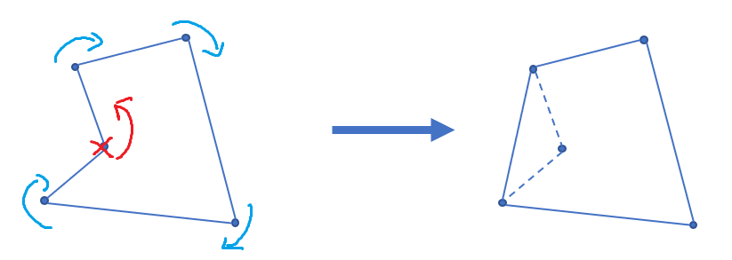

# Ep.3 蛮力法

*「就暴力呗.jpg*……

优点：逻辑清晰  
缺点：效率低下

如：

* 插入排序

  ```c++
  void SelectionSort()
  {
    for (i=1->n)
    {
      for (j=i->n) //穷举找到插入位置
      swap();
    }
  }
  ```

* 冒泡排序
* 最近点对问题  
  平面空间上若干个点，求这些点中距离最近的两个点。  
  1. 纯暴力：直接两两枚举所有点。$O(n^2)$
* 凸包问题  
  若干个点，找最外层的点所连多边形（必定为凸多边形），将所有点包含在其内。

  解法：
  1. 判断某两点连线，其余点是否全在其一侧，若是则为凸多边形的一边。
  2. Graham算法（Andrew算法）$O(n\log n)$  
     选定一个凸包点（如最左侧的点），然后将该点与其余点均相连，得到向量组。  
     按照倾斜程度从低到高排序，再依次选择并验证（验证需要从已选择的第一条凸包边开始验证完所有）。  

     验证方式：若为凸包边，则肯定会只朝一个方向旋转，否则该点不是凸包点。  
     

     因为从左向右看，上部分凸壳和下部分凸壳旋转方向不一样，  
     所以可以分开处理。

     统一规定逆时针转“左拐”。  
     处理则可以利用一个栈，存储找到的凸包点，然后将即将进栈的点$P$与栈顶$S_1$的连线，同栈顶两点$S_1,S_2$的连线做叉积，  
     小于$0$则证明向“右拐”了，弹出栈顶，直到找到大于$0$。

     ```c++
     // stk[] 是整型，存的是下标
     // p[] 存储向量或点
     tp = 0;                       // 初始化栈
     std::sort(p + 1, p + 1 + n);  // 对点进行排序
     stk[++tp] = 1;
     // 栈内添加第一个元素，且不更新 used，使得 1 在最后封闭凸包时也对单调栈更新
     // 求下凸壳
     for (int i = 2; i <= n; ++i) {
       while (tp >= 2 && (p[stk[tp]] - p[stk[tp - 1]]) * (p[i] - p[stk[tp]]) <= 0) // * 操作符为叉积
         used[stk[tp--]] = 0; // 出栈
       used[i] = 1;  // used 表示在凸壳上，用来记录先求的下凸壳，防止求上凸壳时影响
       stk[++tp] = i;
     }
     // 求上凸壳
     int tmp = tp;  // tmp 表示下凸壳大小
     for (int i = n - 1; i > 0; --i)
       if (!used[i]) {
         // ↓求上凸壳时不影响下凸壳
         while (tp > tmp && (p[stk[tp]] - p[stk[tp - 1]]) * (p[i] - p[stk[tp]]) <= 0)
           used[stk[tp--]] = 0;
         used[i] = 1;
         stk[++tp] = i;
       }
     for (int i = 1; i <= tp; ++i)  // 复制到新数组中去
       h[i] = p[stk[i]];
     int ans = tp - 1;
     ```

    Graham与Andrew的区别在于排序方式，一个是用直角坐标排，一个用极坐标排。
* 旅行商问题  
  在图上，从给定点出发，要求通过所有给定的点然后回到起点，使得路径成本最小。
  1. 全排列暴力
* 背包问题
