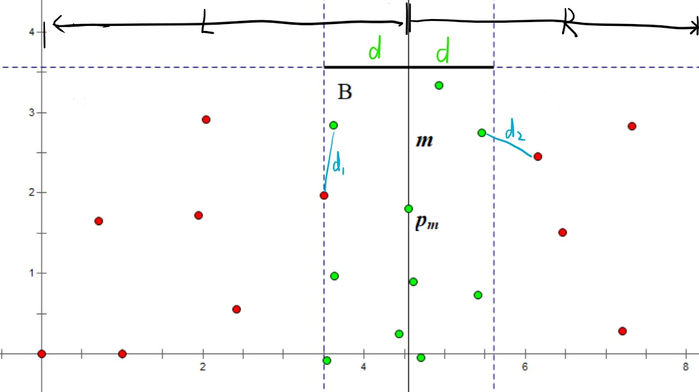
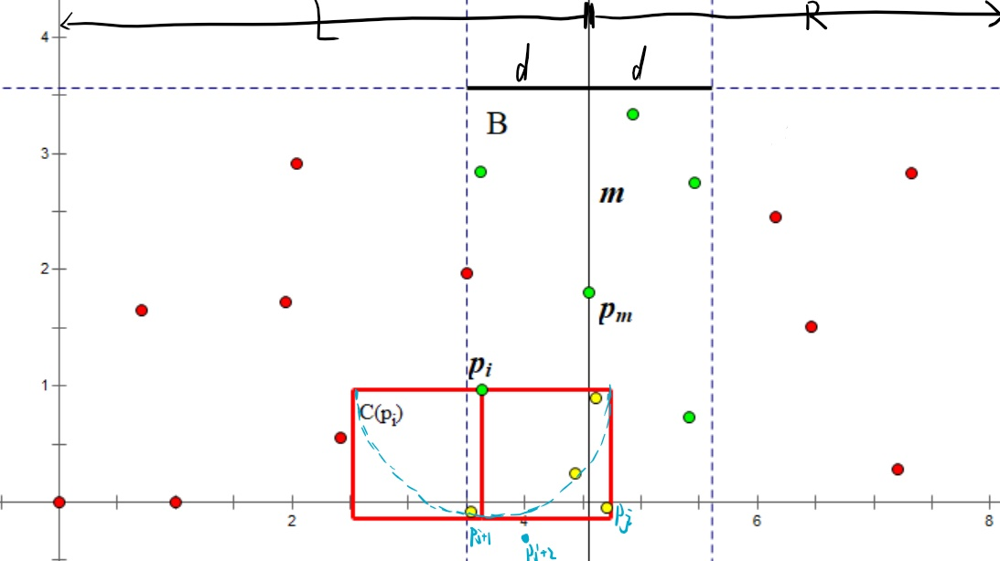
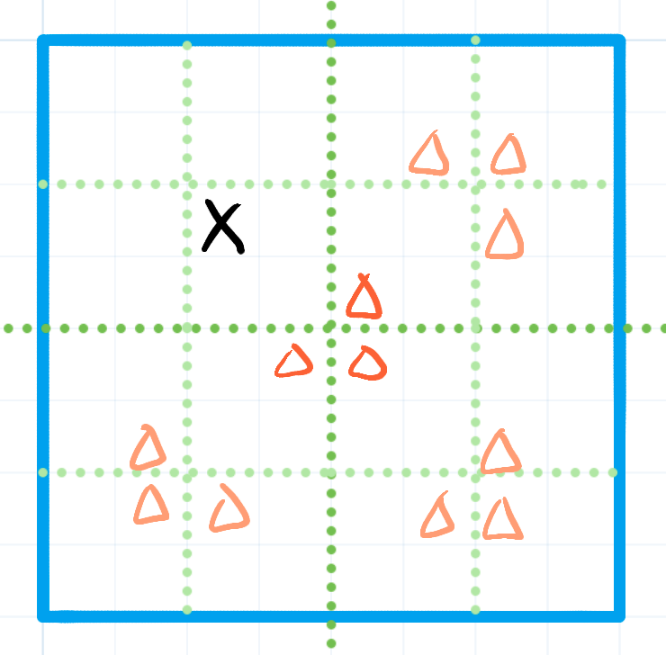

# 第四章 分治法

能分治的前提一般都是数据有序，  
这样才合并的时候交界处才好处理。

## 一、最近点对问题  

### 1. 分解过程

点$P(x,y)$

将所有点按照$x$为主关键字、$y$为次关键字进行排序。  
得到一个关于点的一维数组后，则可以进行分治。

一直划分，直到两侧只剩$2\sim3$个，则可以分别在两侧暴力求解，  
记左侧最小记录为$d_1$，右侧最小距离为$d_2$，  
两侧最小距离$d=\min(d_1,d_2)$。

关键在于合并时，如何处理新的点对的距离。  

### 2. 合并过程

考虑任意一个分解区域。

因为纯左侧和纯右侧的最小距离已求得，分别为$d_1,d_2$，  
则关键在于分界面上左右两侧的点对。

因此划分出“分界面**左侧$d$距离**”和“分界面**右侧$d$距离**”的两个区域，合称为$B$区域，  
则**只有在这个$B$区域的点对可能更新最小值**。  
> ⚠注意：不是左右侧$\frac{d}{2}$距离，因为可能为分界面上的点与左侧$\frac{1.5}{2}d$为最小点对。

如下图：
  
其中以$p_m$点划分为左右两侧，则$x=m$为分界面。

---

接下来对于$B$区域的每个点$p_i$，为了避免重复配对，我们**只配对$p_i$横轴以下的点**。  
而如果要能更新$d$值，肯定**向下的距离**最大肯定也**不能超过$d$**。

  
> 注1：不用考虑也不可能在$B$外出现黄点，否则L或R区的$d_i$就会变化了。
>
> 注2：之前也说过，只有可能**分别在分界面两侧的点对**，才可能更新$d$。  
> 但这里为了简单，把同侧的也直接考虑进去了。实际上也可以在这里进行个小剪枝。
>
> 注3：其实最符合条件的是以$d$为半径的圆形区域内（图中蓝虚圈），  
> 但直接考虑矩形区域，是为了之后的`break`及时退出纵距离超过$d$的查找。  
> 因为上面的某点$p_j$与$p_i$距离大于$d$，但紧接的下面一点$p_{j+1}$与$p_i$距离不一定也大于$d$；  
> 但如果$p_{j+1}$与$p_i$的纵距离都大于$d$了，$p_{j+2}$与$p_i$的纵距离一定也大于$d$，则可以`break`。

但要能快去确定黄色的点，如果按照纵坐标是乱序的话，肯定不能在一段上遍历得到，只能暴力搜索。  
因此考虑这个时候**转换成“$y$为主关键字”的排序**方法，  
就能直接在`for`一段中找到黄色的点，一旦不满足就`break`。

可以在分解过程的时候，将L和R区域就先转换为$y$排序，  
然后直接利用归并排序的最后一步“合并”，快速的将所有部分都转换为$y$排序。  
对应STL中的`inplace_merge(a+0, a+mid-1, a+n-1, cmp)`，用于数组`a[0,mid-1]`和`a[mid,n-1]`都分别有序，将其合并成有序数组`a[0,n-1]`

### 3. 代码

```c++
//点处理部分
struct pt {
  int x, y, id;
};

struct cmp_x { //按x主关键字，y次关键字排序
  bool operator()(const pt& a, const pt& b) const {
    return a.x < b.x || (a.x == b.x && a.y < b.y);
  }
};

struct cmp_y { //按y主关键字排序
  bool operator()(const pt& a, const pt& b) const { return a.y < b.y; }
};

int n;
vector<pt> a; //所有点
//答案处理部分
double mindist;
int ansa, ansb;

inline void upd_ans(const pt& a, const pt& b) { //更新最小答案
  double dist = sqrt((a.x - b.x) * (a.x - b.x) + (a.y - b.y) * (a.y - b.y) + .0);
  if (dist < mindist) mindist = dist, ansa = a.id, ansb = b.id;
}
//分治主体部分
void rec(int l, int r) {
  if (r - l <= 3) { //分为2~3个点，直接暴力求解
    for (int i = l; i <= r; ++i)
      for (int j = i + 1; j <= r; ++j) upd_ans(a[i], a[j]);
    sort(a + l, a + r + 1, &cmp_y); //这里则是“在分解过程中就按y排序”的体现
    return;
  }

  int m = (l + r) >> 1;
  int midx = a[m].x;
  rec(l, m), rec(m + 1, r); //分治
  inplace_merge(a + l, a + m + 1, a + r + 1, &cmp_y); //由于L、R已经按y排序，这里直接merge合并即可

  static pt t[MAXN]; //用来逐步生成B区域
  //因为我们只用考虑下方的点，所以不用先全部生成B区域，而是从下往上依次生成，使得t中点始终满足在p_i下方。
  int tsz = 0; //当前B区域点的个数
  for (int i = l; i <= r; ++i)
    if (abs(a[i].x - midx) < mindist) { //是在B区域中（横坐标之差小于d）
      for (int j = tsz - 1; j >= 0 && a[i].y - t[j].y < mindist; --j) //开始考虑在B区域中其下方的点
      //这里是从距离p_i最近的点t[tsz-1]，往最远的点t[0]遍历的，  
      //因此若不满足p_i与p_j的纵距离小于d后，则会直接终止遍历，节约时间。
        upd_ans(a[i], t[j]);
      t[tsz++] = a[i]; //逐步生成B区域
    }
}
```

## 二、凸包

*没找到用分治的方法，先就用前面的Graham算法就可。*

## 三、棋盘覆盖问题  

### 1. 问题描述

$2^k\times2^k$的棋盘，有一个特殊方格，不能进行覆盖，  
其他均可以用“L”型牌进行覆盖（但不能重复覆盖）。

该问题一定能完全覆盖，因为$\frac{2^k\times2^k-1}{3}$能整除尽。
> 证：
>
> $4\bmod3=1$，每乘个$4$，余数变为$4$，又能多除个$1$余$1$。

### 2. 分析

正如问题描述中告诉的，对于$2^k\times2^k$的棋盘，**必须拿出$1$个**，才可能放得下。

而$2^k\times2^k$，刚好可以从最中心横着和竖着，分成$4$个$2^{k'}\times2^{k'}$的区域。

那么这分出来的$4$个区域，有一个是已经有特殊方格的，  
其他三个还没有，必须要“构造”一个特殊方格，即要提前用“L”型牌覆盖，来形成特殊方格。

而将这三个放在分界中心交界处，就能恰用一个“L”，使得其他三个构造出特殊方格。

对分出来的区域再分，又会重复上述步骤，故可解。



### 3. 思想总结

* 分治，存在分解，但不一定需要合并。（合并后不会对解产生新的影响，或者说分解后就完全解决了要解决的问题）
* 对于一维是用二分分治，对于二维可以考虑用四分分治。

## 四、大整数乘法

$A_1A_2A_3\cdots A_n \times B_1B_2B_3\cdots B_n$

可以将两个乘数拆分成：  
$(A_1A_2\cdots A_{mid} \times 10^{k_1} + A_{mid+1}\cdots A_n) \times (B_1B_2\cdots B_{mid} \times 10^{k_2} + B_{mid+1}\cdots B_n)$